# Python 和 C++中的数字滤波器设计

> 原文：<https://medium.com/geekculture/digital-filter-design-in-python-and-c-4484b6d6f4a5?source=collection_archive---------1----------------------->

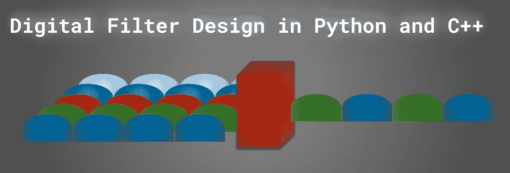

by author

在下一篇文章中，我将展示数字滤波器设计的一般方法。滤波器的目标是从信号中去除特定的频率(噪声)。我们将看到如何设计带通滤波器( [**低通滤波器**](https://en.wikipedia.org/wiki/Low-pass_filter) )和更高级的 [**陷波滤波器**](https://en.wikipedia.org/wiki/Band-stop_filter) 。将使用主要是强大的 [**控制包**](https://python-control.readthedocs.io/en/0.9.0/#) (充分实现控制系统分析和设计的标准功能的 Python 包——类似于 Matlab)在 Python 中进行设计。过滤器设计的软件部署和最终验证将在 C++中进行。为了绘图的目的(在 C++中),我将使用在我以前的文章中讨论过的 C++的 matlablib 库。该库仅用于绘图目的。

[头文件](https://github.com/lava/matplotlib-cpp)(用于绘图库)必须在与 cpp 相同的文件夹中。
你编译的每个程序如下:

```
//compile
g++ my_prog.cpp -o my_prog -I/usr/include/python3.8 -lpython3.8// //run
./my_prog//folder tree
├── my_prog
├── my_prog.cpp
├── matplotlibcpp.h
```

# 介绍

在设计滤波器之前，我们需要了解信号处理的主要原理，这是我们的应用领域，也是我们要解决的问题。由于我们的目标只有一个，即设计一个数字滤波器，所以我不会在这里深入探讨理论的各个方面的数学推导。

为了简单起见，我们可以假设我们捕获音频信号(通常它可以是来自过程的信号，但是这里我们考虑音频信号)。信号噪音很大，所以内容很难理解。使用本文中描述的滤波器设计方法和通用信号处理原理，我们将尝试去除噪声并保持内容信号不变。
请注意，在本文中，我指的是值 Hz(例如 50Hz ),但所有计算都是基于乘以 2*pi 的值进行的。

下面我描绘了“矩形”信号——它只由正弦波组成(我们将在后面讨论)。我还显示了这种信号的 FFT。

所有模拟的源代码(Python 和 C++)你可以在这里找到[。](https://github.com/markusbuchholz/digital-filter-design)

```
// signal definitionssig1 = sin(t) + sin(3*t)/3 + sin(5*t)/5sig2 = sin(t) + sin(3*t)/3 + sin(5*t)/5 + sin(7*t)/7 + sin(9*t)/9 + sin(11*t)/11 + sin(13*t)/13
```


by author

sig2 的 FT 可以描述如下，

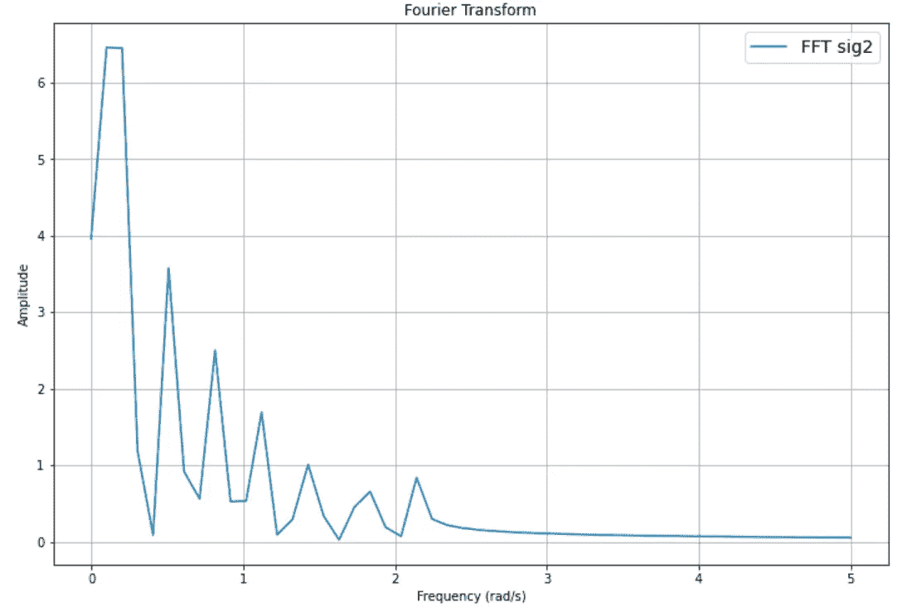

by author

信号处理中最重要的概念是[**傅立叶变换**](https://en.wikipedia.org/wiki/Fourier_transform) (FT)，将信号从时域转换到频域(频谱)。使用 FT，我们能够再次应用变换，并在原始域(时间)中恢复信号。

时域空间中的每个信号通常可以用两种不同的方法来表示。
第一种考虑了信号在某些点的离散值(振幅)。此外，将这些离散值(在某个时间戳中获取/测量)相加。最终值是我们考虑的信号(请考虑下图，该图描述了这种方法的原理)。
第二种方法分歧很大，因为该方法对覆盖所有时间的函数求和，而不是对特定时间的离散值求和。这些函数可以被认为是波，并在数学上表示为欧拉方程，其中ω表示波的特定频率。


正如你在上面的图片和 FT 公式中看到的，每个信号都可以用不同频率下计算出的波的总和来表示。
用于求和的正弦编织数(针对特定频率计算)直接影响信号模式(形状)。
你可以想象，增加波数(如上例)会使最终信号更像矩形信号。
一般来说(这是傅立叶变换理论的主要原理)每个信号都可以用正弦波的和来表示。计算(添加)更多的波，可以获得(“核心”/处理的)信号的更好的数学表示。


by Wikipedia

将信号在时域中表示为正弦波的组合的信号处理方法相当困难。通常不便于可视化和处理。
更合适的方法是在频域中表示信号，这可以通过应用傅立叶变换来实现。傅立叶变换(正如我提到的双向工作)可以简单地提取(核心/处理过的)信号的主频。我们可以说，傅立叶变换将放大核心信号的主要频率，因此更容易使用后处理来(例如)移除特定频率、混频或增强。
对信号(在时域中)应用傅立叶变换，我们简单地将信号从时域转换(映射)到频域，其中核心信号由核心信号(对于特定频率)的合成波的振幅来表示。

**数字滤波器设计**

在下一节中，我将展示数字滤波器设计的标准方法(频率去除)。可以想象，设计将在频域中完成，因为我们想要移除某些频率(我们设计带通滤波器)或仅移除一个频率(我们应用陷波滤波器)。

通常计算机系统或 DSP(数字信号处理器)在采样过程中处理从模拟信号中提取的数字信号值。在 DSP 系统中执行所有操作都是离散的(意味着在量化的时间内发生——以时间间隔 T 获取/测量模拟信号的幅度)。
见下图，该图代表模拟信号和离散信号。

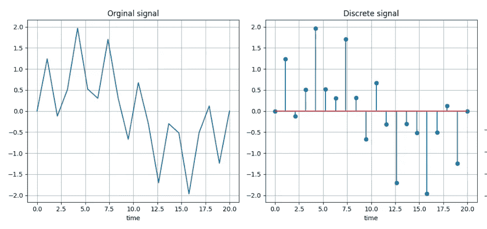

by author

所有离散时间系统在理论上都可以用 n 阶差分方程来描述，其中 x(n)是系统的输入，y(n)可以与输出相关联。m 和参数是虚拟值，仅用于求和目的。


等式具有等价的形式，可以重写为

请注意，值 y(n-m)和 x(n-p)是输出 y(n)和输入 x(n)的延迟函数。参见下面代表延迟离散信号示例。

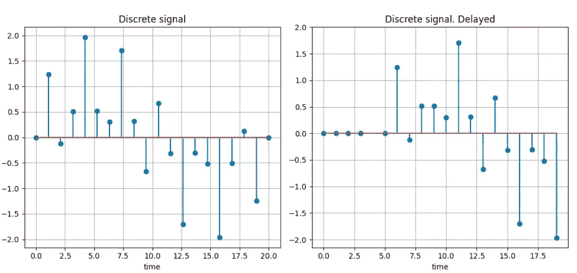

by author

数字滤波器由与本文前面介绍的离散系统相同的传递函数来描述。我们可以想象，滤波器允许特定频率(特定频率下输入“核心”信号的正弦分量)不变地传输。滤波器设计的其他成分(频率)将被衰减。


有两种类型的数字滤波器:**有限脉冲响应滤波器** (FIR)，其中 **a 系数**等于 0(这种类型的滤波器也称为自回归——**AR**)和**无限脉冲响应滤波器** (IIR)，其中传递函数的 **b 系数**等于 0(也称为移动平均 **MA** )。
正如我们所料，我们可以结合这两种类型的滤波器，最终确定 [**ARMA** 滤波器](https://en.wikipedia.org/wiki/Autoregressive%E2%80%93moving-average_model)。

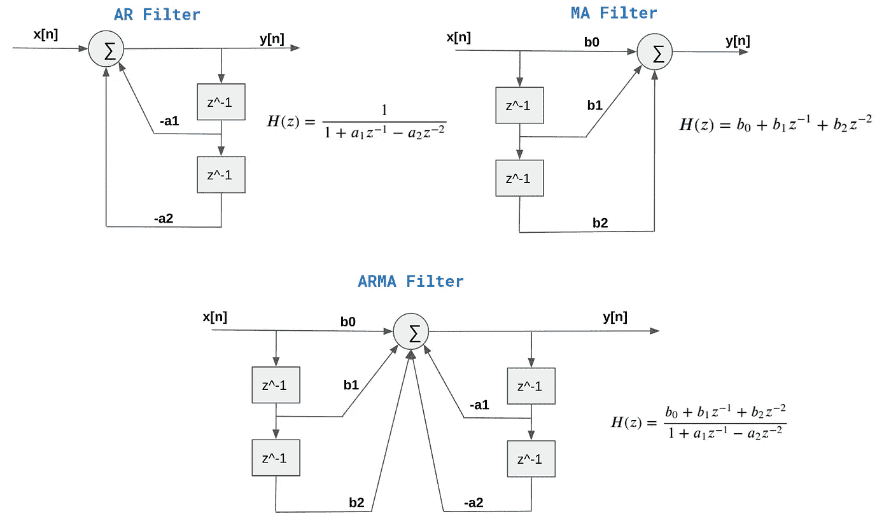

by author

我不打算详细讨论这些滤波器组的异同。出于我们的目的，我们将设计 ARMA 滤波器，其传递函数可以表示如下


这里值得一提的是，在离散域中，每个信号通过[离散傅立叶变换](https://en.wikipedia.org/wiki/Discrete_Fourier_transform)进行映射(时域到频域)。
DFT 将信号从时域转换到频域，这个过程可以描述如下


我们将使用这个公式，并用 C++计算特定信号的 DFT。

以下部分将显示我为设计滤波器(低通和陷波)而应用的一般步骤。正如我提到的设计和验证，我使用 Python(也是我推荐的)。其次，我应用了 C++，在那里我部署了 filer design(系数)。

# **拟采取的步骤可总结如下:**

1.  定义输入(核心)信号并绘图。
2.  决定您想要移除的频率(通带或陷波滤波器)。
3.  计算输入信号的 DFT。
4.  计算滤波器传递函数。
5.  计算滤波器传递函数的[体图](https://en.wikipedia.org/wiki/Bode_plot)并验证特性(通带和衰减带)。
6.  使用[图斯汀的方法](https://en.wikipedia.org/wiki/Bilinear_transform)计算滤波器的离散传递函数。
7.  计算滤波器系数。
8.  将滤波器系数应用于通用 ARMA 传递函数(设计滤波器)。
9.  计算输出信号的 DFT(检查滤波器)。
10.  步骤 1、3、8、9 和 10 用 C++实现。

陷波滤波器需要特殊的设计说明。我将演示一个简单的设计方法，并申请信号定义的信号消除特定频率。

下一节将分几步描述如何设计低通滤波器。正如我之前提到的，在 Scipy 的支持下，使用包控制(类似于 Matlab)在 Python 中执行设计。

**数字低通滤波器**

**第一步。**

在以下示例中，我们将从输入信号中移除 50Hz 信号频率。移除这一特定频率是常见的，因为存在电源频率，如果我们执行测量，这一频率会经常出现。

输入信号由两个正弦波(5Hz 和 50Hz)组成，如下图所示

```
//signal definitionA1 = 1
A2 = 0.2
f1 = 5
f2 = 50y = A1*sin(2*pi*f1*t) + A2*sin(2*pi*f2*t)
```


by author

这里，我们使用 FFT 在频域中绘制信号。如你所见，信号功率谱有两个主频(我们在 C++中使用 DFT)。

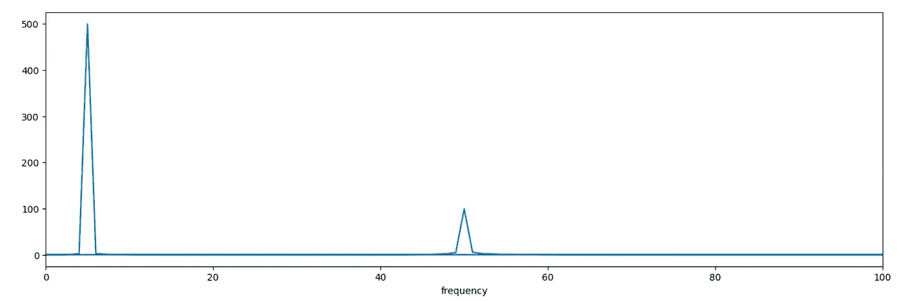

by author

**第二步。**

这里我们使用低通滤波器。滤波器将移除截止频率以上的所有频率，在本例中为 5Hz。记住，我们的目标是降低 50Hz。请注意，大自然不会提供完美的设计，因此滤波器的通过/衰减特性不会完美。取决于设计和制造滤波器的物理材料，滤波器将是可观察到的“过渡”滤波器频带，其中对于某些频率，信号将不会被完全衰减。请考虑身体情节，并熟悉如何过滤器将工作(第 5 步)。

**第三步。**

[离散傅立叶变换](https://en.wikipedia.org/wiki/Discrete_Fourier_transform)将在 C++设计实施期间应用。为了我们的目的，DFT，或通常(傅立叶变换)用于可视化的目的。傅立叶变换和 DTF 的主要区别在于应用这些变换的域。
除了将信号从时域变换到频域，DFT 还对离散信号进行操作，并将输入(离散)信号映射到特定的离散频率。

DFT 的实现(在 C++中)可以在 cpp 文件中找到(参见本文的和)。用于计算 DFT(特定频率的信号分量的幅度)的公式可以写成如下形式，


计算定义的输入信号的 DFT(在 C++中),您可能会得到以下结果:


by author

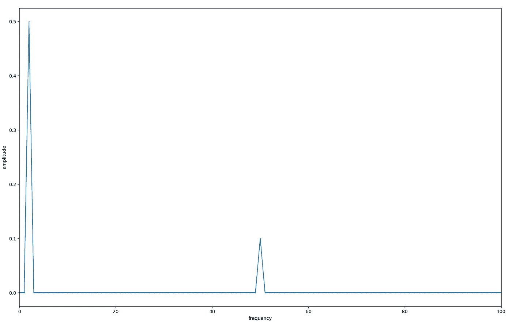

by author

**第四步。**

低通滤波器由以下简单传递函数描述


在我们的例子中，截止频率是 5Hz。对于该滤波器和截止频率，我们可以使用控制包(用于分析系统稳定性的零极点映射方法)进行计算= >如果所有极点都位于实轴的左侧，则系统可以视为稳定系统。[稳定系统](https://en.wikipedia.org/wiki/Stability_theory)是施加力或其他扰动后恢复正常状态的系统。滤波器没有零点，但有一个极点等于…..（

**第五步。**

现在，对于滤波器传递函数，我们计算身体图，见下面结果:

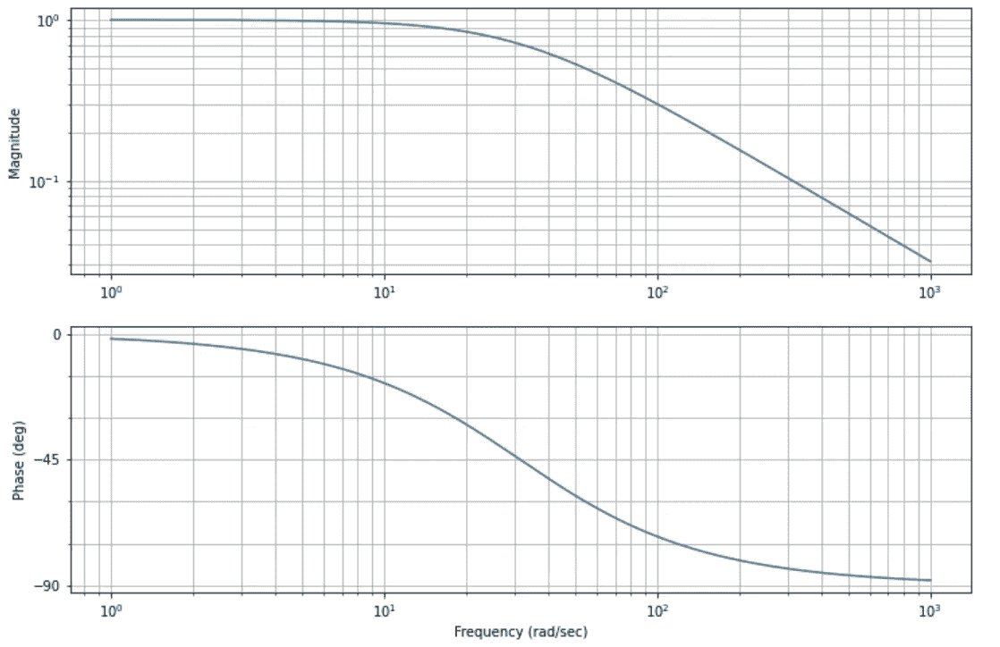

by author

**第六步。**

执行以下步骤为我们提供了关于数字滤波器系数的反馈。为了将我们的连续传递函数变换为离散传递函数(由于我们设计数字滤波器)，我们使用了 [**双线性变换**](https://en.wikipedia.org/wiki/Bilinear_transform) 也称为 s[**Tustin**](https://en.wikipedia.org/wiki/Arnold_Tustin)**的方法。**

转换很简单。我们用下面的函数代替 s，

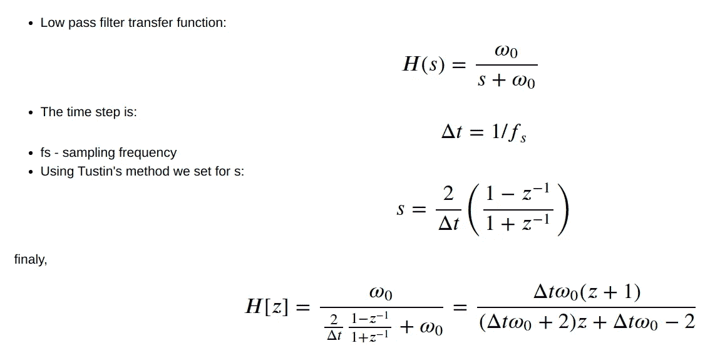

**步骤 7。**

可以手动计算滤波器离散传递函数的系数，但是我们将使用 Python。应用 to_discrete()方法，Python 返回系数值。

**第八步。**

在接下来的步骤中，我们将计算最终的过滤函数，这将在 Python 和 C++中进行验证。

利用上一步计算的系数，我们可以写出最终的滤波器传递函数，它符合我们的要求(衰减所有 5Hz 以上的频率)。(详见 Jupyter 笔记本)


**第九步**

运行我们的仿真，其中输入信号(5Hz 和 50Hz)已通过设计的滤波器。结果在意料之中。50Hz 正弦波已被移除(衰减)。下图描述了频域中滤波器的输出(Python 中的 FT，C++中的 DFT)和时域中信号(滤波器后)的输出。

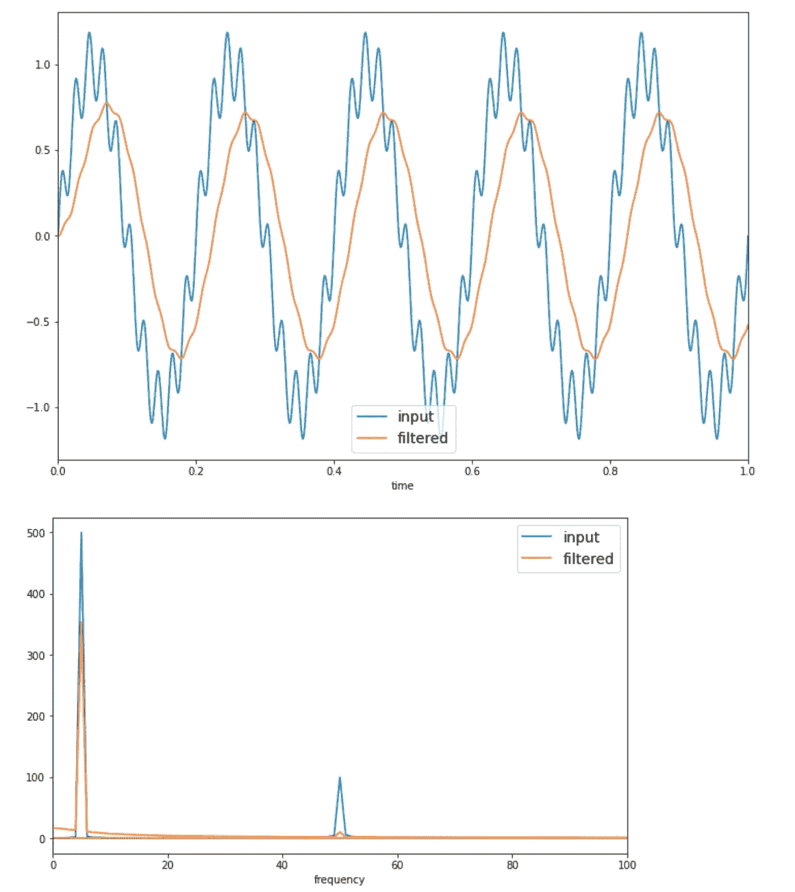

by author

在 C++中。

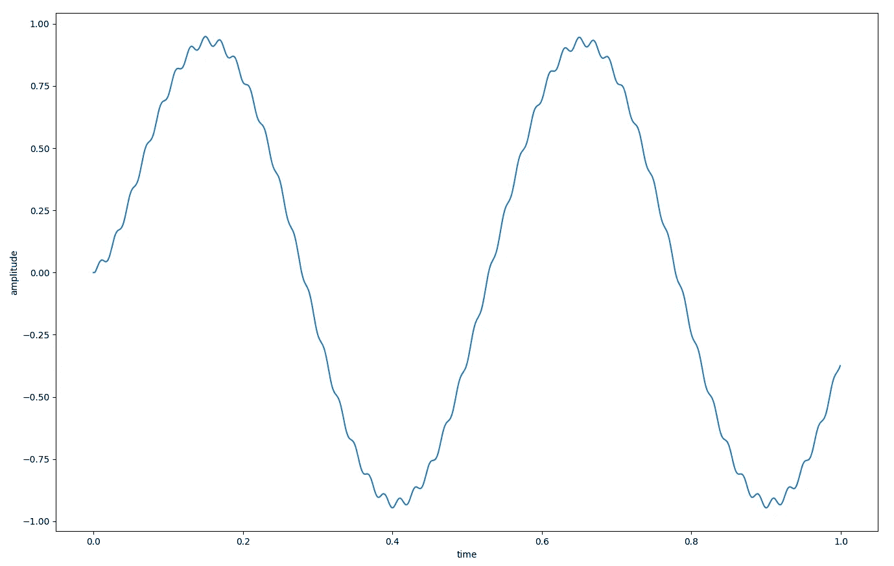

by author

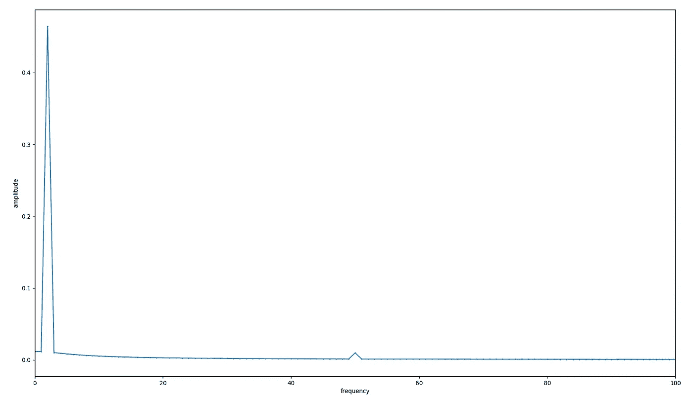

by author

**陷波滤波器设计**

陷波滤波器起着特殊的作用，因为它只衰减特定的频率。陷波滤波器可以与窄带滤波器相关联。在本节中，我将向您展示如何实现这种滤波器的原理。

稍后，我们将对两种不同类型的输入信号应用陷波滤波器，但我们的目标是消除 50Hz 信号。
我真的推荐你也看这个精彩的补充视频。

在上一节中，我们讨论了低通滤波器。这个概念将被重用，但是有重要的修改。你可以看到低通滤波器滤除了 50Hz 的电波。但是如何管理我们也想保持 80Hz 频率的情况呢！？
应用该任务标准低通滤波器也将移除该频率。我们需要应用替代解决方案吗？是的。
陷波滤波器将只移除(在这种特殊情况下)一个特定的频率——50Hz。

大家还记得，我们计算了低通滤波器的传递函数，可以改写如下。

低通体图。

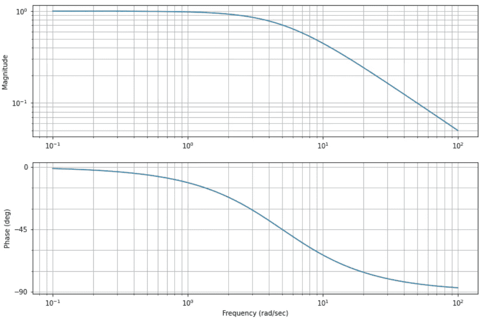

by author

另一方面，正如我上面提到的，我们正在寻找“窄通”滤波器，它只衰减特定的频率。为了做到这一点，我们必须看看高通滤波器(例如 20Hz)，这个值实际上是 20rad/s，正如我前面提到的。

高带滤波器(一阶)的传递函数可以用公式表示如下:


对于我们的特定示例，可以绘制和描绘这种类型过滤器的主体图:

高波段身体图。

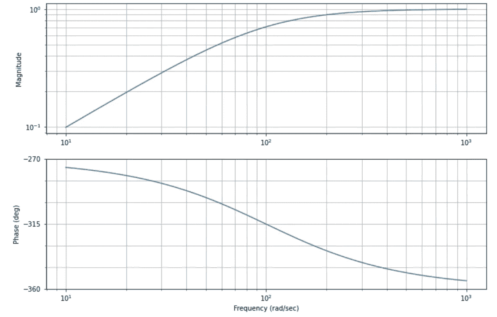

by author

现在，我们将连接传递函数和图体图。

通带滤波器的主体图。


by author

大家可以看到，有一种窄带滤波器，但我们无法适当控制滤波器的深度，因此我们必须重新考虑一下我们的解决方案。

另一个充分的方法是再次采用低通滤波器，但这次是二阶(两个极点)并降低阻尼。看看身体曲线会发生什么。

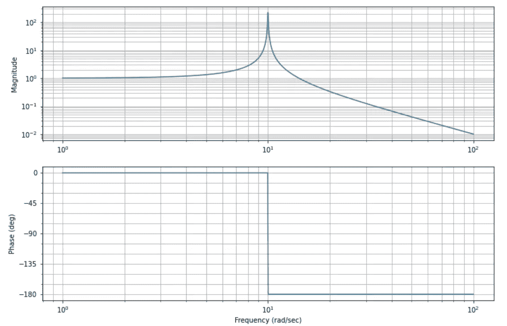

by author

如你所见。将阻尼降低到几乎为零，我们会收到截止频率的几乎无限放大(Python 不幸在这里没有正确计算)。

**现在我们将应用技巧，翻转传递函数。**

这个新的(翻转的传递函数)的主体图看起来如下，

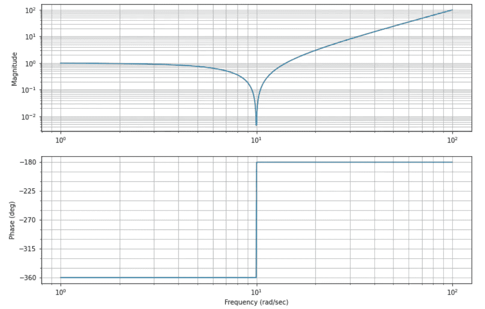

by author

这是我们正在寻找的几乎完美的传递函数，然而我们仍然有两个问题需要处理。由于我们现在只有两个零点(无极点)和，
2，所以放大了 40dB/十进制的高频信号。因为滤波器传递函数的分子大于分母，所以传递函数不能在物理上实现

我们将通过增加两个极点来解决这些挑战。每个极点都会将高频幅度拉低 20dB/十倍频程，并使我们的频率响应在自然频率范围内变得平坦。

**这些杆子怎么选？**

我们用公式来表示应该位于固有频率上下极点。

```
pole_above = (a * wn)/(s+a* wn)pole_lower = (a * wn)/(s+(wn /a))
```

将这些应用于我们翻转传递函数的极点，我们将得到:


我们可以通过再次绘制主体图来检查我们的过滤器设计。

最终陷波滤波器的主体图，

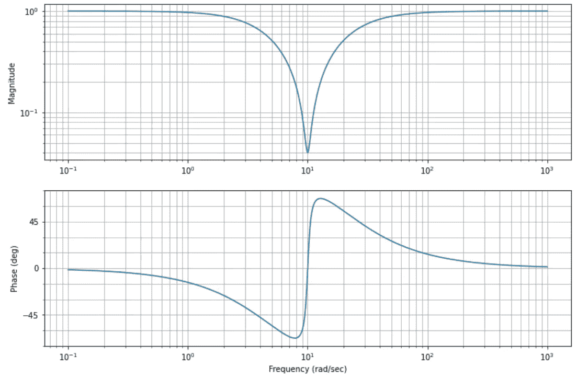

by author

现在滤波器更深了——对于我们的频率，信号将衰减约 28dB。

我们刚刚完成了陷波滤波器的设计。现在，在设计低通滤波器时，我们必须应用我在上面指定和解释的相同设计步骤。原理是一样的。你会在朱庇特笔记本里找到细节。

如前所述，我们将通过应用两个信号来测试设计我们的滤波器。在这两种情况下，我们都希望消除 50Hz。

正如预期的那样，对于第一个信号，50Hz 已经被移除。然而，最有趣的是第二个信号，它由三个频率组成:20、50 和 80Hz。这种情况下，陷波滤波器表现出色。它几乎完全消除了 50Hz，对边频 20 和 80Hz 没有任何影响。

请考虑以下结果(Python 和 C++)。


by author

考虑陷波滤波器后的信号(时域)。


by author

关于信号(50Hz)的频谱 DFT 已移除。

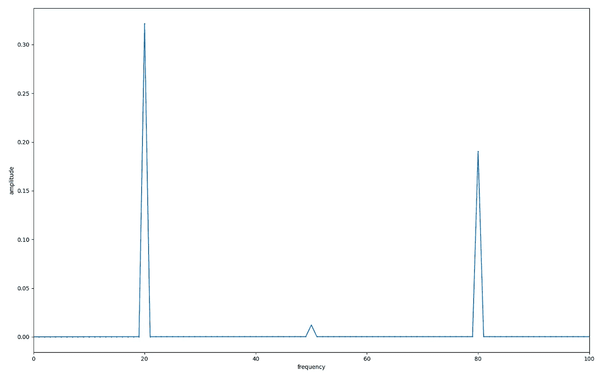

by author

感谢您的阅读，

如果您对本文感兴趣，我真的建议您查看这两个令人印象深刻的资源库:

```
// [https://github.com/capitanov/dsp-theory](https://github.com/capitanov/dsp-theory)// https://github.com/AllenDowney/ThinkDSP
```