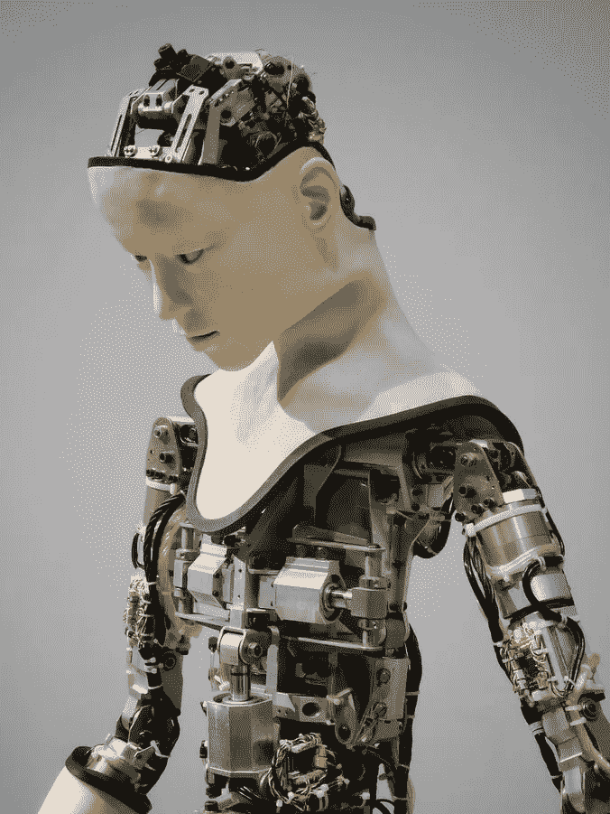
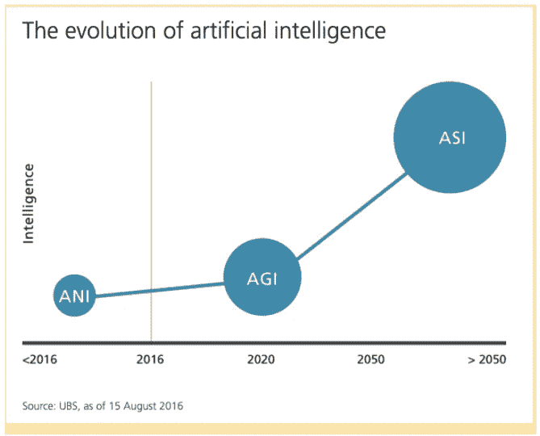
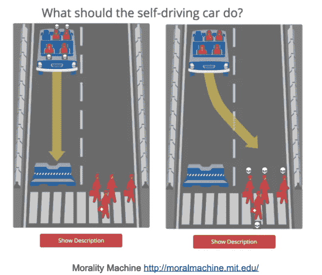

# 人工智能&数字信任的现状

> 原文：<https://medium.com/geekculture/digitaltrust-bc50d55dee37?source=collection_archive---------73----------------------->

***总有一天你会灭亡。你将和你的同类一起躺在泥土里…在那片沙地上，一个新的神将会出现。一个永远不会死的人。因为这个世界不属于你，也不属于之前来的人。它属于一个即将到来的人*—多洛雷斯/西部世界"**

多年来，媒体一直在报道反乌托邦未来的危险。像《西部世界》这样的节目和《钢琴演奏者》这样的书告诉我们，作为一个社会，当企业继续扩大他们的数字足迹时，有必要担心机器学习和人工智能技术的未来。

> “现实没那么戏剧化。毫无疑问，人工智能具有破坏性的潜力，也具有变革性的潜力，尽管在这两种情况下，它都没有达到大众媒体和娱乐业有时描绘的极端。*——*[*斯韦策*](https://www.elsevier.com/connect/the-biggest-misconceptions-about-ai-the-experts-view#contributors) *和* [*伊恩·埃文斯*](https://www.elsevier.com/connect/the-biggest-misconceptions-about-ai-the-experts-view#contributors)

一些人能够写出对技术的恐惧，因为日常便利超过了普通人的担忧。每天都有新用户通过联网设备将谷歌和亚马逊的最新人工智能创新带入他们的家庭和生活。无论是将物品添加到购物清单中，还是不费吹灰之力关灯，或者在进门之前确保您的房间温度适中，这种便利都是无与伦比的。然而，从这些设备开始进入普通家庭的那一刻起，对其真实意图的怀疑就遍布互联网

与此同时，收件箱里充斥着关于我们的数据被硅谷出售的头条新闻。突然我们意识到，我们为支持人工智能而放弃的大量信息不仅有助于我们打开我们最喜欢的节目，还有助于告诉剑桥分析公司，我们中的哪些人很容易在选举中受到影响。错误信息在网络上泛滥。虽然许多人不太明白大型科技公司实际上是如何使用他们的数据的，但他们知道自己并不信任这些数据。

你认识像下面这样的帖子吗？

用户争先恐后地试图重新控制他们(曾经假定的)私人数据，而在人工智能方面取得令人难以置信的进步的公司仍然留在搜索结果的最后几页，被耸人听闻的标题所掩盖。对新技术接管世界的恐惧再次上升。然而，我们离这个未来比我们想象的要远得多。

在我们日常生活中的许多任务的自动化的今天和未来之间有足够的空间来涵盖。“人工智能将会出现，但它不会夺走人们的工作。人工智能将使人们更有效率。他们不再需要做重复的、平凡的工作。相反，他们将有能力投资于更好地理解他人和文化。”首席执行官 Ashish Toshniwal，

在人工智能领域，团队正忙于假设和测试。产品爱好者知道，为了建立最有效的解决方案，你必须快速失败，并且经常失败，这样你才能使解决方案无效。在人工智能领域，失败意味着更多。这不像发现用户不知道如何浏览你发布的最新功能那么简单。训练机器学习的一次失败。可能意味着对罪犯的错误识别，或个人贷款资格的否定。赌注更高。

人工智能大致分为三个阶段:人工狭义智能(ANI)、人工广义智能(AGI)和人工超级智能(ASI)。随着我们努力进入超级智能时代，通过人工智能可以实现的可能性激励着每个人，从最新的技术实习生到使用机器学习领先于潜在诊断的医生。然而，通往人工智能“未来”的道路是崎岖不平的。

让我们以贾内尔·谢恩的[为例。在这里你可以看到，A .我被要求组装一套机器人部件，从 A 点到达 b 点。](https://www.ted.com/talks/janelle_shane_the_danger_of_ai_is_weirder_than_you_think/transcript?language=en)

“写一个传统风格的计算机程序，你会给程序一步一步的指示，如何把这些部件组装成一个有腿的机器人，然后如何用这些腿走到 b 点。”

结果不像预期的那样。当人工智能将零件组装成一座塔并倒下时，它“技术上”到达了 b 点。然而，几乎不是以其他人预期的方式。

举个例子，把它放在更大的范围内。PredPol 是一种旨在预测犯罪将在何时何地发生的算法，旨在帮助减少警务中的人类偏见。然而，用来“教导”或“训练”这个人工智能的数据教会了它融入偏见，并经常派遣官员到高种族构成的社区，而不管实际的犯罪率。

似乎很容易解决，对吗？确保训练数据、请求、意图都被机器正确地解释，我们准备好了，应该准备好了。当然，随着技术进步的速度，我们可以很快解决这些问题。

没那么快。即使是最简单的机器学习，比如遵循管理日常司机的既定交通规则，也可能是模糊的。虽然这个概念看起来直截了当，“不要杀人类”，“遵守命令”，我们现在必须引入伦理和道德。目前，如果没有人类的帮助，这项技术无法向前发展。

作为人类，我们很容易处理道德“权衡”进入现代[电车问题](https://en.wikipedia.org/wiki/Trolley_problem)。

道德机器【http://moralmachine.mit.edu/ 

“道德机器”是一个测试，探索了自动驾驶汽车机械故障或遇到障碍的许多场景。在测试中，我们探究人们是否认为汽车应该继续行驶或冲出车道。此外，测试开始分析如果街上有人受伤，我们是否会有不同的感觉。如果他们违反了法律，超重，年老，年轻，或在道路上？

这些结果提醒我们,“道德”或伦理上正确的决定因地区而异。例如，不同的文化对老年人应该发生什么的预期有很大不同。一些人认为保留孩子生活的机会更重要，而另一些人热情地认为老人是优先考虑的。与人工智能相关的挑战是，实施解决方案的公司不仅仅是地区性的，它们还具有全球影响。这不仅导致技术的必要监管和民主化，也导致人工智能基础设施的必要监管和民主化。

技术监管的世界仍在探索之中，存在大量模糊之处。政府官员刚刚开始弄清楚他们对这类技术的立场，选民们仍在试图理解候选人的立场。

面对所有这些障碍，我们发现自己在问，对于人工智能的未来，果汁值得榨吗？为什么要推？

我们是梦想家和实干家。在某个时间点上，人工智能的可能性是一种电影。现在，我们不仅幸运地找到了解决这些问题的方法，而且我们能够看到我们的劳动成果，这些成果在我们有生之年被分享。对我来说，这是无价的奖赏。所以如果我不得不处理这种挤压，我会说把橘子递过来。

## 来源和报价

*   [https://www . McKinsey . com/industries/financial-services/our-insights/insurance-2030-ai 对保险业未来的影响](https://www.mckinsey.com/industries/financial-services/our-insights/insurance-2030-the-impact-of-ai-on-the-future-of-insurance)
*   【http://www.kasparov.com/deep-thinking-ai/ 号
*   [https://www . Elsevier . com/connect/the-maximum-misconcepts-about-ai-the-experts-view](https://www.elsevier.com/connect/the-biggest-misconceptions-about-ai-the-experts-view)
*   [https://eleks.com/blog/digital-trust-impact/](https://eleks.com/blog/digital-trust-impact/)