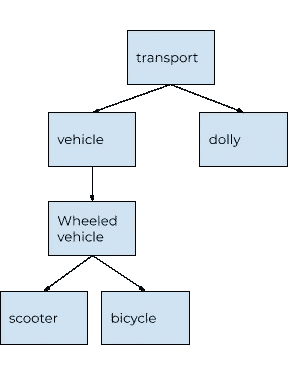
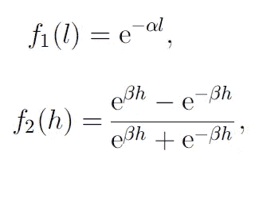

# 发现潜在本体术语之间的相似性

> 原文：<https://medium.com/geekculture/discovering-similarity-among-prospective-ontology-terms-b7d0cc33d102?source=collection_archive---------9----------------------->

在其他帖子中，我讨论了我们如何在自由职业者的个人资料和招聘启事中选择预期的术语，然后建立父子(包含)关系([第一部分](/geekculture/automatic-ontology-generation-part-1-15fd17827418)，[第二部分](/geekculture/automatic-ontology-generation-part-2-results-81ec0fe3c2cc)，[第三部分](/geekculture/automated-ontology-generation-part-3-software-323c60de3f99))。发现术语相似性是我们在 Upwork 的自动本体更新中实现的下一步。我们选择[1]提出的方法作为我们方法的基础。那篇文章的作者建议计算相似性作为几个部分的函数:WordNet 中的术语之间的距离(最短路径，l)和最短路径的深度。这里的直觉相当简单:术语彼此越接近，它们的含义就越相似。如果术语在同一个同义词集中(在 WordNet 中，同义词集实例是表达相同概念的同义词的分组)，它们之间的距离最短，它们就是同义词。它们离得越远，它们的意思就越不相似。例如，“宝石”和“宝石”之间的相似度高于“宝石”和“岩石”之间的相似度。

对深度(h)的直觉是基于这样一种感觉，即更详细的术语存在于 WordNet 层次的更深层次中。例如，考虑 WordNet 3.1 层次结构的以下部分。术语“自行车”和“踏板车”在语义上比“车辆”和“小车”更丰富，因此，尽管最短路径的长度相同，但前者对之间的相似性高于后者。

WordNet 3.1 example tree

*S* = f1(l)*f2(h)，

Components of similarity calculation

我们将相似性 *S* 计算为两个函数 f1 和 f2 的乘积，其中α是缩放最短路径贡献的参数，β是缩放深度贡献的参数。在我们的计算中，我们取α = 0.2，β = 0.6。使用上面的示例树，两对(踏板车/自行车和车辆/推车)之间的距离是 2。我们测量的深度是从层次结构的顶部到第一个公共父级的距离。一般来说，WordNet 对于名词的层次结构是从“实体”这个词开始的，这个词是所有名词树的根。在我们的例子中，如果我们以“transport”作为根，那么 vehicle/dolly 的深度为 0(“transport”是它们的第一个公共父级，也是层次的根)。踏板车/自行车对的深度是 2-从根(“运输”)到第一个公共父对象(“轮式车辆”)的距离。

虽然这本身就是一个非常有用的公式，但我们需要更多。事实证明，我们在分析实际用户资料和工作描述的文本后发现的术语通常是复合词:由多个单词组成。我们的分析还发现了我们的本体中缺失的数千个术语。虽然我们可以将每一项与所有其他项进行比较，但计算显然会相当昂贵。我们还可能会得到许多误报，这些术语可能具有依赖于业务领域的含义。这些术语在一个业务领域中可能类似于某些术语，而在另一个领域中可能完全不同。例如，“客户”可以接近“社会媒体和营销”领域中的“买方”和“软件开发”领域中的“节点”。

最初的文章指出，复合术语通常过于具体，实际上不可能与任何东西相似。在许多知识领域，这可能是真的，但对于 Upwork 的文档，我们发现这是不正确的。为了在我们的个人资料或职位空缺中进行搜索，有大量可以相互替换的复合术语。为了能够比较复合术语，我们使用以下方法。为了计算两个术语的相似度，我们首先创建术语中最大长度的向量。例如，如果我们比较“会计顾问”和“簿记员”这两个术语(我在前面的文章中描述的方法没有涉及到)，我们会创建长度为 2 的向量。然后，我们以其中一个术语为起点，计算起始术语的单词和另一个术语的单词之间的成对相似度。我们找到最高的相似度，并从进一步的考虑中排除所使用的单词，直到所有的单词都被消耗掉。由于结果明显取决于向量的顺序，我们从第二个向量开始重复这个过程。对于“会计顾问”和“簿记员”的例子，两个向量都是[0.8187，0]。那是因为“会计”最适合“记账员”，消耗“记账员”，所以“顾问”没有词来计算相似度，其相似度默认为 0。当我们反过来计算:从“记账员”到“会计顾问”的相似度时，“记账员”消耗“会计”且该术语中没有第二个词，因此向量的第二个成员默认为 0。然后，我们将得到的向量的范数相乘，并通过将范数的乘积除以向量的长度(大小)来归一化到范围 0 到 1。

这种方法有明显的局限性:两个单词的术语和一个单词的术语之间的最佳相似度是 0.5(对于上面的例子是 0.335)，不管这些术语在语义上有多接近。然而，为了我们的目的，自动检测至少一些对 Upwork 的本体具有相似意义的术语，该计算工作得非常好。

为了加快计算速度并减少误报，我们只计算同一业务领域中术语之间的相似度。如果 n 是项数，计算的时间复杂度是 n2。将相似性搜索限制在业务领域内的术语可以显著减少总计算时间。

# 结果

经过一些实验，我们决定将相似性阈值设置为 0.8187。计算发现了不到 9000 个相似的术语，其中绝大多数是两个单词的术语。在这 9000 个词汇中，大约有 2700 个词汇是互不相同的——词序颠倒或者中间有空格。其余的，假阳性的百分比接近 1%。然而，这些误报是只有精通特定业务领域的人才会识别的术语。考虑到一些源文档(职位发布)是由“客户”创建的，他们不一定精通他们需要帮助的领域(例如，一个客户可能需要帮助创建一个网站，而他们的主要业务远非如此)，我们不确定是否应该从具有相似含义的单词列表中删除这样的误报。例如，我们的软件发现“软件技术专家”与“软件程序员”非常相似，“办公自动化”与“业务自动化”接近。

在我们的“待办事项”列表中，是对复合术语相似性公式的进一步改进。我们也在尝试基于未被发现的相似词列表来更新搜索结果。现在我们可以快速迭代结果。