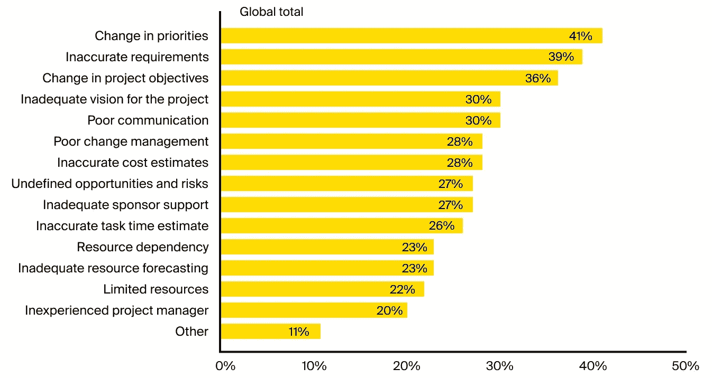

# 项目的发现阶段:实践指南

> 原文：<https://medium.com/geekculture/discovery-phase-of-a-project-the-practical-guide-2063fa68a375?source=collection_archive---------11----------------------->

见解，总结如下:

*   在全球实施的所有创新 IT 项目中，只有 10%到 30%最终取得了成功。
*   通过引入发现阶段，可以防止导致软件开发项目出错的大部分问题。
*   项目的发现阶段是软件开发管道的第一个阶段，其目的是帮助您将您的商业想法转化为具有竞争优势的全功能解决方案。
*   项目发现阶段通常包括四个阶段:需求引出、解决方案设计、设计解决方案和项目计划。每个阶段都产生了一系列可交付成果，您可以用它们向投资者和利益相关者推销，并在此基础上构建您的开发流程。
*   业务分析师和工程团队的代表通常负责执行发现。外包的发现阶段也是一个有价值的选择，尤其是如果你缺乏有经验的内部 IT 人才。
*   无论您选择瀑布还是敏捷项目管理方法，都将影响您发现的长度和范围。
*   在瀑布中，通常要提前计划整个范围，这可能需要 4 到 8 周甚至更长的时间——取决于项目的规模和复杂性。
*   在敏捷中，建立所谓的 sprint 0 或初始阶段是很常见的，这通常需要几周或更短的时间。通常在开发跟踪之前运行一两个迭代的发现跟踪。
*   标准发现阶段的费用从 20，000 美元起。

你有一个创新的想法。我们自己也是技术爱好者，我们渴望马上把它变成一个功能性的应用程序。但是，没有所谓的发现阶段就投入开发可能是致命的，特别是在实现复杂或创新的解决方案时。

各种研究表明，在全球实施的所有软件开发项目中，只有 10%到 30%成功。

令人沮丧的是:想法越创新，项目越有可能失败。

失败的原因各不相同，但通常都与糟糕的项目规划有关:

DevTeam 分享的调查调查了软件项目失败的常见原因。被调查的公司被要求选择最多三个他们认为他们的软件开发计划失败的原因。失败的前三个原因是组织优先级的变化、不准确的需求和项目目标的变化。

我们交付[软件工程服务](https://itrexgroup.com/services/software-engineering/)的经验证明:导致软件开发项目出错的大部分问题是可以避免的——这就是发现阶段发挥作用的地方。

如果你即将开始一项 IT 计划，不想让它失去控制，请继续阅读。下面，我们分享了发现阶段如何帮助企业和初创公司成功推出软件解决方案，解释了哪些类型的项目受益于发现活动，并利用 ITRex 产品组合中的示例分享了发现阶段的大致成本。

# 项目的发现阶段到底是什么？

项目发现阶段是软件开发管道中的第一个阶段。在这个阶段，你根据业务环境测试想法，消除疑虑，并证明对未来应用的假设。

如果处理得当，发现阶段有助于您了解如何将您的商业想法转化为功能完善的解决方案，同时为准确的时间和[成本估算](https://itrexgroup.com/blog/estimating-the-cost-of-software-development/)提供基础。

最终，将发现阶段引入到您的项目中有助于您实现符合用户期望并具有竞争优势的产品。

根据工作范围的不同，敏捷项目的发现阶段可能需要 2 到 4 周，瀑布项目可能需要 4 到 8 周甚至更长时间。通常根据时间和材料(T&M)定价模型进行计费。

# 项目发现阶段包括哪些阶段？

项目的发现阶段通常包括四个阶段:

1.  需求启发
2.  解决方案设计
3.  解决方案架构
4.  计划图编制

# 需求启发

在这个阶段，你建立了一个清晰的产品愿景。你还要考虑将这一愿景变为现实的战略方面。为此，您需要执行以下步骤:

## 确定关键利益相关者和业务背景

通过访谈、问卷调查、讨论、焦点小组和观察开始项目的发现阶段，深入了解未来解决方案将被使用的环境，并记录主要利益相关者的需求和期望。后者应该包括产品所有者、管理员、最终用户、开发人员、投资者和其他参与设计和使用未来解决方案的人。

此外，不要忘记回头看看现有的文档。如果你已经有了市场调查、用户访谈或任何其他有用的文档，你可以通过节省额外研究的时间来缩短项目发现阶段。

## 定义产品愿景

基于利益相关者的反馈，定义产品愿景。Think:概述产品开发目的并向用户传达其关键价值的高级文档。

## 确定成功指标

作为项目发现阶段的下一步，考虑测量产品性能的标准。这些可能包括月收入、每日活跃用户、客户终身价值和其他因素。产品经理将依靠这些标准来监控产品是否符合设定的业务目标。

## 确定目标用户

继续研究你的目标受众并创建用户角色。确定他们的需求、期望和痛点，并思考在应用程序的用户旅程中解决这些问题的方法。

## 明确技术要求

将项目发现阶段的前几个阶段收集的所有数据转化为软件需求规范(SRS ),记录功能性和非功能性(性能、可用性、安全性等)。)对未来解决方案的要求。请参考我们的[撰写 SRS 指南](https://itrexgroup.com/blog/guide-to-software-requirements-specification-document-benefits-expert-tips/)，了解更多关于如何撰写有说服力的文档的细节。

## 制定风险管理策略

制定风险预防和缓解策略。这些将帮助您在潜在的风险、不确定性和障碍成为问题之前识别和应对它们。

## 定义项目范围和时间表

在项目发现阶段的这一点上，您可以提供完成项目所需的资源、成本和时间的详细估计。通过制定一个完整的项目时间表来结束这一阶段，该时间表包含已定义的里程碑、可交付成果和截止日期。

在完成需求引出阶段后，您手头将有以下可交付成果:

*   产品愿景声明
*   项目范围文档和范围图(可选)
*   用例、用户故事和用户旅程图
*   产品需求文档(PRD)、功能需求文档(FRD)或软件需求规范(SRS)
*   风险管理策略
*   项目时间表

# 解决方案设计

不言而喻，解决方案设计阶段的目标是设计产品的用户体验，并提出它的外观和感觉。在设计阶段，您通常会执行以下活动:

## 手工用户旅程地图

在目标受众研究和用户角色的基础上，对用户的产品体验进行高层次的可视化描述。通常，每个用户群都需要一个单独的用户旅程地图。

通过思考用户和未来产品之间的交互点，继续项目发现阶段。使用您在研究过程中收集的数据来填充旅程图。

从设计角度来说，你的地图可以像时间线一样简单，也可以像故事板一样复杂，描述每个阶段到底发生了什么。

## 创建线框和模型

[通过创建传达解决方案结构和设计的蓝图，将您的概念形象化](https://itrexgroup.com/services/data-visualization/)。

## 构建原型

通过构建解决方案原型来结束这一阶段。思考:反映其基本功能和设计的未来解决方案的早期版本。原型是让您的利益相关者体验未来解决方案的行为、外观和感觉的好方法。

为了验证用户流以及 UX 和 UI 决策，您可能会经历几轮测试。这完全没问题。在每次迭代中收集涉众的反馈，并依靠它来完善你的设计。

解决方案设计阶段完成后，您将获得以下交付件:

*   用户旅程地图
*   用户界面线框和用户界面设计模型
*   低保真度解决方案原型

# 设计解决方案

在项目发现阶段的这个阶段，您考虑如何从技术角度实现设计的愿景。要完成这一切，请执行以下操作:

## 打造技术愿景

基于技术最佳实践、业务背景和来自开发团队的反馈，设计一个如何将产品愿景变为现实的技术解决方案。确保您的技术愿景是灵活的、经得起未来考验的，并且与整体业务战略相一致。

## 进行技术可行性分析

作为项目发现阶段的下一步，评估您将如何交付解决方案的细节。考虑技术前景、可用的基础设施、资源和预算。最终目标是确定提议的技术解决方案的可行性，并确保项目在法律上和技术上是可行的，在经济上也是合理的。

## 设计解决方案架构

依靠行业最佳实践并基于技术要求，设计未来解决方案的体系结构。内置的可伸缩性、灵活性和安全性是您需要寻找的特性，这些特性有助于确保您可以在以后进一步改进您的解决方案。

## 选择最佳技术组合

下一步是选择最佳的编程语言、框架和库。在这样做的时候，请记住，您做出的技术选择将影响未来解决方案的性能和可伸缩性、上市时间、软件的可维护性以及支持成本。请务必根据这些因素仔细权衡您的技术选择。

## 将项目范围分解成可交付成果，并创建一个待办事项结构

有了清晰的项目范围和技术选择，您就可以将工作量分解成具体的可交付成果，并设计项目待办事项。有不同的方法来组织你的待办事项；我们发现一个依赖于用户故事作为最方便交付的灯塔。

## 设计质量保证和测试策略

为了确保您的解决方案运行顺利，在早期投入精力设计一个全面的 QA 策略。请记住，全面的质量保证不仅限于测试——尽管它是 QA 的重要组成部分。因此，确保[在计划阶段就包含 QA 活动](https://itrexgroup.com/services/software-testing-qa/),并遵循所需的功能和非功能测试活动。

完成解决方案设计阶段后，您将获得以下交付成果:

*   技术愿景
*   解决方案可行性记录
*   解决方案架构图
*   技术堆栈
*   范围基线
*   积压结构
*   质量保证和测试策略

# 计划图编制

项目发现阶段的项目规划阶段的目标是定义如何在设定的时间范围内，利用可用的资源并考虑到限制条件来完成项目。为此，请执行以下活动:

## 绘制资源、上市时间和预算估计

从起草资源计划开始，确定、组织和列出完成项目所需的所有资源。稍后，您将使用该计划作为蓝图，以确保项目工作在预算内按时完成。

## 概述项目路线图

对项目的主要元素进行战略概述，包括目标、里程碑、可交付成果、资源和计划的时间表。在开发的后期阶段，您将依赖路线图作为参考指南来保持项目团队在正确的轨道上。

## 成立一个项目小组

根据产品的类型和复杂性、上市时间、分配的预算和其他项目限制，组建一个项目团队来实现您的愿景。为了确保你有一个最佳的团队组成，请随意研究我们深入的[项目团队结构指南](https://itrexgroup.com/blog/software-development-team-structure/)。

## 定义项目 KPI

设置要跟踪的度量标准，以衡量项目的成功。这些可以跨越预算、质量、有效性和时间表 KPI。确保你引入的每个指标都是 **SMART** (具体的、可衡量的、可实现的、相关的、有时限的。)

## 设置进度跟踪工具

您不必手动管理项目数据。取而代之的是，使用一个项目管理工具，它将允许你方便地浏览来自不同来源的数据。市场上最流行的进度跟踪工具有:Trello、JIRA、Hive、Asana、Nifty 等等。

## 建立项目基础设施

一旦核心发现活动完成，就该通过引入运营和/或 [DevOps 团队](https://itrexgroup.com/services/devops/)来完成项目的发现阶段了。他们将为开发和测试活动建立环境，并为自动部署创建管道。

项目规划阶段结束后，您手头将有以下交付成果:

*   项目路线图
*   概算
*   团队组成
*   项目 KPI
*   项目基础设施计划
*   可选地，创业公司向投资者展示的推介材料。

# 谁负责指导和协调发现？

有了上面的信息，你可以自己进入项目的发现阶段。另一种方法是求助于经验丰富的项目发现服务提供商，他们将为您提供合适且熟练的人才支持。通常，项目发现团队包括一名业务分析师和一名工程团队代表，可以是解决方案架构师、 [ML 顾问](https://itrexgroup.com/services/machine-learning-development/)或任何其他与项目相关的角色。扩展发现团队可能由以下角色组成:

*   产品所有者
*   产品负责人拥有最初的产品想法，并负责开发产品愿景。作为产品所有者，您将参与产品开发，但您的任务将更具战略性，而分析、设计和开发的主要部分通常将移交给其他团队成员。
*   项目管理人
*   项目经理是负责利益相关者之间顺畅沟通、规划工作范围和跟踪项目进展的人。
*   商业分析员
*   业务分析师是提出具体计划的人，如何将最初的愿景转化为实际的功能性解决方案。作为一名业务分析师，您采访利益相关者，深入了解他们的需求，并根据业务环境权衡这些需求，以制定详细的 SRS。
*   解决方案架构师
*   解决方案架构师分析需求并设计解决方案逻辑和架构。他们还提出工具、技术和方法，以确保您获得有竞争力、经得起未来考验的软件。
*   UX/用户界面设计师
*   一个 [UX/UI 设计师](https://itrexgroup.com/services/ui-ux-design/)是一个设计不间断和流畅的用户体验的人。他们研究用户的需求和偏好，使未来的产品尽可能方便和吸引人。

此外，您的发现团队可能包括一名开发运维工程师、一名 QA 工程师和一名安全工程师。

一名 **DevOps 工程师**将负责为项目活动建立基础设施，并为自动化构建设计一个管道，如果你选择实现的话。

如果你的产品有严格的质量要求，让一名质量保证工程师参与发现活动。让他们评估需求的可行性，并将必要的 QA 活动纳入开发的所有阶段。

一名**安全工程师**反过来将确保您的产品符合必要的安全标准，并拥有内置的保护机制。

# 敏捷项目和瀑布项目中的发现有何不同？

无论您选择线性项目管理方法，比如瀑布，还是敏捷家族中的一种管理方法，都会影响发现阶段的处理方式。

在瀑布中，所有的发现活动都是在开发开始之前完成的。发现阶段通常需要长达八周的时间和 10%到 15%的项目预算。完成后，团队获得所有必要的可交付成果。

另一方面，在敏捷中，发现阶段通常在开发轨道之前运行一到两次迭代。通常需要几周或更短的时间。

如果你想更深入地了解不同之处，请阅读我们在瀑布与敏捷项目中关于[发现阶段的文章。](https://itrexgroup.com/blog/product-discovery-choosing-between-waterfall-agile-kickoff/)

# 什么类型的项目可以从发现阶段中受益？

我们采访了[ITRex](https://www.linkedin.com/in/vladimir-sechko-377a2716/)的 BA 主管 Vladimir Sechko，询问他哪些类型的项目可以从引入发现阶段中受益。剧透:任何。我们稍后会解释这种反应的原因。现在，我们将从 [ITRex 的投资组合](https://itrexgroup.com/case-studies/)中选取三个例子来说明发现活动何时会派上用场。

**项目 1。市场研究和预测的软件平台**

一家希望为零售商创建市场研究和预测平台的初创公司接洽 ITRex，以测试他们想法的可行性，并进一步开发解决方案概念。

针对时尚零售市场，基于 ML 的平台将帮助制造商和零售商根据特定销售点的需求来调整生产和销售商品的数量。该预测将基于开源数据，包括社交媒体信息。

交付范围包括研究预测模型的数据源，思考预测模型背后的逻辑，描述未来解决方案的功能，以及制定与数据收集和数据存储相关的合规性要求。

一名业务分析师和一名 ML 工程师参与了发现活动。

在发现阶段结束时，客户验证了其想法的可行性，获得了一个底层功能解决方案，其中所有功能块都得到全面描述和可视化，并了解了未来解决方案的合规性要求。

该解决方案的概念现在正在向投资者推销，很有可能吸引到进一步发展所需的资源。

因此，我们建议在以下情况下执行项目发现阶段:

*   你的解决方案与人工智能、人工智能和其他创新技术有关
*   您的解决方案依赖于公共数据，并且您不熟悉该领域的数据收集要求
*   您还没有磨砺最初的愿景，并且不知道在第一次开发迭代中应该关注哪些核心特性

**项目 2。协调 B2B 流程的后台办公室**

一位拥有四项业务的所有者，包括一项音乐流媒体服务、一项在线印刷和刺绣服务，以及一家允许乐队设计和销售商品的在线商店，他希望开发一个方便的后台办公室来协调所有业务。后台将允许改进曾经部分离线的 B2B 管理流程。

在调查过程中，ITRex 的业务分析师研究了客户的需求，并设计了未来解决方案的功能图。建议的解决方案将帮助客户的合作伙伴和员工在合作伙伴模块内无缝沟通。

因此，在执行发现活动之后，客户获得了一个详尽的未来解决方案的功能图，该解决方案将使用 PHP Symfony 框架来实现。

因此，如果有问题的解决方案很复杂，并且有许多集成，那么就去进行发现活动。发现阶段将帮助您挑选出在第一次开发迭代中关注的核心特性，以便开始在前期获得价值。

**项目 3。一个非常规的移动广告平台**

一家初创公司求助于 ITRex 来验证和进一步开发他们希望快速推向市场的产品愿景。他们想出了一种新颖的带有赌博成分的广告方式。移动平台将允许广告商上传视频广告，让用户以类似抖音的方式观看。广告客户还将被要求设定他们愿意为该活动花费的金额。在观看视频内容时，将向随机用户显示索赔奖励按钮，该按钮将仅出现很短时间，其中奖励将等于广告商设定的金额。

在项目的发现阶段，我们磨练客户的业务理念，记录合规性要求，选择开发解决方案的平台，设计用户体验，考虑奖励算法的特点，并建立反欺诈机制。

客户继续与 ITRex 的团队一起开发解决方案。

因此，如果出现以下情况，请选择探索阶段:

*   你正在开发的解决方案存在于领域的交叉点，比如广告和赌博
*   该解决方案必须快速推出。在这种情况下，在发现过程中获得的可交付成果将指导开发过程，并帮助避免开发错误
*   您不确定合适的技术和平台
*   您不确定合规性和安全性要求

划清界限，发现阶段对于任何旨在成功交付的项目都是有价值的。把发现活动看作是对你的商业想法的另一次健全检查。

项目发现阶段也有助于在变化或不稳定的环境中导航开发。有了完善的愿景、详尽的需求和深思熟虑的时间表，在不忽略最终目标的情况下调整开发过程就变得更加容易了。

发现交付成果也有助于降低对产品所有者/产品经理的依赖。在敏捷中，产品经理的错误可能是致命的。在发现阶段之前的项目中，战略决策是经过集体思考和验证的，战略失败的可能性要低得多。

# 进行一个项目的发现阶段要花多少钱？

发现阶段的总成本取决于项目的复杂程度和要执行的活动范围。

例如，对于一个具有深思熟虑的愿景的项目，发现阶段的核心将围绕提出实现它的最佳方法，并得出所有需要的估计。总计约为 **$10，000-$15，000** 。

愿景不明确的项目的发现活动通常根据时间和材料定价模型计费。此类项目的发现费用从**20，000 美元**起，更多费用取决于所需的交付成果。

# 总而言之

因此，如果你是一家正在开发下一个突破性应用的初创公司，从发现阶段开始开发过程可以帮助你:

*   确定价值主张、用户需求和业务目标
*   定义工作范围并获得详细的时间和预算估计
*   获得一个工作原型向投资者推销
*   获得详细的架构解决方案，并开始寻找合适的合作伙伴和供应商
*   获得一个深思熟虑的产品愿景，让你在开发的后期阶段避免昂贵的修改
*   因此获得更高的投资回报

反过来，对于在非 IT 领域运营的企业来说，引入项目发现阶段可以带来以下好处:

*   记录良好的项目愿景和范围
*   决策所依据的真实利益相关者反馈
*   最大限度地发挥内部人才的影响
*   对时间和金钱投资的透彻理解
*   用户友好的体验
*   更高的投资回报

> *如果你对项目的发现阶段仍有疑问，或者正在寻找一个值得信赖的合作伙伴来启动你的计划，请联系 ITRex* *。我们经验丰富的 BAs 将为您的项目成功奠定基础！*

*原载于 2022 年 11 月 21 日 https://itrexgroup.com***。**