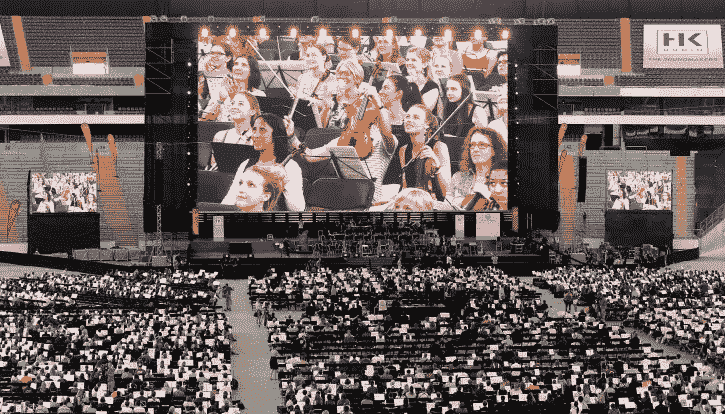
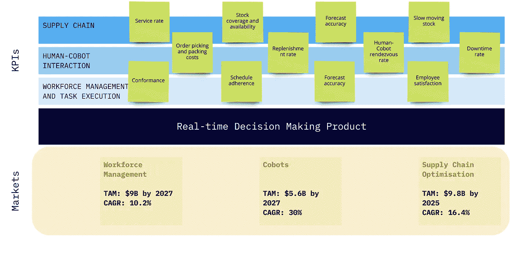
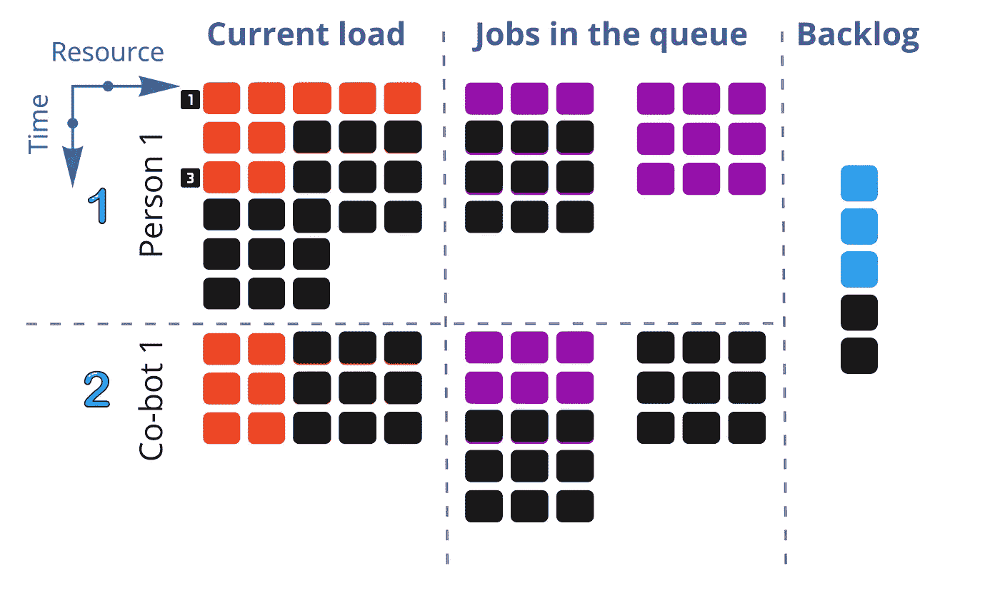

# 扰乱零售、仓库自动化和供应链行业:为什么任务执行软件产品需要重启？

> 原文：<https://medium.com/geekculture/disrupting-retail-warehouse-automation-and-the-supply-chain-industries-why-do-task-execution-7f6884bf217e?source=collection_archive---------11----------------------->

Seven thousand five hundred forty-eight musicians gathered in a football stadium in Frankfurt to play for 45 minutes, conducted by Wolf Kerschek. Source: EPA

你在这张照片中看到了什么？一个人指挥 7548 名音乐家一起演奏各种乐器——任何微小的偏差都会使交响乐偏离轨道。这里的中心思想是无论我们做什么——烹饪食物到送我们的孩子去学校需要一系列任务的精心安排。当决策通常是时间敏感的，并有一连串的后果时，我们使用辅助手段，如在一张纸上写下任务，对它们进行优先排序，创建一个序列，其中一个任务的输出成为另一个任务的输入，等等。

同样，在零售、仓储、运输和物流等行业也是如此。—存在旨在管理代理数量(人、机器人、设备等)的软件。)以及这些代理最终做什么(任务执行*等*)。今天的文章将使用[产品-市场契合度](https://biswasengupta.medium.com/the-product-market-fit-of-ai-technologies-ffbf3c618720)的支架，并利用[元宇宙](/geekculture/parallel-futures-and-the-blackhole-of-metaverse-4f4054f6ce4c)(或者更确切地说，我称之为**数字孪生**的子集)的想法来重新思考构建下一代劳动力管理和任务执行软件。对于那些执着于*‘这样一个产品的价值是什么’*的人来说，我已经戴上了市场研究的帽子，作为一个技术人员，我回到我的核心，戴上了我的机器学习的帽子。在接下来的一篇文章中，我打算将解决方案架构结合到一个 [edge AI 框架](/geekculture/edge-intelligence-the-upcoming-challenger-to-cloud-intelligence-34610f99414c)下，ML 模块和这样一个产品需要的云架构。

# **产品与市场的契合度**

Industries such as retail, warehousing, transport and logistics, supply chain are based on fine-tuned trade-offs between supply and demand. A delay can have a ripple effect throughout the chain of micro supply-demand trade-offs. I say micro because every stage of a chain has its supply-demand trade-offs to optimise for.

管理一个拥有大量产品的仓库或零售店包括解决不同层次的优化问题。优化向仓库的供应链供应以及从仓库向用于监控和重新进货的机器人的零售或在线前端供应，需要精心规划和优先化任务。任务有不同的风格——有些不是有效抢占的，例如，涉及物理资源移动的驱动任务。其他职责可以在随机时间段内占用资源；例如，包装订单所需的时间是工人年龄、敏捷度、技能等的函数。同样，任务也有一个可以在时间(顺序)和空间(多层)上链接的结构。大多数任务/劳动力管理系统在处理**可抢占的、动态的和分层的任务**方面存在局限性。它们通常基于手工制作的试探法，或者充其量是经典的运筹学方法。

Preemptable, dynamic and hierarchical tasks require **real-time decision-making algorithms**.

为了制定一个框架，**可以学习编排任务**，让我们来说明当前劳动力和任务管理系统的缺点。大多数劳动力优化和任务执行平台在商业环境中是静态的！为任务划分的代理和任务本身是提前几周预定的。时间表的可伸缩性包括手动调整提议的时间表(主要是启发式的或基于的)，违背了预测性和规范性时间表的目的。以下问题加剧了调度解决方案的复杂性，使得实时任务导向型劳动力协调市场出现了**缺口:**

**耦合劳动力管理和任务调度系统:**

★由商店经理或仓库主管手动调整(基于本地限制)计划会破坏基于软件的计划的目的(蝴蝶效应)。

★分层任务结构:重新装满玉米片的货架构成了走到后面的商店，找到有玉米片的货架，记住需要重新装满的零售前端货架，走到摊位，重新进货，最后在玉米片周围浮出其他产品。大多数任务执行忽略了子任务的层次和顺序。

★多级供应链养活一个店/仓库:一个店往往有多个供应商；供应链的微小变化会扰乱企业的日常运营。涟漪效应被忽略，因为外部干扰通常不被建模。

★制约因素(管理者与个人贡献者):人们需要根据资历或个人条件进行不同的安排。根据工人的能力、职业和技能来制定个性化的时间表常常被忽视。

★耦合时间表:一个人做两份工作，其中一份时间表对调度者是隐藏的——为调度创建了部分可观察的约束。

★员工流动率:零售/仓库工作通常有很高的流动率，我们不能指望新员工像零售/仓库老手一样有同样的能力。

**原子和动态约束下的资源利用:**

★原子资源限制:劳动力需要投入最少的小时数。这对于传统的任务执行系统来说问题不大，因为这通常会成为混合整数程序的一个约束。然而，具有随机过程建模约束更接近现实生活场景。

★可变的时间约束:对资源的原子约束对最终地平线提出了后续的限制。给定任务的随机结束时间没有在行业范围的静态调度器中建模。

**基于事件的劳动力建模:**

★当前情况的细微差别被忽略:陈旧的历史数据可能不会对时间表产生因果影响。仅仅因为上周一你的仓库里有大量订单，并不意味着本周一会有类似的需求。没有实时预测反馈到调度算法中并不是最佳的。

★无法处理溢出等边缘事件:健康和安全事件时有发生，而且本质上总是随机的。

**任务积压的优先级:**

★对任务进行优先排序:大型组织有大量积压的工作，通常不会根据它们的相关性或优先级进行清理。如果您的员工数量有限，将他们用于最高优先级的任务难道不是明智之举吗？

★无法获得已完成任务的反馈:一旦一个作业被分派给一个工人，调度程序就不知道该任务何时开始和结束。这就是计算机视觉派上用场的地方，它告诉我们一个分派的任务是否在给定的服务级别协议内完成。

**认知心理学的游戏化:**

★匹配的机会:调度程序与代理的技能集和任务规格不匹配。这就是你的职场引爆器(不是爱情兴趣，而是技能)发挥作用的地方。

★有效的团队组成:需要不止一个人一起工作的任务需要团队成员的正确组合来完成任务(RL 人员戴着你的合作博弈论帽子)。

★支持众包人类行为训练集:将零售或仓库环境游戏化有助于我们收集从运营角度来看变得越来越相关的人类行为数据。

# **市值**

既然我们已经描述了零售/仓库/供应链任务执行部分中的问题，那么让我们看看产品如果被制造出来是否能赚钱。请记住，有许多大大小小的公司提供劳动力管理和任务执行——这些解决方案已经运行了几十年。为什么客户会转向风险更大、未经证实、技术领先但“原始”的东西？最后，如果我们不能确定这样一个产品如何解决上述一个或多个问题的上市策略，我们需要在结束构建它之前停下来想一想。总是以这样的问题开始:当它出现在市场上时，我会买吗？多少钱？是否解决了当前排班计划软件的痛点？

Key Performance Indicators (KPI) and possible Markets and their TAM/CAGR for a Real-time Task Execution Product.

对于一个没有明确衡量标准的产品来说，TAM/SAM(潜在市场总量/可用服务市场总量)的数字是非常不光彩的。一个小得多的子集叫做可获得服务市场(SOM)应该成为焦点。但是对于一个不存在的产品来说，这样的市场分析通常是徒劳的。这就像问苹果/PARC，如果你在桌面上推出鼠标，或者在 30 年前在 TAM/SAM 上推出大量 iPhones，会发生什么。然而，对于争论中的主题，即使 SOM 最终占上述 tam 的 10%,我们预计劳动力管理、仓库机器人和供应链市场将分别获得 9 亿美元、5 . 6 亿美元和 9 . 8 亿美元。不是一个微不足道的数字！

查看 KPI，很容易得出具体的数字来与当前的最先进水平进行比较。这包括服务率的提高、库存可见性指数、对滞销产品的更好控制、提货/包装成本、补货率、停工时间、计划遵守情况和其他指标。我将把对这个问题的进一步审查留给持卡产品经理和业务开发同事。

到目前为止，我们已经讨论了当前任务执行软件的问题，并评估了是否有赚钱的可能性。我们将在接下来的内容中勾勒出这样一个产品的样子。

# **产品:使用传感器收集世界信息的实时协调，计算机视觉和自然语言处理分析世界，最后，深度强化学习作用于感觉**

**A real-time orchestrator:** shows that the first incoming job (coloured red) requires five humans and two robots followed by two resources for the following two units of time. Each job has a different colour, enabling us to visually see the reinforcement learning algorithm’s state-space. The task queue is finite; thus, we separate jobs in the queue and those that do not fit the queue are maintained in a task backlog. There are currently three tasks (blue boxes) waiting to be prioritised in the job queue. The queue empirically can be considered a configurable task buffer of finite size.

通常，规划中的标准技术假设环境的完全可观察性，即，如果我们计划存货到达仓库，产品的位置和数量需要非常确定地知道。在现实生活中，这种完全的可观测性通常很难实现。总有一些决策变量具有不确定性，或者任务结构会随着时间而变化。任务/劳动力管理系统能学会基于与环境的交互来安排任务吗？

强化学习(RL)系统提供了两个好处——首先，类似于游戏代理，RL 算法使我们能够创建一个数字双胞胎(元宇宙的子集— *)很高兴看到马克·扎克伯格重新点燃了零售或仓库环境的元宇宙想法*。它们基于建筑对环境的模拟，允许我们在嘈杂和不完整的感官观察中进行推理。其次，持续学习系统使推理算法能够针对各种工作负载峰值和任务复杂性进行优化。**这样一个产品有助于一个新的任务管理系统，缓解上面提到的一些问题。**

> 如果你想先睹为快，请随时联系我们，我们已经在**基于云的实时编排产品**方面做了些什么。它利用**计算机视觉来确定物理空间中的需求**，利用**自然语言处理来分析任务**，利用**强化学习来在现实环境中采取行动之前，在**数字双胞胎**中回测决策**。我相信你们中的一些人会从中受益。