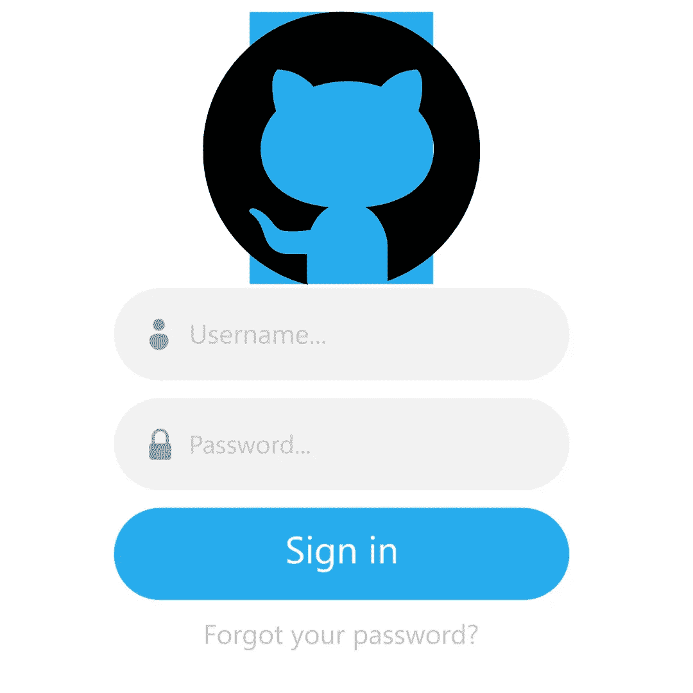

# Django 社交认证:使用 GitHub 登录

> 原文：<https://medium.com/geekculture/django-social-authentication-sign-in-with-github-33390db1a388?source=collection_archive---------5----------------------->

## 如何在 Django framework web apps 中使用 GitHub 登录和注册



Login with GitHub using the Django framework

你好，Django 开发者..！！

我叫 Rohit Kumar Thakur。我一般写 React Native、Django、数据科学、机器学习和 Python。

在本文中，我将向您展示如何在 Django 应用程序中使用社交认证。当您构建 web 应用程序时，添加 GithHub 身份验证是您可以添加的最常见的功能。它将帮助用户轻松登录您的网站。所以，不浪费任何时间，让我们开始这个项目。

下面是本文的分步视频教程:

# 项目设置

*   我总是建议在虚拟环境中开始一个 Django 项目，因为这是一个练习的好习惯。
*   选择一个目录。在该目录中打开终端或命令提示符窗口，并启动一个虚拟环境。激活虚拟环境。我写了一篇关于如何在 Windows 和 Linux 中启动虚拟环境的文章。需要帮助可以查一下。
*   激活虚拟环境后，安装以下 python 库:

```
pip install django
pip install social-auth-app-django
```

*   启动 Django 项目:

```
django-admin startproject github
cd github
python manage.py startapp mainApp
```

*   在您喜欢的文本编辑器中打开此项目。我是说 VS 代码。xd:)

# 密码

***settings.py***

```
INSTALLED_APPS = [
    'django.contrib.admin',
    'django.contrib.auth',
    'django.contrib.contenttypes',
    'django.contrib.sessions',
    'django.contrib.messages',
    'django.contrib.staticfiles',    
    'social_django',        **#add this**
    'mainApp',              **#add this**
]MIDDLEWARE = [
    'django.middleware.security.SecurityMiddleware',
    'django.contrib.sessions.middleware.SessionMiddleware',
    'django.middleware.common.CommonMiddleware',
    'django.middleware.csrf.CsrfViewMiddleware',
    'django.contrib.auth.middleware.AuthenticationMiddleware',
    'django.contrib.messages.middleware.MessageMiddleware',
    'django.middleware.clickjacking.XFrameOptionsMiddleware',
    'social_django.middleware.SocialAuthExceptionMiddleware', **#add this**
]TEMPLATES = [
    {
        'BACKEND': 'django.template.backends.django.DjangoTemplates',
        'DIRS': [],
        'APP_DIRS': True,
        'OPTIONS': {
            'context_processors': [
                'django.template.context_processors.debug',
                'django.template.context_processors.request',
                'django.contrib.auth.context_processors.auth',
                'django.contrib.messages.context_processors.messages',
                'social_django.context_processors.backends',    **#add this**
            ],
        },
    },
]
**#Add this at the bottom in settings.py
#social app custom settings** 
AUTHENTICATION_BACKENDS = [
    'social_core.backends.github.GithubOAuth2',
    'django.contrib.auth.backends.ModelBackend'
]LOGIN_URL = 'login'
LOGIN_REDIRECT_URL = 'home'
LOGOUT_URL = 'logout'
LOGOUT_REDIRECT_URL = 'login'SOCIAL_AUTH_GITHUB_KEY = '############'
SOCIAL_AUTH_GITHUB_SECRET = '########################'
```

在 **settings.py.** 中，我们需要在 INSTALLED_APPS、中间件和模板部分添加几行代码。之后，我们必须在底部添加几行代码，如上所示。

***views.py***

```
from django.shortcuts import render
from django.contrib.auth.decorators import login_required# Create your views here.def login(request):
    return render(request, 'login.html')[@login_required](http://twitter.com/login_required)
def home(request):
    return render(request, 'home.html')
```

在 views.py 中，首先，我们将导入所有需要的库。之后，编写两个函数来渲染登录和主屏幕。

现在在 mainApp 目录中。制作一个新的目录**模板**。在模板目录下，新建三个文件:**base.html**、**login.html**、**home.html**

也做一个静态文件夹。在 mainApp 目录中。并且在静态目录里面，制作一个文件“ **index.css**

如果愿意，您可以自定义 CSS 部件。但是对于最小的 UI 引用，您可以将以下代码添加到 index.css 文件中。

```
.container-fluid {
    height: 100vh;
    background-color: #fff;
    display: flex;
    justify-content: center;
    align-items: center;
}.container-fluid > div {
    width: 85%;
    min-width: 300px;
    max-width: 500px;
}.card{
    width: 100%;
    background-color: #282c34;
}.social-container {
    display: flex;
    flex-direction: column;
    justify-content: center;
}.btn a, .btn a:hover {
    color: white;
    text-decoration: none;
}
```

***base.html***

```
<!DOCTYPE html>
<html lang="en">
    <head>
        <meta charset="UTF-8">
        <meta name="viewport" content="width=device-width, initial-scale=1.0" />
        <meta http-equiv="X-UA-Compatible" content="ie=edge" />
        <link href="[https://cdn.jsdelivr.net/npm/bootstrap@5.1.3/dist/css/bootstrap.min.css](https://cdn.jsdelivr.net/npm/bootstrap@5.1.3/dist/css/bootstrap.min.css)" rel="stylesheet" integrity="sha384-1BmE4kWBq78iYhFldvKuhfTAU6auU8tT94WrHftjDbrCEXSU1oBoqyl2QvZ6jIW3" crossorigin="anonymous">
        <link rel="stylesheet" href="" />
        <title>DJANGO SOCIAL AUTH</title>
    </head>
    <body>
        <div class="container-fluid"> 
            <div>
                <h1 class="text-white text-center">
                    
                     
                </h1>
                <div class="card p-5">
                    
                     
                </div>
            </div>
        </div>
    </body>
</html>
```

这是 base.html 档案的代码。我们将在 login.html 和 base.html 获取参考和相对标签元素。

***login.html***

```
 
Sign in 
 
    <div class="row">
        <div class="col-md-8 mx-auto social-container my-2 order-md-1">
            <button class="btn btn-primary mb-2">
                <a href="">
                    LOGIN WITH GITHUB 
                </a>
            </button>
        </div>
    </div>

```

***home.html***

```
 
HOME 
 
    <div class="row">
        <div class="col-sm-12 mb-3">
            <h4 class="text-center">Welcome {{ user.username }}</h4>
        </div>
    </div>

```

这是登录和主屏幕的基本代码。成功登录后，我们将在主屏幕上显示用户名。

***github/URLs . py***

```
from django.contrib import admin
from django.urls import path, include
from django.contrib.auth import views as auth_views 
from mainApp import viewsurlpatterns = [
    path('admin/', admin.site.urls),
    path('login/', views.login, name='login'),
    path('logout', auth_views.LogoutView.as_view(), name='logout'),
    path('social-auth/', include('social_django.urls', namespace='social')),
    path("", views.home, name='home'),
]
```

在主目录中添加 URL。

# 配置 Github 开发人员控制台

现在我们只需要做一件事。让我们建立 Github 开发者档案。推荐你看 **18:32** 之后的视频。这里的视频是。

*   你需要一个 GitHub 账户。
*   点击您的个人资料。然后点击设置
*   向下滚动并点击开发者设置(左侧)
*   点击 OAuth 应用程序
*   点击注册新的应用程序
*   添加应用程序名称:测试
*   主页网址: [http://localhost:8000](http://loacalhost:8000)
*   授权回调 URL:[http://localhost:8000/social-auth/complete/github/](http://localhost:8000/social-auth/complete/github/)
*   点击注册申请
*   生成客户端密码。
*   复制客户端 id 和客户端密码并粘贴到此处:

```
SOCIAL_AUTH_GITHUB_KEY = '############'
SOCIAL_AUTH_GITHUB_SECRET = '########################'
```

*   如果您检查了视频，请确保点击订阅按钮。我制作了很酷的 Django 和 react 本地应用程序。你的支持会令人钦佩。

现在，打开您的终端或命令提示符，迁移 Django 应用程序。

```
python manage.py makemigrations
python manage.py migrate
python manage.py runserver
```

现在点击“用 GitHub 登录”按钮。你现在可以走了。

[**GitHub 代码链接**](https://github.com/imrohit007/Github-auth-Django)

现在，鼓掌，鼓掌，鼓掌！并关注更多关于 Django 框架的基于项目的文章。

感谢阅读。