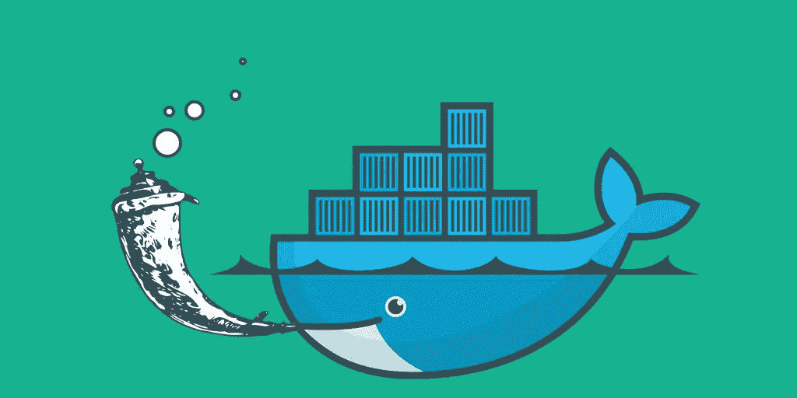

# 地方发展码头工人组织

> 原文：<https://medium.com/geekculture/docker-for-local-development-1caf04b84e94?source=collection_archive---------12----------------------->

你使用 Docker 吗？我打赌你有！这些天 Docker 是一个非常常见的事情，几乎每个空缺职位都要求有经验的 Docker。通常，开发人员编写服务并为其创建 Dockerfile，然后将其传递给 DevOps 团队，以创建 CI/CD 管道来将其部署到生产和其他环境。但是当地的发展呢？Docker 在我的笔记本电脑上能用吗？当然可以。在本文中，我们将介绍 Docker 在本地开发过程中的基本用例。

**环境**

回到 2015 年，我的笔记本电脑上安装了 PostgreSQL、MySQL、MongoDB、Redis、Nginx、RabbiqMQ 和 ElasticSearch。猜猜看，现在我的机器上安装了多少个？答案是零，它们都被替换成了 Docker 和 Docker-Compose。

Docker-compose 使您能够在本地运行所有必要的服务，而无需安装它们。此外，使用 Docker-compose，您可以运行任何服务的特定版本，这是非常有用的功能，例如，如果您的一个项目使用 MongoDB 版，而另一个项目使用 4.2 版。当然，有很多关于如何安装 MongoDB 多个版本的指南，但是在 docker-compose config 中指定需要的版本要容易得多。

假设您有一个用 NestJS 编写的 Node.js 后端服务，它使用 MongoDB 作为数据存储，Redis 作为缓存，下面是这个服务的 docker-compose.yaml:

有几点我想强调一下:

*   服务版本必须在 docker 标签中明确指定。不要使用像`redis:6`这样的快捷标签。次要版本和补丁版本很重要！版本必须是固定的，并且与生产环境中的版本相同。您很容易面临与特定服务版本相关的错误。注意这一点，任何版本更新甚至补丁都必须测试。
*   如果可能的话，使用阿尔卑斯山的图像。在这个例子中，Redis 镜像基于`alpine`，但是 MongoDB 基于`bionic`，这仅仅是因为 MongoDB 没有`alpine`版本。这不是一个必要的要求，更像是一个建议，但是它可以节省你的硬盘空间。您可以查看 DockerHub 上的可用标签列表，Redis image 的示例链接[https://hub.docker.com/_/redis?tab=tags&page = 1&ordering = last _ updated](https://hub.docker.com/_/redis?tab=tags&page=1&ordering=last_updated)
*   将卷用于持久服务。在这个例子中，MongoDB 已经挂载了卷，而 Redis 没有。Redis 是内存存储，我们将其用作缓存存储，因此它不需要持久磁盘存储。但是如果您将 Redis 配置为持久的，那么您也必须将一个卷挂载到它的映像中。

**跑步 app**

好了，我们已经拥有了启动 Node.js 服务所需的一切，只需在终端中键入`npm start:debug`就可以了。稍等一下，会用什么 Node.js 版本？安装在你系统里的那个。但是如果我们有几个不同主要 Node.js 版本的项目该怎么办呢？将所有项目升级到当前的 LTS Node.js 版本可能会很困难，并会导致一些意外的错误。

Node.js 版本切换的工具有 NVM[https://github.com/nvm-sh/nvm](https://github.com/nvm-sh/nvm)或者`n`https://www.npmjs.com/package/n 之类的。我真的很喜欢`n`，它是一个 npm 包，非常容易安装和使用。但我们的应用仍将取决于当地环境。如果我们把 docker 也放进去呢？

对于 NestJS 应用程序，Dockerfile 看起来像这样:

如何在本地运行？在每次代码更改时构建它？这毫无意义。

首先我们需要引入一个新概念——Docker image for development。你可以为一个服务创建任意多的 Docker 图片，这是完全合法的。Docker 镜像必须满足其要求，对于生产，它应该是苗条的，对于开发，它应该支持调试模式和实时重载。不要试图编写通用 Docker 映像，只需创建它的新版本。让我们将我们的应用程序添加到 docker-compose 配置中:

这是怎么回事:

*   用`image`我们已经定义了 Node.js 版本
*   在`ports`中包含 Node.js 服务的 http 端口`3000`和 Node.js 调试的标准端口`9229`。你可以很容易地从你的 IDE 或者谷歌 Chrome 开发者工具连接到它。
*   在`volumes`中，我们已经将当前项目目录挂载到 docker 的`workdir`
*   `command`指示 Docker 执行什么。`npm run start:debug`是一个由 NestJS 编写的 npm 脚本，用于在调试模式下运行带有实时重载的 app

因此，我们采用了纯 Node.js 映像，用`node_modules`挂载了我们的代码，并说要执行哪个命令。我们甚至还没有创建一个新的`Dockerfile`，所有的改变都是在`docker-compose.yaml`中完成的。通过运行以下命令，可以在 docker 中更好地安装额外的 npm 软件包:

这是更安全的方式，因为一些包可能包含 C++库的绑定，它们在安装过程中被编译。

当然，这个主题并没有完全涵盖，有太多的案例和大量的 Docker 和 Docker-Compose 特性。我已经成功地将这种技术用于 Node.js 和 Golang 的后端开发，以及 VueJS 和 React 的前端开发。我敢打赌，您也可以将它用于您的堆栈，以自动化您的开发过程，并保护它免受由环境不匹配引起的意外错误的影响。

下次见，servus！