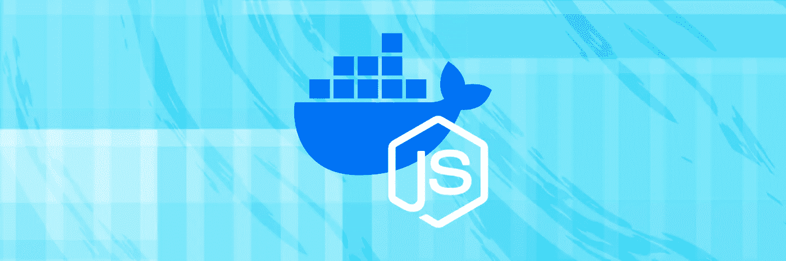

# 新手的 Docker 映像构建过程

> 原文：<https://medium.com/geekculture/docker-image-for-novice-b7ee891acb5e?source=collection_archive---------50----------------------->



我们将学习如何创建 Node.js 应用程序/服务的 docker 映像。已经有很多关于这个主题的文章，但是它们缺乏简单性。当我通过它们来创造我的第一个码头工人形象时。我意识到它们很复杂。但是制作 Node.js 应用程序的 docker 映像并不像看起来那么困难。

> Docker 是一个开发、发布和运行应用程序的开放平台。Docker 使您能够将应用程序从基础设施中分离出来，这样您就可以快速交付软件。

我假设您已经掌握了使用 Node.js 的知识。代码可以参考这个[回购](https://github.com/abhishek-asarawa/nodejs_docker)。

当您开始学习 Docker 时，会出现两个主要术语

1.  图像
2.  容器

在这篇文章中，我们将学习图像。

# 什么是 Docker 图像？

docker 镜像是文件的**集合，将**配置**一个完全可操作的**容器**环境所需的所有要素(安装、应用程序代码和依赖项)捆绑在一起。简而言之，它捆绑了运行一个容器所需的所有文件。**

为了创造码头工人的形象，码头工人需要一本手册。这本手册叫做***docker file****。开发者只需要创建这个。听起来很酷！*

让我们为我们的案例创建一个 docker 文件。

# 创建 Dockerfile 文件

Dockerfile 包含创建图像所需的所有步骤和命令。

我知道你在想什么…只有六行！创建 docker 图像并不难。但是决定这些线和优化 docker 图像需要时间。所以，让我们一条一条地理解这些台词。

## 1.基础图像

Dockerfile 中的第一行提到了一个基本图像。基础图像也称为*父图像。最初码头集装箱是空的。它不包含任何软件。*

> 基本映像包括运行容器所需的所有必要软件。

在我们的例子中， *node:alpine* 将确保我们可以运行一个 node 应用程序，因此它将添加 node 应用程序所需的所有必要文件/软件。所以我们什么都不用担心。

*节点基图像有很多版本。你可以选择一个适合你的项目。你可以在这里查看节点基础图片*[](https://hub.docker.com/_/node)**。**

## *我为什么用 node:alpine？*

*在 docker 中，要让自己的形象尽可能的小。节点:删除所有不必要的文件/软件。它显著减小了节点图像大小。它也是针对节点应用程序优化的生产级映像。想要了解更多关于阿尔卑斯山的图片，你可以参考这篇文章。让我们转到文件的第二行。*

## *2.工作目录*

***WORKDIR** 命令在 docker 容器中定义一个工作目录。如果 WORKDIR 命令没有写入 Docker 文件，它将由 Docker 编译器自动创建。任何 RUN，CMD，COPY，ADD 和 ENTERYPOINT 命令都将被执行到指定的工作目录。为你的应用程序定义一个工作目录被认为是一个好的实践。这里，我们将/app 指定为工作目录。*

*从第三行到第五行，命令是相互连接的。它们与将我们的项目代码移动到容器中有关。*

## *3.**应对文件进入 Docker***

*对于不同的语言，将项目移入 docker 是不同的。在 node.js 中，我们首先将 package.json 文件复制到 docker，然后在安装所有包后，我们将复制 app 的其他文件。为什么？*

*我相信你会想为什么要增加线路？为什么不把所有文件都复制到一起，然后再安装包。这将删除一个额外的行。我来快速回答一下。*

> *对于 Dockerfile 中写入的每一行，docker 都会构建一个**中间映像**并将其保存在缓存中。*

*它这样做，所以下一次如果你建立图像，它将只是获取这些图像，并使用它。这使得构建图像非常快。这就是问题所在，记下台词和顺序。如果任何一行发生变化，docker 将为这一行及其后的行创建中间图像。*

> *我们不断更新/更改应用程序文件，但我们很少更改 pakcage.json。因此，如果我一次复制所有文件，那么即使 package.json 没有更改，代码的每次更改都会再次触发安装包，这将使构建 docker 映像变得缓慢。*

*为了解决这个问题，我们遵循以下步骤*

1.  *复制 package.json*
2.  *安装所有软件包*
3.  *复制其他代码文件*

*最后但同样重要的是…*

## *4.运行容器的命令*

*CMD 用于运行 docker 映像中包含的软件。对于节点应用程序，因为我们在 index.js 处有入口点，所以我们将使用命令 *node index.js* 。这将在容器启动时立即启动我们的应用程序。*

> *[CMD 应遵循格式 CMD ["executable "，" param1 "，" param2"…]。](https://docs.docker.com/develop/develop-images/dockerfile_best-practices/#cmd)*

*我们现在了解了 Dockerfile 中的每一行。但这只是一个食谱，不是一道菜。这些都是建立我们想要的形象所需要的步骤。现在让我们来看看如何构建这个非常简单的图像。*

# *建立码头形象*

*为了构建 docker 图像，我们使用以下命令。*

```
*docker build .*
```

*Docker build 命令需要一个 Docker 文件来构建映像。您必须在创建 Dockerfile 的目录级别使用上述命令。*

*Docker 为 docker build 命令提供了许多参数。解释这些命令将超出本文的范围。你可以在这里看到它们。*

# *参考资料:*

1.  *[https://docs . docker . com/develop/develop-images/docker file _ best-practices/# general-guidelines-and-suggestions](https://docs.docker.com/develop/develop-images/dockerfile_best-practices/#general-guidelines-and-recommendations)*
2.  *【https://docs.docker.com/get-started/overview/ *