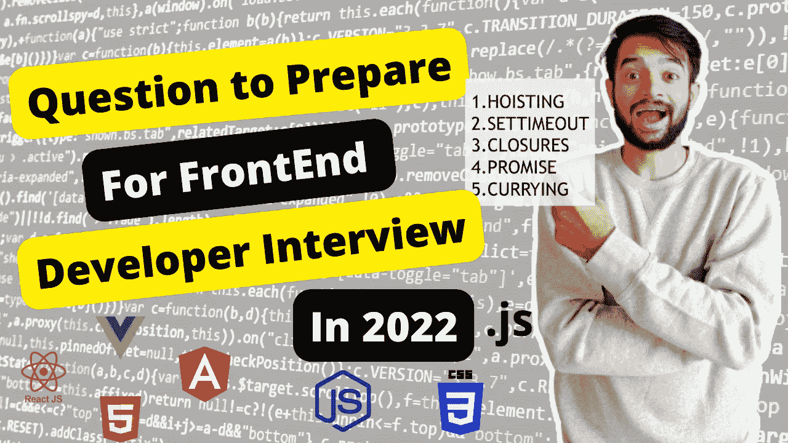

# 不要跳过| 2022 年要准备的 5 大前端面试话题

> 原文：<https://medium.com/geekculture/dont-skip-top-5-frontend-interview-topics-to-prepare-in-2022-8adc8801677e?source=collection_archive---------4----------------------->

根据我采访数百名候选人的经验，许多前端开发人员仍然不知道面试需要准备哪些主题。他们都是优秀的开发人员，如果你要求他们建立漂亮的网站或移动应用程序，他们将能够在短时间内完成。但它们在概念上不会很强。所以，我决定列出前端开发人员面试中所有最常见的面试问题，并附上一些示例片段。

如果你无聊到不想看，你可以在这里看我在 Youtube 上的视频。如果你还没有订阅我的频道，请订阅并在评论区告诉我你对我的视频的看法。你也可以继续阅读下面的文章。



> 准备前端开发人员面试的核心主题

1.  提升
2.  关闭
3.  设置超时
4.  承诺
5.  Currying

> **吊装**

JavaScript 提升指的是在执行代码之前，解释器将函数、变量或类的*声明*移动到其作用域顶部的过程。

想了解更多关于吊装的知识，你可以在这里观看我的视频。或者你也可以在这里阅读我的 medium 博客[。看完这个，你应该对吊装有个公正的认识了。现在，试着回答下面的问题。](https://mevasanth.medium.com/hoisting-in-javascript-hot-topic-for-interview-43b463a6a77)

常见问题:

**简单一个:**

```
function test(){
    console.log('X is ' + x);
    var x;
}
test();
```

上述输出的**未定义**。

**棘手的一个**

```
var rate = 10
function getRate() {
    if (rate == undefined) {
        let rate = 6;
        return rate;
    } else {
        return 10;
    }
}
console.log("Rate is", getRate());
```

尝试猜测这方面的输出，如果你失败了，你可以看我的视频[这里](https://www.youtube.com/watch?v=U1BXdBkXFgw&list=PLmcRO0ZwQv4QMslGJQg7N8AzaHkC5pJ4t&index=3)，清楚的解释为什么会这样。

> **关闭**

*闭包是对其周围状态(词法环境)的引用捆绑在一起(封闭)的函数的组合。换句话说，闭包允许您从内部函数访问外部函数的范围。在 JavaScript 中，闭包是在每次创建函数时创建的。*

> **setTimeout**

*全局* `*setTimeout()*` *方法设置一个定时器，一旦定时器到期，该定时器就执行一个函数或指定的代码。*

在大多数面试中，使用闭包和 setTimeout 问题的组合已经成为一种致命的组合。如果你不确定基本的，请观看视频[这里](https://www.youtube.com/watch?v=pycV_CSoj1g&list=PLmcRO0ZwQv4QMslGJQg7N8AzaHkC5pJ4t&index=15)和[这里](https://www.youtube.com/watch?v=nJhQRotbIis&list=PLmcRO0ZwQv4QMslGJQg7N8AzaHkC5pJ4t&index=15)。

看完这些视频后，我想你会对上述话题有一个公正的理解。试着猜测下面代码片段的输出。

//代码片段 1

```
function example1(){
  for (var i = 0; i < 3; i++) {
    setTimeout(function() { console.log(i); }, 1000 * i);
  }
}
```

因为它已经成为一个经典的片段，每个人都猜测输出为 3，它将被打印 3 次。但是你真的知道什么音程吗？？很多人不知道这一点，因为大多数视频或博客都没有教过。所以，请不要学题，学概念。如果你正确地学习了这个概念，你就能正确地猜出答案。正确答案是，3 以 1 秒的间隔打印 3 次。

```
// Snippet 2function example2(){
 for (var i = 0; i < 3; i++) {
 setTimeout((function() { 
 console.log(i) 
 })(), 1000 + i);
 }
}// Snippet 3function example3(){
 for (var i = 0; i < 3; i++) {
 setTimeout(function(k) { 
 return function() { console.log(k); } 
 }(i), 1000 + i);
 } 
}
```

试着猜测上面 2 个片段的输出，如果你没有得到正确的答案，请在这里观看我的详细解释。

> 承诺

`Promise`对象表示异步操作的最终完成(或失败)及其结果值。

以我的经验，承诺没有任何常见的刁钻面试问题。最重要的是，你需要理解什么是承诺，什么时候使用承诺。所有和承诺。所有解决等。要了解更多，请观看我从[开始的视频系列，点击这里](https://www.youtube.com/watch?v=1OINZhOIh0c&list=PLmcRO0ZwQv4QMslGJQg7N8AzaHkC5pJ4t&index=19)

> Currying

Currying 简单地说就是**用多个参数计算函数，并把它们分解成一系列只有一个参数的函数。**

阿谀奉承不是常见的面试话题。但这是一个非常重要的面试概念。关于奉承的一般问题如下。

1.  写一个有无限个参数的 currying 函数。例:sum(10)(20)(30)()。如果你不知道这个问题的答案，请在这里阅读。
2.  写一个函数，既可以运行 currying 也可以不运行 currying。例如:sum(10)(20)和 sum(10，20)。如果你不知道这个问题的答案，请看这里的。

感谢您在下一篇文章中阅读 catch you。如果你还没有在媒体上关注我，那么请关注我，你可以在链接的[这里](https://www.linkedin.com/in/vasanth-bhat-4180909b/)上关注我。别忘了订阅我的 Youtube 频道[。](https://www.youtube.com/channel/UCSCNvSCk_Z9mBvUM-FJexRg/videos)

如果你想亲自和我讨论模拟面试，面试或简历审核的技巧和诀窍，你可以在这里预约:

【https://topmate.io/vasanth_bhat 

如果你正在准备前端开发者面试，请观看我的以下系列:

如果你想学习内置方法的 JavaScript 自定义实现，那就看看我下面的系列吧:

# 同一作者的更多文章:

1.  我在 JIO 信实公司的面试经历。
2.  [在 React Native 中生成带有标题的 Get 请求以渲染图像](https://javascript.plainenglish.io/react-native-making-get-request-to-display-the-image-f75d4338c5e2)
3.  [JavaScript array . push()是深度拷贝还是浅度拷贝？](https://javascript.plainenglish.io/array-push-in-javascript-is-it-deep-or-shallow-copy-90cd195ec5b7)
4.  [如何在 JavaScript 中展平数组的数组](https://mevasanth.medium.com/flatten-array-of-array-in-javascript-microsoft-interview-question-345c71ff9ccd)

在这里阅读作者[的所有文章。](https://mevasanth.medium.com/)