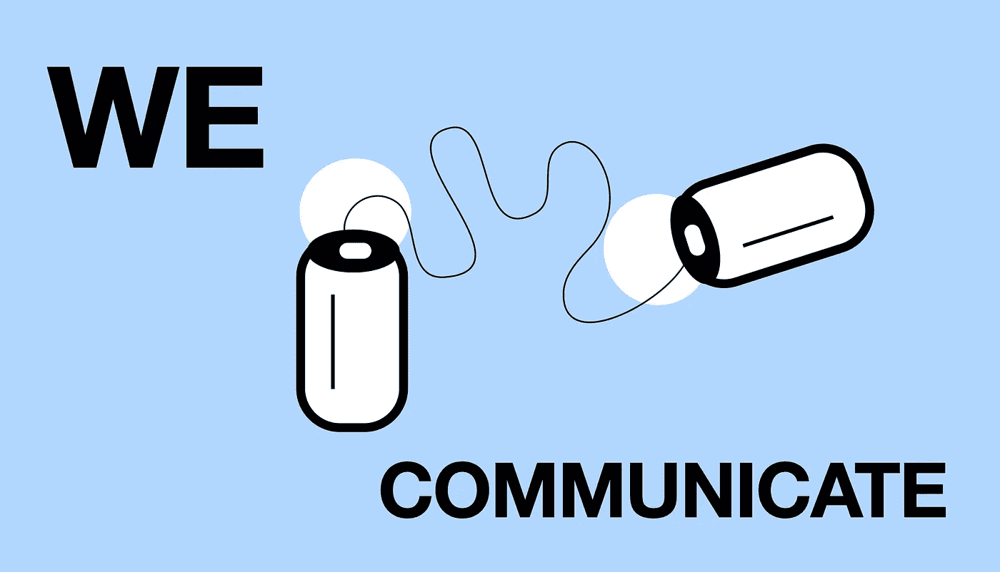

# 开发人员和质量保证工程师之间沟通的注意事项

> 原文：<https://medium.com/geekculture/dos-and-don-ts-in-communication-between-developer-and-qa-engineer-901a6843a675?source=collection_archive---------14----------------------->

在做了几年 QA 工程师后，我决定分享一些与开发人员沟通的技巧。以下是我对此的看法。

# ❌ **不要**

**如果不紧急，不要让开发人员分心。**不要马上走到它的办公桌前。先通过 messenger 询问或提前安排会议。我意识到一旦我开始自己编码。当你随波逐流，有人分散你的注意力时，你需要花费大量的时间和精力来再次深入这种心态。这样的干扰根本不会增加生产力。

**不要害怕寻求帮助。你不可能什么都知道，问一问也没关系，因为这比假装你很酷要好！只要确保你理解了答案，不要问同一个问题两次。我们在同一条船上，如果每个人都有一个桨，我们可以朝着一个方向前进，这对每个人都有好处。**

**不要相信开发商的话。你需要找到一个开发者“一切都会好的”的信心的证据，或者“我在代码中更改了一个字符串，它不会破坏任何东西”。**

**不怪。这是一条通往任何地方的路。不要拘泥于负面，试着去解决问题。以后我们可以决定如何避免将来的特殊情况。没有人是完美的。错误不可避免。主要目标是有能力健康反应，做好本职工作。**

不要将一个特定的开发人员分配给一个缺陷。就像开发人员在没有 QA 批准的情况下关闭票证一样，这可能会气死人。

**不要微观管理开发者。**“你检查缺陷了吗？”，“那现在呢？”、“你什么时候修复 bug？”。这很烦人，而且他们解决问题的速度也不快。把自己放在开发者的位置上。

**不要把事情放在心上，脸皮要厚。**情绪化到不好的程度是通往倦怠的最短路径。不要让你的感情过于理智。你可能会被你不得不与之打交道的傲慢的人绊倒。它实际上可以适用于任何人。这就是为什么厚脸皮和圆滑一样重要。

# ✅ **要做的事情**

**与开发者交流知识。让他们了解你的测试方法，为每一个和你一起工作的开发者找到“访问钥匙”。提供关于如何测试产品的信息。它可以帮助避免部分错误。然而，由于几个原因，这并不总是可能的。第一，时间不足。第二，公司流程不允许这么做。最后，开发人员出于多种原因不愿意与某人合作。但是，如果你能找到我上面提到的“访问密钥”，从长远来看，保持健康的关系和相当好的产品质量会更容易。**

**学会说服。如果你想在一个可以为 QA 需求做一点改进的环境中工作，这是一项有用的技能。寻找支持，把你的计划变成现实。然而，如果你在陈述中感到孤独，也许你想纳入的想法并不是那么好。所以，不要为了说服而说服。接受你并不总是对的事实，学会倾听和倾听你周围的人。**

**要诚实。**否则会很快毁掉你的名声。或者最终。那得看你撒谎的水平有多高了。不会推荐。

**准备好为你报告的缺陷进行辩护。**有时候你必须捍卫需要修复的缺陷的重要性。但是你必须在你的陈述中确定。随着时间的推移，当你提出一些真实的事实和缺陷必须被修复的原因时，情况会变得更好。能够看得更远一些有助于节省公司的资金。

在压力下保持冷静。我知道，很难。当每个人都在催促你或你的团队时，你很难抗拒权威。然而，说“不”是我们工作的一部分，即使这不是一个流行的观点。如果有人把你推到墙上或者用枪指着你的头，这条规则就不管用了。

与开发人员讨论测试用例。从我的经验来看，这很难做到。这需要双方的时间和奉献。以及魅力和说服 QA 的能力。我做这个已经有一段时间了，但是我不能采用这种方法。我看到了与开发商进行这种对话的巨大好处。然而，我可能看不到其他能告诉我相反情况的东西。你怎么想呢?

**缺陷描述要精确。**如果可以的话，用开发者的语言说。在其他情况下，保持你的写作尽可能简单。应该是瑞典式的“lagom”。良好的规模、结构，对开发人员来说信息量大，足以让创建者或团队中的任何其他测试人员记住什么是 bug 并测试修复。

**鼓励队友深入了解产品。团队中的这种意识将减少愚蠢缺陷的数量。从我的经验来看，傻虫们耗费大量精力去举报。最好预测这些，并把注意力集中在更重要的事情上。而不是报告错误的*字体大小*测试边缘情况、安全性、性能等。**

**耐心点。**不是每个人都讨人喜欢，学会应付难相处、自恋的人。这是适用于任何人的普遍规则。

一旦我开始为这篇文章写想法，我决定记下我自己的想法，然后才与第 7 章“在软件测试中吸取的教训”相比较。由 Cem Kaner、James Bach 和 Bret Pettichord 编写的“上下文驱动的方法”一书。我是故意这样做的，所以这本书不会影响我对这个话题的看法。如果你同意他们的观点，你完全可以阅读他们提供的课程并在日常生活中应用。

根据我的观察，有些项目已经在第 7 章中存在了。它温暖了我的心，因为我得到的经验和下面的清单让我想到有人也是这么想的。

我读过的一些教训实际上不在我的清单上，这意味着我学到了一些新东西，可以尝试将这些教训纳入我的 QA 策略。

你读过我提到的那本书吗？在和开发者交流的时候，你有什么样的观察？如果你有什么要补充的，请说。不管你是不是 QA。不同的观点永远不会有坏处。