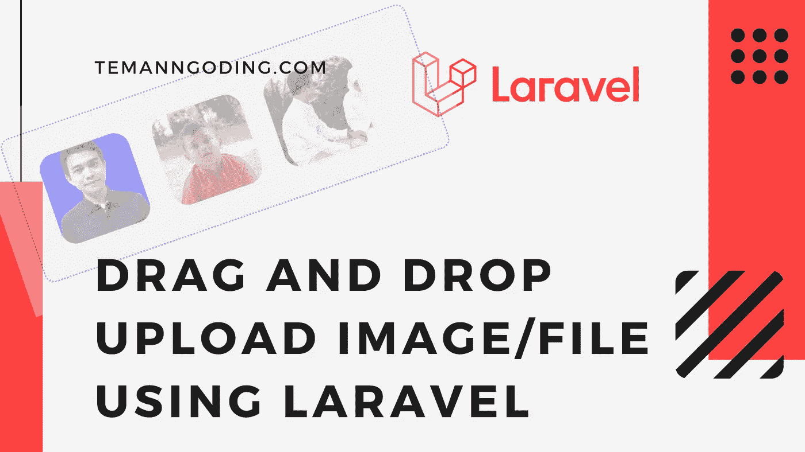

# 使用 Laravel 拖放上传图像/文件

> 原文：<https://medium.com/geekculture/drag-and-drop-upload-image-file-using-laravel-35e8446e8e92?source=collection_archive---------8----------------------->



你好，朋友们你们好吗，希望你们永远健康成功。回到 Temanngoding.com，这次我们将再次讨论拉勒维尔。

这次我们将讨论如何使用 [Dropzone.js](https://www.dropzonejs.com/) 插件上传文件或图像的教程。我们将尝试同时上传一个或多个文件。并且我们会在上传文件的时候创造一个吸引人的外观。DropzoneJs 是一个开源库，可以用来执行 java 脚本活动。

您可以学习其他 laravel 教程:

## [REST API 登录&向圣所注册](https://temanngoding.com/en/rest-api-login-register-with-sanctum-laravel/)

## [在 Laravel 中使用 Ajax 上传文件](https://temanngoding.com/en/upload-files-using-ajax-in-laravel/)

## [Laravel 8 使用 DomPDF 生成 PDF 文件](https://temanngoding.com/en/laravel-8-generate-pdf-files-using-dompdf/)

# 1.创建一个 Laravel 项目

运行 composer 命令，如下所示:

```
composer create-project laravel/laravel --prefer-dist file-upload
```

然后进入 root:

```
cd file-upload
```

# 2.创建路线

接下来，我们将创建两条路线，第一条路线用于创建表单。第二个用于创建文件/图像存储功能。

在 routes/web.php 文件中输入下面的代码。

```
<?php

use Illuminate\Support\Facades\Route;
use App\Http\Controllers\UploadController;

/*
|--------------------------------------------------------------------------
| Web Routes
|--------------------------------------------------------------------------
|
| Here is where you can register web routes for your application. These
| routes are loaded by the RouteServiceProvider within a group which
| contains the "web" middleware group. Now create something great!
|
*/

Route::get('upload-ui', [UploadController::class, 'uploadUi' ]);
Route::post('file-upload', [UploadController::class, 'FileUpload' ])->name('FileUpload');
```

# 3.上传控制器

要构建拖放文件上传功能，我们需要创建控制器，所以从命令提示符下启动下面的命令。

```
php artisan make:controller UploadController
```

**app/Http/controller/upload controller . PHP**

```
<?php

namespace App\Http\Controllers;

use Illuminate\Http\Request;

*class* UploadController extends Controller
{
    /**
     * Generate Upload View
     *
     * @return void
    */
    public  *function* uploadUi()
    {
        return view('upload-view');
    }
    /**
     * File Upload Method
     *
     * @return void
     */
    public  *function* FileUpload(Request $request)
    {
        $image = $request->file('file');
        $imageName = time().'.'.$image->extension();
        $image->move(public_path('images'),$imageName);
        return response()->json(['success'=>$imageName]);
    }
}
```

# 4.创建刀片视图

最后一步，在 resources/views/drop zone-file-upload . blade . PHP 中创建一个刀片文件。

```
<!DOCTYPE html>
<html>
<head>
    <title>Laravel 8|7 Drag And Drop File/Image Upload Examle </title>
    <link href="https://cdnjs.cloudflare.com/ajax/libs/dropzone/5.7.2/dropzone.min.css" rel="stylesheet">
    <script src="https://cdnjs.cloudflare.com/ajax/libs/dropzone/5.7.2/min/dropzone.min.js"></script>
    <script>
        var dropzone = new Dropzone('#file-upload', {
            previewTemplate: document.querySelector('#preview-template').innerHTML,
            parallelUploads: 3,
            thumbnailHeight: 150,
            thumbnailWidth: 150,
            maxFilesize: 5,
            filesizeBase: 1500,
            thumbnail: *function* (file, dataUrl) {
                if (file.previewElement) {
                    file.previewElement.classList.remove("dz-file-preview");
                    var images = file.previewElement.querySelectorAll("[data-dz-thumbnail]");
                    for (var i = 0; i < images.length; i++) {
                        var thumbnailElement = images[i];
                        thumbnailElement.alt = file.name;
                        thumbnailElement.src = dataUrl;
                    }
                    setTimeout(*function* () {
                        file.previewElement.classList.add("dz-image-preview");
                    }, 1);
                }
            }
        });

        var minSteps = 6,
            maxSteps = 60,
            timeBetweenSteps = 100,
            bytesPerStep = 100000;
        dropzone.uploadFiles = *function* (files) {
            var self = this;
            for (var i = 0; i < files.length; i++) {
                var file = files[i];
                totalSteps = Math.round(Math.min(maxSteps, Math.max(minSteps, file.size / bytesPerStep)));
                for (var step = 0; step < totalSteps; step++) {
                    var duration = timeBetweenSteps * (step + 1);
                    setTimeout(*function* (file, totalSteps, step) {
                        return *function* () {
                            file.upload = {
                                progress: 100 * (step + 1) / totalSteps,
                                total: file.size,
                                bytesSent: (step + 1) * file.size / totalSteps
                            };
                            self.emit('uploadprogress', file, file.upload.progress, file.upload
                                .bytesSent);
                            if (file.upload.progress == 100) {
                                file.status = Dropzone.SUCCESS;
                                self.emit("success", file, 'success', null);
                                self.emit("complete", file);
                                self.processQueue();
                            }
                        };
                    }(file, totalSteps, step), duration);
                }
            }
        }
    </script>
    <style>
        .dropzone {
            background: #e3e6ff;
            border-radius: 13px;
            max-width: 550px;
            margin-left: auto;
            margin-right: auto;
            border: 2px dotted #1833FF;
            margin-top: 50px;
        }
    </style>
</head>
<body>
    <div id="dropzone">
        <form action="{{ route('FileUpload') }}" *class*="dropzone" id="file-upload" enctype="multipart/form-data">
            @csrf
            <div *class*="dz-message">
                Drag and Drop Single/Multiple Files Here<br>
            </div>
        </form>
    </div>
</body>
</html>
```

这里使用 CDN 链接(JavaScript 和 CSS)调用 Dropzone 插件。

用文件上载 id 初始化的 Dropzone 对象；我们还为文件上传功能实现了一个小设置。

为了设计拖放组件的样式，我们使用 CSS 来组合样式。我们用 action 指令中的 route()方法传递 dropzoneFileUpload。

现在，您可以使用拖放和点击事件来上传单个或多个文件。

运行命令启动应用程序:

```
php artisan servehttp://localhost:8000/upload-ui
```

这将是使用拖放成功上传图像时的结果。


那就是这次的教程，我能传达的。

谢了。