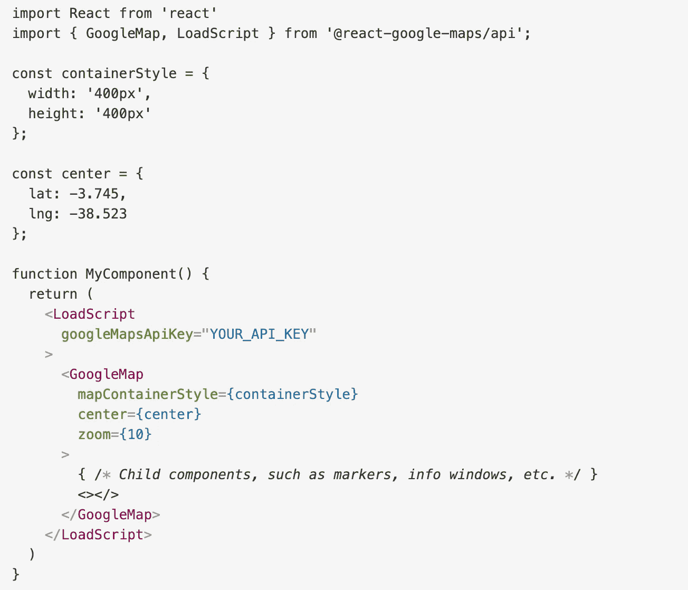
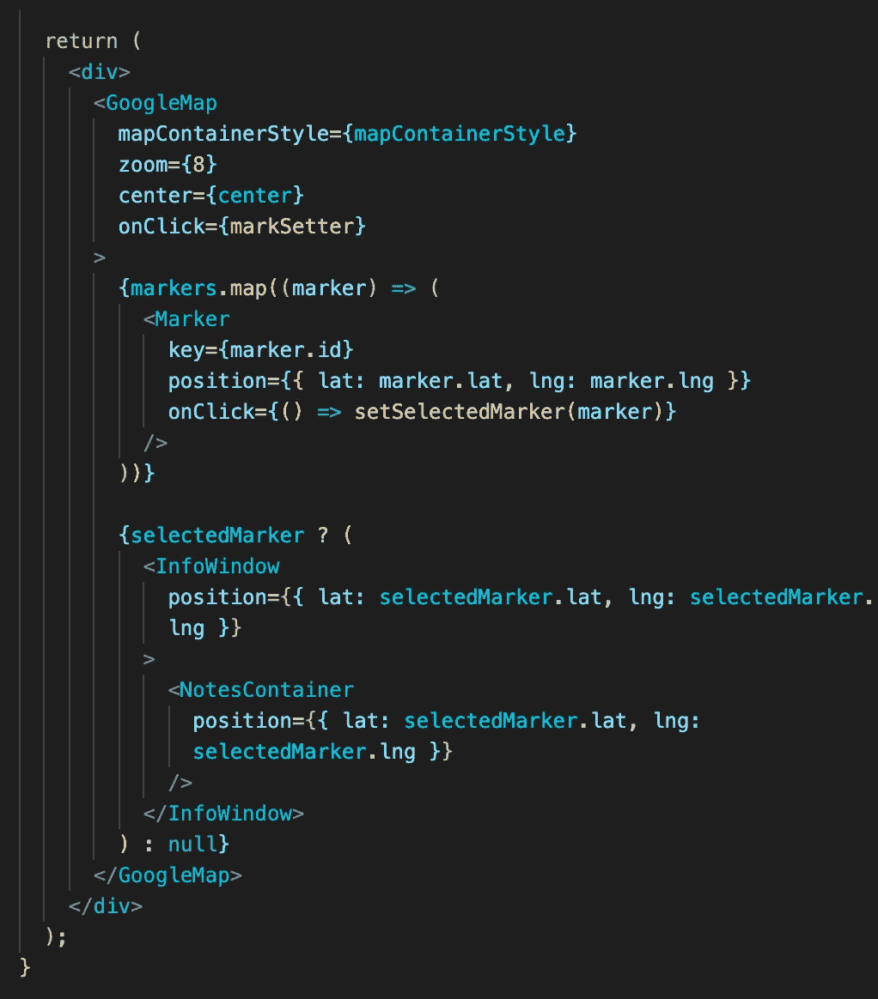
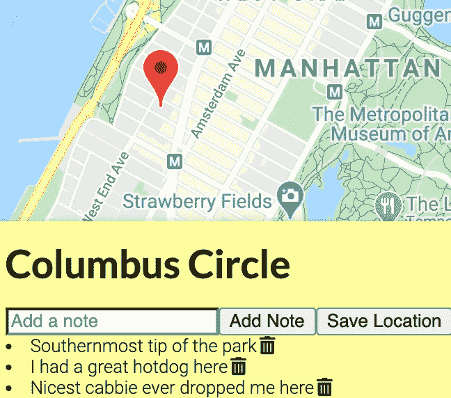

# React 的谷歌地图 API 内部的动态 Post-its

> 原文：<https://medium.com/geekculture/dynamic-post-its-inside-google-maps-api-for-react-132355c9c8f5?source=collection_archive---------20----------------------->

我不确定我的下一个个人项目是什么，但我知道我想集成一个健壮的、功能丰富的 API。我用了谷歌地图。

因为它被广泛使用，所以有大量的文档和教程，既有来自 Google 的，也有来自许多已经实现了它的服务的初级和高级程序员的。

我在以前的项目中使用过 YouTube 数据 API，所以我已经设置了一个开发人员控制台，并且熟悉注册和获取 API 密钥的过程。顺便说一下，这些步骤非常简单。

通过很少的编码和一些来自博客的有用提示，我将一个地图放入一个新的 React 项目中，并开始试验一些特性。我不会添加到记录一步一步设置过程的大量帖子中——尽管我会涉及到它。相反，我将讨论我如何扩展一个特定的特性。

就地图组件的设置和实现而言，这个网站是 React 项目的一个很好的资源。一旦安装了@react-google-maps/api，添加一个基本地图所需要的就是分别用于加载和显示地图的 LoadScript 和 GoogleMap 组件。

From https://react-google-maps-api-docs.netlify.app/#section-introduction

就这么简单。您可以看到，这里只添加了一些小的规范来调整默认外观。

许多基于地图的应用程序使用的一个常见功能是独特的红色标记，它指定一个感兴趣的点，通常是搜索或用户输入的结果。像大多数功能一样，标记是一个带有许多内置道具的组件，仅代表谷歌地图生态系统的一小部分。

通常标记旁边是弹出标记，称为信息窗口，当用户单击或滚动标记时，它会显示文本信息。我认为让这些信息窗口更加动态会很有趣，允许用户输入和删除，每一个都像是标记的便利贴。

以下是我的 BaseMapContainer 的地图部分:

我不会在这里详细介绍，但上面的代码指定了我的地图的默认外观—我以纽约市哥伦布圆环的坐标为中心—并为用户创建了放入标记然后对其进行操作的功能。

如果用户选择了给定的标记，info 窗口将包含 my NotesContainer 组件，该组件由输入表单、注释列表和用于删除和编辑注释的注释组件组成。我还将标记的位置作为道具传入，因此所有重要的信息都存储在一个地方。

原谅不雅的造型，但这里是简单的便利贴功能的行动。

对于任何尝试 API 游戏或者想尝试一个功能丰富的系统的人来说，Google Maps API 是一个不错的选择。