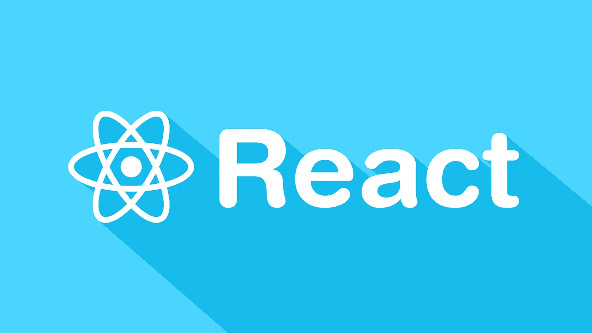

# 具有反应的动态造型

> 原文：<https://medium.com/geekculture/dynamic-styling-with-reactjs-7f7258d29cd0?source=collection_archive---------6----------------------->



ReactJS | UI

ReactJS 是一个开发具有复杂状态或逻辑的用户界面(UI)的令人惊叹的框架。这种逻辑或状态的一个很好的例子是在黑暗和光明主题之间切换。

在本文中，我将介绍如何通过改变元素的类名或 CSS 属性来动态设计元素的样式，以响应事件(例如 onclick)或 UI 状态

# 关于 React 的 UI 方法

在网页上进行的每一次交互都被认为是 javascript 中的一个事件。React 作为一个库有助于管理这些事件、应用程序状态和更新，并且性能更好。

*让我们编码*

*确保你已经有了一个 react 应用，或者你也可以按照这里的说明*[](https://reactjs.org/docs/create-a-new-react-app.html)

# *开发简单的用户界面*

*首先，打开你的 App.css 并添加下面的 css 属性*

```
*div {
width: 4rem;
height: 4rem;
background: yellow;
}.*rose* {
background: red;
}.*dark* {
background: black;
}*
```

*打开 App.js 并导入 App.css 文件(如果已经导入了该文件，可以忽略此步骤)*

```
*import './App.css'*
```

*现在，您可以呈现一个空的 div 元素和 button 元素*

```
*...
 const App(){
  return (
      <section>
      <div></div>
      <button>Change Color</button>
      </section>
  )
} export default App;*
```

# *添加本地状态*

*此时，我们将使用一个名为 [useState](https://reactjs.org/docs/hooks-state.html) 的钩子向 *App* 组件添加一个本地状态——这将返回一个数组，其中包含我们需要的值和一个函数来更改它。*

```
*...
const App(){
  const[color, setColor] = useState('');return( <section><div className={color}></div>...
)export default App;*
```

*我们已经成功地向 app 组件添加了一个本地状态，并从状态中为 div 元素指定了一个类名，这样，每当我们通过 setColor 函数更新状态时，div 元素也会重新呈现。*

**来试试吧！**

*首先，我们将向按钮元素添加一个 onclick 事件*

```
*...
 <button onClick={() => setColor('rose')}> change color </button>
...*
```

*我想我们成功了！*

*尝试单击按钮，观察 div 的背景颜色从黄色变为红色。*

*感谢阅读这篇文章，我希望你今天在 React 和动态样式学了一些很酷的东西。*

*你可以在 [Twitter](https://twitter.com/AI_Lift) 、 [Github](https://github.com/armstrong99) 和 [Linkedin](https://www.linkedin.com/in/ndukwearmstrong/) 上关注我，祝你愉快。*