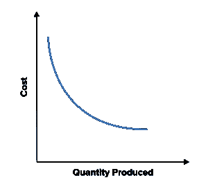

# 规模经济

> 原文：<https://medium.com/geekculture/economies-of-scale-d70240b0d148?source=collection_archive---------20----------------------->

# 介绍

规模经济是公司通过组织良好的生产流程获得的成本优势。通过回顾 20 英尺集装箱和航运的历史，我们可以更好地理解规模经济。1950 年，一艘船可以装载 700 个集装箱。今天，一艘超级油轮可以装载 20，000 个集装箱。这些大型超级油轮使得全球航运变得非常经济。这已经改变了全世界制造业的整个竞争环境。

当我们的组织实现规模经济时，我们的现金会得到更多。因此，虽然我们可以通过投资新的机器、额外的劳动力或额外的原材料获得初步的额外成本，但我们在生产的每单位产品的平均成本上节省了资金。看下图:

这个简单的原则一直是许多主要经济发展背后的驱动力。在这篇文章中，我们将了解规模经济可能给企业带来的经济利益。

# 描述

规模经济与一系列组织和商业状况有关。这适用于不同的层次，例如，生产、工厂或整个企业。[当平均成本随着产量的增加而开始下降时，规模经济就发生了。](https://www.technologiesinindustry4.com/2021/12/how-iot-is-changing-our-lives.html)

一些规模经济有物理和工程基础。比如说；

*   制造设备的资本成本
*   运输摩擦损失
*   工业设备。

规模经济在生产过程的任何阶段都可以被有充分根据的人所理解。生产提到了生产的经济概念，在这种情况下包括与商品有关的所有活动，但与最终购买者无关。因此，企业可以选择在其营销部门应用规模经济。这可以通过雇佣大量的营销专家来实现。一个企业可以通过从人工劳动转移到机器劳动，在它的投入采购部门中同样采用这种方式。

# 规模经济的类别

# 内部规模经济

这是专属于稳定经济的状态。

**举例**

一家公司可以拥有批量生产机器的专利。这使得它比业内其他公司更能降低平均生产成本。

还有五种内部规模经济可以对公司进行估值:

1.  技术的
2.  采购
3.  经理的
4.  金融的
5.  承担风险

# 1.技术的

我们可以通过提高生产率来实现技术上的规模经济。同样，我们可以通过生产流程的规模实现技术上的规模经济。

# 2.采购

批量购买可能会大幅削减成本。如果我们是大制造商，我们将比小竞争对手有更多的讨价还价的能力与供应商谈判更低的价格。

# 3.经理的

随着我们组织的成长，我们可以通过利用专业知识来实现管理上的规模经济。管理和开发生产系统的职业经理人可以使流程现代化，提高生产率。这种后果导致低劣的平均单位成本和规模经济。

# 4.金融的

大机构通常比小机构有更好的信用评级。因为他们有额外的资产作为担保。这意味着他们可能会用更廉价的可接受的资金进行投资。他们可以理解更大的规模经济。然后他们从投资中获得额外的回报。它们是开放的，这意味着由于利率较低，它们的使用成本较低。

被推荐到股票市场的公司有更多的机会获得新的融资。因此，比出售股权或股票有更好的规模经济。

# 5.承担风险

一家公司越是扩大其业务范围和扩大其成本，它在任何一项业务中承担的总体风险就越小，其单位成本也就越低。

大公司的另一个优势是有能力进行复杂而高端的研究。[例如，大型制药公司能够从规模经济的这一特征中获得收入](https://www.technologiesinindustry4.com/2021/12/how-iot-is-changing-our-lives.html)。更大的公司可能同样有足够的钱来更好地营销和宣传他们的产品。

# 外部规模经济

这些人谈论的是整个行业都喜欢的规模经济。

**举例**

假设政府需要提高钢铁产量。为此，政府宣布，所有雇佣 2000 名以上工人的钢铁生产商将获得 20%的税收减免。因此，支付员工少于 2000 人的公司可能会通过雇佣更多员工来降低平均生产成本。这是外部规模经济的一个例子。这改变了整个行业或经济部门。

更多详情请访问:[https://www . technologiesinindustry 4 . com/2021/12/economies-of-scale . html](https://www.technologiesinindustry4.com/2021/12/economies-of-scale.html)