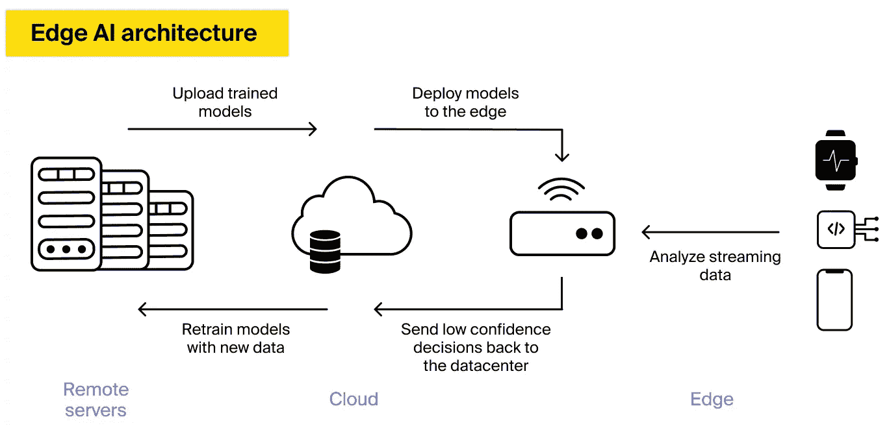
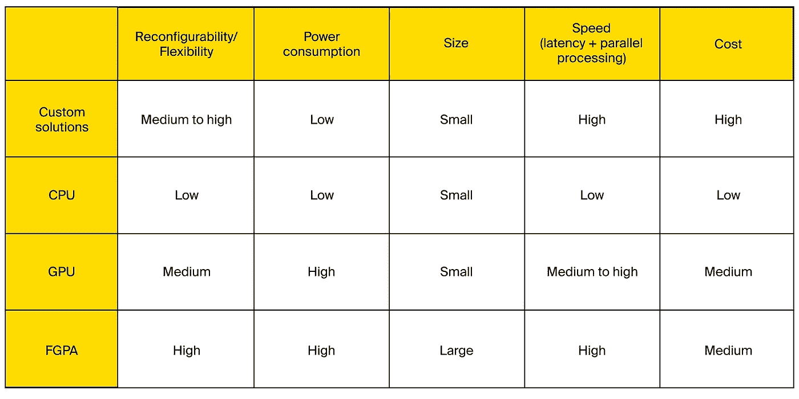

# 边缘人工智能:内部结构、用例、优势和障碍

> 原文：<https://medium.com/geekculture/edge-ai-the-innards-use-cases-benefits-and-barriers-b226d285be7f?source=collection_archive---------15----------------------->

最近的研究表明，到 2025 年，全球使用的物联网设备数量[将超过 380 亿](https://techinformed.com/internet-of-things-key-stats-for-2022/)。急剧增长将不可避免地影响人工智能的采用状况，因为物联网和人工智能这两个概念一直是齐头并进的。

随着开发物联网系统的黄金标准——以云为中心的方法——慢慢过时，人工智能也将开始向边缘靠拢。转移到边缘的原因各不相同，但最引人注目的原因包括高延迟和高云计算成本。这些对于大规模物联网系统来说尤其尖锐。

尽管如此，当[人工智能软件供应商](https://itrexgroup.com/services/artificial-intelligence/)通过开发边缘人工智能系统来扩展他们的产品时，企业却在想:边缘人工智能到底是什么，它在引擎盖下如何工作，以及可以从哪些常见的边缘人工智能用例进行开发？如果这些是你问自己的问题，继续读下去。在下面的文章中，我们将重点介绍 edge AI 的内部结构、用例、优势和局限性。

# 什么是 edge AI，它和云 AI 有什么区别？

标准的物联网架构可以大致分为三个部分:物、网关和云。这些东西代表各种各样的工具、小配件和设备，通过传感器生成数据来增强。网关是集中的设备，比如说路由器，它将东西连接到云。终端设备和网关共同构成了边缘层。

反过来，Edge AI 代表将 AI 算法部署在更靠近网络边缘的地方，即，要么部署到连接的设备(端节点)，要么部署到网关(边缘节点)。

与基于云的方法相反，在基于云的方法中，人工智能算法是在云中开发和部署的，以边缘为中心的人工智能系统可以在几毫秒内做出决定，并且运行成本更低。

与云人工智能解决方案相比，边缘人工智能的其他优势包括:

*   **更短的处理时间:**由于数据是在本地分析的，因此无需向云发送请求并等待响应，这对于医疗设备或驾驶辅助系统等时间关键型应用来说至关重要
*   **降低带宽和成本**:由于不需要将大量传感器数据发送到云端，边缘人工智能系统需要的带宽更低(主要用于传输元数据)，因此运营成本更低
*   **更高的安全性**:在本地处理数据有助于降低敏感信息在云中或传输过程中被窃取的风险
*   **更好的可靠性**:即使在网络中断或云服务暂时不可用的情况下，edge AI 也能继续运行
*   **优化能耗**:在本地处理数据通常比将生成的数据发送到云端消耗更少的能量，这有助于延长终端设备的电池寿命

根据 Markets 和 Markets 的数据，全球边缘人工智能软件市场规模[预计到 2026 年将达到 18 亿美元](https://www.marketsandmarkets.com/Market-Reports/edge-ai-software-market-70030817.html)，CAGR 增长率为 20.8%。各种因素，如云上不断增加的企业工作负载和智能应用数量的快速增长，预计将推动边缘人工智能解决方案的采用。

# edge AI 如何在引擎盖下工作

尽管有一个常见的误解，但标准的以边缘为中心的人工智能解决方案通常以混合方式部署——边缘设备**基于流数据做出决策，数据中心**用于修改和重新训练部署的人工智能模型。****

因此，一个基本的边缘人工智能架构通常如下所示:

为了让边缘人工智能系统能够理解人类语言，驾驶车辆，并执行其他重要任务，它们需要类似人类的智能。在这些系统中，人类的认知是在深度学习算法的帮助下复制的，深度学习算法是人工智能的[子集。](https://itrexgroup.com/blog/ai-types-subsets-use-cases/)

训练深度学习模型的过程通常在云中运行，因为实现更高的准确性需要大量的数据和巨大的处理能力。一旦经过训练，深度学习模型就会被部署到终端或边缘设备，在那里它们现在会自动运行。

如果模型遇到问题，反馈被发送到云端，在那里重新训练开始，直到在边缘的模型被一个新的、更准确的模型取代。这个反馈回路允许保持 edge AI 解决方案精确和有效。

# 支持边缘人工智能的硬件和软件技术概述

标准的 edge AI 实现需要硬件和软件组件。

根据具体的 edge AI 应用，可能有几个硬件选项用于执行 edge AI 处理。最常见的跨越 CPU、GPU、专用集成电路(ASICs)和现场可编程门阵列(FPGAs)。

ASICs 能够实现高处理能力，同时具有高能效，这使它们非常适合各种边缘人工智能应用。

反过来，GPU 可能会非常昂贵，尤其是在支持大规模边缘解决方案时。尽管如此，它们仍然是要求以闪电般速度处理数据的延迟关键用例的首选，如无人驾驶汽车或高级驾驶辅助系统。

FPGAs 提供了更好的处理能力、能效和灵活性。FPGAs 的关键优势在于它们是可编程的，即硬件“跟随”软件指令。这允许更多的功率节省和可重新配置性，因为人们可以简单地改变硬件中数据流的性质，而不是硬编码的 ASICs、CPU 和 GPU。

总而言之，为 edge AI 解决方案选择最佳硬件选项时，应该考虑多种因素，包括可重新配置性、功耗、尺寸、处理速度和成本。以下是根据既定标准对流行硬件选项进行的比较:

[Source](https://www.eetimes.com/fpga-comes-back-into-its-own-as-edge-computing-and-ai-catch-fire/)

反过来，edge AI 软件包括支持深度学习过程的全套技术，并允许 AI 算法在边缘设备上运行。边缘人工智能软件基础设施涵盖[存储](https://itrexgroup.com/services/data-warehouse-consulting/)、[数据管理](https://itrexgroup.com/services/data-management/)、[数据分析/人工智能推理](https://itrexgroup.com/services/data-analytics/)和网络组件。

# 边缘人工智能用例

各行各业的公司已经从边缘人工智能中受益。以下是不同行业最突出的人工智能用例的概要。

# 零售:提升购物体验

积极的购物体验是零售商关注的主要问题，因为它是决定顾客保留率的因素。通过使用人工智能分析，零售商可以让消费者满意，确保他们成为回头客。

许多[边缘人工智能应用程序中的一个帮助零售员工](https://itrexgroup.com/services/ai-for-retail/)日常运营并创造更好的客户体验，就是使用边缘人工智能来确定产品何时需要补充和更换。

另一个边缘人工智能应用是[在](https://itrexgroup.com/services/computer-vision/)[智能结账系统](https://itrexgroup.com/blog/supermarkets-of-the-future-deploying-ai-in-grocery-store/)中使用计算机视觉解决方案，最终可以将顾客从扫描柜台上的商品的需要中解放出来。

零售商也在使用智能视频分析来挖掘客户偏好，并相应地改善商店布局。

# 制造业:引入智能工厂

制造企业，尤其是涉及精密制造的企业，需要保证生产过程的准确性和安全性。通过用 AI 增强制造场所，制造商可以确保车间安全高效。为此，他们采用人工智能应用程序进行车间检查，就像宝洁&和宝马使用的一样。

宝洁公司使用一种边缘人工智能解决方案，该解决方案依赖于检查相机的镜头来检查化学混合罐。为了防止有缺陷的产品进入制造流程，部署在摄像机上的 edge AI 解决方案可以精确定位缺陷，并将发现的质量偏差通知车间经理。

宝马使用边缘计算和人工智能的结合来获得工厂车间的实时视图。该企业通过安装在整个制造工厂的智能摄像机获得了其装配线的清晰图像。

# 汽车:实现自动驾驶汽车

自动驾驶汽车和高级驾驶辅助系统依赖 edge AI 来提高安全性、增强效率和降低事故风险。

自动驾驶汽车配备了各种传感器，这些传感器收集有关道路状况、行人位置、光线水平、驾驶状况、车辆周围的物体和其他因素的信息。出于安全考虑，这些大量的数据需要快速处理。Edge AI 解决了延迟敏感的监控任务，如对象检测、对象跟踪和位置感知。

# 安全:支持面部识别

越来越多地转向边缘的领域之一是[面部识别](https://itrexgroup.com/blog/facial-recognition-benefits-applications-challenges/)。

对于具有面部识别功能的安全应用程序，比如智能家居安全系统，响应时间至关重要。在传统的基于云的系统中，摄像机镜头不断在网络中移动，这影响了解决方案的处理速度和运营成本。

更有效的方法是直接在安全摄像机上处理视频数据。由于将数据传输到云中不需要时间，因此应用程序更加可靠，响应速度更快。

# 消费电子:在移动设备中实现新功能

移动设备产生大量数据。在云中处理这些数据也带来了一些挑战，比如高延迟和带宽使用。为了克服这些问题，移动开发者已经开始转向 edge AI，以更高的速度和更低的成本处理生成的数据。

edge AI 支持的移动用例包括语音和人脸识别、运动和跌倒检测等。

尽管如此，常见的方法仍然是混合的。需要更多存储或高计算能力的数据被发送到云或雾层，而可以在本地解释的数据留在边缘。

# 边缘人工智能采用的障碍

**有限的计算能力**

训练 AI 算法需要足够的计算能力，这在很大程度上是边缘无法达到的。因此，大多数以边缘为中心的应用程序仍然包含云部分，人工智能算法在这里被训练和更新。

如果你倾向于构建一个更少依赖云的以边缘为中心的应用程序，你需要考虑优化设备上数据存储的方法(例如，在人脸识别应用程序中只保留以人脸为特征的帧)和人工智能训练过程。

**安全漏洞**

尽管边缘应用的去中心化特性和无需数据通过网络传输增加了以边缘为中心的应用的安全特性，但是终端节点仍然容易受到网络攻击。因此，需要额外的安全措施来应对安全风险。[机器学习模型](https://itrexgroup.com/services/machine-learning-development/)power edge 解决方案也可以被犯罪分子访问和篡改。锁定它们并将它们视为关键资产可以帮助您防止与边缘相关的安全问题。

**数据丢失**

边缘的本质意味着数据可能无法存储到云中。终端设备可以被配置为丢弃生成的数据，以便降低运行成本或提高系统性能。虽然云设置有相当多的限制，但其主要优势在于，所有(或几乎所有)生成的数据都是存储的，因此可用于收集见解。

如果存储数据对于特定用例是必要的，我们建议采用混合方式，使用云来存储和分析使用情况和其他统计数据，就像我们在为客户开发[智能健身镜](https://itrexgroup.com/case-studies/ai-powered-fitness-mirror-with-a-personal-coach-inside/)时所做的那样。

> *如果你对 edge AI 还有未解之谜，或者寻找一个值得信赖的合作伙伴来实现一个 edge AI 应用，* [*放下 ITRex 一行*](https://itrexgroup.com/contact-us/) *。我们的专家将竭诚为您提供帮助。*

*原载于 2022 年 11 月 1 日 https://itrexgroup.com**T21*[。](https://itrexgroup.com/blog/edge-ai-innards-use-cases-benefits-barriers/)