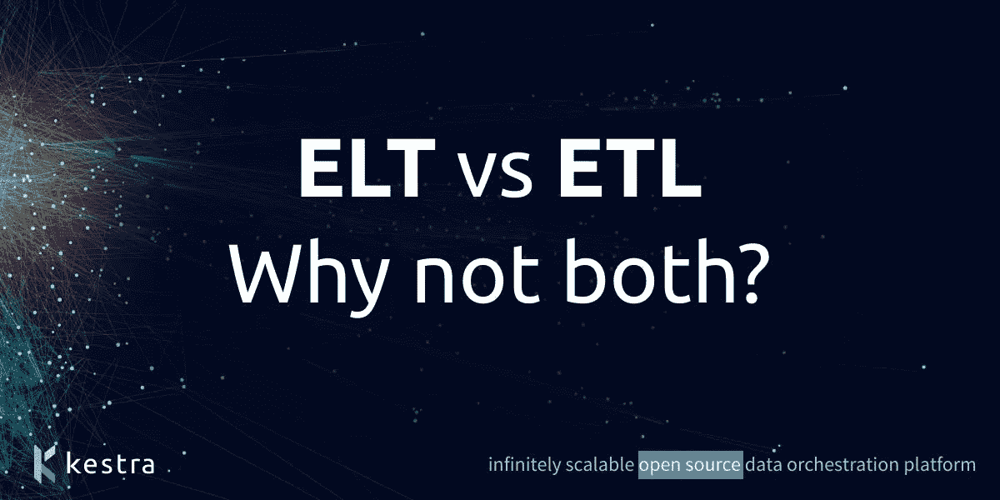
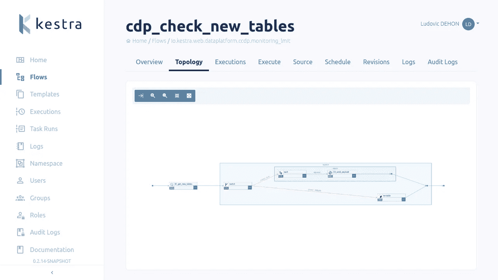

# ELT vs ETL:为什么不能两者兼得？

> 原文：<https://medium.com/geekculture/elt-vs-etl-why-not-both-d0c4a0d30fc0?source=collection_archive---------9----------------------->



如果不讨论摄取实践，比如 ETL 和 ELT(提取、转换、加载或提取、加载和转换)，关于数据管道的对话就永远不会完整。ETL 在将数据加载到数据仓库之前转换数据，而 ELT 加载数据并允许在数据仓库中处理转换。

每个实践都植根于强大的业务需求，并且是现代数据流实践的必要组成部分。然而，对这些实践的讨论经常表现为一种竞争性的叙述，询问哪一种更好。你会发现很多博客的标题都以某种方式、形式包含了“ETL 与 ELT”。然而，有很强的理由说明为什么两者都在今天被使用，而且没有一个会很快消失。因此，在本文中，我们将介绍这两种方法，它们经常相互对立的原因，其中一种方法蓬勃发展的情况，以及为什么凭借[](https://github.com/kestra-io/kestra)****的独特功能**，您可能会考虑混合解决方案。我们开始吧，好吗？**

# **抽取、转换、加载至目的端（extract-transform-load 的缩写）**

****

**Image by Author**

**首先，让我们看看这两个过程中涉及的阶段。正如你可能从首字母缩略词中猜到的，两者都使用相同的阶段，只是顺序不同。**

*   ****提取:**从原始数据库或数据源中提取源数据。使用 ETL，数据进入临时暂存区。使用 ELT，它会立即进入数据湖存储系统。**
*   ****转换:**这是指改变信息的格式/结构的过程，以便它能够与目标系统和该系统中的其余数据集成。**
*   ****加载:**这是指将信息插入数据存储系统的过程。在 ELT 场景中，加载原始/非结构化数据，然后在目标系统中进行转换。在 ETL 中，原始数据在到达目标之前被转换成结构化数据。**

**ETL 早在 20 世纪 70 年代就出现了，以应对当时数据中心的高存储成本。协同定位设施很少，云甚至在开发人员的眼中都算不上什么，大多数大型组织多年来都维护着自己的集中式数据。与今天相比，存储非常昂贵，并且在系统之间移动大量数据既昂贵又耗时，因此简单地存储原始的未处理数据没有太大用处。因此，在将原始数据交付给任何分析该数据的系统之前，必须对其进行转换，以确保该数据的格式对于交付给它的系统是可用的。**

**迄今为止，ETL 主要用于处理能力和/或内存有限的内部解决方案。不是通过移动或存储大量无用的数据来浪费资源，而是在存储目的地接收数据之前对数据进行分类和转换，在存储目的地，数据可以由商业智能工具进行分析。**

**最初，ETL 过程通常是手工编码的，以便从关系数据库中收集数据。现在有专门的 ETL 工具可以收集和处理来自多个来源的数据，并自动执行这些操作。这个领域中使用的一些常用工具包括 Oracle Data Integrator、Talend 和 Pentaho Data Integration 等。由于专为简化 ETL 过程而设计的工具的流行，许多组织最终拥有了专注于特定工具或工具集的集中式数据工程师团队，而不是接受过创建 ETL 管道的培训。这可能是一个挑战，因为:**

1.  **没有经过平台培训的新员工可能会成为瓶颈，减缓或阻止新管道的创建。**
2.  **组织经常被锁定在一个特定的产品或方法上，并且可能不能够容易地集成更新的最佳实践。**

**在当今时代，有许多理由来实现 ETL 过程，这些理由是更便宜的云存储、流过程和其他进步的可用性没有被取代。其中包括:**

*   ****技术债务/投资—** 您的组织可能投资于需要特定数据格式的解决方案，或者您的组织收集的原始数据可能用于非常特定的目的，并且接收数据的格式可能对内部流程非常重要。现代 ETL 解决方案比过去更快更容易，而且可能没有什么改变的动力。**
*   ****具有明确定义的工作流的连续流程** — ETL 首先从同构或异构数据源中提取数据。接下来，它将数据存放到临时区域。从那里，数据经过清洗过程，得到丰富和转换，并最终存储在数据仓库中。经过清理和格式化的数据对于已定义的工作流至关重要。**
*   ****合规性—** 一些法规**禁止将信息(尤其是未加密的信息)存储在特定地区或国家边界之外的服务器上**。由 [GDPR](https://www.integrate.io/blog/etl-for-gdpr-and-ccpa/) 、 [HIPAA](https://www.hhs.gov/hipaa/index.html) 或 [CCPA](https://www.caprivacy.org/) 协议管理的公司经常需要删除、屏蔽或加密数据字段。通过 ETL 过程执行这样的操作比 ELT 更安全。ELT 要求在转换之前先上传潜在的敏感数据，以确保其安全。这意味着它出现在日志中，系统管理员可以访问它。此外，可能会违反 GDPR 法规，因为不符合法规的数据可能会在到达数据湖或其他存储介质之前离开欧盟。**

# **英语教学**

****

**Image by Author**

**随着更便宜的存储设备的出现，以及数据湖等云技术的进步，ELT 在过去十年左右的时间里获得了极大的普及。这通常被认为是更现代的解决方案。不需要数据转移，因为目标存储基本上可以是任何东西，包括数据湖，它可以利用任何或多种数据类型，非结构化、结构化、半结构化甚至原始数据。这种灵活性是其在现代解决方案中被广泛采用的关键，尤其是在涉及大型数据集和流的情况下。**

**ELT 过程特别适合数据湖。数据湖是数据不可知的大型存储库，换句话说，能够以任何和所有格式存储数据。因此，避免能够处理相对有限的数据集的临时区域的瓶颈会更有效。**

**主要优势是:**

*   ****低维护:**可以使用数据库资源来转换数据，并且有许多不同的选项现成可用。**
*   ****更快的加载:**没有先前的转换意味着数据可以被简单地接收而没有瓶颈。**
*   ****按需转换:**在 ELT 中，数据在加载后被转换，但不需要立即转换，只在特定目的需要时才转换。**
*   ****高数据可用性:**一旦加载，数据始终可用。可以利用可以使用非结构化数据的工具，也可以利用那些依赖于结构化数据的工具。**

**ELT **使数据收集过程民主化**，因为来源同样可以是任何东西。正如目标(通常是数据湖或大型数据库)应该能够处理任何类型的数据一样，源也可以是完全不同的。这对于现代工作负载非常重要，因为现代用例从物联网源、原始数据、视频、文档、文件等流传输数据。这还不算多云进程。有时，数据集成会跨组织、跨不同的云平台、跨地区进行。灵活性是让这些现代流程发挥作用的关键。ETL 过程根本不能处理数量，也不能处理涉及的变化。当然不是在实时场景中。**

# **缺点**

****

**ETL 过程虽然是一种更现代、更灵活的解决方案，但由于我们已经提到的一些原因，它并不适合每种情况。其中最重要的是前面提到的遵守问题。因为没有对数据执行任何转换，所以在到达数据库之前的任何时间都可以使用**原始的、未加密的数据**。系统管理员可以从日志中检索可用于重构数据或至少元数据的记录。因为数据可以跨越国界，所以加密通常是法规遵从性的最低要求。**

**在这些场景中，删除数据不足以作为预防措施，因为删除过程经常会崩溃，尤其是在处理大量信息时。通常，**数据本质上可能是个人的，即医院记录、财务信息**等等，这就是这些法规如此严格的原因。许多数据仓库没有配备足够的事务支持来确保删除数据所需的查询成功。**

# **Kestra 处理复杂性**

**无论您的解决方案中需要 ETL 还是 ELT 流程， [Kestra](https://kestra.io/) 都可以处理。事实上， [Kestra](https://github.com/kestra-io/kestra) 可以在同一个解决方案中管理这两者，甚至可以处理最复杂的工作流程。ETL 过程可用于清理敏感数据，确保合规性，将转换后的数据加载到临时表中。凭借 Kestra 的并行流能力，其余的数据可以由 ELT 处理。**

**[Kestra](https://kestra.io/) 能够独立执行 ELT 工作负载，或者通过**集成到许多流行的解决方案中**。它可以处理从 [BigQuery](https://kestra.io/plugins/plugin-gcp/tasks/bigquery/io.kestra.plugin.gcp.bigquery.Load.html) 、 [CopyIn、Postgres](https://kestra.io/plugins/plugin-jdbc-postgres/tasks/l/io.kestra.plugin.jdbc.postgresql.CopyIn.html) 等加载数据。可以执行简单的查询来移动数据，例如，SQL INSERT INTO SELECT 语句。流之间的依赖关系可以通过 Kestra 的[触发机制](https://kestra.io/docs/developer-guide/triggers/flow.html)来处理，以转换数据库(云或物理)中的数据。**

**Kestra 灵活的工作流程同样可以轻松管理 ETL。 [FileTransform 插件](https://kestra.io/plugins/plugin-script-jython/tasks/io.kestra.plugin.scripts.jython.FileTransform.html)是一种可能的方法。您可以编写一个简单的[Python](https://kestra.io/plugins/plugin-script-jython/tasks/io.kestra.plugin.scripts.jython.FileTransform.html)/[Javascript](https://kestra.io/plugins/plugin-script-nashorn/tasks/io.kestra.plugin.scripts.nashorn.FileTransform.html)/[Groovy](https://kestra.io/plugins/plugin-script-groovy/tasks/io.kestra.plugin.scripts.groovy.FileTransform.html)脚本来逐行转换提取的数据集数据行。例如，您可以删除包含个人数据的列，通过删除日期来清理列，等等。将自定义 docker 图像集成到您的工作流中是另一种可用于转换数据的方法。您不仅可以逐行转换数据，还可以处理数据格式之间的转换，例如，[将 AVRO](https://kestra.io/plugins/plugin-serdes/tasks/avro/io.kestra.plugin.serdes.avro.AvroReader.html) 数据转换为 [JSON](https://kestra.io/plugins/plugin-serdes/tasks/json/io.kestra.plugin.serdes.json.JsonWriter.html) 或 [CSV](https://kestra.io/plugins/plugin-serdes/tasks/csv/io.kestra.plugin.serdes.csv.CsvWriter.html) ，反之亦然。**

```
id: my-first-flow
namespace: my.company.teams

inputs:
  - type: FILE
    name: uploaded

tasks:
  - id: csvReader
    type: io.kestra.plugin.serdes.csv.CsvReader
    from: "{{ inputs.uploaded }}"

  - id: fileTransform
    type: io.kestra.plugin.scripts.nashorn.FileTransform
    description: This task will anonymize the contactName with a custom nashorn script (javascript over jvm). This show that you able to handle custom transformation or remapping in the ETL way
    from: "{{ outputs.csvReader.uri }}"
    script: |
      if (row['contactName']) {
        row['contactName'] = "*".repeat(row['contactName'].length);
      }
```

**对于大多数解决方案来说，这通常是不可能的。大多数 ELT 工具经常故意阻止 ETL 过程，因为它们不能处理繁重的转换操作。Kestra 能够处理这两种情况，因为所有的转换都被认为是逐行的，因此不使用任何内存来执行该功能，只使用 CPU。**

****

**Kestra user interface**

**凭借 [Kestra](https://kestra.io/) 与生俱来的灵活性和许多整合，你不会被局限于选择一种或另一种摄取方法。可以开发复杂的工作流，无论是并行的还是顺序的，来交付 ELT 和 ETL 过程。简单的[描述性 yaml](https://kestra.io/docs/developer-guide/flow/) 用于连接插件，并创建流。因为在 Kestra 中创建的工作流是用视觉化的方式呈现的，并且可以看到与单个任务相关的问题，所以不需要担心复杂性。麻烦可以在瞬间追溯到它的源头，让你尝试新的东西，提出一个新的解决方案，而不用担心。试一试，让我们知道你想出了什么！**

**也许你独特的解决方案可以成为我们的下一个展示！**