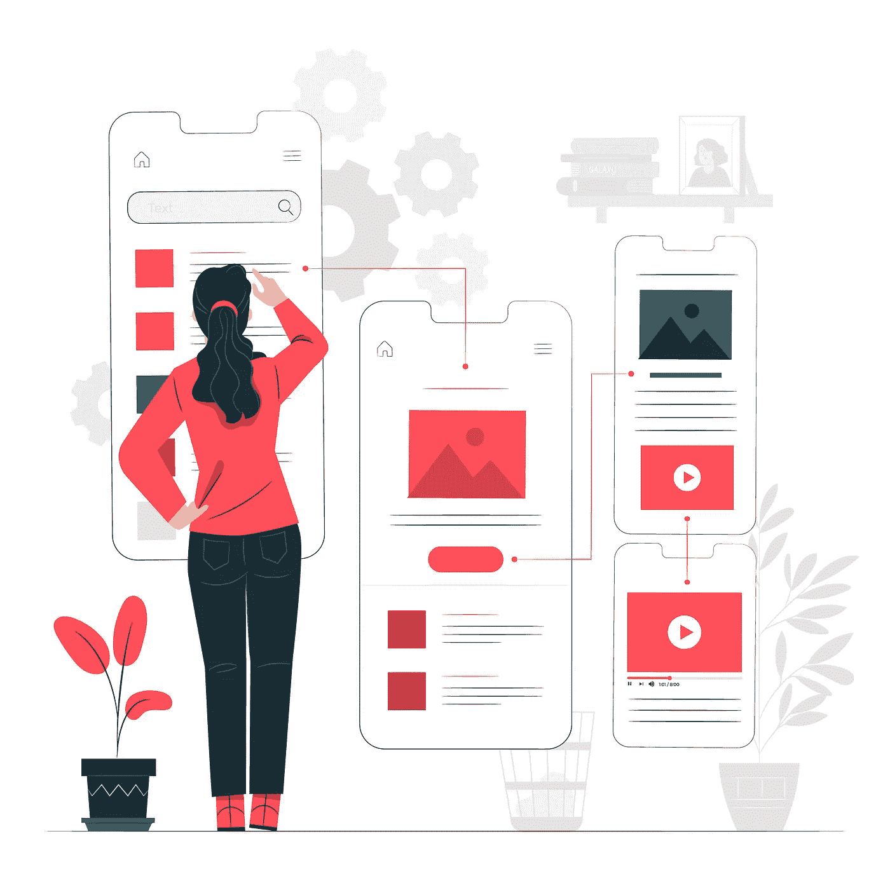

# 移情映射以及人性化用户的重要性

> 原文：<https://medium.com/geekculture/empathy-mapping-and-why-its-important-to-humanize-the-user-b78ad6c9be0d?source=collection_archive---------17----------------------->

*   自己系鞋带
*   睡觉前关灯
*   铺床
*   学习如何咬我们的舌头
*   知道何时该说抱歉

随着年龄的增长，我们学到了很多东西——移情就是其中之一。它使我们成为人类，并有助于建立牢固的联系。

有人甚至会说，学习如何“移情”并不容易。例如，杰克·伦敦和乔治·奥威尔住在受压迫者中间，完全沉浸在穷人的生活中。

说说进入角色吧！

然而，值得注意的是，社会主义思想家比阿特丽斯·韦伯开创了这一传统。出生于富裕家庭的韦布衣衫褴褛地在伦敦东部的一家纺织厂工作，体验贫困者的生活。她不仅学会了像穷人一样生活，还对他们产生了深深的同情。

但这与杰克·伦敦无关，也与碧翠丝·韦伯无关。这是关于 UI 和 UX 中的移情映射。这被认为是设计思维的第一步。

**什么是移情映射？**

这么想吧。这是一种深入用户内心的详细而快速的方法。一个好的设计师完全知道他是最后一个为他设计的人。他是为许多不同年龄、地域和性别的用户设计的，同时考虑了他们环境中可能影响用户行为结果的主要变化。

移情图是一种视觉辅助工具，它传达了我们对特定类型用户的所有了解。借用[尼尔森诺曼集团](https://www.nngroup.com/articles/empathy-mapping/)的话说，一张换位思考地图:

a)有助于形成对用户需求的共同理解，以及

b)有助于决策

一个典型的共情地图以用户为核心，并根据用户的所说、所想、所做和所感分成四个象限。但是，每次的顺序可能是也可能不是时间顺序，也不是连续的。

它最初是由 XPLANE 的创始人 Dave Gray 创建的，已经被全世界的设计师和敏捷社区广泛使用。

**移情映射的四个象限**

由于用户处于象限的中心，这里有一个快速指南让你熟悉这四个方面。

**T11【表示】方面 **

它是用户或参与者在访谈、测试或可用性研究中大声说出的内容。它收集未经过滤和直接的报价，如，“我信任 XYZ 品牌，因为我从来没有任何问题，”或“我经常寻找一个两步的付款过程。”

***“思”的方面***

这一方面永远不会像“说”这一方面那么简单，因为设计者应该站在用户的角度进行思考。他们必须假设用户想说什么但找不到词或害怕被评判。

例如，用户可能会想，“这是平庸的设计，”或者“为什么我不是唯一理解这一点的人？每个人似乎都走在我前面。”为了帮助参与者打破僵局，进行测试的人可以向他们保证，他们可以自由地分享他们的想法，即使他们可能不愉快。不过，这将有助于在设计早期纠正错误。

鼓励一些参与者以匿名形式提交他们的答案，以使过程更加顺利。

***的“礼部”方面***

*这个象限关注用户的行为。它回答了这样的问题:用户从 A 点到 B 点做了什么？用户努力到达那里了吗？用户暂停了吗？*

*这些行为可能包括不必要的多次点击按钮，以及在一个页面上花费很长时间。*

***T5【感觉】象限 ***

*这个象限测量用户在研究、访谈或可用性测试中的情绪状态。例如，用户喜欢这个设计吗？加载时间慢是不是让用户不耐烦了？这些按钮会让用户感到困惑吗？*

**“感觉”象限应该回答“用户对体验感觉如何？”**

***UX 设计中移情映射的优势***

1.  *UX 设计的一个伟大的工具，移情映射也可以部署在其他行业和情况。由于工具、格式和理念是相同的，因此任何行业都可以利用它来获得有价值的见解。*
2.  *它提供了来自调查、访谈和可用性测试的无价数据来创建近乎精确的人物角色。尽管见解和数据对每个用户来说可能是主观的，但信息是可靠的，最终可以用作客观数据。*
3.  *移情映射不仅仅给设计师一个坚实的开端。它也可以是线框、原型、模型和测试的设计和开发过程中的附加工具。*
4.  *由于这是一个协作过程，它涉及许多人。除了设计师之外，来自产品经理和所有者、技术专家和其他人的见解也可以提供不同但令人耳目一新的输入。*
5.  *这是很容易的口袋里，不需要太多时间来完成。*

***移情映射的步骤***

*这份创建移情图的分步指南将有助于简化流程:*

***第一步:移情图的目标是什么？***

*并不是所有的同理心地图都通向相同的道路，知道你想从练习中达到什么将有助于为地图和研究定下基调。比如是打造一个产品还是改进一个现有的？是找出痛点在哪里，还是了解用户在使用特定产品时的整体体验？*

*问你自己和你的团队一些具体的问题，以找到目标的根源。你所有的问题都回答了一个首要的“为什么”吗？*

*第二步:你在映射谁？*

*请注意，您所映射的人物角色不同于目标受众。例如，如果您正在映射一组客户，那么为他们分配特定的角色，比如利益相关者、不擅长技术的人、理想用户的原型等等。通过缩小映射对象的范围，开发人物角色并映射它们变得更加容易。*

***第三步:收集数据***

*令人惊讶的是，你可以从数据和见解中获得多少，即使它们看起来无关紧要。假设你正在进行一次非语言面试。你可以从非语言暗示以及参与者的肢体语言有多舒服中学到很多。在整个过程中积极倾听。*

*由于共情映射从诚实的想法、感受和经历中茁壮成长，因此通过主题访谈、观察、调查和可用性测试等过程收集数据至关重要。*

***第四步:留意用户看到的***

*尽管没有固定的年表或顺序可循，大多数移情图过程的倡导者更喜欢从“看”开始。用户所看到的界面也会受到他们周围环境和市场的影响。用户的观点也会受到其他人正在观看和阅读的内容的影响。*

***第五步:使用象限***

*对于每个象限，提出一系列问题。如果你和一个团队在同一个地方，用便笺记下每个象限的问题。当所有可能的问题都得到回答后，细化你的搜索，将搜索范围缩小到核心问题。*

*在流程结束时，象限应该将同理心放在最前面。本质上，它应该提醒设计者在理解用户需求方面的任何不利的差距。*

*如果你认为在同理心中加入另一个元素会更公正，请随意。然而，它不应该偏离地图的主要目标，即与用户的痛点感同身受。*

***人物角色和移情映射有什么区别？***

*   *这两者之间的主要区别在于，人物角色是基于想象的、虚构的或者可能是角色和用户的。相比之下，共情地图是基于真实用户的。*
*   *人物角色帮助你识别你的客户和目标受众，而移情图则深入挖掘并提供对用户行为和模式的洞察。*
*   *用户角色不容易受到影响，而移情图会根据用户的感受而变化。移情地图结果也可能根据用户的即时环境以及其他人对特定事物的感受或想法而波动。*
*   *移情图是创建人物角色的第一步，因为前者提供了关于用户的可靠信息。每个人物角色应该反映地图的区域和附加信息。*

*什么时候应该使用移情图？*

*移情图帮助设计者在一个地方过滤和分类用户的信息。之后，您可以通过调查答案、深入研究笔记、文字记录等进行定性研究。*

*同理心地图在洞察客户心理、深入挖掘用户角色、记录客户在访谈中的行为以及描绘用户的旅程和故事时非常有用。*

***外卖***

*我们只需几秒钟就能与家人和朋友产生共鸣。既然涉及到感觉、情绪、记忆，我们就不能不为他们感到难过。有时，我们甚至同情仅仅是熟人。但当涉及到客户时，感觉同理心是一种遥远的情感。*

*当你让你的本能占据主导地位时，同理心就会自然而然地产生。设身处地为客户着想可能不是最容易做到的事情，但这很有效。要多关心，就要多了解他们。所以，下一次你创建移情图时，把顾客当成家人。把他们想象成你自己——一个用户。所有的答案都在这里。*