# 设计、分析和可视化您的数据

> 原文：<https://medium.com/geekculture/engineering-analysing-and-visualizing-your-data-559fc58306ac?source=collection_archive---------11----------------------->

(Credit: Unsplash.com)

在**Quick-Code(data science)**系列的这篇博客中，我们将把原始数据转换成工作数据，然后把它们放入一个数据库中，我们将用它进行建模和可视化。

我们结合了 a 的工作原理，

> 数据工程师(清理数据并将数据上传到数据库)
> 
> 数据科学家(从数据集中获得洞察力)
> 
> 对我们的样本数据集进行数据分析(分析和可视化结果)

这个过程有 5 个步骤，

**1。临时 excel 分析(清理)**

**2。使用微软 SSIS (Exporting-I)通过 ETL 管道推送数据**

**3。将 ETL 管道的输出数据存储在 SQL 数据库中(Exporting-II)**

**4。使用 Gretl(分析)对 SQL 数据库中的数据建模**

**5。使用 Tableau 可视化数据(可视化)**

**1。临时 excel 分析(清理):**

Microsoft Excel 可用于高级数据分析和清理。如果你的 PC/Mac 上没有安装 Excel，你可以免费使用 Google sheets。

(Credit: QuickMeme)

第一步的主要目标是对客户直接提供给我们的数据进行全面分析。通过彻底的分析，我不是指应用一些疯狂的算法和编写数百行代码，而是说，只看数据告诉我们的东西比应用模型和算法重要得多。

通过查看列名来理解数据，并找到因变量(其结果依赖于其他变量的变量)和自变量。

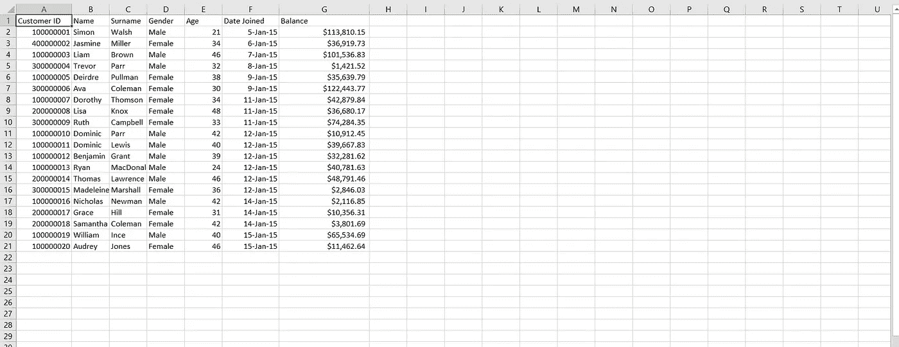

以上数据是一家 XYZ 银行给我们的。他们告诉我们要分析信息，给他们提供关于客户的有价值的见解。(注意:一个正常的数据集可能有数千行。因为这只是一个例子，为了更容易理解，我选择了一个只有 20 行的数据集)

因变量= `Balance`(余额取决于其他变量)

自变量= `CustomerID`、`Name`、`Surname`、`Gender`、`Age`、`DateJoined`

我们可以在 excel 中做一些快速清理，比如改变`DateJoined`中的日期格式，从`Balance`中删除美元符号和小数点(只是为了我们的例子)。

要更改日期右击`DateJoined` 列- >点击【格式单元格-】输入自定义日期格式(yyyy-mm-dd)。

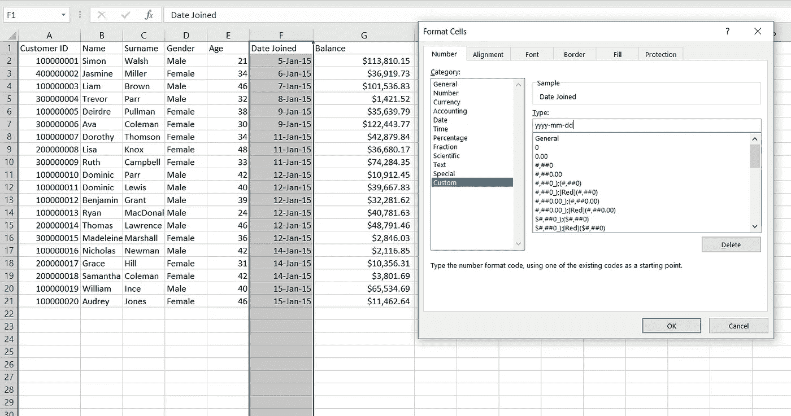

要更改平衡，右键单击`Balance`列- >单击格式单元格- >单击数字并将小数位归零

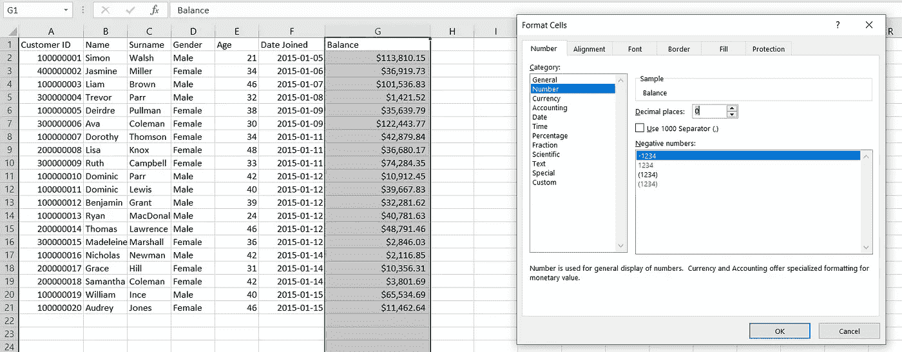

如果您保存并重新打开 excel 文件，您会发现日期没有被更改，这是因为 excel 根据您的笔记本电脑的位置修改了日期格式。要遇到这个问题，你需要安装 Notepad++并在上面打开 excel 文件，然后单击另存为. txt 文件。

第一步到此结束。我们做了一个特别的 excel 分析。下图给出了第一步分析后我们现在拥有的数据。

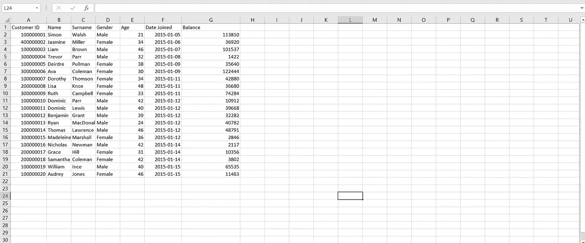

**第二步:使用微软 SSIS (Exporting-I)通过 ETL 管道推送数据**

在通过 ETL 推送数据之前，我们首先需要创建一个 SQL 数据库，这样我们就可以在平面文件(excel)和 OLE DB 服务器(SQL 数据库)之间建立连接

[安装 Microsoft SQL Server](https://www.microsoft.com/en-in/sql-server/sql-server-downloads) 然后连接到您的服务器

通过右键单击 Databases 创建一个新的数据库，并将您的数据库命名为(我将其命名为 AV_Competition)

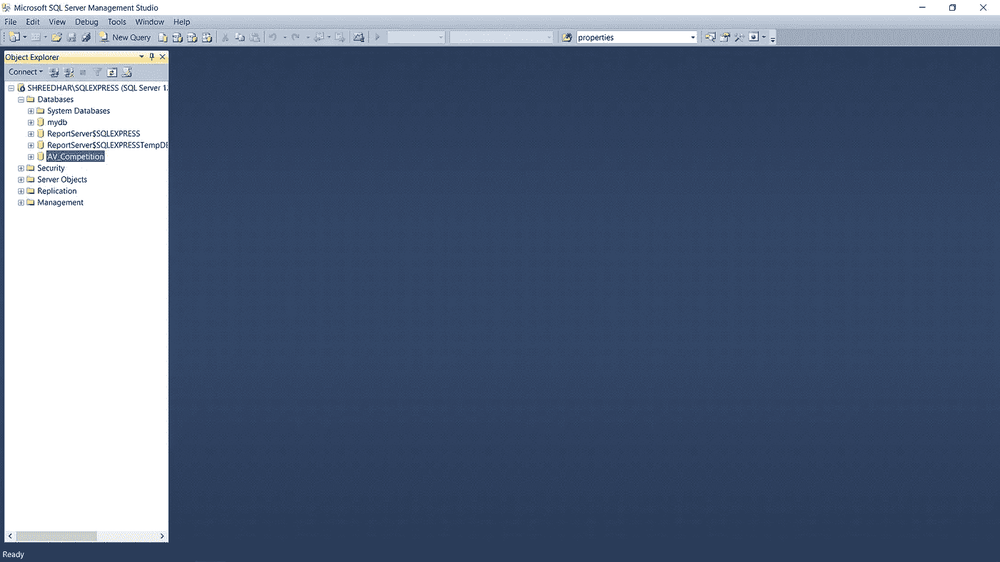

按 Ctrl + N 或在标题栏中选择一个新查询来创建我们的第一个 SQL 查询(注意，这不是我们数据库的实际查询。这只是为了了解环境)

单击标题栏上的 Execute 执行代码。然后展开 AV_Competition 的下拉列表，然后右键单击 tables 文件夹并单击 refresh 以查看我们新创建的表。

要查看表中的内容，请右键单击 dbo。SampleTable 并单击选择前 1000 行。

我们已经使用 SQL 成功地创建了第一个样本表。

(Credit: makeamem.org)

现在，让我们使用微软 SSIS 将实际数据加载到 SQL 中

[安装微软 SSIS](https://docs.microsoft.com/en-us/sql/integration-services/sql-server-integration-services?view=sql-server-ver15) 并在 Integration Services 中为我们的项目创建一个新文件

这个想法是创建一个**数据流**任务，在这个任务中，我们的数据从平面文件(Excel)传输到 OLE DB 服务器(我们的数据库)。

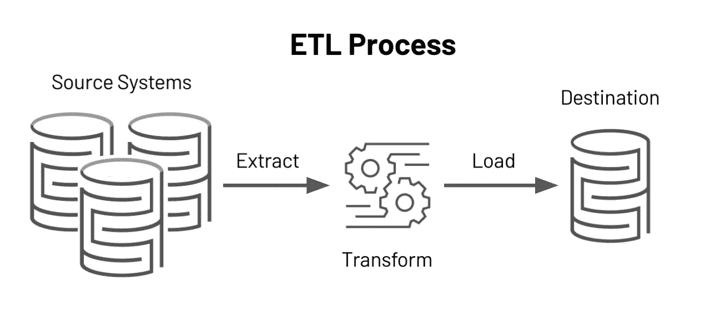

(Credit: Databricks)

拖放左侧窗格中的数据流任务，以创建我们的第一个数据流任务

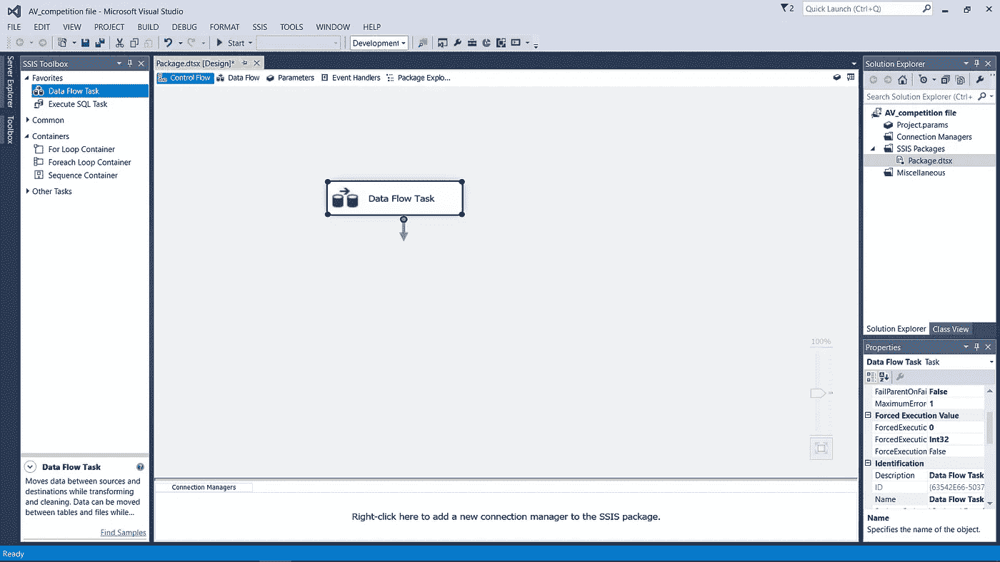

双击数据流任务。这是我们转移的地方。从左窗格中拖放平面文件源和 OLE DB 目标。单击平面文件源框上的蓝色箭头，并将它们放到 OLE DB 目标框中

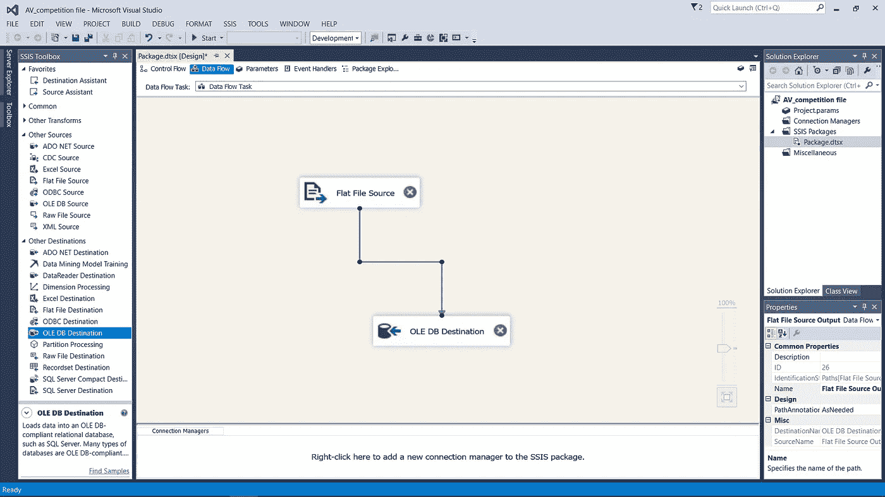

现在，让我们将 excel 文件添加到平面文件源中。双击平面文件并选择新建连接管理器。浏览您的 excel 文件(现在在 notepad++中存储为文本文件),并输入文本限定符“

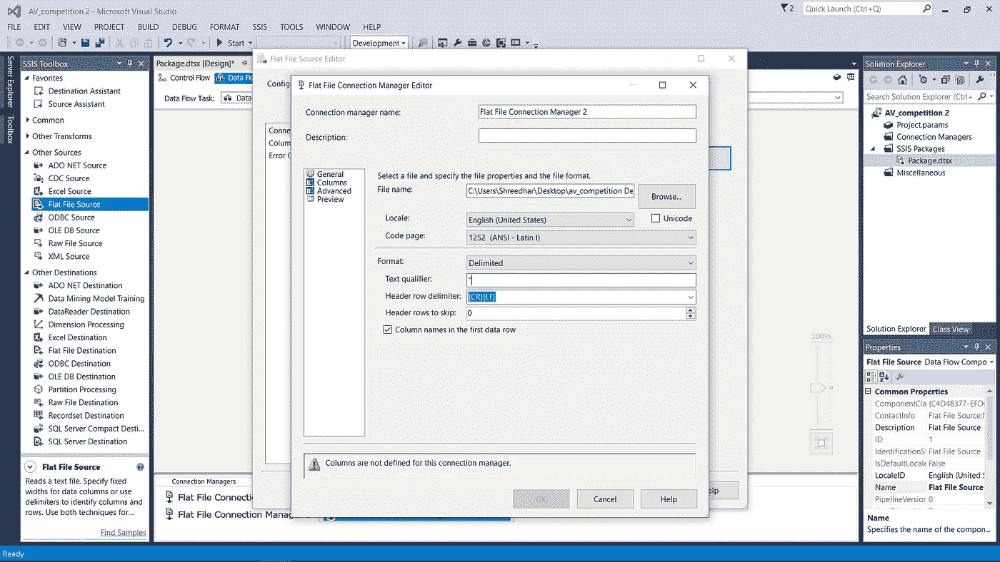

单击 Columns 选项卡并检查列，看到我们的`DateJoined`和`Balance`已经改变。

点击高级，通过按住`shift+ down arrow`选择所有的列名，并将输出列宽设置为 1000(有时我们的字符串值可能很大，例如评论或对话，我们这样做是为了遇到这种情况)

预览它，然后单击“确定”。我们的平面文件源已成功创建。

**3。将来自 ETL 管道的输出数据存储在 SQL 数据库中(Exporting-II)**

现在，要创建一个 OLE DB 服务器(我们在 SQL 中的数据库)，我们将双击 OLE DB 服务器文本框。单击连接管理器上的“New ”,键入您在 Microsoft SQL 上找到的 SQL server 名称(我的 SQL server 名称是:SHREEDHAR\SQLEXPRESS ),然后选择您的数据库，该数据库将显示我们已经创建的 AV_competition 的名称。单击确定。

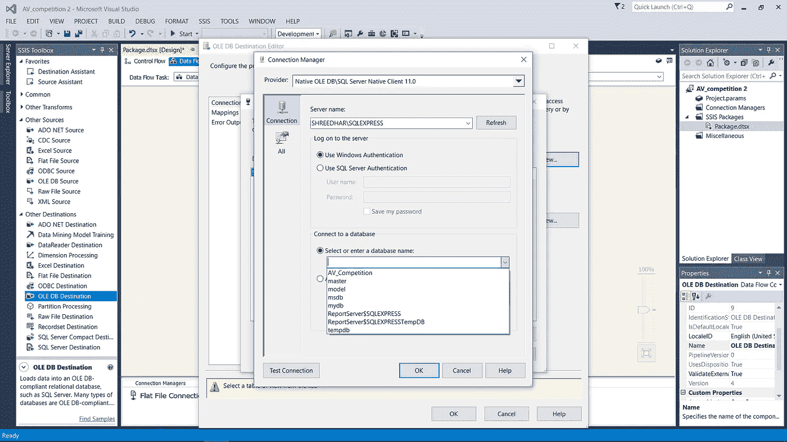

现在，要填写表格，请在表格名称上单击 new。SSIS 的神奇之处在于，SQL 代码会自动为我们填充

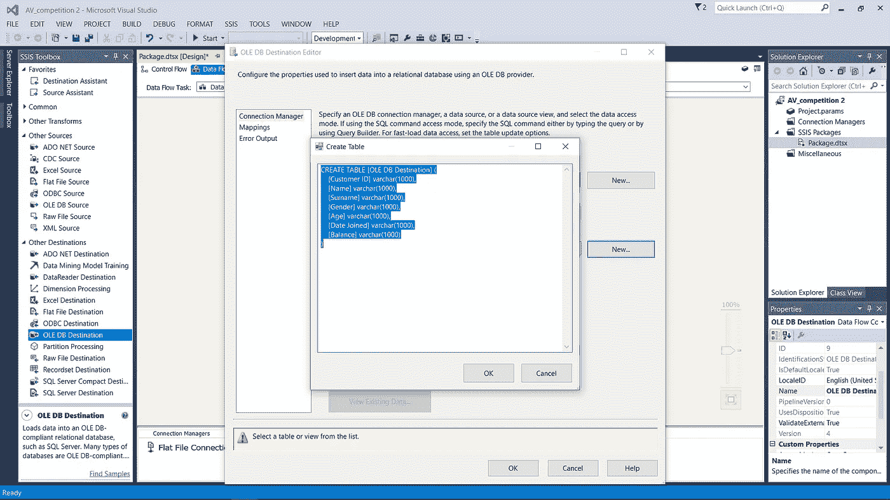

单击 Ok，转到 mappings 并查看列是否被正确映射。

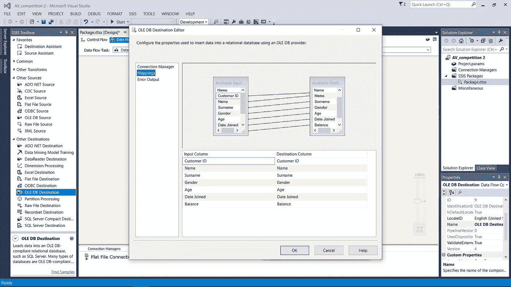

就这样，我们的设置已经为数据传输做好了准备。按标题栏上的开始按钮开始传输。

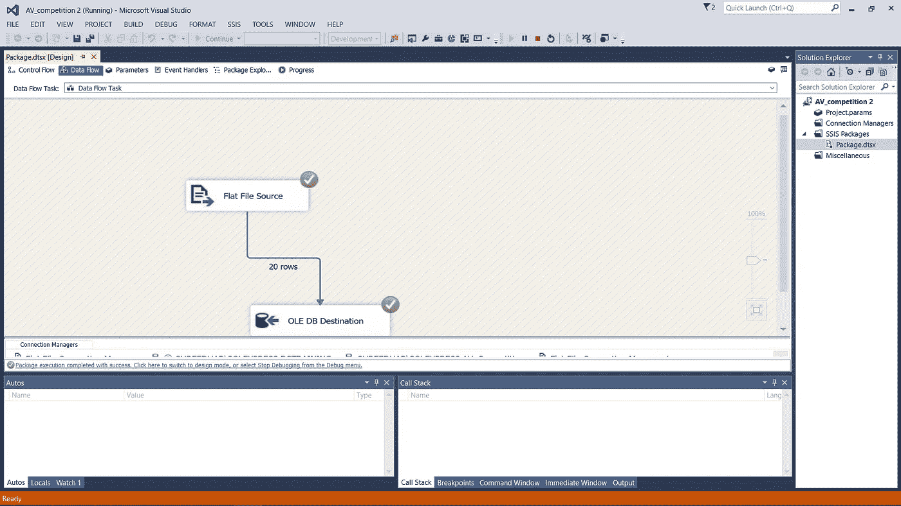

一旦成功，您将在源和目标文本框上看到绿色勾号。

(Credit: Alooma)

现在，让我们检查我们的数据库。转到 SQL，刷新表以查看我们的表名 dbo。OLE DB 目标(注意，我们总是可以在我们的 SSIS 中更改表名)。右键单击该表，然后单击选择前 1000 行。

我们已经成功地创建了 excel 和数据库之间的传输。现在，剩下的就是分析和可视化它们。

**4。使用 Gretl(分析)对来自 SQL 数据库的数据建模**

现在让我们来分析数据。完成这一步有多种方法。可以使用 python 编写回归(如果输出是连续的)/分类(如果输出是离散的)模型并预测结果。但是在这里，我们将保持简单，使用 Gretl 软件来为我们做这件事。我们将对我们的模型应用多元线性回归，这样软件就可以在给定独立变量的情况下为我们预测`Balance`。

安装 Gretl 并在 Gretl 上打开你的数据集。然后点击模型- >普通最小二乘法(针对回归模型)。选择因变量和自变量。

我们没有选择`Name`、`Surname`、`CustomerID`作为我们的自变量，因为它们不会给我们的模型带来任何价值。你的名字和你的存款余额没有关系。

选择后，单击确定。

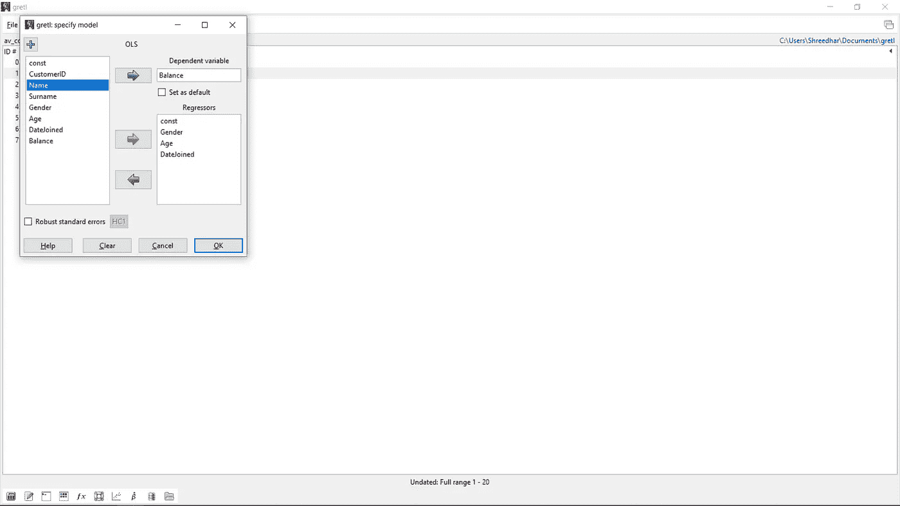

您将获得详细的统计分析，如 p 值、标准误差、r 平方值等。可以用来分析你的模型。

点击分析->预测->确定。你会在`prediction`栏下通过我们的线性回归模型得到预测值。

我们已经成功地模拟了我们的数据。请注意，我们的模型在统计上并不强大(实际的`Balance`和预测的`Balance`之间的巨大差异)，这是因为我们的模型只有 20 个样本，所以很难用非常低的数据集进行预测。

如果您向数据中添加更多样本，然后运行模型，结果会好得多。此外，有各种各样的消除方法，我们可以做的，以改善我们的模型，你可以检查出来，如果你有兴趣了解更多关于模型调整。

**5。使用 Tableau 可视化数据(可视化)**

Tableau 是一个非常有用的工具，可以提供交互式可视化，我们可以向团队展示，这样我们就可以讨论我们使用 Tableau 通过图表提供的见解。Tableau 的替代品是 PowerBI

[安装 tableau public(免费版)](https://public.tableau.com/en-us/s/download)，连接你的文件。

我们将想象不同的`Names`和它们的`Balance`。将`Name`拖放到列，将`Balance`拖放到行

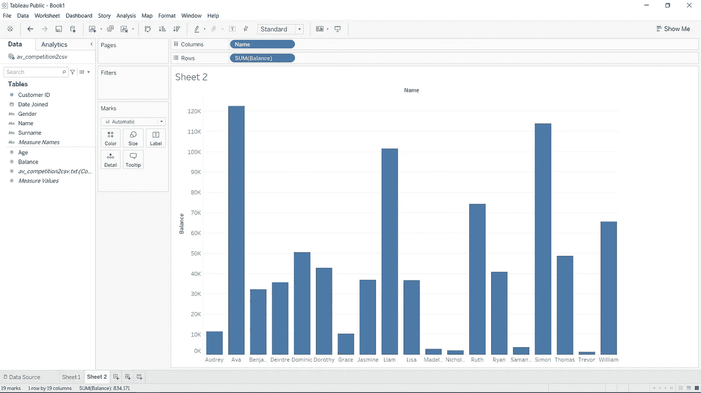

看看哪个性别比另一个性别更平衡。将`Gender`拖放到列，将`Balance`拖放到行

从下面的图表中我们可以清楚地看到，男性在我们银行的存款余额更多。因此，也许银行可以更多地关注女性客户，根据我们提供给她们的信息来检查出了什么问题。

让我们看看哪个年龄组的余额更高。为此，我们将首先创建 10 个区间(一组 10 个区间)。右键单击年龄(在左侧窗格中)->创建->箱(选择间隔为 10)。

现在将`Age(bin)`(在左窗格中)拖放到列中，将`Balance`拖放到行中

我们可以很快分析出，30 岁到 40 岁之间的年龄比其他年龄组的人更平衡

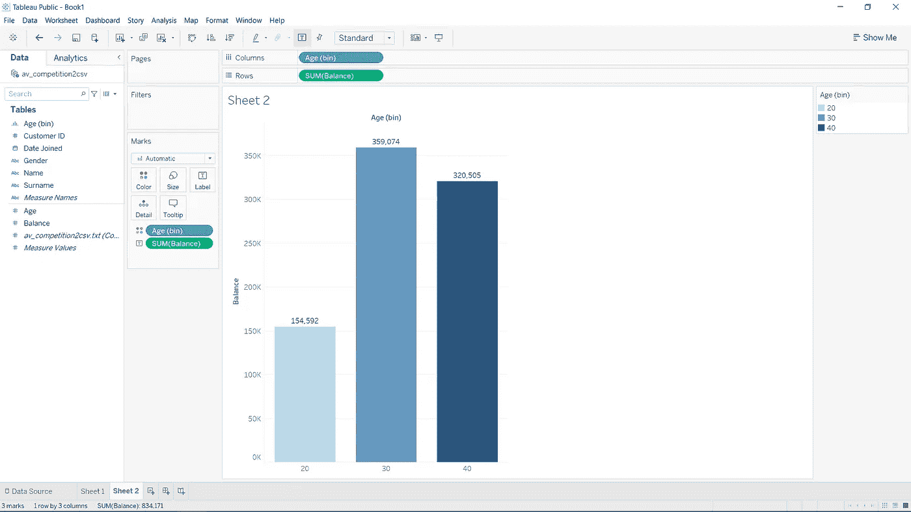

我们可以对五年的缺口间隔做同样的事情，只是通过修改 bin 间隔(将间隔改为 5)，以获得更清晰的图像。(请注意，25-30 岁年龄组的空白处表示没有该年龄组的数据)

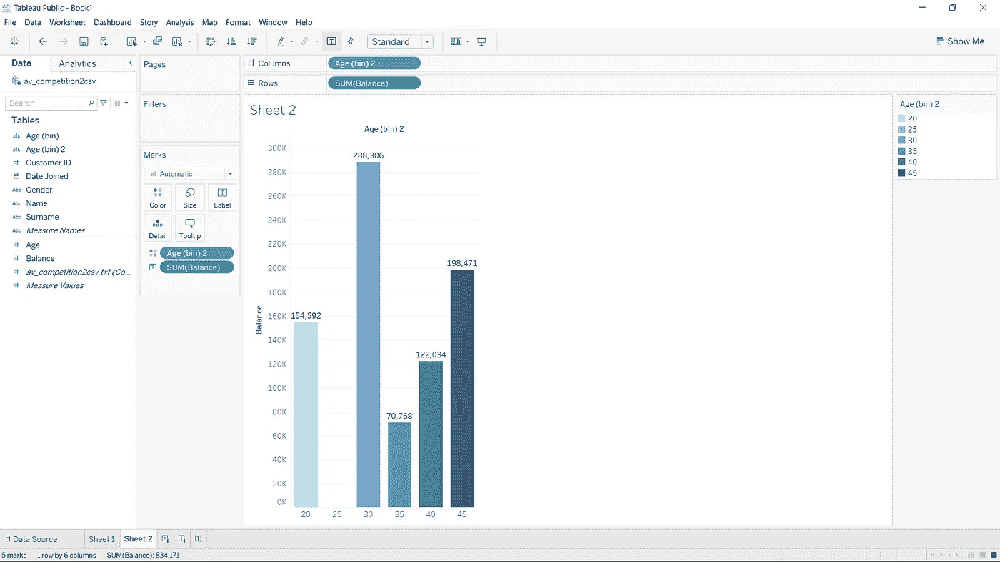

我们已经成功地为数据集创建了可视化。

概括一下我们的博客:

我们已经获得了原始数据集，使用 Microsoft excel 进行了专门的清理(格式化日期和删除美元符号)，然后我们通过 ETL 管道将数据传输到 SQL 数据库，我们使用 gretl 对这些数据进行分析，以对我们的模型进行线性回归。最后，我们将数据可视化，为客户提供更有意义的见解。

您可以对自己的数据集使用相同的步骤来快速清理、提取、分析和可视化模型。

这个博客是快速代码(数据科学)系列的一部分，在我的[媒体页面](/@Shreedharvellay)查看更多快速代码系列