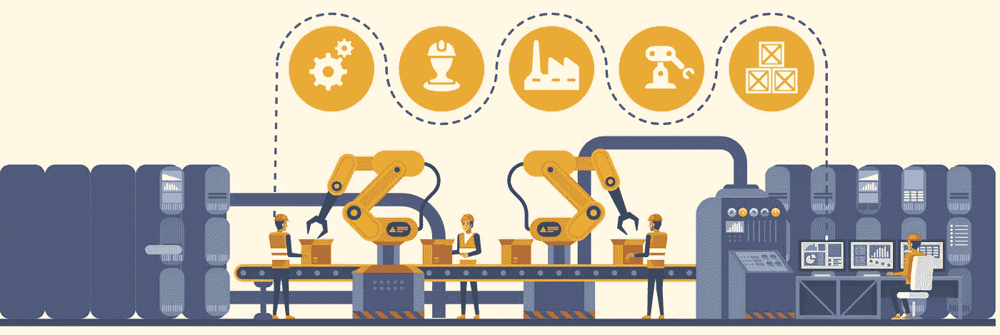

# 工程 Syook InSite:构建物联网产品的挑战

> 原文：<https://medium.com/geekculture/engineering-syook-insite-challenges-while-building-an-iot-product-ad7bda518edb?source=collection_archive---------2----------------------->

随着我们准备推出我们旗舰物联网产品的第一个版本， [InSite](https://syook.com/) ，我认为这是回顾我们过去一年历程并分享经验的绝佳时机。这是 Syook 工程团队一系列博客文章中的第一篇。

构建工业物联网产品的努力是巨大的，无数个夜晚在办公室度过，艰苦的争论和讨论试图第一次就做好，而不是频繁地迭代和重建。我们花了一年多的时间从一个 POC 产品发展到一个被 Unilever 和 Delhivery 等大客户接受的产品(很快还会有更多产品发布)。

这个团队已经从两个人发展到了二十个人(我们也打算雇佣更多的人)。在与一家中国供应商合作一段时间后，我们从外包硬件转移到了 R&D 内部，这一过程帮助我们学到了许多关于构建强大的物联网硬件的知识。

我们使用的堆栈是 Javascript(NodeJS+React js+React Native)和一个用 Java 编写的附加服务。对我们大多数人(包括我自己)来说，这是第一次(用 JavaScript 构建应用程序)，我们有很多东西要学。

**以下是我们在进行现场工程时面临的一些挑战:**

对于那些最终可能做一个 TL 的人；博士，这里有一个快速总结:

*   NoSQL 可能很棘手。在对数据库建模之前，请参考最佳实践。
*   内存泄漏是一场噩梦，最好通过正确理解处理环境来避免
*   使用 NodeJS 子进程来缓解循环延迟问题，并避免在主线程上处理数据
*   物联网网关需要构建稳健性。
*   雇佣拥有适当领域知识的专家。
*   在为内部能力做好准备之前，请咨询顾问
*   构建动态的、可配置的特性，允许用户配置和构建他们想要的东西，而不是你硬编码所有东西

对于那些留下来阅读更多内容的人来说:

*   **NoSQL 数据库面临的挑战:**我们想要 NoSQL 数据库的灵活性，而 Mongo DB 的排名相当高，所以它是我们的首选。我们用 Mongoose 做了一些模式建模，但是，作为第一次，我们最终犯了一些明显的建模错误，导致内存膨胀。在几个月内解决了这些问题之后，我们可以很有信心地说，NoSQL 数据一点也不简单，我们绝对应该参考 db 建模的最佳实践和指南。这里有一个[少数](https://www.mongodb.com/blog/post/6-rules-of-thumb-for-mongodb-schema-design-part-1) [好的](https://www.mongodb.com/blog/post/6-rules-of-thumb-for-mongodb-schema-design-part-3?_ga=2.128324428.1314420214.1543055033-1875511956.1525516180) [参考文献](https://www.mongodb.com/presentations/webinar-back-to-basics-thinking-in-documents)，为我们澄清了很多概念**。**
*   **内存泄漏:**对我们来说，一个重要的教训是对 Node 中的内存膨胀和内存泄漏(由于缺乏 db 建模知识而造成的)进行故障排除。我们的第一个版本会运行五分钟，然后由于内存泄漏而崩溃。为什么？我们玩了大约一个月左右的夏洛克游戏来找出根本原因(我想还需要提高我的演绎推理能力)。有很多关于如何寻找内存泄漏的文章，但大多数都不简单。堆转储和火焰图分析、手动垃圾收集调整和一些其他技术被用来找出核心问题在于我们最初是如何对数据库建模的(我们将大量数据加载到 RAM 中，而没有正确地释放它；鉴于物联网数据每 2 秒钟处理一次，膨胀速度非常快，应用程序在 5 分钟内就崩溃了)。
*   **循环延迟问题:** Node 因在主线程上处理请求而臭名昭著，像其他所有第一次处理请求的人一样，我们也面临着事件循环的问题。由于这是我们的第一个应用程序，我们必须在 Node 中处理所有的实时数据处理(如果我们需要将其切换到更快的东西，如 Go，仍有待讨论)，我们最终进行了大量迭代，以完善物联网传感器生成的所有实时数据的处理。我们如何缓解环路延迟问题？孩子去营救了！
*   **物理网关与虚拟网关:**我们的第一个硬件版本依赖于物理网关，它从所有其他阅读器收集数据，然后将其发送到主服务器进行处理。这具有一定的优势(通过使用边缘计算优化处理来最大限度地减少带宽使用),同时这也意味着万一出现问题，网关是单点故障。此外，单一网关限制了我们可以部署的传感器数量，因为任何物理设备的带宽都是有限的。我们将这个物理网关换成了虚拟网关，每个阅读器将数据直接发送到云中进行处理。
*   **读取器特征问题:**任何发送数据的硬件都需要对其行为进行特征描述，以便可以预测应用程序的响应。这对我们来说是另一项重要的学习。鉴于我们的油田背景，我们知道如何着手构建依赖于来自硬件的数据的应用程序，但硬件的特性化是我们必须处理的一个非常棘手的问题。我们最终雇佣了硬件专家来完成这项特殊的任务，结果令人惊讶。
*   **设计迭代:**我们没有内部的产品设计专业知识，为了 POC，我们最终创建了一个准系统 UI，它足以有效地展示我们试图实现的潜力。鉴于概念验证通过了我们第一个客户的验证，我们知道我们有很多工作要做，以改进用户界面/UX，使其更加用户友好。进入 [Tinkerform](http://tinkerform.com) ，我们的设计顾问！他们是一群与初创公司合作的 IIT G 毕业生，通过建立用户故事，然后交付工作流程和最终的用户界面，帮助他们将产品概念化。在过去的一年中，我们与他们的合作卓有成效，我们将继续与他们合作。
*   **指标:**仪表板是任何 B2B 应用程序的核心，图形是数据可视化的一种不可或缺的方式。我们从我们认为可能有用的基本图形开始，但很快意识到最好给用户以他们想要的任何方式可视化数据的选项。为此，我们构建了一个可配置的指标模块，用户可以在其中添加和配置任何类型的小部件，帮助他们以自己喜欢的格式可视化数据。
*   **动态规则引擎:**InSite 最重要的一个方面是动态规则引擎，它可以在某个规则被破坏时发送警报。就像其他事情一样，我们不太清楚我们将如何构建它，但对开发人员来说，这是一个很大的惊喜。它受 IFTTT 类工作流的启发，现在设置规则非常简单。展望未来，我们的目标是使这个引擎更强大，并增加可以设置的规则的复杂性。

我要特别感谢所有在我们面临所有这些挑战时为我们提供建议和帮助的人。这就像坐过山车一样，没有他们的帮助是不可能的。这也是对开源社区和所有为构建我们最终使用的如此神奇的库做出贡献的人们的一声欢呼。我们鼓励我们的开发者做出开源贡献，因为我们知道我们最终会多么依赖这个社区的帮助和支持。

最后，让我们看一看我们正在建造的一切:

*   我们正在探索一些 ML / AI 来提高我们定位引擎的准确性
*   我们还致力于构建更强大、更准确的商业智能和分析引擎，帮助我们的客户获得可操作的见解
*   我们正在寻求扩展我们的物联网产品，以包括一系列对智能工厂(IIoT 4.0)至关重要的传感器
*   随着我们不断扩展，我们肯定会专注于性能增强

伙计们，现在就到这里吧！直到下一个帖子…