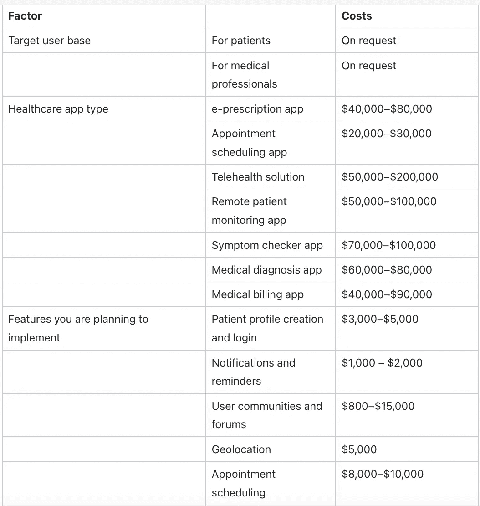

# 估算开发健康应用的成本:来自 ITRex 的提示

> 原文：<https://medium.com/geekculture/estimating-the-cost-of-developing-a-health-app-tips-from-itrex-82e3055b257?source=collection_archive---------22----------------------->

怀疑你的移动医疗应用想法是否有潜力，不确定它是否值得高昂的医疗应用开发成本？

好消息是，客户愿意下载和使用医疗应用。我们来看一下统计数据。三星健康应用程序在 2022 年 9 月达到了 315 万次下载，而印度新冠肺炎联系人追踪和自我评估解决方案 Aarogya Setu 自推出以来，在 40 天内下载量超过了 1 亿次。

2022 年 9 月全球谷歌 Play 商店领先的移动健康解决方案，按下载数量计算

全球移动健康应用市场[在 2021 年](https://www.grandviewresearch.com/industry-analysis/mhealth-app-market)的价值为 382 亿美元，预计到 2030 年将达到 1059 亿美元，以 11.8%的 CAGR 稳步增长，因为越来越多的医疗机构使用[健康应用开发服务](https://itrexgroup.com/services/healthcare-app-development/)来扩展业务。

你是否有兴趣加入这个项目，但是因为没有足够的信息来了解你需要投资的金额而犹豫不决？本文解释了影响开发健康应用程序总成本的五个主要因素，并根据我们的产品组合给出了实际估算。最后，我们的售前团队会分享一些实用技巧，告诉您如何在此过程中最大限度地降低您的费用。

在我们博客上的这份综合指南中，你可以找到更多关于影响软件解决方案开发成本[的因素的见解，这些因素与行业无关。本文还详细介绍了我们团队帮助您进行成本估算的步骤。](https://itrexgroup.com/blog/estimating-the-cost-of-software-development/)

# 影响健康应用开发成本的 5 个关键因素

为了准确估计开发一款健康应用的成本，你需要根据以下五个因素来评估你的想法:

1.  目标用户群(患者与医疗专业人员)
2.  您希望构建的医疗保健应用程序的类型
3.  您将要实现的功能
4.  您的移动健康应用将依赖的创新技术
5.  您的产品必须满足的合规性和认证要求

让我们更详细地探讨这些因素。

# 因素#1:目标用户群(患者与医疗专业人员)

医疗保健应用程序既可以为患者服务，也可以为医护人员服务。

**医疗专业人员的移动医疗应用**

这种类型的应用包括为医生和护士服务的医疗保健解决方案。此类应用程序促进了医疗保健服务的流程，并使医务人员能够与患者沟通。这些应用程序必须符合 HIPAA 标准，并采用强加密方法，这一点非常重要。

面向医疗保健专业人员的医疗应用可帮助医务人员完成以下任务:

*   执行临床诊断，因为它们通过整理数据和促进与其他专业人员的交流来支持医生的临床决策
*   远程咨询和监控他们的病人
*   存储和操作患者数据，如病史、处方、预约等。
*   管理账单并简化发票流程

**面向患者的健康应用**

这些解决方案旨在支持大众过上健康的生活方式，并提供更好的医疗结果。这种类型的移动医疗应用有助于患者:

*   搜索医生，安排和重新安排预约
*   监测他们的慢性病，如果病情恶化，就提醒医生
*   根据症状获得初步诊断
*   应对心理健康问题

# 第二个因素:你想要构建的医疗保健应用的类型

由于一些人倾向于将移动健康应用与健身和健康软件混淆，我们希望在这些解决方案之间划清界限。此处讨论的医疗保健应用将个人数据用于医疗目的，因此需要遵守相应国家的法规。

如果你想[建立一个健身应用](https://itrexgroup.com/services/fitness-app-development/)，你可以查看我们最近关于[运动应用开发成本](https://itrexgroup.com/blog/how-much-does-it-cost-to-make-a-fitness-app/)的文章。此外，如果您正在寻求开发患者参与解决方案，请查看我们关于与实施患者参与软件相关的[费用的详细指南。](https://itrexgroup.com/blog/types-of-patient-engagement-solutions-costs/)

在本节中，我们列出了常见的健康应用类型，描述了它们的功能，并评估了它们的开发成本。请注意，本节中的所有成本估算仅在以下假设下有效:医疗应用在单一平台上运行，不使用任何高级可视化，如游戏化，并且不采用“因素 4”中提到的任何创新技术。

## 电子处方医疗应用

这种类型的医疗保健软件允许医生开药，监控处方历史，取消和更新处方。此类应用的功能取决于政府法规。在一些国家，这种软件允许用户与他们选择的药剂师沟通，以下订单并安排取药。

[ScriptSure](https://www.dawsystems.com/eprescribing.html) 就是这种健康应用类别的一个例子。它使用户能够将他们的电子处方发送到药房，并在需要时安全地打印处方。这个软件链接到一个综合数据库，里面有处方药和维生素以及它们的使用说明。

> ***一个电子处方医疗应用平均要花费你 4 万到 8 万美元。***

## 预约安排健康应用程序

这些医疗保健应用程序允许患者安排医生预约、接收提醒、查看和取消预约，同时自动通知诊所。这种软件通常有两层:面向病人的一面和医疗专业人员使用的功能。医生还使用预约管理应用程序来更改他们的日程安排，并接收新预约的通知和现有预约的提醒。

一些日程安排应用程序允许患者根据要求向医生发送其病史中的相关信息。

[SimplyBook.me](https://simplybook.me/en/online-appointment-software-for-medical-companies-clinics-doctors-and-healthcare) 是医疗中心的预约软件。它从各种渠道提取约会数据，包括 Instagram、脸书和谷歌地图。供应商也可以将 SimplyBook.me 集成到诊所的网站中，如果它是用一个流行的网站构建器构建的，比如 Wix 和 Joomla。许可费用从每月 50 次预约的 0 美元到高级订阅的 49.9 美元不等。

> ***你要为预约安排健康应用支付的价格从 2 万美元到 3 万美元不等。***

## 远程医疗解决方案

自新冠肺炎疫情爆发以来，远程医疗实践越来越受欢迎。这些健康解决方案允许医生通过移动和网络应用程序进行在线咨询。这些应用程序可能相当广泛，包括链接到医院的 EHR 系统、发票和支付选项、应用程序内视频会议、患者仪表盘、文件传输、电子处方和患者监控等功能。

总部位于波士顿的 Amwell 公司开发了一套全面的符合 HIPAA 标准的远程医疗解决方案，使患者可以全天候联系专业人员。医疗保健组织可以注册他们的专业人员，收取订阅费。医生可以直接从他们的原生电子病历访问该应用程序，它可以链接到计费和索赔系统。这个平台提供初级和紧急护理以及远程精神病学。Amwell 已经有 2000 多家医疗机构订购了其服务。

> ***开发一个定制的远程医疗应用程序需要花费 5 万到 20 万美元。***

## 远程患者监护应用

这种类型的医疗应用通过传感器收集医疗环境之外的患者数据。医生利用这些数据来监测病人的健康状况，有时甚至进行远程诊断。如果患者的病情突然恶化或检测到任何异常情况，患者远程监控解决方案还可以提醒医疗保健提供者。这对于老年人和手术后康复的人或试图在家治疗慢性疾病的人来说尤其有用。

[MedM](https://www.medm.com/rpm/?utm_source=capterra&utm_medium=ppc&utm_campaign=patient_monitoring) 为患者监护提供了一个与传感器和智能手机无关的平台。它的集成产品组合中已经有 600 多个医疗传感器，可以测量 18 个健康参数。该应用程序还可以与 Google Fit 和 Apple Health 整合数据。

> ***此类医疗保健解决方案的价格从 5 万美元到 10 万美元不等。***

## 症状检查器移动健康应用

这些医疗保健应用程序可以帮助用户根据一系列症状识别自己的疾病，并将他们指向最近的医疗中心以确认诊断。

这种软件的一个例子是 Ada。根据该应用程序的网站，临床研究证明这是最准确的症状检查应用程序。它包含 1500 种疾病的信息。除了诊断服务之外，Ada 还可以找到离用户很近的医生，并建议您在家进行治疗。

> 如果人工智能驱动的疾病检测引擎已经可用，那么实现一个症状检查器应用程序将需要大约 2 万美元。如果你需要从头开始制造引擎，成本将增加到 7 万到 10 万美元。

## 医疗诊断软件

以前的 mHealth 应用程序类型是为患者设计的，而医疗诊断软件更复杂，是为医疗保健专业人员设计的。它可以帮助医生收集和分析来自患者物联网传感器和电子病历的数据，并以匿名方式与同事分享，以寻求反馈。医疗诊断软件也可能包括能够处理患者数据并生成智能建议的人工智能模型。

[Human Dx](https://www.humandx.org/) 是一款医疗社区软件，旨在构建世界集体医疗洞察。它有助于解决不同的医疗案例，并给学员提供了练习推理技能的机会。

> 一款基础医疗诊断应用的起价为 6 万至 8 万美元。

## 医疗计费应用程序

这类移动医疗应用程序可以自动执行计费程序。它允许患者进行安全支付和接收虚拟收据，并支持会计部门跟踪发票。计费应用程序还可以与诊所的 EHR 系统和保险提供商集成，并支持折扣选项和信用支付。

[Simplepractice](https://www.simplepractice.com/) 是强大的医疗计费解决方案的一个例子。用户可以轻松登录应用程序并支付医疗保健服务费用。该软件还允许患者搜索医生、安排预约和接收提醒。此外，该应用程序提供了一个远程医疗平台，使用户能够远程咨询医生并在线支付。

> ***典型的医疗计费应用的成本从 4 万美元到 9 万美元不等。***

# 因素 3:你要实现的特性

功能的数量和复杂程度会对医疗 app 开发的总成本产生很大影响。但是，如果你能成功地交付实际上满足目标受众需求的功能，这也会给你带来竞争优势。

让我们看看您可以将哪些基本和高级功能整合到您的健康应用程序中。

## 基本特征

*   **患者档案创建和登录**。用户必须能够创建和管理他们的帐户。如果该应用程序用于预约安排，你可以考虑让用户填写大量表格，帮助医生为预约做准备。如果患者和医生都使用你的移动健康应用，请记住，医生的个人资料中显示的信息将与患者的不同。医生将包括他们的教育，经验，资格等。，任何让他们在病人眼里值得信赖的东西。

不要忘记实现一个易于访问的密码恢复选项，允许用户使用电子邮件或通过短信接收的一次性 PIN 码重新访问他们的帐户。

添加注册和登录功能会使您的医疗保健应用程序价格增加大约 **$3，000 到$5，000** 。

*   **通知和提醒**。根据您的健康应用程序的目的，您可能希望通知用户即将到来/取消的预约，并在他们的实验室结果准备好时通知他们。你也可以提醒患者安排复诊，按时服药。

在发送通知的时候，确保你的应用程序不会过度打扰，警报也不会过于激烈。这项功能的价格大约为**1000-2000 美元**。

*   用户社区和论坛。该功能使患者能够相互联系和激励，从而获得更好的健康结果。如果你的移动医疗应用的目标是医生和护士，你可以提供一个专业的网络选项，让医疗保健员工可以交换意见和寻求建议。

连接一个现有的基于网络的社区论坛将增加**800 美元到 2000 美元**来构建一个健康应用的总成本。更深入的整合将从**的 10，000 美元到 15，000 美元**开始。

*   **地理定位**借助这一功能，您的应用将提供一系列基于位置的功能。例如，它可以编辑用户附近的医院和医疗保健提供商的列表。另一个例子是在紧急情况下救护人员可以看到病人的位置。

这项功能将为您的医疗保健应用程序开发成本增加**5000 美元**。

*   **预约排班**。调度系统通常与医生和患者的日程表同步。它允许病人在旅途中预约和更改预约，并使医生能够确认或拒绝访问。这样的系统可以执行其他对时间敏感的活动，比如发送约会提醒。

实施此功能的成本大约为**8000 美元到 10000 美元**。或者，您可以集成一个现有的调度解决方案，价格大约为 **$1，500** 。

*   **支付网关**。通过该功能，用户可以支付医疗服务费用、购买药物和支付保险。如果你能提供几种支付方式，比如 Payoneer 和 PayPal，对你的客户来说会更方便。你也可以选择信用卡支付。
*   对于这个功能，预计每种方法要支付大约**$ 3000**。

## 高级功能

这里列出了一些更复杂的功能，可以帮助您提供有竞争力的产品。

*   从可穿戴设备上收集数据。这意味着您的移动健康应用程序可以与物联网设备集成，聚合和分析它们生成的数据。该功能使用户能够监控他们的健康参数，如血压和心率。最近的一项[研究显示，80%](https://www.insiderintelligence.com/insights/wearable-technology-healthcare-medical-devices/) 的被调查消费者愿意穿戴健身健康科技。让人们将你的健康应用程序与他们喜欢的小工具联系起来，将会增加他们的参与度。此外，它为医生提供了更多关于患者的信息，并允许他们根据数据做出治疗选择的决策。

这里的成本取决于想要集成的物联网传感器的数量和类型。最低成本将在**3000 美元到**6000 美元之间。

*   **文件共享**。该功能允许患者和医生交换医学图像、实验室结果和其他医疗文档，以促进诊断过程。

这将平均给你的医疗应用程序开发成本增加【4,000 美元。

*   **虚拟候诊室**。该功能在支持远程医疗的医疗应用中非常有用。它允许患者通过他们的移动设备登记，并通知他们的医生他们已经准备好了预约。此外，您可以在等待的患者和医务人员之间实现简单的文本通信，以便用户可以回答一些基本问题，从而加快预约过程。

实施一个虚拟候诊室将花费你大约 5000-10000 美元。

*   **视频通话。**该功能允许用户使用视频实时咨询医疗专家。确保这种通信是安全和加密的。为了简化咨询，您可以授权医生查看患者的病史。

与此功能相关的费用包括实施成本和视频流服务的订阅费。将视频通话整合到您的健康应用程序中的最稳定、最快速的方法是使用外部 SDK。基本的流媒体功能大约需要**10，000 美元**。随着更多的直播流量和额外功能，如保存视频点播(VOD)内容的可能性，价格将会上涨。

*   **病历整合**。这对病人和医生都有用。病人保持跟踪他们的健康状况，医生可以在病人咨询期间参考医疗记录。研究表明，仅在 2020 年，集成 EHR 系统的健康应用数量[就增加了 20%。最受欢迎的集成平台是 Epic App Orchard，增长了 43%。](https://medcitynews.com/2021/10/study-apps-integrating-with-ehrs-grew-20-during-2020/)

整合医疗记录平均每次需要花费 10，000 美元。

*   **AI 与 ML 融合。**人工智能可以通过许多方式增强你的医疗保健应用，并赋予它竞争优势。有关更多信息，请查看下面的下一部分。一个例子是整合了 ML 驱动的聊天机器人，当患者想要研究他们的症状时，它可以作为他们的第一线互动。在查看症状后，聊天机器人可以提出其他问题，并做出初步诊断。

这可能要花费 2000 到 5000 美元。

# 因素 4:你的移动健康应用将依赖的创新技术

融入尖端技术将增加健康应用程序的总开发成本，但它将使您能够为客户提供更多价值。让我们看看这些技术到底能做什么。

## 人工智能

总的来说，人工智能对医疗保健领域有很多好处，尤其是移动医疗应用。这里有一些技术可以实现的例子。

1.  **管理心理健康**。人工智能化身可以通过询问相关问题来帮助移动健康应用用户[应对精神状况](https://itrexgroup.com/blog/ai-mental-health-examples-trends/)。例如， [Happify](https://www.happify.com/) 使用户能够通过玩监督游戏来控制自己的情绪。
2.  **监测慢性疾病**。人工智能驱动的护理助理可以通过测量用户的健康参数(如体重和血压)来支持患有慢性疾病的用户，并回答这些人可能存在的一些问题。例如，总部位于纽约的 [One Drop](https://onedrop.today/) 为患者提供人工智能支持，同时还将他们与现实生活中的专业人士联系起来，他们可以在情况升级时提供帮助。
3.  **辅助远程诊断**。软件，如 [WebMD](https://www.webmd.com/) ，可以从用户的症状列表中检测出常见疾病。
4.  **为患者匹配医生**。医疗应用程序可以在用户填写广泛的调查后，将他们与最合适的医生联系起来。这种健康应用的一个例子是由纽约的 Spring Health 开发的。
5.  **支持患者健康监护**。例如，总部位于阿姆斯特丹的 SkinVision 可以通过智能手机摄像头评估皮肤上的可疑斑点，并建议用户是否去看医生。该应用程序还可以帮助监控一段时间内皮肤病变的情况，并在恶化时通知用户。
6.  **辅助医生诊断**。人工智能驱动的技术可以帮助医生检测和分类不同的疾病。例如，它可以帮助 T2 诊断癌症。总部位于马萨诸塞州的 Iterative Health 使用人工智能来改善胃肠病学中的疾病诊断。

在你的医疗应用中整合人工智能模型的[的成本将会有所不同，这取决于你是采用现成的还是定制开发的算法，以及与训练数据相关的努力。如果你可以通过额外的最小限度的培训来使用人工智能模型，你可以在两个月的时间内构建上述每一个人工智能解决方案，平均花费 10，000 美元到 20，000 美元。](https://itrexgroup.com/services/artificial-intelligence/)

但这些估计仅占人工智能解决方案的一部分，还会有额外的费用，这取决于你想包括哪些功能。如果我们看看上面提到的人工智能头像，总成本将取决于你希望头像看起来有多逼真。是 2D 的还是 3D 的？你会用 Unity 还是虚幻引擎？你的观众有多少？这些因素和其他因素会显著增加医疗保健应用的制作成本。

更多信息，请查看我们最近关于人工智能成本的文章。

## 增强现实

增强现实已经对医疗保健行业产生了深远的影响，尤其是自疫情开始以来。以下是一些关于如何通过[实现 AR](https://itrexgroup.com/services/augmented-reality-development/) 来增强医疗保健应用的想法。

1.  **辅助医疗操作**。 [AccuVain](https://www.accuvein.com/) 提供了一种 AR 供电的解决方案，帮助临床医生可视化患者的静脉，以尽可能快速、无痛地抽血。
2.  **在培训和教育期间提供支持**。增强现实驱动的医疗保健应用程序，如微软的 HoloAnatomy，可以通过投影器官、骨骼和肌肉组织来帮助医学学生更多地了解人体。其他应用程序，如[触摸手术](https://live.touchsurgery.com/)，允许医生练习手术程序以提高技能。
3.  **对记忆力衰退的患者进行病情指导。**例如，[多萝西](https://dorothy.app/)是一个 AR 驱动的助手，可以帮助病人在他们的环境中导航，完成日常任务，比如吃药。
4.  **模拟不同健康状况对人的影响**。例如，Orca Health 的[eye decide](https://orcahealth.com/)评估各种眼睛状况如何影响一个人的视力，并在增强现实中创建模拟。

增强现实平均来说比人工智能和物联网都更便宜，因为所有的增强现实解决方案都建立在现有框架的基础上。回到上面的列表，第三个选项是最难执行的，也是最昂贵的。该系统需要能够识别环境(患者的房子有不同的房间)，确定患者的确切位置，并决定他们如何在不撞到椅子或其他家具的情况下找到他们的药物。创建这样一个医疗保健移动应用程序所需的时间和成本随着每一个额外的任务或流程而增加。

有关创建增强现实应用相关[成本的更多信息，请参考我们的博客。](https://itrexgroup.com/blog/augmented-reality-cost-factors-examples/)

## 物联网

物联网在医疗领域有许多用例，从[智能医院](https://itrexgroup.com/blog/smart-hospitals-market-overview-trends-considerations/)到[物联网](https://itrexgroup.com/blog/internet-of-bodies-iob-definition-benefits-examples/)。[物联网医疗保健解决方案](https://itrexgroup.com/services/iot-healthcare-solutions/)依靠网络应用、移动应用和语音助手来显示经过处理的传感器数据，并使用户能够与物联网设备进行交互。以下是一些关于[物联网解决方案](https://itrexgroup.com/services/iot-development-consulting/)如何增强您的健康应用的示例。

1.  **监测用户的运动和健康参数。**物联网传感器可以帮助患者在家舒适地测量血糖水平、心率和其他生命体征。这种物联网系统分析数据，如果读数异常，其中一些解决方案可以通知负责的医生。另一个应用是当传感器跟踪老年患者的运动，并在他们摔倒时提醒他们的护理人员。
2.  **可摄取传感器**。与传统的探针相比，这种传感器可以以一种侵入性更小的方式从人体内部收集信息。这种微型设备可以收集胃的 PH 值数据，或者帮助检测内出血。可摄取传感器也可用于监测药物治疗的依从性。例如，第一个 FDA 批准的摄入电子药丸， [Abilify MyCite](https://www.abilifymycite.com/) ，旨在跟踪精神分裂症患者的药物摄入。
3.  **情绪感知物联网**。这些设备可以收集指示一个人精神状态的数据。它可以跟踪参数，如眼球运动，这有助于捕捉任何情绪波动。例如，武田[测试了苹果手表应用程序追踪重度抑郁症患者情绪的潜力](https://www.cambridgecognition.com/news/entry/takeda-cognition-kit-partner-pilot-wearables-patients-major-depression)
4.  **药品储存监控**。医院可以在冰箱中放置无线传感器，以监控药物储存环境，并在产品变质前提醒设施工作人员任何变化。
5.  **助听器**。物联网助听器传感器，如 [Whisper AI](https://whisper.ai/) 制造的传感器，可以让用户控制周围的声音。在手机应用程序的帮助下，用户可以根据自己的舒适度调节声音。

在上述各点中，用于药品储存监控的物联网系统将是最便宜、最简单的选择。它需要三到五个月的时间来建造。可摄取传感器是这个列表中最具挑战性的，因为你必须处理 FDA 和类似的批准。

当涉及到物联网相关成本时，您需要考虑构建/购买硬件、获取所有必要的认证以及开发嵌入式软件(如果需要)等因素。此外，还会有与数据存储和分析相关的成本。欲了解更多信息，请查看我们最近关于[物联网成本](https://itrexgroup.com/blog/how-much-iot-cost-factors-challenges/)的博文。

# 因素 5:您的产品必须满足的合规性和认证要求

医疗保健是一个[受到严格监管的行业](https://itrexgroup.com/blog/healthcare-it-standards-and-regulations/)，为该领域开发的任何软件都需要遵守相应国家的法规，这些法规管理您如何收集、存储和使用个人医疗数据。例如，将在美国[使用的医疗保健软件可能需要遵守](https://cohenhealthcarelaw.com/2022/05/compliance-laws-for-mobile-health-apps/)健康保险便携性和责任法案(HIPAA)规定、联邦食品、药品和化妆品法案(FD & C 法案)、联邦贸易委员会法案(FTC 法案)以及 FTC 的健康违规通知规则。每个国家都有自己的一套合规规则，你和你的[开发团队](https://itrexgroup.com/services/dedicated-development-team/)需要从项目一开始就了解这些规则。

实现广泛的隐私和安全性会使开发健康应用程序的总成本增加至少 20，000 美元，并且需要复杂而昂贵的基础设施。如果这看起来是一大笔钱，请记住，美国政府会对违反者施以重罚，包括因严重违规而实际服刑。罚款总额取决于违规的严重程度和违规企业的规模。例如，违反 HIPAA [下的隐私规则，每次违反可能会导致高达 50，000 美元](https://www.ada.org/resources/practice/legal-and-regulatory/hipaa/penalties-for-violating-hipaa#:~:text=A%20person%20who%20knowingly%20obtains,up%20to%20one%2Dyear%20imprisonment.)的罚款，而出售可识别的健康信息以获取商业利益可能会导致 250，000 美元的罚款。

如果您从一开始就在您的产品架构中包含了遵从性，那么只需要架构师或 CTO 额外的几个小时的时间。如果你没有全职员工或者不确定如何解决问题，你也可以使用 [CTO 即服务](https://itrexgroup.com/services/cto-as-a-service/)方法。

# 构建一个健康应用程序需要多少成本:总结

您可以在下表中找到这些因素和相应的附加成本的汇总。

# 来自 ITRex 产品组合的真实医疗应用开发成本估算

既然你知道了哪些因素可能会影响构建一个医疗保健应用程序的成本，那么让我们来看看[我们的投资组合](https://itrexgroup.com/case-studies/)中的真实项目，以便更好地理解定价。

请注意，下面介绍的估计预算仅关注开发成本。每个项目都有额外的费用，这些费用在估算中没有考虑。额外费用可能是每月许可费(取决于所使用的工具)和维护费用(取决于客户选择的支持计划)。

# 带有 iOS 应用程序的定制心率监测设备

一家数字健康初创公司与 ITRex 合作生产了一款心率监测设备，并辅以 iOS 医疗保健应用程序，该应用程序将可视化监测数据，并在紧急情况下提醒医生。为了能够实时聚合传感器数据，我们的团队使用了 OpenGL API，并将部分工作负载转移到移动 GPU。

健康应用开发成本:3 万至 5 万美元

持续时间:3 个月

技术:iOS SDK，C，OpenGL 库，OpenGL ES

# 一个用于将健康信息文件转换成 HL7 消息的 web 应用程序

ITRex 与芝加哥的一家软件公司合作开发了一个 web 应用程序，帮助医疗保健组织标准化医疗数据。该软件可以将 CSV 文件(带有逗号分隔的医疗条目)转换为符合 HL7 医疗保健数据交换标准的消息。该解决方案由三个主要模块组成——CSV 解析器、HL7 转换器和 FTP 上传器，后者将生成的 HL7 消息上传到专用 FTP 服务器上的文件中。

开发健康应用的成本:1 万美元到 2.5 万美元

持续时间:3 个月

技术:C#，HTML/CSS，。NET 核心，ASP.NET 核心，实体框架核心，xUnit.net，引导，SQL。

# 一款帮助用户建立和保持健康习惯的应用

一家数字健康初创公司求助于 ITRex，开发了一款移动应用程序，诊所可以用它来帮助客户养成更健康的习惯，并遵循医生的建议。该解决方案跟踪用户的长期和短期目标、用户教练/医生的意见以及选定的饮食和锻炼计划。用户可以通过该应用程序预约医生，获得如何提高成绩的建议，并与教练聊天。该解决方案与诊所的管理系统集成，并允许用户查看他们的实验室结果。

医疗应用开发成本:40 万到 60 万美元

持续时间:8-10 个月

技术:React，React Native，AWS，Node.js

# 心力衰竭支持的移动优先 web 应用程序

一家跨国生物技术公司求助于 ITRex，以构建一款与设备无关的应用程序，在患者出院后的头 100 天内为其提供支持。患者可以创建个人资料，链接他们的护理人员帐户，并通过首选渠道接收个性化内容，这些渠道可以是短信、电子邮件或 WhatsApp 消息。

开发健康应用的成本:40 万到 60 万美元

持续时间:9 个月

技术:React，Java 11，Spring，Spring Security，Adobe Experience Manager，MySQL，Google Analytics，AWS，Twilio

# 个性化健康计划的网络和移动应用

这种符合 HIPAA 和 GDPR 的解决方案允许患者注册、填写介绍性调查、接收个性化健康计划以及后续通知和提醒。用户还可以通过聊天和视频电话与医生交流。这个医疗应用程序还为患者提供了设置家庭账户和在社交媒体上分享进展的选项。

该解决方案还包括一些高级功能，如人工智能驱动的内容推荐引擎和基于 BioJava 的 DNA 分析工具。

医疗保健应用开发成本:60 万至 80 万美元

持续时间:5-6.5 个月

技术:React.js，Java，亚马逊网络服务，Kotlin，Swift

# 如何降低医疗保健应用程序开发成本:来自 ITRex 的提示

总的来说，你可以为一个简单的定制医疗保健应用支付 30，000 到 70，000 美元。这是一笔可观的金额，您的支出可能不会就此结束，因为您的医疗解决方案需要维护和支持。此外，您可能希望实现额外的功能来满足客户的需求。为了帮助您降低健康应用程序开发成本，您可以:

*   **尽量减少集成可穿戴设备的数量**。医疗应用程序的开发成本将随着您想要集成到应用程序中的每个传感器而增加，因为这需要更多的开发工作，并且您将支付更高的许可费用。还值得一提的是，一些硬件制造商有严格的集成要求，如果你想使用他们的设备，你需要遵循这些要求。例如，Oura ring 要求您先预订 10，000 件，然后才允许您访问他们的 API 规范。
*   **如有可能，为您的所有设备使用统一的通信协议**。如果你构建了你的应用将要连接的所有硬件，确保你的所有产品线使用相同的通信协议。这将帮助您节省集成成本，因为您的团队将只编写一次集成代码，并将其用于所有设备。

当涉及到与医院系统的集成时，比如电子健康记录，**使用现成的、基于国际标准**的开源解决方案，比如 FHIR 和 HL7

*   **受益于现有的开源工具**。例如，OpenCDS 是一个开源的、基于标准的临床决策支持工具，它已经为您做了许多与集成相关的工作。它包括一些与诊所通信所必需的协议。它有一个业务规则引擎，使医生能够配置不同的规则，而不必编写代码。例如，医生可以设置一个特定患者必须服药的规则，健康应用程序会相应地向该患者发送提醒。此外，OpenCDS 已经包含了一个可靠且经过验证的药物数据库，因此您不必从头开始构建它。
*   **不要急着在制作初期就把 AI 纳入**。一开始，您可以使用启发式算法，即硬编码算法，这种算法的实施成本要低得多，但它们仍然可以分析数据，得出结论，并在概念验证阶段提供您需要的结果。你可以在后期实现人工智能来提高你预测的准确性。
*   **确定你需要遵循哪些合规标准，并从一开始就采取措施**。仅遵守您所在国家/地区的法规。试图遵守尽可能多的全球标准会增加开发健康应用程序的成本，而不会增加任何价值。
*   **了解谁是你的受众，为他们量身定制你的健康应用**。如果您的解决方案针对老年人或残疾人，您需要遵循相应的指南和可访问性标准。相比之下，如果你的软件针对的是年轻人，就没有必要额外努力让它对老年人友好。
*   **仔细考虑你的平台选择**。尽可能选择跨平台开发而不是本机开发。但是如果您计划与硬件紧密集成，那么跨平台选项将变得更加昂贵。
*   此外，在检查硬件选择时，要考虑使用环境。例如，如果你想建立一个连接到智能手表的应用程序，该智能手表可以跟踪痴呆症患者的位置并通知他们的护理人员，那么优先考虑的是硬件最大限度地延长电池的寿命，并且不需要经常充电，因为这会导致维护开销。
*   **关注核心功能，加快上市速度**。为你的 MVP 实现足够的特性来满足最初的用户需求。当产品获得牵引力时，您可以扩展它的功能集。

> *你是否有一个能给客户留下深刻印象的医疗保健应用？* [*取得联系*](https://itrexgroup.com/contact-us/) *！我们的团队将解释总成本的来源，并帮助您在经济性和功能性之间取得平衡。*

*原载于 2022 年 12 月 20 日 https://itrexgroup.com**T21*[。](https://itrexgroup.com/blog/healthcare-app-development-cost/)