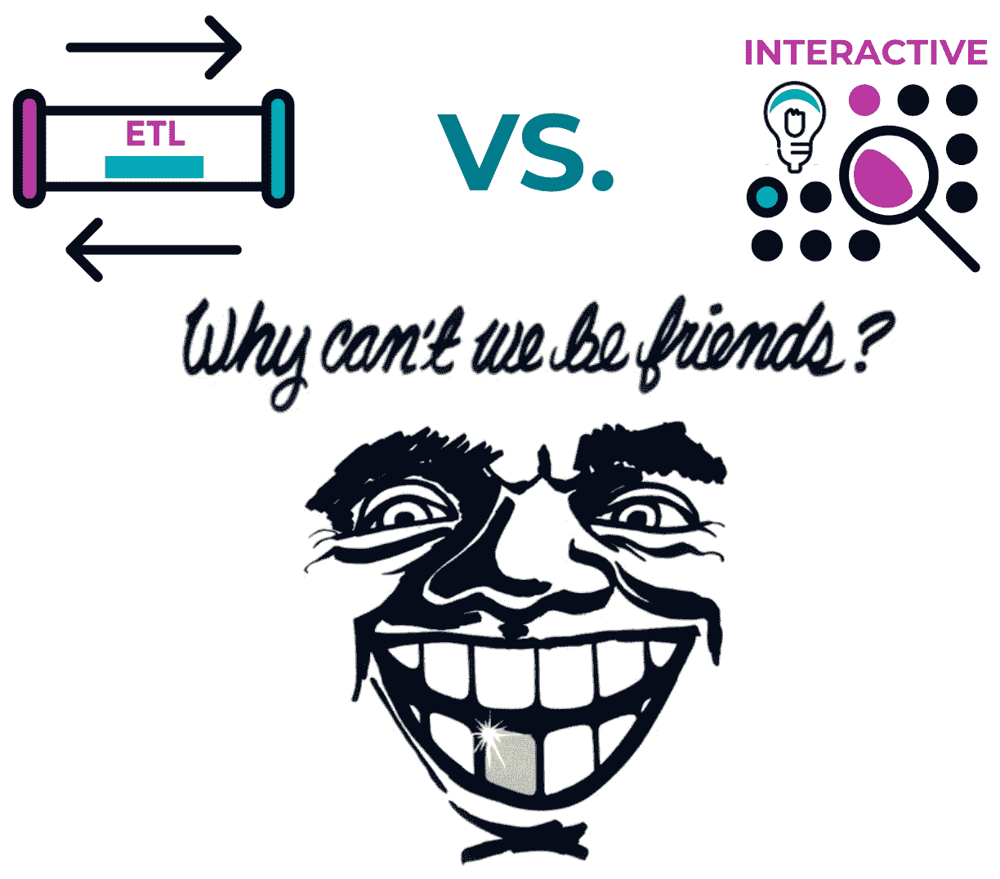

# ETL 与交互式查询:两者都适用

> 原文：<https://medium.com/geekculture/etl-vs-interactive-queries-the-case-for-both-9966e5c14073?source=collection_archive---------10----------------------->

*原帖:*[https://blog . starbust . io/ETL-vs-interactive-queries-the-case-for-both](https://blog.starburst.io/etl-vs-interactive-queries-the-case-for-both?hs_preview=eVJmbaXw-72642196519)

*这是关于 Trino 如何支持交互式和批处理用例的 2 部分博客的第 1 部分。在第 1 部分中，我们将探索为什么一个组织既需要交互能力又需要批处理能力，以及为什么 Starburst 是在同一个平台上运行这两种能力的最简单的方法。在第 2 部分中，我们将详细讲解如何使用 Trino 和 Starburst Galaxy 设置批处理作业。*

TL/DR —数据工程师是巫师。当回答可以用其他方式解决的业务问题时，创建 ETL 管道是一个漫长的、有时是不必要的过程。交互式(或即席)查询非常棒，尤其是对于特定的自助见解。正如美国放克乐队 War 指出的那样，与其在这两者之间争来争去，不如说:“为什么我们不能成为朋友？”

麦格教授是霍格沃茨魔法学校的变形课老师，她教学生们改变物体形状或外观的魔法。虽然我从未收到霍格沃茨的正式信函，但我真心拒绝任何数据争论的做法都不符合纯魔法的概念，不，变形术本身就是。将数据的形式或外观转换成有意义的商业启示答案的能力也许是将数据工程麻瓜与男女巫师区分开来的一种技能。

传统上，ETL(提取、转换、加载)被认为是在典型的数据仓库架构中实现任何类型的数据转换逻辑的蓝图，但随着现代数据堆栈的发展和新技术的开发，它正在成为一种被过度利用的策略。交互式或特别的查询引擎最近被证明有价值贡献 ETL 不能提供的快速洞察力。然而，彻底检查一个数据技术栈来代替另一个并不一定有意义，因为 ETL 可以提供交互式查询所不能提供的价值，反之亦然。在一个如此绝对的世界里，为什么不通过在同一个平台上采用两者来包容这些差异呢？ ***为什么【ETL 和交互查询引擎】不能做朋友？***

*什么是 ETL？*

ETL 是一个三阶段的数据集成过程，从多个来源提取数据，将数据转换为一致且有意义的信息，然后将信息加载到预期的目标中。由于工具和数据工程实践的既定生态系统，ETL 管道经常被用来提供一种自动和可靠的方式，将数据从不同的位置移动到理论上的单一真实来源，通常是数据仓库。随着基于云的数据环境的出现，ELT(提取、加载、转换)的类似实践也越来越受欢迎，它首先将原始数据移动到一个对象存储中，比如一个数据湖，然后支持进一步的下游转换，最终产生所需的输出。

*ETL 管道创建生命周期*

ETL 管道的英雄起源故事— *或恶棍起源故事，取决于特定的请求* —通常从数据科学家、数据分析师或任何其他数据消费者的询问开始。消费者向数据工程团队提交一个请求，数据工程团队将这个请求提交到 backlog，在那里，它的命运取决于它是否在下周、下个月或者永远不会被处理(死于 backlog)。让我们假设我们有一个工作不足的数据工程团队(哈！)和一个出色的产品负责人来处理待办事项，这样工作可以在 2-3 天内开始。仍然假设我们的数据仓库架构在运行，那么数据工程师必须与 DBA 讨价还价，才能在开发和生产环境中创建新的目标表。

对于那些在家玩的人来说，到目前为止有两个请求和两个积压的两个 SLA。有时，数据工程师可以在创建表时开始开发工作；但是，在许多情况下，这种策略会产生不必要的重复工作，应该避免。最后，构建一个 ETL 管道，将数据从源移动到目标，完成自动化测试和数据验证，并在几周甚至几个月后完成最初的业务需求。整个过程可能会在一两周之后重新开始，数据消费者意识到交付的业务洞察力实际上不是他们最初想要回答的问题，即使他们发誓这是在多次会议中。

*互动查询引擎介入*

作为 ETL 方法的替代方法，数据消费者可以通过交互式查询引擎(如 Starburst Galaxy，这是一种基于 Trino 的云原生服务)自助获得这些业务问题的一些答案。数据消费者可以编写一个 SQL 查询，一次直接从多个来源获取数据，而不是等待数据完全转换后到达目标。交互式查询引擎的最佳特性正是您所认为的交互性。假设创建了一个查询，发现了结果，结果是消费者想要添加更多信息以使业务洞察力更具描述性。这仅仅意味着交互式查询中的编辑将在几分钟内获得最新更新的结果，如果对 insight 的依赖严格来自 ETL 管道，这将需要数周时间，这是一个显著的差异。Trino 专为速度而生，并针对海量数据进行了[优化性能](https://trino.io/docs/current/optimizer/cost-based-optimizations.html)。基于 ANSI SQL，Trino 可以很快被采用来利用连接器的健壮生态系统。

*何时使用 ETL vs 交互式查询引擎*

对于每种数据操作技术何时是正确的选择，没有明确的指导方针。最好的建议是学会权衡，理解数据，并且*知道什么时候持有，什么时候放弃。*

**速度**:

*洞察时间*，定义了从源数据中获得可操作的洞察所需的时间，根据所选的数据处理方法可能会有很大差异。我已经哀叹过我个人对数据管道周转所需的延长的数周或数月的痛苦疑虑。这与交互式查询引擎可以开始提供价值的几分钟到几小时的更快洞察时间范围有很大不同。如果 ETL 管道需要改变，这个过程仍然需要大量的资源，因为管道中的每个集成应用程序都需要测试。交互式查询的 SQL 查询更改可以用少得多的时间和精力来实现。

鉴于交互式查询引擎从多个不同来源获取结果的特性，查询响应时间也是一个需要考虑的因素。如果* 数据仓库得到正确优化，则 interactive analytics 的查询运行的最终完成时间可能会比为聚合* **构建的数据仓库稍长。然而，这种假设严重依赖于 *if* 语句，因为未有效优化的数据仓库会产生自身的大量查询响应时间问题，相比之下可能会更慢，因为 Trino 已经实施了许多基于成本的优化，特别是利用下推模型并将处理工作卸载到存储系统。**

**自动化与探索:**

ETL 依赖于按顺序运行的作业，并且有许多批处理编排工具(例如 Airflow 和 Dagster)提供工作流集成来创建完全自动化的流程。除了自动化特性之外，这些作业还可以通过 workflow manager 进行调度，并被视为在定义的批处理窗口内移动数据的可靠选项。交互式查询本质上是交互式的，对于对不熟悉的数据集或问题进行探索性分析是非常宝贵的，这意味着它们需要手动键盘操作。然而，Trino 和 Starburst 确实允许用户使用上面提到的工具轻松地安排这些查询，这允许用户以最小的努力在交互式和批处理之间转换。

**成本:**

支持本地或基于云的数据仓库所需的基础设施需要一大笔费用。当公司用一次性使用的表填满他们的数据仓库时，数据通常会被遗忘，但附带的已用存储却不会。养成这种习惯几年后，就需要更多的储物空间，并且会产生更多不必要的成本。

与此同时，Trino 基于存储和计算分离的概念，参与自动扩展集群，并整合了许多基于成本的优化来降低费用。将交互式查询引擎用于特定的自助服务任务可以防止数据仓库不必要地存储未使用的数据。

另一个大的成本因素是开发人员的效率和灵活性。ETL 管道的开发需要集成多种技术来创建一个工作流，而交互式查询引擎利用 ANSI SQL，这是许多数据消费者已经熟悉的。通过添加一个`WITH`子句来使您的 join 语句变得更有效要容易得多，这与调试由基础设施问题引起的损坏的管道作业相反。

**可信度:**

从历史上看，批处理和交互式查询分析之间最大的权衡是速度与查询故障恢复的较量。Trino 的开发速度很快，因此最初的决定是有意排除容错，以降低潜在的延迟，从而创建一个全有或全无的架构。然而，任何 Trino 子任务的失败都会导致整个查询失败，这使得长时间运行的查询在没有适当知识的情况下很难进行大规模管理。虽然 ETL 管道也面临自己的一系列故障，但风险通常很低，因为这种数据操作方法被构造为在三个不同的阶段之间分担负载，并且作业通常在重新运行时完成。ETL 管道通常还内置数据质量检查，而交互式查询引擎不具备这种能力。尽管有这些折衷，基于 Trino 的交互式查询是有弹性的，并且假设集群配置正确，它的总体失败率非常低。

另一方面，一些孤立的数据组织在 ETL 管道之上构建 ETL 管道，作为一种有意的捷径，这导致了较慢的 SLA 和可怕的调试挑战(ETL 异常)。如果提取作业提取零条记录，通常只有在管道在最终数据质量步骤中失败后才能发现。然而，团队可能有也可能没有访问源的源，故障排除很快就变成了一场噩梦。通过交互式查询引擎集成，每个团队都可以从数据源中提取他们需要的数据，并轻松地执行数据操作，以根据自己的需要使用这些数据。

*介绍查询失败恢复*

在一个如此习惯于选择这个或那个的权衡困境的世界，以至于一个[抖音趋势](https://knowyourmeme.com/memes/this-or-that-challenge)开始利用这个概念，每个决定似乎必然是不可逆转的。但就像里斯花生酱杯子的创造者(大概)想的那样，为什么不能两全其美呢？

[Project Tardigrade](https://trino.io/blog/2022/05/05/tardigrade-launch.html) 是 Trino 的一个专门项目，旨在增加可选性，并停止对需要完全不同系统的多个用例进行归档。虽然每个场景的需求会有所不同，但是在任务和查询级别增加查询失败恢复为 Trino 和 ETL 的集成提供了更多的可能性。理想情况下，查询失败恢复的实现将增加 ETL 管道的可预测性，降低成本，并帮助添加一些防护栏，以避免以前与 Trino 和 ETL 协作相关的传统陷阱。现在，数据分析师可以使用交互式查询引擎运行探索性分析查询，以确定新的有意义的见解，并且使这一过程可重复且可靠地用于日常仪表板的步骤大大减少了。

如果你有兴趣亲自看看，并且有几分钟的空闲时间，我邀请你尝试一下[星爆星系](https://www.starburst.io/platform/starburst-galaxy/)来玩一下交互式和批处理集群。看看我下面的视频，它演示了如何在集群之间交替导航。做一些查询，改变一些数据，拍拍自己的背，因为你比其他麻瓜更接近魔法世界一步。

请继续关注本博客的第 2 部分，我们将一起浏览一些使用 Trino 和 Starburst Galaxy 设置和运行交互式和批处理查询的实例。