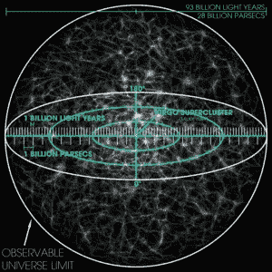
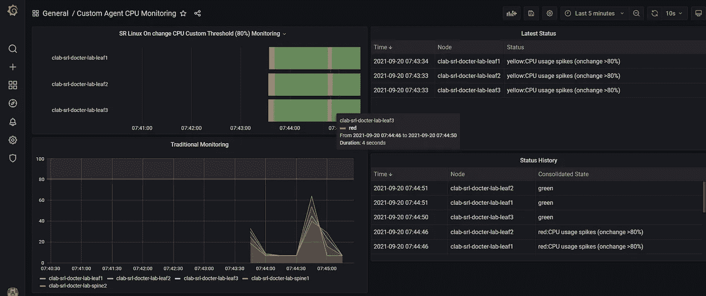
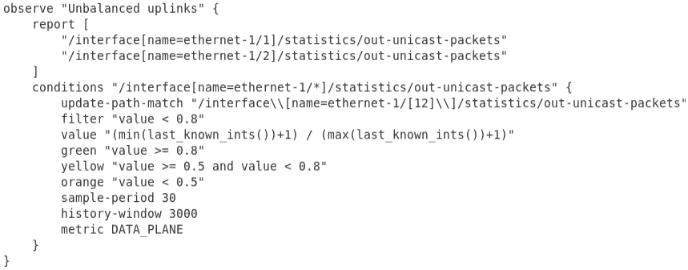
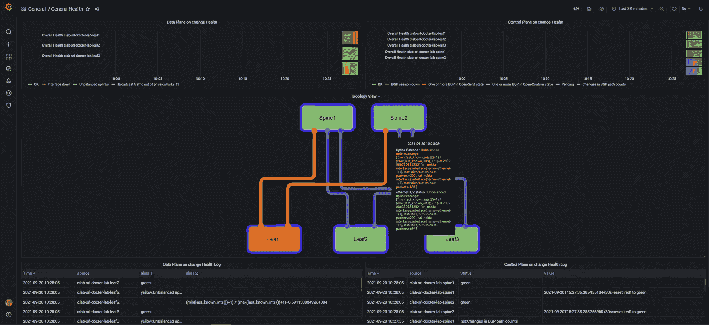

# 扩大可观测的宇宙🌌(或使用 SR Linux 定制代理和 gNMI 的可扩展模型驱动遥测技术)

> 原文：<https://medium.com/geekculture/expanding-the-observable-universe-or-scalable-model-driven-telemetry-with-sr-linux-custom-agents-b31363abcc37?source=collection_archive---------14----------------------->

The Observable Universe [source: [Wikipedia](https://en.wikipedia.org/wiki/Observable_universe)]

与宇宙相比，数据中心是一个相对较小且组织有序的地方。这些由人类工程师设计的人工数字系统具有相对较小的状态集，以及同样较小的编排行为集，这些行为是完全可预测和可再现的。至少在理论上是这样。

实际上，事情并不那么简单。当然，有简单的网络管理协议——SNMP，从 [RFC1098(1989](https://datatracker.ietf.org/doc/html/rfc1098) )到 [RFC3414](https://datatracker.ietf.org/doc/html/rfc3414) (2002)中定义的 v3；它通过其标准化的 MIB 提供了一个模型驱动的遥测框架(可以说是“avant la lettre”)，管理对象以树形结构组织。可以使用 UDP 发送通知事件(称为“陷阱”)，混合使用通用和供应商特定的 oid(例如像这个[tmnxdyingasp](http://www.circitor.fr/Mibs/Html/T/TIMETRA-SAS-SYSTEM-MIB.php#tmnxDyingGasp)陷阱)。尽管该协议正在老化，并且有许多已知的问题和缺点(例如缺乏安全性/加密、有限的过滤和数据检索选项、使用不可靠的传输以及版本之间不一致的编码)，但它仍然普遍用于今天的网络监控。

# 流式遥测术

最近，互联网社区引入了一些新概念，如“[流式遥测](https://www.networkworld.com/article/3575837/streaming-telemetry-gains-interest-as-snmp-reliance-fades.html)”和“ [OpenConfig](https://www.openconfig.net/) 及其[NETCONF](https://datatracker.ietf.org/doc/html/rfc6241)(2011)/[RESTCONF](https://datatracker.ietf.org/doc/html/rfc8040)(2017)协议，以管理 [YANG](https://datatracker.ietf.org/doc/html/rfc7950) (2016)数据模型。与此同时，谷歌开源了 gRPC(2015)和 gRPC 网络管理接口(gNMI)，作为 NETCONF 的替代方案。各大网络厂商大约在 5 年前，也就是 2016 年左右开始在网络设备中支持这些概念和协议([诺基亚 SROS 16.0R1](https://srexperts2019.conferenceworks.com.au/presentations/deep-dive-on-sros-model-driven-cli-md-cli/) ，Juniper [JunOS 16.1R3](https://www.juniper.net/documentation/us/en/software/junos/interfaces-telemetry/topics/concept/open-config-grpc-junos-telemetry-interface-understanding.html) ，思科 [IOS XR 6.0.0](https://blogs.cisco.com/getyourbuildon/model-driven-programmability) ，Arista [EOS 4.20.1F](https://eos.arista.com/openconfig-the-emerging-industry-standard-api-for-network-elements/) )。

总体而言，与“传统的”基于 SNMP 的监控相比，流式遥测技术具有以下优势:

*   更高效的收集(对设备 CPU 的影响更小)
*   更高粒度/质量的数据
*   更加准确和实时(主动“推送”相对于被动“拉取”，收集的数据包括时间戳)
*   更安全(更好的认证、加密)

这些好处都与拥有更新的协议、管理架构和硬件支持相关联，并且所有供应商都凭借已经实现的 gNMI 协议支持和 YANG 模型很快声称它们是有益的。然而，并不是所有的实现都是相同的，差异就在细节中。

# 定期采样与“变化中”事件

gNMI 支持[两种类型的流检索方法](https://github.com/openconfig/reference/blob/master/rpc/gnmi/gnmi-specification.md#35152-stream-subscriptions) : SAMPLE 和 ON_CHANGE。前者定期发送更新，时间间隔以纳秒(ns)为单位，尽管今天的典型使用场景是以秒为单位的。SAMPLE 是 SNMP 轮询的直接替代。ON_CHANGE 仅在发生变化时发送更新，从而实现对警报情况的事件驱动响应。这更类似于 SNMP 陷阱，但功能更强大——如果实施得当。问题是:什么构成了“惊人的”变化，人们如何有效地确定这一点？

Traditional monitoring can miss events reported by conditional on-change events

# 使用代理自定义有条件的“更改时”警报

阈值交叉警报(TCAs)是系统监控中一个众所周知的概念。一些变量(例如，那些与资源使用相关的变量，如 CPU/磁盘利用率、内存、缓冲区)经常变化，但大多数变化在达到一定限度之前都是无关紧要的。系统供应商可以很容易地整合功能，以[发送 SNMP 陷阱](https://docs.oracle.com/en/industries/communications/session-border-controller/8.3.0/adminsecurity/threshold-crossing-alert-configuration.html)或 gNMI 事件来通知这些事件，甚至让用户可以配置它们。

为了说明这是不够的，考虑一下我们在渥太华的诺基亚实验室曾经面临的情况。管理网络使用一对运行 [VRRP](https://en.wikipedia.org/wiki/Virtual_Router_Redundancy_Protocol) 的冗余交换机，但是网关经常会停止响应，我们会失去连接。经过调查，发现一个不相关的端口上的大量多播流量可能会使 CPU 不堪重负，而 CPU 正是为我们处理 VRRP 的。

在对这种情况进行故障排除时，仅仅每 X 秒发送一次 CPU 利用率样本并在它们超过阈值时做出响应是不够的。即使 gNMI ON_CHANGE 受支持(有些供应商不支持)，当中央监控系统收到事件并决定获取其他系统组件的统计数据时，很可能事情已经发生了变化，您不再看到这个问题。没有可观察性。

为了解决这种差距，现代监控架构受益于(如果不是“需要”)在每个节点上运行定制逻辑/软件的能力。这些软件“代理”可以:

*   实现复杂的定制逻辑，聚合一组任意条件(“在 CPU 利用率发生变化时报告，但只报告超过 80%的变化；包括在时刻”*对多播业务队列的统计。*
*   及时响应当地情况，比任何中央系统都要快
*   由任何人独立实现，而不仅仅是作为供应商发布周期的一部分
*   随着部署而扩展(更多节点=更多代理处理能力)

排除现代软件定义网络的故障需要灵活和先进的分布式监控技术，因为故障条件本质上是异常的，并且是不可预测的。需要可编程的、定制的逻辑，其可以在任意条件下被触发，并且收集任何必要的数据来验证关于可能发生的事情的任何可能的假设。

# 定制代理:面向数据中心的边缘计算

类似于[多接入边缘计算](https://en.wikipedia.org/wiki/Multi-access_edge_computing) (MEC)背后的理念，由网络节点上的定制软件实现的本地处理减少了一些事件发生的时刻和管理应用程序意识到它的时刻之间的延迟。这增加了可能的应用范围、可以收集的数据量，以及在发生时检索的状态信息的详细程度和及时性。

例如，在故障排除场景中，这可以在观察到某个问题和得出关于可能的相关性和缓解的结论之间产生差异，或者看不到它。请注意，这并没有消除集中监控的需要——远远没有。实质上，本地代理增强了中央监控系统的能力，并向其提供更详细、更准确、更有针对性和更及时的信息。

# 原型:SRL 博士代理

GitHub 上的这个 [SRL Docter 代理项目](https://github.com/jbemmel/srl-docter-agent)提供了一个示例实现来帮助您开始。它说明了以下使用案例:

*   对汇总数据/控制平面健康状况的通用 ON_CHANGE 监控，由可配置的起作用的元素组成

Monitoring changes in BGP paths as part of CONTROL_PLANE health

*   根据可编程条件及时报告任意系统状态
    (上图所示的 CPU 阈值交叉示例)

Per-application CPU usage reporting upon threshold crossing

*   更长时间内的可扩展本地样本监控，为中央 ON_CHANGE 控制面板提供信息

Reporting unbalanced uplink usage as ON_CHANGE events for DATA_PLANE health

Visualizing custom health issues reported by agents

*   不支持 ON_CHANGE 的监控状态

The BGP RIB subtree does not support ON_CHANGE events, and can only be sampled. Here a given application prefix (8.8.8.8/32) is monitored for availability, using 10 second intervals over a 100 second history period

# 用 SR Linux 扩展您的邻居的可能性

“[邻近可能的](https://www.edge.org/conversation/stuart_a_kauffman-the-adjacent-possible)”(作者 [Stuart Kauffman](https://en.wikipedia.org/wiki/Stuart_Kauffman) )阐明了系统和有机体如何自然进化到一组下一个可能的配置。通过这样做，他们增加了接下来可能发生的事情的多样性——如果你是一名负责设计或运营现代网络的建筑师或网络工程师，可以考虑[诺基亚 SR Linux](https://www.nokia.com/networks/products/service-router-linux-NOS/)——其内置对模型驱动的定制代理的支持，因此你可以知道你的关键网络正在发生什么。神盾局。