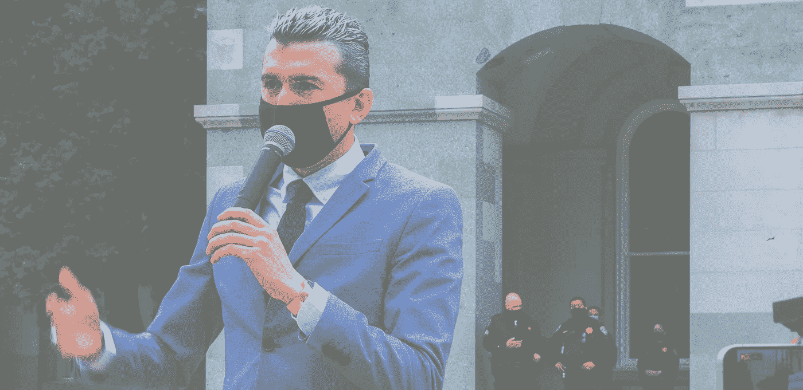

# “专家”和黑盒

> 原文：<https://medium.com/geekculture/experts-and-the-black-box-819b11528647?source=collection_archive---------7----------------------->

## 如果我们的领导将一个复杂系统的责任委托给别人，当他们的专家没有我们想象的那么优秀时会发生什么？

我想谈谈近二十年来我在软件行业看到的一个令人不安的模式。我已经多次注意到这种模式，但由于某种原因，这个想法从未清晰地实现，并从我的行业经验中“跨越”到现实生活中——直到最近。最近，我在任何地方、任何时候都看到这种模式；这让我害怕。

这种模式是领导将复杂系统(即某种黑盒)的责任委托给“专家”——但领导没有足够的(或没有)经验来审计绩效或从一开始就选择正确的“专家”。

当我暗示缺乏经验时，我并不是指缺乏领导能力或作为一种艺术形式的灵感，而是缺乏对他们固有的复杂任务的经验。我们有许多在实际工作中缺乏经验的领导者——他们似乎正走在一条通过授权而远离真正知识的道路上。

更直白地说，领导力需要领导一个复杂系统所带来的所有忠诚、信任、生产力、赞扬、尊重、投资、支出和权力，但是…

*   他们不想看香肠是怎么做的
*   他们说“这超出了我的理解范围，但是我相信团队做得很好”
*   说或暗示“相信专家”之类的话

实际上，我们有盲目的(但精神饱满的)演说家和“战略家”驾驶着巨轮穿越风险直道——脑子里只有目的地。

我们如何到达那里？ *谁在乎。*

**如果出了问题会怎么样？NMB:不关我的事(也…不关你的事)**

那么，谁是幕后操纵者？ *“专家”*

**但是谁授权给“专家”呢？** *非专家的‘专家’，咄！*

# 缺乏经验就是风险

因此，我们有非技术领导，但拒绝对我们的复杂系统真正负责。我们为什么要关心？

我通常专注于软件，但是我们每天都被复杂的系统所包围。这些复杂系统存在于金融市场、政府健康和货币政策框架、国际贸易和军事系统等领域。软件是典型的动态项目——但是它是所有其他有机动态项目的近亲。

我们的领导者管理我们的动态软件项目的能力对软件行业的生活质量有影响(即潜在的倦怠、压力、焦虑、破产、未来机会成本)。

我们的领导人管理我们更大的动态社会项目的能力具有生死攸关的后果(贫困、饥荒、战争行为、自由和个人自主权的丧失、社会和文化腐败)。

非技术领导者缺乏以下能力:

*   审计人员(即无法雇用优秀的人员，解雇假冒的人员)
*   审计复杂系统，即审计黑箱
*   随着时间的推移计算风险
*   约束批量大小
*   确定总拥有成本
*   将经验和科学真理置于叙事、意识形态和幻想之上

由非技术领导部署的“专家”运行的项目通常是一个愿望和一个祈祷，一条信仰。我们看到领导层如此自信和坚忍——然而他们目前的项目与斗鸡眼赌马有什么不同呢？

在一群“专家”的簇拥下，这位雕像般的管理顾问对光学行业来说很棒，但经验告诉我们，我们需要对领导者提出更多要求，并重新思考我们如何处理动态项目。我们需要对我们的领导更加诚实(有时包括自我)。

# “思考”课

> 只要想一想，就会实现。

在动态软件项目中，我们经常看到“思想者”和“实干家”之间的巨大鸿沟思想者谈论模糊的策略和严格的期限，而实干家苦苦思索，祈祷源自高处的基本假设是正确的。

领导力与实际任务能力和现实世界经验的距离越大，灾难的风险就越大。

作为委托人的体验与真实世界的体验是不同的。在我的职业生涯中，我从未见过随着时间的推移，更长时间的授权让一名领导者在技术上更有能力、更有效率。

在软件行业的例子中，领导力通常由以下三个方面来代表。这些概况似乎也被许多其他行业所共享。

*   所有级别的单一任务所有者
*   初创公司的非技术型创始人
*   大型企业领导人

## 单一任务所有者

懒惰的、非技术性的随机任务所有者是我见过的最糟糕的软件行业腐败的例子之一。有些人是终极授权者——他们能找到方法去授权他们应该负责的最重要的任务。

这种人似乎拒绝学习任何东西，除非这是一条艰难的道路。这个人会回复一封邮件，有 9 个人会问“但是什么是 CDN？”而不是谷歌一下。这个人会完全忽略你的解释邮件，在邮件中你急切地希望他们能多花一点时间来了解对他们日常工作至关重要的任务的更多细节或知识。非技术性的随机任务所有者不会花任何时间自己学习——他们绝对不会上我的课 [Web Fundamentals 101](https://www.webfun101.com) ,即使我免费提供给他们。

这些人很烂，应该被驱逐出文明的队伍。

## **非技术型创始人**

对于非技术型的创始人，我们从哪里开始呢？

创始人不需要什么都知道，但他们必须在与生产核心产品组件明确相关的某些方面达到精通/卓越/最高能力。如果没有，至少，这将是一个多么无聊的公司！

热情、活泼、自信、善于交际、有动力——尽管是一种奇妙的组合——是不够的。

筹资——尽管不可思议、困难重重且必不可少——并不是与生产核心产品相关的技术技能。

这并不是说没有成功的非技术型创业者。它们当然存在。然而，在竞争激烈的市场中，由非技术型创始人运营的绝大多数项目，在面临市场条件、销售、技术约束或需求产生的逆境时，都会融化地面上的冒烟洞。

“抽送”只是生活中混蛋的一个好策略。这不是一个可持续的战略，旨在建立一种社区卓越和贸易精通的文化。

我们无权获得成功，它必须通过努力获得。“一夜成名需要 10 年时间”这句话似乎是真的，无论从哪方面来看都是如此。10 年或 10，000 小时才能掌握。这似乎是事物本质的一些硬性规定。

## **大型企业领导**

大公司领导是大公司的非技术团队主管和董事。这些人有董事、主管、副总裁、总裁等头衔。

我对大公司的领导人有些同情。正如一句名言所说，“有能力的人就去做。不能者，教之。”我不知道企业界的情况是怎样的，但企业通常会吸引那些能够在缓慢、烦人、无趣的官僚机构中有效(和精神上)运作的人。给每个人他们自己的，对他们好的，祝福和最美好的祝愿等等。

尽管我对这家大公司的领导很同情，但控制台上有一个巨大的红灯在闪烁——我们汽车的仪表盘上的“虚拟”灯亮了。我们正被卷进公海，没有路线，没有救生圈，没有无线电，没有信标，没有昏暗——我们的船长并不是真正的船长，但他们昨晚确实方便地“住在快捷假日酒店”……

**我们的大公司正变得与政府诡异地交织在一起，这是一种历史上令人担忧的感觉。从历史上令人担忧的角度来看，这种交织正在加剧地方、州和全球风险。**

** *我为下面的脏话道歉。我真的在努力，变得更好。很抱歉，在这篇文章发表的时候，我不知道更真实的方式来表达我自己。***

在美国，我们有两个政党中的超级笨蛋，他们由独一无二的自私笨蛋组成，由他们的笨蛋同伴赞助和资助当选的职位——他们中的大多数人除了从家族信托基金中获得分配之外，没有任何技术经验。这些被选举出来的自私自利的笨蛋代表给自私自利的公司，到处都是授权大师。

我们在软件、医疗保健、制药、公共政策、军事战略、电信、媒体等领域看到了历史上古怪和不道德的疏忽行为。

美国不是独一无二的，这是一个全球性的模式，正在创造历史规模、影响、道德和人类后果的风险概况。这种非技术授权者的更新文化正在编织全球风险之网，可怕到难以启齿。

曾经有一段时间，看着工艺大师——他粗糙的手指和睿智的额头，她精确的技术——一万次尝试和神圣的耐心——告诉我们如何相信对大师的追求在个人和文化意义上是神圣的。我们需要尽快重新构思这个故事。我们的远程办公室依赖于它，我们的真实办公室依赖于它，但更重要的是，世界依赖于它。

废话说够了。如果你听到又一个不负责任的笨蛋告诉你要听从他们自封的“专家”，告诉他们踢石头。

*在*[*【WilliamBelk.com】*](https://www.williambelk.com/)*找我。关注我* [*推特*](https://twitter.com/wbelk) *。*