# 使用卷积神经网络的可解释缺陷检测:案例研究

> 原文：<https://medium.com/geekculture/explainable-defect-detection-using-convolutional-neural-networks-case-study-2b58bc17c8b1?source=collection_archive---------1----------------------->

## 没有任何包围盒标签的训练对象检测模型。这篇文章展示了可解释人工智能的力量。

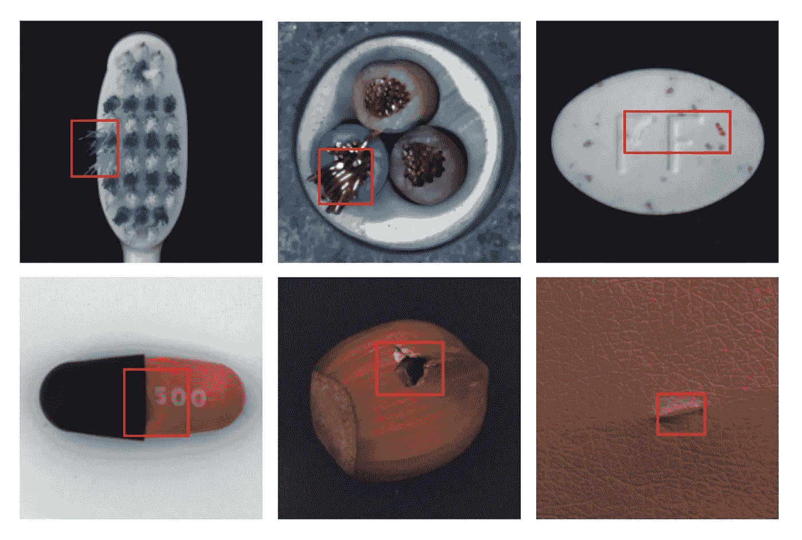

Image by Author

尽管神经网络非常精确，但在需要预测解释能力的领域，如医学、银行、教育等，它并没有得到广泛应用。

在本教程中，我将向您展示如何克服卷积神经网络的这种可解释性限制。的确如此——通过探索、检查、处理和可视化由深度神经网络层产生的特征图。我们将详细介绍这种方法，并讨论如何将它应用到现实世界的任务中——缺陷检测。

我为这个项目创建了一个 [Github 库](https://github.com/OlgaChernytska/Visual-Inspection)，在这里你可以找到所有的数据准备、模型、训练和评估脚本。

**内容** —任务
—训练管道
—推理管道
—评估
—结论

# 工作

给你一个 400 个图像的数据集，其中包含好的项目(标记为“好”类)和有缺陷的项目(标记为“异常”类)的图像。数据集不平衡，好的图像样本比有缺陷的图像样本多。图片中的物品可以是任何类型和复杂程度的——瓶子、电缆、药丸、瓷砖、皮革、拉链等。下面是数据集的一个示例。

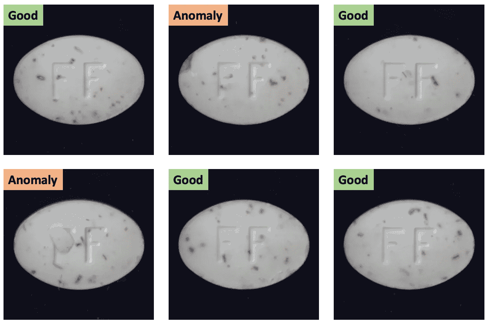

Image 1\. Subset “Pill” from [MVTEC Anomaly Detection Dataset](https://www.mvtec.com/company/research/datasets/mvtec-ad). Image by Author

你的任务是建立一个模型，将图像分类为“良好”/“异常”类，如果图像被分类为“异常”，则返回缺陷的边界框。尽管这个任务看起来很简单，就像一个典型的对象检测任务，但有一个问题——我们没有边界框的标签。

幸运的是，这个任务是可以解决的。

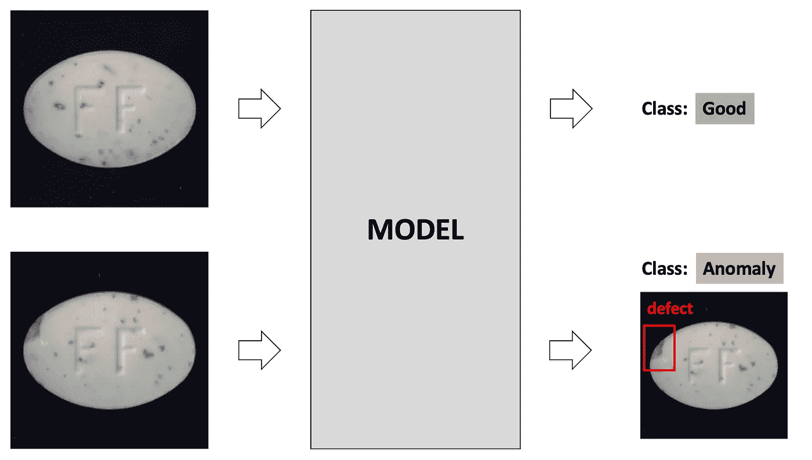

Image 2\. Model is expected to predict class ‘Good’ / ‘Anomaly’ and localize a defect region for an ‘Anomaly’ class. No bounding boxes are provided during training, only class labels. Image by Author

# 培训渠道

*披露:我不是在分享我的真实商业项目，而是展示如何解释分类模型预测，因此这可能会用于许多领域和任务——不仅是制造业，还有医学。我还应该说，在这里不要期望高精度，因为这是我最喜欢的项目。但是你可以自由地使用我的结果作为你的项目的起点，投入更多的时间并达到你需要的精确度:)*

## 数据准备

对于我的所有实验，我都使用了 [MVTEC 异常检测数据集](https://www.mvtec.com/company/research/datasets/mvtec-ad)(注意，它是在[知识共享署名-非商业-共享 4.0 国际](https://creativecommons.org/licenses/by-nc-sa/4.0/)许可下分发的，这意味着它不能用于商业目的)。

该数据集包括不同项目类型的 15 个子集，如瓶子、电缆、药丸、皮革、瓷砖等；每个子集总共有 300-400 幅图像，每幅图像都被标记为“良好”/“异常”。

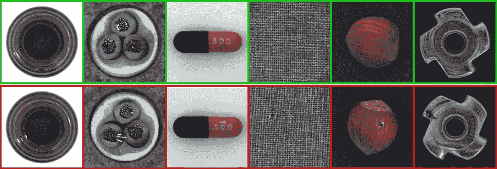

Image 3\. Samples from [MVTEC Anomaly Detection Dataset](https://www.mvtec.com/company/research/datasets/mvtec-ad):
upper row — good images, lower row — images with the defective items. [Image Source](https://www.mvtec.com/company/research/datasets/mvtec-ad)

作为数据预处理步骤，**将图像调整为 224×224 像素，以加快训练速度。**大多数子集中的图像尺寸为 1024×1024，但由于缺陷尺寸也很大，我们可以在不牺牲模型精度的情况下将图像尺寸调整为较低的分辨率。

**考虑使用数据增强。**一般来说，适当的数据扩充总是有益于你的模型(顺便说一句，查看[我关于数据扩充的帖子](https://towardsdatascience.com/complete-guide-to-data-augmentation-for-computer-vision-1abe4063ad07)了解更多)。

但是让我们假设，当部署到生产中时，我们的模型将“看到”与我们现在拥有的数据集中格式完全相同的数据。因此，如果图像被居中、缩放和旋转(如在胶囊和电缆子集中)，我们可能根本不使用任何数据增强，因为测试图像也被期望居中、缩放和旋转。但是，如果不旋转(而只是居中和缩放)mages，如在螺钉和金属螺母子集中，将旋转作为预处理步骤添加到训练管道将有助于模型更好地学习。

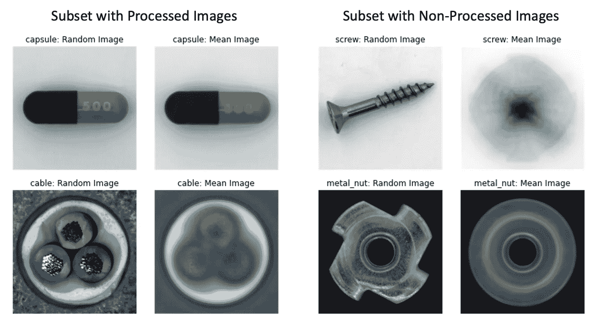

Image 4\. Examples of subsets with preprocessed (centered, scaled, and rotated) and not preprocessed (not rotated) images. Visualizing the mean image helps understand whether images in the subset are preprocessed or not. Image by Author

**将数据分成训练/测试部分**。理想情况下，我们希望拥有训练、验证和测试部分——分别用于训练模型、调整超参数和评估模型准确性。但是我们只有 300–400 张图像，所以让我们将 80%的图像放入训练集，20%放入测试集。对于小数据集，我们可以执行 5 重交叉验证，以确保评估结果是稳健的。

当处理不平衡数据集时，训练/测试分割应该以分层的方式执行，因此训练和测试部分将包含两个类别的相同份额——“良好”/“异常”。此外，如果您有缺陷类型的信息(如划痕、裂纹等)，最好也根据缺陷类型进行分层分割，这样训练和测试零件将包含相同份额的有划痕/裂纹的项目。

## 模型

我们就拿 ImageNet 上预训练的 [VGG16](https://arxiv.org/abs/1409.1556) 来说，改变它的分类头——用全局平均池和单个密集层代替扁平化和密集层。我将在“推理管道”一节中解释为什么我们需要这些特定的层。

(这种方法我已经在论文[中找到了，学习深度特征进行鉴别定位](https://arxiv.org/abs/1512.04150)。在这篇文章中，我将介绍文中描述的所有重要步骤。)

我们将该模型训练为典型的 2 类分类模型。该模型输出一个二维向量，其中包含分类“好”和“异常”的概率(对于一维输出，该方法也应该可行，请随意尝试)。

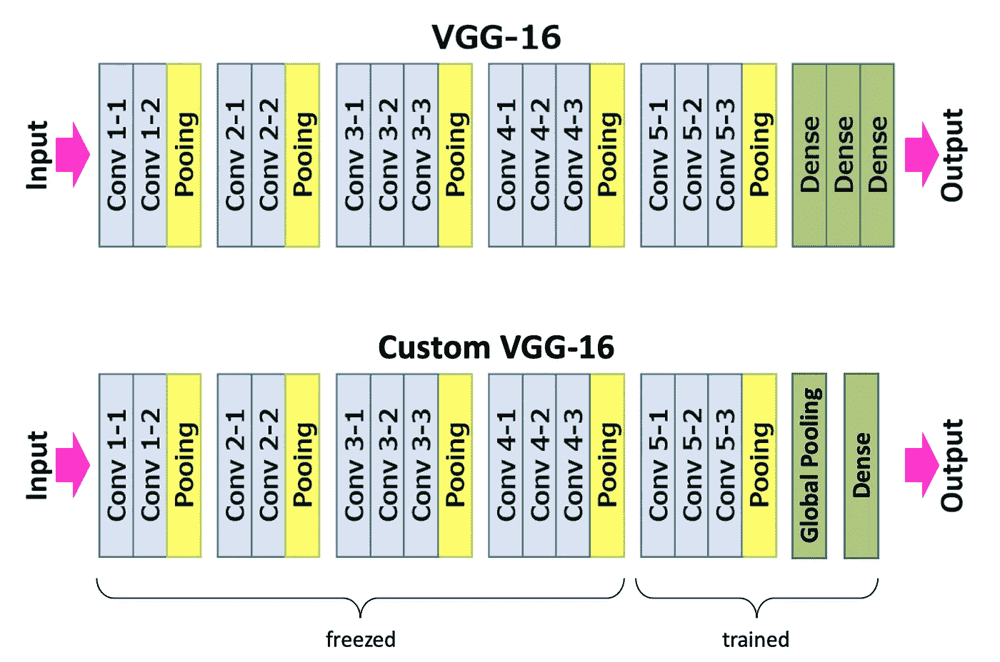

Image 5\. Original VGG-16 architecture VS custom one. Image by Author

在训练期间，前 10 个卷积层被冻结，我们只训练分类头和后 3 个卷积层。这是因为我们的数据集太小，无法微调整个模型。损失是交叉熵；优化器是 Adam，学习率为 0.0001。

我试验了不同的 MVTEC 异常检测数据集子集。我用 batch_size=10 对模型进行了最多 10 个时期的训练，并在训练集准确率达到 98%时提前停止。为了处理不平衡数据集，我们可以应用损失加权:对“异常”类图像使用较高的权重，对“良好”类图像使用较低的权重。

# 推理管道

在推断过程中，我们不仅要将图像分类为“好的”/“异常的”类别，而且要在图像被分类为“异常”的情况下获得缺陷的边界框。

由于这个原因，我们使模型处于推理模式，以输出类别概率以及热图，这些稍后将被处理到边界框中。热图是根据深层要素图创建的。

**第一步。【ReLU 激活后，从 con V5–3 层获取所有特征地图。对于单个输入，将有 512 个大小为 14×14 的特征地图(大小为 224×224 的输入图像通过 4 个池层每次缩减采样两次)。**

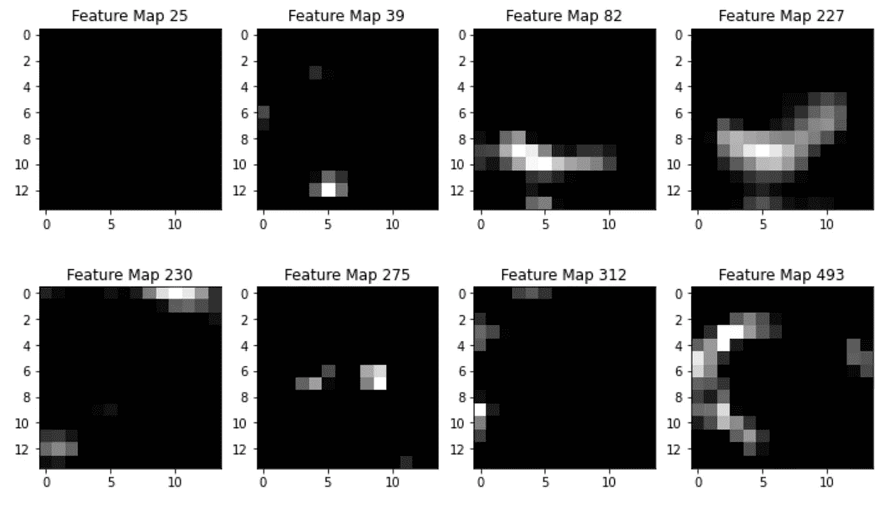

Image 6\. Feature Maps from Layer Conv5–3 (after ReLU activation).
There are 512 feature maps total, each of size 14×14; visualized only some of them. Image by Author

**第二步**。对 con V5–3 层的所有 512 个要素图求和，每个要素图乘以影响“异常”类得分计算的密集层中的权重。仔细看图 7 和图 8，理解这个步骤。

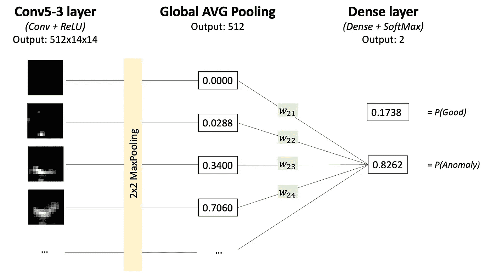

Image 7\. Detailed architecture of the last model layers (classification head). Image by Author

Image 8\. The final heatmap is calculated as the sum of Conv5–3 layer heatmaps each multiplied by the weight in the Dense layer that affected the ‘Anomaly’ class score. Image by Author

**为什么会这样？**现在你会明白为什么分类头要有一个全局平均池层和一个密集层。这种架构使得有可能跟踪什么特征图(以及多少)影响最终预测并使其成为“异常”类。

每个特征图(层 con V5–3 的输出；参见图 6)突出显示了输入图像中的一些区域。全局平均池图层将每个要素地图表示为一个数字(我们可以将其视为一维嵌入)。密集层通过将每个嵌入乘以相应的权重来计算分类“好”和“异常”的分数(和概率)。该流程如图 7 所示。

因此，密集图层权重表示每个要素地图对“良好”和“异常”类分数的影响程度(我们只对“异常”类分数感兴趣)。将 con V5–3 图层的特征地图相加，每个地图乘以密集图层的相应权重，这样做很有意义。

有趣的是，使用全局平均池而不是全局最大池对于使模型找到整个对象是至关重要的。下面是原始论文[学习深度特征进行鉴别定位](https://arxiv.org/abs/1512.04150)所说的:

> “我们相信，与鼓励网络仅识别一个区别部分的全局最大汇集相比，全局平均汇集损失鼓励网络识别对象的范围。这是因为，当进行贴图的平均时，可以通过找到对象的所有有区别的部分来最大化值，因为所有低激活会减少特定贴图的输出。另一方面，对于全局最大值池，除了最有区别的图像区域之外，所有图像区域的低分数不会影响分数，因为您只是执行最大值。”

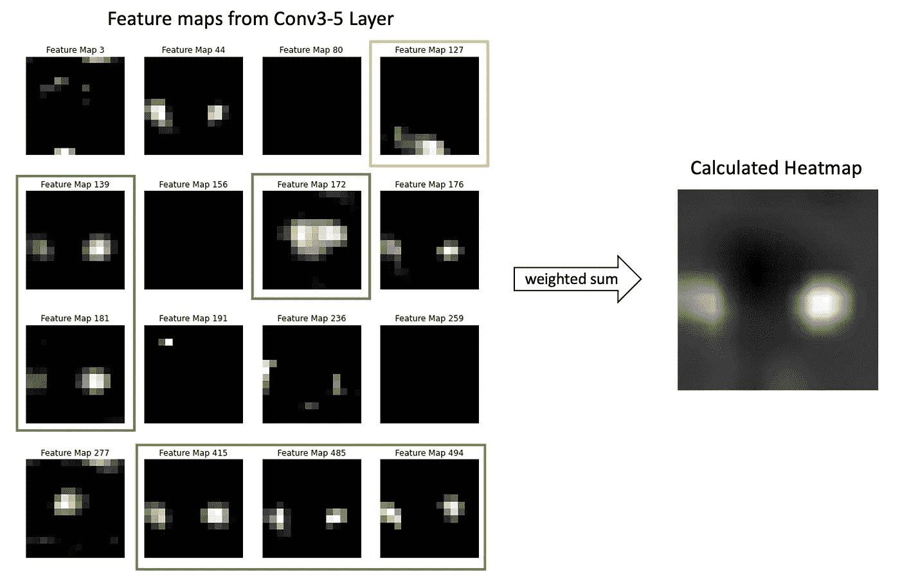

Image 9\. The final heatmap is calculated by summing feature maps multiplied by the weight in the Dense layer that affected the ‘Anomaly’ class score. We may guess that feature maps, such as 139 and 181, have large positive weights during summation, feature map 172 has a large negative weight and feature map 127 probably has a weight close to 0, so it doesn’t affect how the final heatmap look. Image by Author

**第三步**。下一步是对热图进行上采样，以匹配输入图像的大小——224×224。双线性上采样是可以的，就像任何其他上采样方法一样。

回到模型输出**。**该模型返回“良好”和“异常”类别的概率，以及显示在计算“异常”分数时哪些像素是重要的热图。模型总是返回热图，不管它将图像分类为“好”还是“异常”；当课程“好”的时候，我们只是忽略了热图。

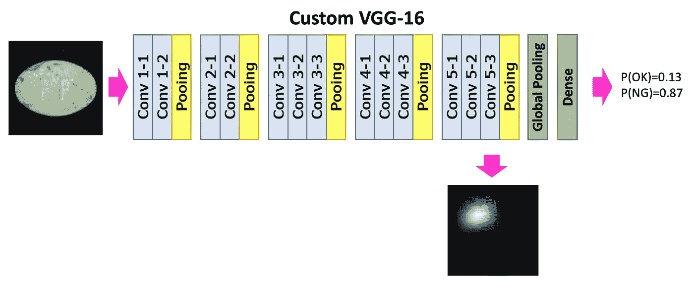

Image 10\. Model in the inference mode should output ‘Anomaly’ class heatmap. Image by Author

热图看起来很好(见图 11)，并解释了是哪个区域使模型决定该图像属于“异常”类。我们可以就此打住，或者(如我所承诺的)将热图处理成一个边界框。

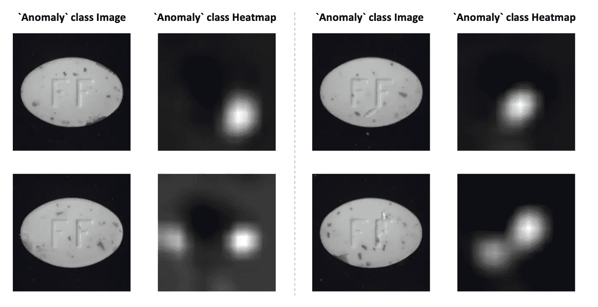

Image 11\. Heatmaps for some ‘Anomaly’ class images. Image by Author

从热图到包围盒。这里你可能会想到几种方法。我给你看一个最简单的。在大多数情况下，它工作得很好。

1.首先，标准化热图，使所有值都在范围[0，1]内。

2.选择一个阈值。将其应用于热图，以便所有大于阈值的值都转换为 1，小于阈值的值都转换为 0。阈值越大，边界框就越小。我喜欢阈值在[0.7，0.9]范围内时的结果。

3.我们假设，1s 的区域是一个单一的致密区域。然后，通过在高度和宽度维度中查找 argmin 和 argmax，围绕该区域绘制一个边界框。

但是，注意这种方法只能返回一个边界框(根据定义)，所以如果图像有多个缺陷区域，它就会失败。

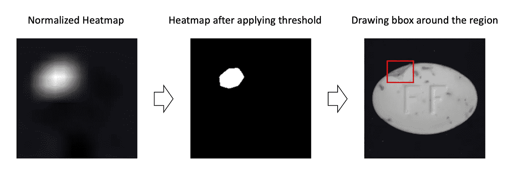

Image 12\. How to process heatmap into the bounding box. Image by Author

# 估价

让我们在 MVTEC 异常检测数据集的 5 个子集上评估该方法——榛子、皮革、电缆、牙刷和药丸。

对于每个子集，我都训练了一个独立的模型；选择 20%的图像作为测试集——以随机和分层的方式。没有使用数据增强。我在损失函数中应用了类别权重——1 代表“良好”类别，3 代表“异常”,因为在大多数子集中，良好图像比异常图像多 3 倍。该模型最多被训练 10 个时期，如果训练集精度达到 98%，则提前停止。这是我的笔记本，上面有培训脚本。

以下是评测结果。子集的训练集大小为 80–400 幅图像。平衡精度在 81.7%到 95.5%之间。有些子集，比如榛子和皮革，对模特来说比较容易学，而药丸是相对比较难的子集。

Image 13\. Evaluation results for 5 subsets from [MVTEC Anomaly Detection Dataset](https://www.mvtec.com/company/research/datasets/mvtec-ad). Image by Author

数字就是这样，现在让我们看看预测是什么样的。在大多数情况下，如果类别是“异常”，模型产生正确的类别预测和精确的边界框。然而，存在一些错误:它们或者是不正确的类预测，或者是当类被正确预测为“异常”时错误的边界框位置。

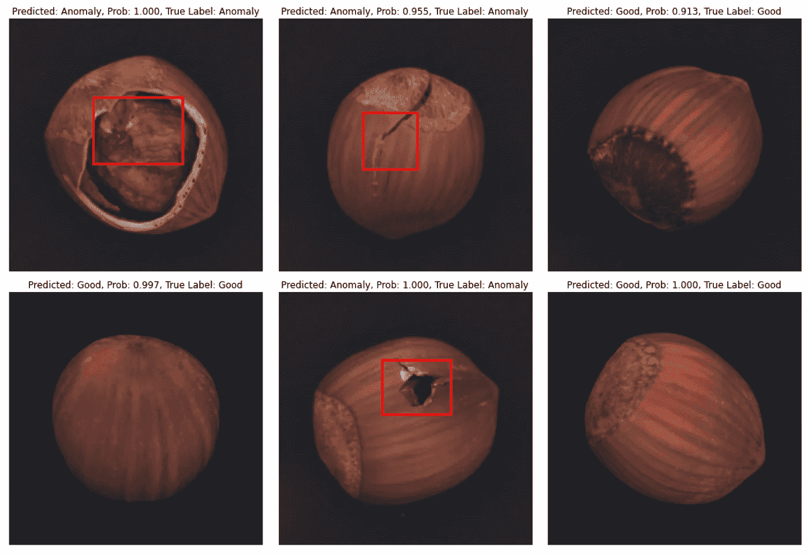

Image 14\. Hazelnut subset: Predictions on the Test Set. Image by Author

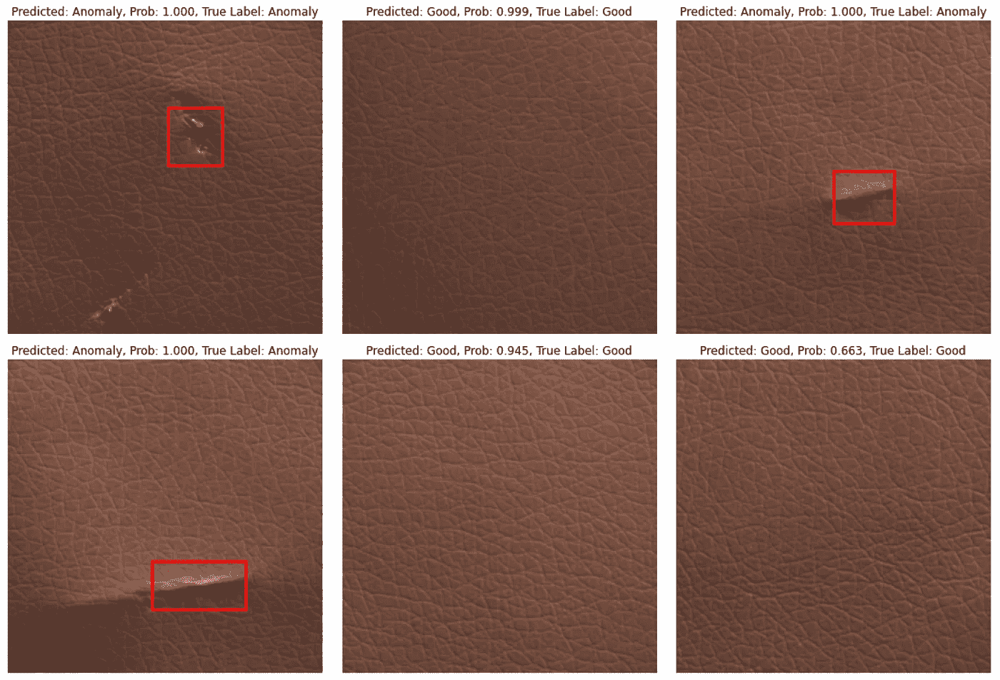

Image 15\. Leather subset: Predictions on the Test Set. Image by Author

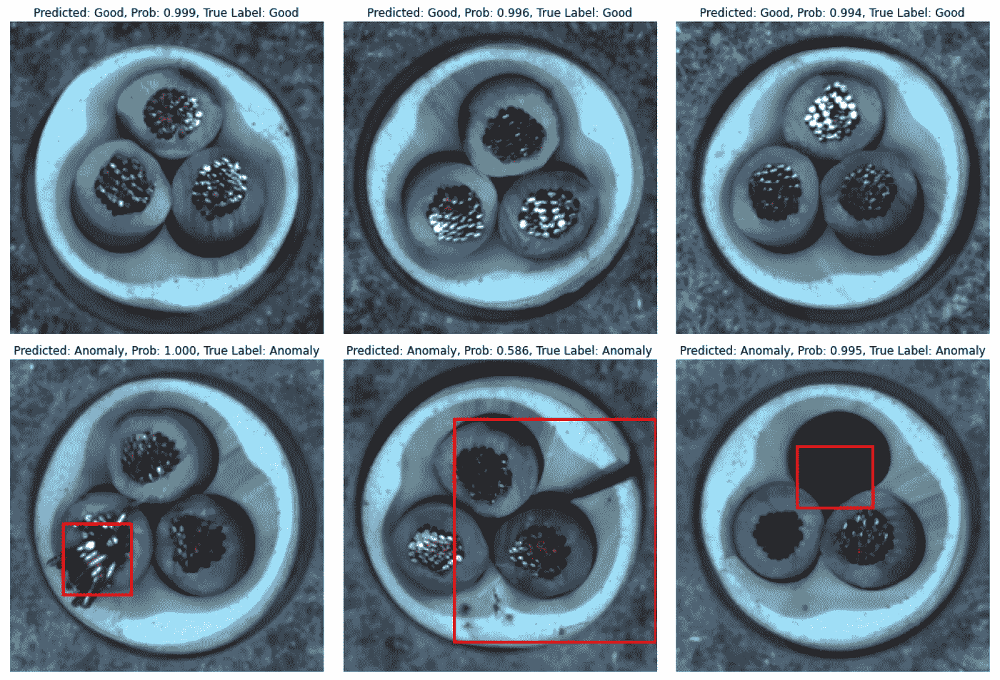

Image 16\. Cable subset: Predictions on the Test Set. Image by Author

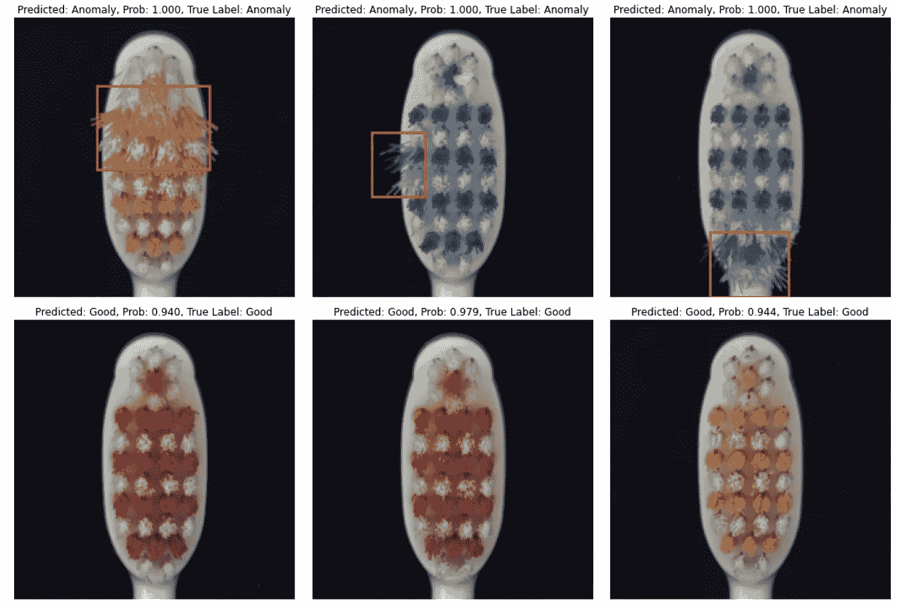

Image 17\. Toothbrush subset: Predictions on the Test Set. Image by Author

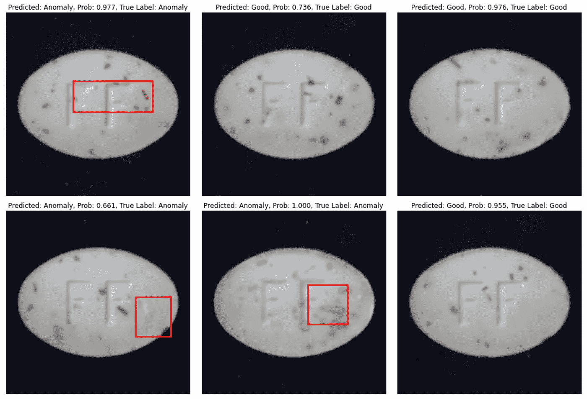

Image 18\. Pill subset: Predictions on the Test Set.

# 结论

在这篇文章中，我想告诉你，神经网络并不像有些人认为的那样是黑盒算法，但是当你知道去哪里找时，它是很容易解释的:)这里描述的方法是解释你的模型预测的许多方法之一。

当然，模型不是那么准确，主要是因为它是我的快速宠物项目。但是如果你要做类似的工作，请随意以我的结果为起点，投入更多的时间，获得你需要的精确度。

我正在开源这个项目的代码到[这个 Github 库](https://github.com/OlgaChernytska/Visual-Inspection)。请随意使用我的结果作为您项目的起点:)

# 下一步是什么？

如果您想提高这种异常检测模型的准确性，添加数据扩充—是开始的地方。我推荐你阅读我的帖子——[计算机视觉数据增强完全指南](https://towardsdatascience.com/complete-guide-to-data-augmentation-for-computer-vision-1abe4063ad07)。在那里，您将发现如何使用数据扩充来使您的模型受益，而不是有害:)

如果你对案例研究感兴趣，可以查看我的教程—[2D 手部姿态估计简介:方法讲解](https://towardsdatascience.com/gentle-introduction-to-2d-hand-pose-estimation-approach-explained-4348d6d79b11)。

# 参考

[1]周、、Aditya Khosla、Agata Lapedriza、Aude Oliva 和 Antonio Torralba:学习用于区别性定位的深度特征；载于:2016 年 IEEE 计算机视觉和模式识别会议论文集。 [pdf](https://arxiv.org/pdf/1512.04150.pdf)

[2]保罗·博格曼、基利安·巴茨纳、迈克尔·福瑟、大卫·萨特勒格、卡斯滕·斯特格:MVTec 异常检测数据集:用于无监督异常检测的综合真实世界数据集；发表于:国际计算机视觉杂志，2021 年 1 月。 [pdf](https://link.springer.com/content/pdf/10.1007/s11263-020-01400-4.pdf)

[3]保罗·博格曼、迈克尔·福瑟、大卫·萨特勒格、卡斯滕·斯特格:mv tec AD——用于无监督异常检测的综合真实数据集；参加:IEEE 计算机视觉和模式识别大会(CVPR)，2019 年 6 月。 [pdf](https://www.mvtec.com/fileadmin/Redaktion/mvtec.com/company/research/datasets/mvtec_ad.pdf)