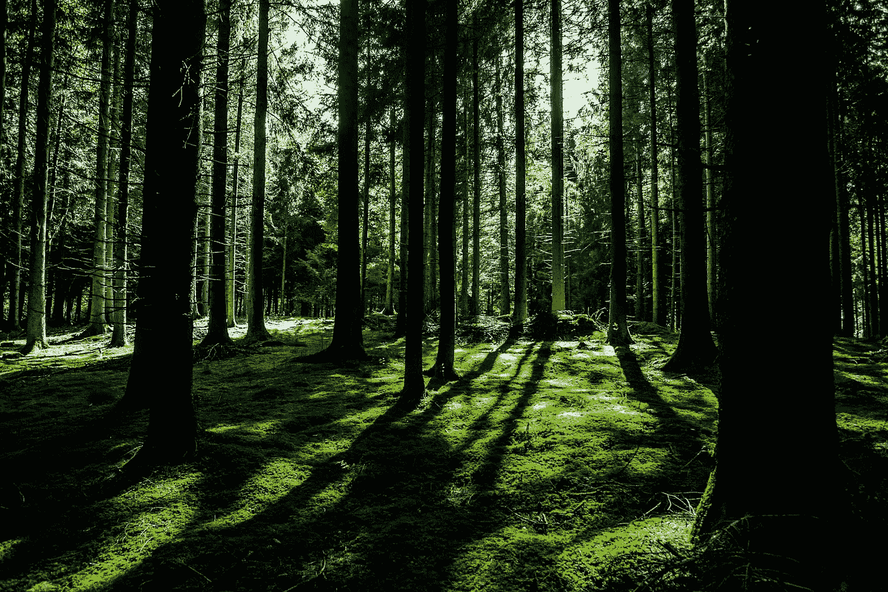
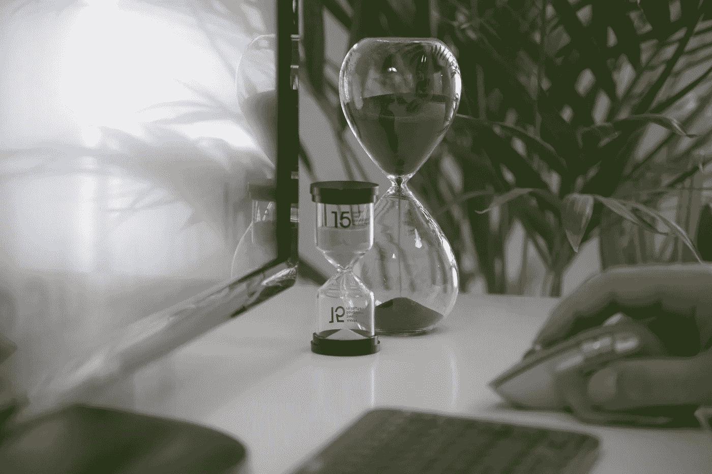

# 探索性测试:终极武器

> 原文：<https://medium.com/geekculture/exploratory-testing-the-ultimate-weapon-fe43467ee7ca?source=collection_archive---------45----------------------->

## 利用探索性测试的力量

> 打破传统的 QA 孤岛，让开发人员能够进行质量检查。

说到测试，我们被可用的测试技术淹没了。因此，作为测试专家，跟上最新趋势对我们来说很重要。QA 工程师需要了解哪些测试技术是相关的，哪些是不相关的，这有点像“攀比”。

Photo by [Victoriano Izquierdo](https://unsplash.com/@victoriano?utm_source=unsplash&utm_medium=referral&utm_content=creditCopyText) on [Unsplash](https://unsplash.com/s/photos/options?utm_source=unsplash&utm_medium=referral&utm_content=creditCopyText)

如果你用谷歌搜索“测试技术”或者类似的东西，你就会明白我的意思；你会得到大量的结果。做出选择有时就像下一盘棋。你试着考虑所有可能的行动和结果。随着游戏的发展，你开始了解更多，有时你会被迫意识到自己走错了一步。

探索性测试只是众多测试技术中的一种。我认为它是迄今为止我最喜欢的测试武器之一，原因有很多，我将在本文中介绍。最后，您将有望了解如何利用探索性测试的力量。

如果你还不熟悉探索性测试，我会这样描述它:探索性测试是一种*创造性的*方法。这是你探索产品和探索不败之路的机会。在这个过程中，你会揭示细节，发现可能不太明显的组合。

作为 QA 工程师，理解产品很重要。无论你是有经验的还是新手，对内部发生的事情有一个清晰的想法与了解外部发生的事情同样重要。测试遵循系统的方法，但是探索性测试没有边界。

Photo by [Sven Schlager](https://unsplash.com/@svenschlager?utm_source=unsplash&utm_medium=referral&utm_content=creditCopyText) on [Unsplash](https://unsplash.com/s/photos/dense-forest?utm_source=unsplash&utm_medium=referral&utm_content=creditCopyText)

我的第一条建议是*在你做探索性测试时放弃测试计划*。测试计划是一组方向，因此与我们想要通过探索性测试实现的完全相反。我们想探索未知。如果你发现自己在挣扎，我建议你列出几个你想测试的领域。避免过于精确，例如:如果你正在测试一个网站，并计划测试几个页面，写下你计划进入的页面，但不要列出你将采取的步骤。完成后，示例可能如下所示:

*   结账时的第三步。
*   收银台购物车中有 12 件商品。

我们有我们想去的地方，但是我们避免列出到达那里的步骤。“如何”是当你运用创造性思维的时候。你可以刷新页面五次，让它闲置 *x* 分钟，或者在页面之间快速来回切换。当你开始探索时，想法就来了，所以顺其自然吧。我们的示例列表可能会在这个过程中激发新的想法，以两个要点开始的可能会以五个要点结束。

因为探索性测试允许你发挥创造力，你可能会问自己:“*我应该什么时候停止？”。答案很简单:当你喜欢的时候。如果你已经开始了一个探索性的测试，但是 5 分钟后你就没有主意了，那就停下来。会议时间因人而异。*

我对你花多少时间做探索性测试的建议是保持灵活性。没有规定说你不能花 3 个小时，但你可能会感到筋疲力尽。随着时间的推移，我发现我通常会在 15 到 20 分钟左右停下来。探索性测试并没有找到最佳点。你可以在前两分钟内有重大发现，也可以花 20 分钟。

Photo by [Fakurian Design](https://unsplash.com/@fakurian?utm_source=unsplash&utm_medium=referral&utm_content=creditCopyText) on [Unsplash](https://unsplash.com/s/photos/time?utm_source=unsplash&utm_medium=referral&utm_content=creditCopyText)

苹果公司的联合创始人史蒂夫·乔布斯说，“*很明显，我们拥有的最重要的资源是时间*”。对我来说，这句话强调了我们都在不同的时刻表现出色，所以确定什么样的时间长度最适合你。无论你选择开放式会议还是给自己设定时间表，如何支配时间的选择权都在你。

到目前为止，我已经介绍了什么是探索性测试，它可能看起来像什么，以及您可能需要多少时间。现在剩下要知道的是什么时候应该使用探索性测试？

探索性测试是一种流动的方法，所以说它几乎可以在任何地方使用可能不会让你吃惊。例如，测试计划将帮助我们验证我们已经知道要期待什么，但是它很少揭示我们不知道什么。探索性测试可以作为扩展测试计划的一种手段。

探索性测试没有像白盒测试那样的蓝图，例如，白盒测试的目标是明确的，范围是已知的。冒着听起来像“*破纪录*”的风险:探索性测试没有边界。探索性测试带来的多样性，允许我们将它应用于不同的产品和情况。

Photo by [Alice Dietrich](https://unsplash.com/@alicegrace?utm_source=unsplash&utm_medium=referral&utm_content=creditCopyText) on [Unsplash](https://unsplash.com/s/photos/creativity?utm_source=unsplash&utm_medium=referral&utm_content=creditCopyText)

在我结束这篇文章的时候，请记住，我们可以将探索性测试作为一种独立的方法来使用，或者在与另一种技术结合时作为一种补充。我们可以精确地知道我们花了多少时间或者工作了多久。作为人类，我们思考和创新的能力是我们的优势，运用这种创造力是探索性测试成为终极武器的原因。

[***订阅***](https://qatoddy.medium.com/subscribe) *如果你喜欢你读过的？留下掌声👏敬请关注更多内容！*