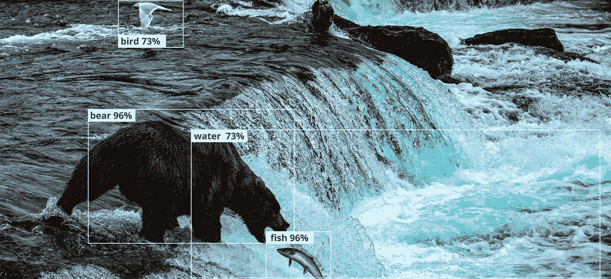
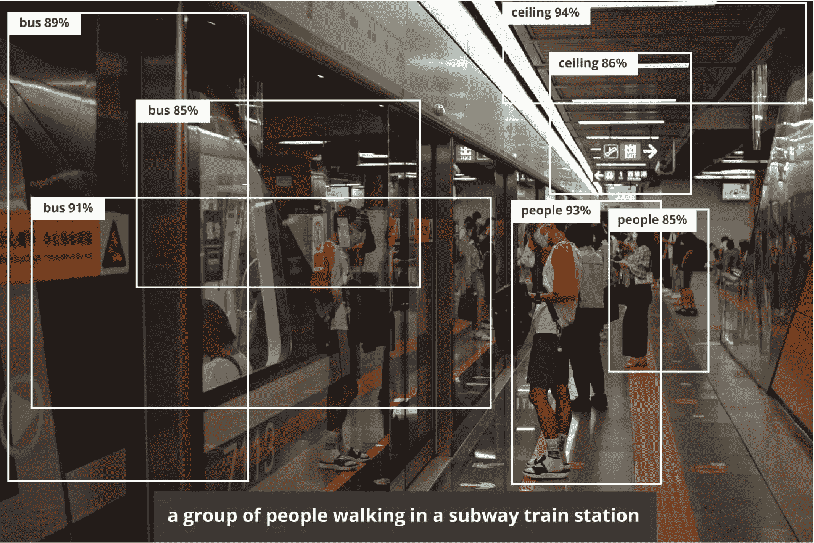
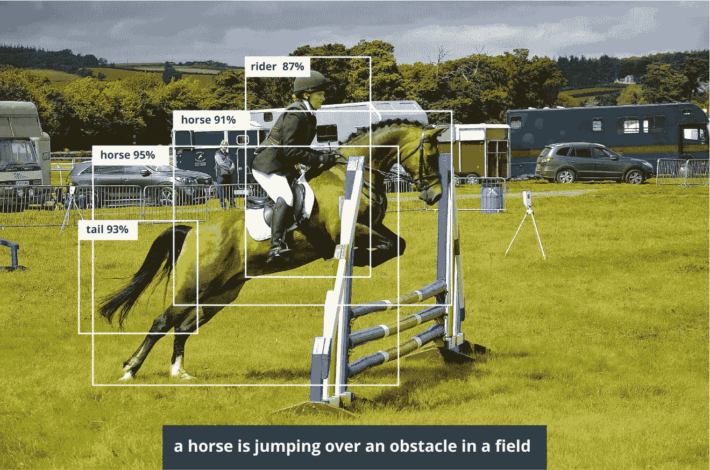
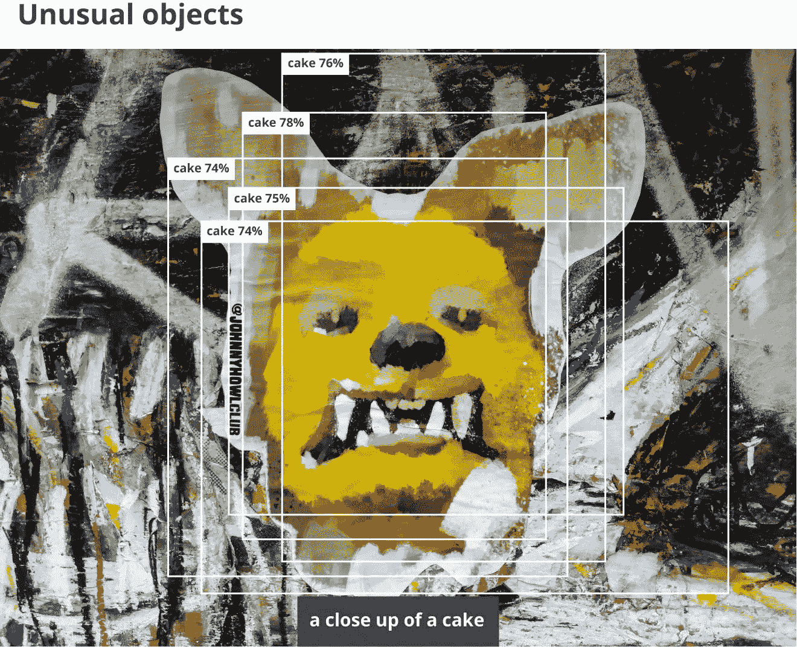
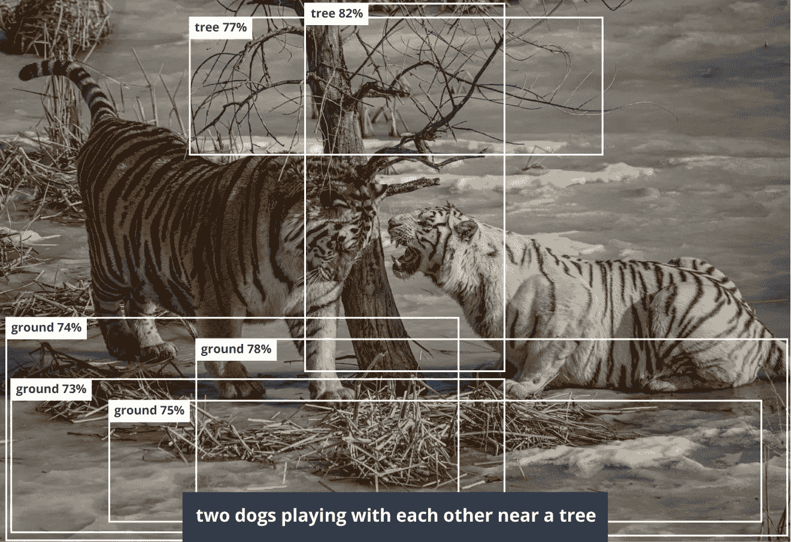
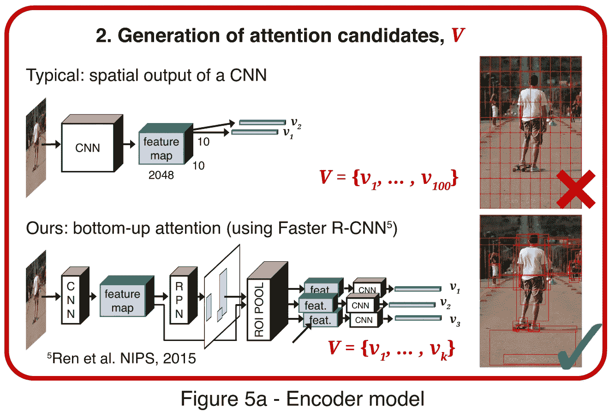
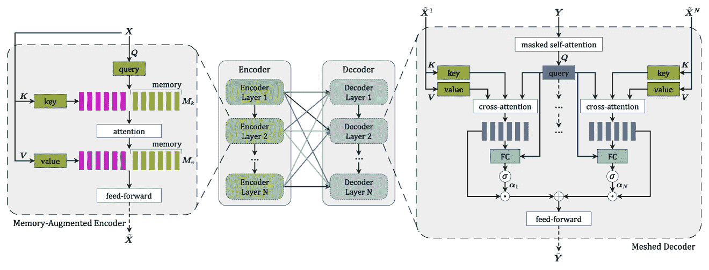
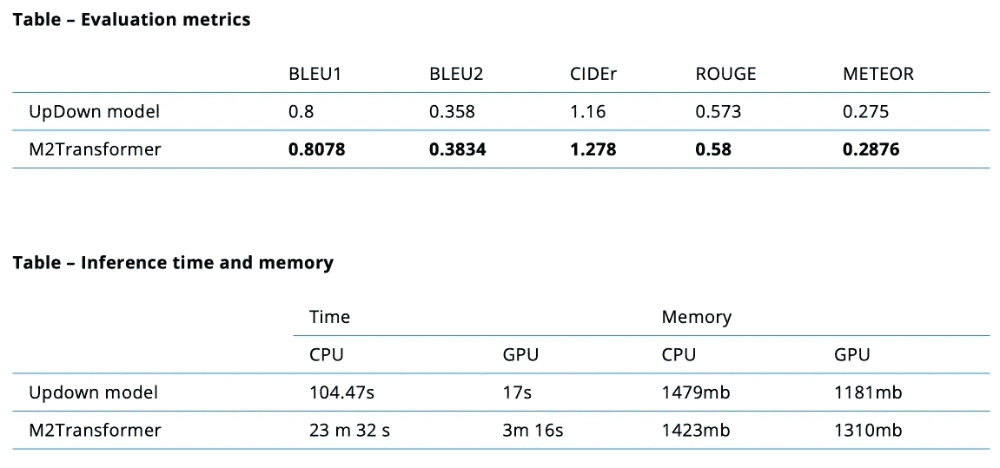

# 探索图像字幕和标记的深度学习

> 原文：<https://medium.com/geekculture/exploring-deep-learning-for-image-captioning-and-tagging-483169973680?source=collection_archive---------40----------------------->

应用人工智能将图像上描绘的像素序列转化为文字的技术不像五年前或更久以前那么原始了。从社交媒体到电子商务，更好的性能、准确性和可靠性使流畅高效的图像字幕成为可能。标签的自动创建对应于下载的照片。这项技术可以帮助盲人发现他们周围的世界。

本文涵盖了图像字幕技术的使用案例、基本结构、优点和缺点。此外，我们部署了一个模型，该模型能够为输入图像上显示的内容创建有意义的描述。

图像字幕作为一种视觉语言目标，可以借助计算机视觉和自然语言处理来解决。人工智能部分在 CNNs(卷积神经网络)和 RNNs(递归神经网络)或任何其他可应用的模型上实现目标。

在讨论技术细节之前，让我们先了解一下图像字幕的现状。

# 人工智能驱动的图像标记和描述用例

*“图像字幕是计算机视觉的核心功能之一，可以实现广泛的服务，* [*【东学】*](https://www.microsoft.com/en-us/research/people/xdh/) *”微软技术研究员、华盛顿州雷蒙德市 Azure AI Cognitive Services 首席技术官黄说。*

他说的很有道理，因为图像字幕技术已经有了广阔的应用领域，即:

# 电子商务、照片共享服务和在线目录的图像标记

在这种情况下，正在通过照片自动创建标签。例如，当用户上传图片到在线目录时，它可以简化用户的生活。在这种情况下，AI 识别图像并生成属性——这些属性可以是签名、类别或描述。该技术还可以确定在线商店的商品类型、材料、颜色、图案和服装的合身程度。

同时，图片说明可以通过照片共享服务或任何在线目录来实现，以便为 SEO 或分类目的创建自动的有意义的图片描述。此外，标题允许检查图像是否符合平台的发布规则。在这里，它作为 CNN 分类的替代，有助于增加流量和收入。

**注意:**为视频创建描述是一项复杂得多的任务。尽管如此，目前的技术水平已经使之成为可能。

# 盲人的自动图像注释

为了开发这样的解决方案，我们需要将图片转换为文本，然后转换为语音。这是深度学习技术的两个众所周知的应用。

由微软开发的一款名为 [Seeing AI](https://www.microsoft.com/en-us/ai/seeing-ai) 的应用程序允许有视力问题的人使用智能手机看到周围的世界。当摄像头对准文本时，程序可以读取文本并给出声音提示。它可以识别印刷和手写文本，也可以识别物体和人。

[谷歌](https://blog.google/outreach-initiatives/accessibility/get-image-descriptions/)也推出了一款工具，可以为图像创建文本描述，让盲人或视力有问题的人理解图像或图形的上下文。这个机器学习工具由几层组成。第一个模型识别图像中的文本和手写数字。然后，另一个模型识别周围世界的简单物体，如汽车、树木、动物等。第三层是能够在成熟的文本描述中找出主要思想的高级模型。

# 用于社交媒体的人工智能图像字幕

在人工智能工具的帮助下生成的图像说明已经可以在脸书和 Instagram 上使用。此外，模型一直在变得更加智能，学习识别新的对象、动作和模式。

大约五年前，脸书创建了一个能够创建替代文本描述的系统。如今，它变得更加准确了。以前，它使用一般的词语来描述一幅图像，但现在这个系统可以生成详细的描述。

# 人工智能帮助下的标识识别

图像字幕技术也正在与其他人工智能技术一起部署。例如，DeepLogo 是基于 TensorFlow 对象检测 API 的神经网络。它能识别标识。所识别的标识的名称作为标题出现在图像上。

# 图像字幕深度学习模型的研究

考虑到可能的用例，我们应用了一个为图片创建有意义的文本描述的模型。例如，标题可以描述每个图像上的动作和主要对象。对于训练，我们使用了微软 COCO 2014 数据集。

COCO 数据集是大规模对象检测、分割和字幕数据集。它包含了大约 150 万个不同的物体，分为 80 个类别。每张图片都有五个人工生成的标题。

我们应用了[安德烈·卡帕西的训练、验证和测试分割](http://cs.stanford.edu/people/karpathy/deepimagesent/caption_datasets.zip)来划分数据集，以训练、验证和测试各个部分。此外，我们需要像蓝色，红色，流星，苹果酒，香料等指标来评估结果。

# 图像字幕的机器学习模型比较

通常，图像字幕的基线架构将输入编码成固定形式，并将其逐字解码成序列。

编码器将具有三个颜色通道的输入图像编码成具有“学习”通道的较小图像。这个较小的编码图像是原始图像中所有有用内容的汇总表示。对于编码，可以应用任何 CNN 架构。此外，我们可以对编码器部分使用迁移学习。

解码器查看编码图像，并逐字生成字幕。然后，每个预测的单词用于生成下一个单词。

在继续之前，看一下我们在使用网状内存变压器模型进行模型创建和测试时得到的结果。

# 基于人工智能的图像字幕现在总是准确的

我们还研究了导致错误的例子。出现错误有几个原因。最常见的错误与图像质量差以及初始数据集中缺少某些元素有关。该模型是在包含一般图片的数据集上训练的，因此当它不知道内容或无法正确识别内容时会出错。这和人脑的工作方式是一样的。

这里还有一个案例来说明神经网络是如何运作的。用于训练模型的数据集中没有老虎，因此无法识别老虎。相反，人工智能选择了它知道的最接近的物体——这是完全相同的，因为我们的大脑处理未知的事物。

# 图像字幕的上下注意模型

这是第一个比较的模型。上下机制结合了自下而上和自上而下的注意机制。

更快的 R-CNN 用于在对象检测和图像字幕任务之间建立连接。由于利用了跨领域的知识，区域提议模型在对象检测数据集上被预先训练。此外，与其他一些注意机制不同，这两个模型都使用上下机制的一次注意。

更快的 R-CNN(图 5a)用于图像特征提取。更快的 R-CNN 是一种对象检测模型，旨在识别属于某些类别的对象，并用边界框对其进行定位。更快的 R-CNN 分两个阶段探测物体。

**第一阶段，**描述为区域提议网络(RPN)，预测对象提议。使用具有交集-并集(IoU)阈值的贪婪非最大值抑制，选择顶部方框建议作为第二阶段的输入。

**在第二阶段**，使用感兴趣区域(RoI)池为每个盒子方案提取小特征图(例如 14×14)。然后，这些特征地图作为 CNN 的最终层的输入被一起批处理。因此，最终的模型输出由类标签上的 softmax 分布和每个框提议的类特定的边界框细化组成。该方案摘自[官方海报。](https://panderson.me/images/cvpr18_UpDown_poster.pdf)

这是增加了上下注意力机制的 LSTM。给定一组图像特征 V，所提出的字幕模型使用“软的”自上而下的注意机制来在字幕生成期间加权每个特征。在高层次上，字幕模型由两个 LSTM 层组成。

# 用于图像字幕的网状记忆变压器模型

我们用来解决图像字幕任务的另一个模型是[网状记忆变压器](https://arxiv.org/abs/1912.08226)。它由编码器和解码器部分组成。它们都是由一层层的关注层组成的。编码器还包括前馈层，解码器具有带加权的可学习机制。

图像的区域以多级方式编码。该模型同时考虑了低层和高层关系。学到的知识被编码成记忆向量。编码器和解码器部分的层以网状结构连接。解码器从每个编码层的输出中读取，并在结果被调制和求和之后，在所有编码层上执行自关注和交叉关注。

因此，该模型不仅可以使用图像的视觉内容，还可以使用编码器的先验知识。这些方案摘自[官方文件](https://arxiv.org/abs/1912.08226)。

# 两种图像字幕模型的比较

基于我们的研究，我们能够比较 Up-down 模型和 M2transform 模型，因为它们是在相同的数据上训练的。下表总结了这两种模式。

# 图像字幕-结果分析和未来展望

两个使用的模型都显示了相当好的结果。在他们的帮助下，我们可以为数据集中的大多数图像生成有意义的标题。此外，由于 fast-RCNN 的特征预提取，在庞大的视觉基因组数据集上进行预训练，该模型能够识别人们日常生活中的许多对象和动作，并因此正确地描述它们。

**那么有什么区别呢？**

Updown 型号比 M2Transformer 更快、更轻便。原因是 M2Transformer 使用了更多的技术，如编码器和解码器之间的附加(“网状”)连接，以及用于记住过去经验的存储向量。此外，这些模型使用不同的注意机制。

Updown 注意可以在单次传递中执行，而 M2Transformer 中使用的多头注意应该并行运行几次。但是根据得到的指标来看，M2Transormer 取得了更好的成绩。在它的帮助下，我们可以生成更加正确和多样的字幕。对于来自数据集的图片和一些其他相关图像，M2Transformer 预测在描述中包含更少的不准确性。因此，它可以更好地执行主要任务。

我们比较了两种模型，但也有其他方法来完成图像字幕的任务。可以改变解码器和编码器，使用各种单词向量，组合数据集，以及应用迁移学习。

该模型可以进行改进，以实现适合特定业务的更好结果，可以作为视力有问题的人的应用程序，也可以作为嵌入电子商务平台的附加工具。为了实现这一目标，应该在相关数据集上训练模型。例如，对于正确描述衣服的系统，最好在带有衣服的数据集上运行训练。

由 [MobiDev](https://mobidev.biz/services/machine-learning-consulting) 的人工智能工程师 Diana Malyk 撰写。

*全文原载于*[*https://mobidev . biz*](https://mobidev.biz/blog/exploring-deep-learning-image-captioning)*基于 mobi dev 技术研究。*