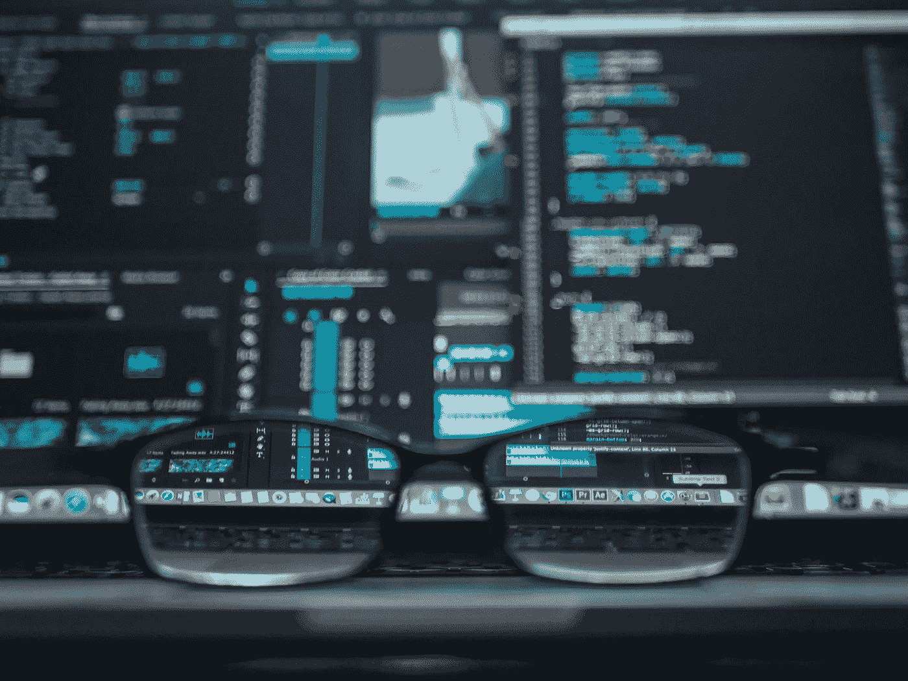

# 探索人工智能的伦理景观

> 原文：<https://medium.com/geekculture/exploring-the-ethical-landscape-of-artificial-intelligence-36ea218dd99b?source=collection_archive---------79----------------------->

*强调关键要点&来自 AILA 未来人工智能责任研讨会的相关思考。*

Photo by [Kevin Ku](https://unsplash.com/@ikukevk?utm_source=unsplash&utm_medium=referral&utm_content=creditCopyText) on [Unsplash](https://unsplash.com/s/photos/machine-learning?utm_source=unsplash&utm_medium=referral&utm_content=creditCopyText)

AILA 最近举办了一场关于人工智能责任未来的研讨会，其中包括各种令人难以置信的主题演讲人、小组讨论和互动会议，致力于探索人工智能(AI)在影响社区、企业、政策等方面的伦理景观。

随着人工智能的力量越来越多地被全球各地的企业所利用，这种技术的影响正在渗透到我们的日常生活中，并得到更广泛的认可。权力越大，责任越大。

负责任的人工智能包含框架和原则，以使人工智能符合特定标准，并减轻它可能造成的潜在伤害。这是通过运用人工智能工具来实现的，这些工具的核心原则是透明、公平、安全和包容性。但当然，这说起来容易做起来难，因为考虑到设计人工智能模型的因素数量，以及与人工智能发展不相称的教育和标准发展。

从高层次来看，问题可能出现在整个人工智能生产管道的任何地方，从排除数据收集中已经代表性不足的群体，到随之而来的大量数据隐私问题，到算法个性化可能永久存在的孤岛和两极分化(见[这里有一个更长的列表](https://www.weforum.org/agenda/2016/10/top-10-ethical-issues-in-artificial-intelligence/))，使他们很难识别和控制。

这种道德差距可能造成的伤害的一些常见例子包括:预测性警务算法中的种族貌相，由于之前的公司构成而在未来未能雇用少数族裔，以及根据社交媒体或智能手机等地方的数据做出相应的决定(*如波士顿的 project Street Bump，这是一款旨在改善社区街道的应用程序。 但是，由于与更多智能手机用户的相关性，这导致了更多的数据收集和更富裕地区的建设，未能为更多受益于此类修复的社区提供服务*。

有了这个主题的概述，现在让我们深入了解我从 AILA 事件中获得的一些最大的收获，以及他们对人工智能的当前和未来伦理景观的一些相关思考！

**1。大多数工作存在于思想中，而不是技术中:**很容易转向算法，因为这是一种无所不知的技术，并指责所说的“算法”出了任何问题。这种把它看作是它自己的个体行动者的说法，是为了把它从创造它的所有其他因素中分离出来，并把责任从这些因素中抽离出来。人工智能责任实验室的增长主任劳伦斯·安普福博士对此表示，问题往往是由人引起的；不一定是科技本身。

正如我最喜欢的一篇文章[中提到的，“大数据就是人！”丽贝卡·莱莫夫](https://aeon.co/essays/why-big-data-is-actually-small-personal-and-very-human)，我们讨论和解释数据的方式已经变得围绕着像 3 V's 这样的概念，或者作为这个空灵的总括标签，模糊了隐私的含义以及它是由个人自己描述、收集和操纵的事实。为了开始消除去责任化，我们有必要在人工智能的修辞中使这个领域人性化。

除了一般的言辞，公司需要确保他们在内部谈论道德人工智能的原则，并考虑他们可以采取的措施。小组成员 Olivia Gambelin(对抗系统性偏见会议)描述了作为她的人工智能道德咨询工作的一部分，他们如何首先询问团队他们对公平的定义。通常，每个人对一个公平的模型可能是什么样子都有不同的看法，这可能会导致严重的沟通失误(以及由此产生的糟糕的模型！).这些对话有助于为负责任的人工智能构建和部署的公司文化奠定坚实的基础。

技术本身是我们真的没有那么多权力控制的东西。但我们所做的，是我们与技术合作的方式，识别和解决其中的问题，并谈论它。首先要关上电脑，进行批判性思考和对话。这可能会有所不同。

**2。疫情加剧了人工智能的使用:**整个活动中的一个共同情绪是，人工智能的增长是不可否认的，而这个疫情只是在进一步加速它。

公司普遍寻求将人工智能更多地融入他们的运营中，57%的经理表示他们的公司将在 2020 年试点或使用人工智能，麦肯锡全球调查报告称，疫情已经引发了更多的计划。在毕马威的一项调查中，88%的小企业主和 80%的大企业主也表示，在冠状病毒爆发期间，人工智能技术帮助了他们的公司，其用例从生产力监控到增强的服务提供，再到欺诈检测。

**3。道德作为一种资产:**随着公司越来越多地使用人工智能，小组成员还讨论了将道德作为自己的资产与技术配对的预测和必要性。

他们推测，在未来五年内，这一点在公司中的重要性将会增加，这将反映在首席数据道德官和不断增长的数据治理团队等角色的发展中。Gambelin 的人工智能道德咨询公司已经利用了这一概念，他们将道德视为人工智能发展的服务，提供这一指导手作为培训员工、识别风险领域和塑造数据战略的工具。

**4。镜像和放大根深蒂固的不平等:**人工智能中普遍存在的许多系统偏见问题对我们来说并不陌生；我们在历史上见过它们，它们提醒我们需要在线上和线下进行干预。

回到前面提到的警务例子，预测性人工智能已被用于刑事司法领域来决定人们的判决，并被发现对有色人种(特别是黑人男性)给予比白人更严厉的判决。然而，这种偏见反映了多年来在我们的刑事司法系统中普遍存在的系统性种族主义，因为[少数族裔社区更容易成为目标，并受到更严厉的判决](https://www.technologyreview.com/2019/01/21/137783/algorithms-criminal-justice-ai/)。该算法反映并强化了社会中现存的偏见。

当算法获取关于世界的信息，并吐出不公平的结果时，这是它们为我们举起了一面镜子，并清楚地强调了这些问题确实存在并深深植根于社会各个方面的事实。当将信任放入模型中并据此做出相应的决策时，这甚至会带来更多的问题，从而放大偏见并进一步扩大社区之间的差距。

**5。向前工作，向后工作:**在最后一点中谈到的试图减少基于受保护群体和社会不平等的偏见的共同努力，包括检查训练数据以确保公平、公正和代表性。

虽然这有巨大的价值，但问题应该向前看*和向后看*。正如一些小组成员所讨论的，模型可以开发与群体相关的代理；这些变量在初始数据集中可能无法识别，但可以通过观察结果、逆向工程和验证任何潜在的显著相似性来观察。

随着人工智能使用的明显持续增长，我们必须努力使伦理和人工智能成为同义词；我们必须继续批判、学习和迭代，希望收获人工智能对社会有益的所有美好潜力。)，而不是让它进一步把我们撕裂。

【https://www.joinai.la/】*[*了解 AILA。*](https://www.joinai.la/)*