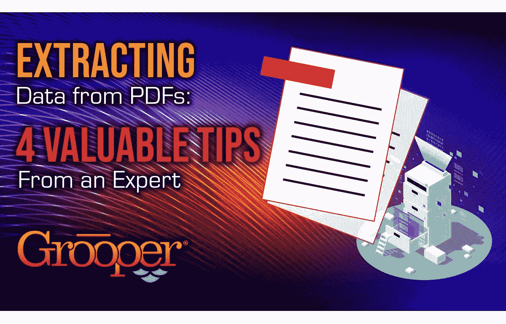
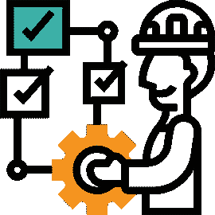

# 从 pdf 中提取数据:来自专家的 4 个有价值的提示

> 原文：<https://medium.com/geekculture/extracting-data-from-pdfs-4-valuable-tips-from-an-expert-21b9d593bf17?source=collection_archive---------64----------------------->

看着最近一次血液测试的结果，我开始思考从 pdf 文件中提取数据的困难。

# 这里有一个很难从 PDF 文件中提取(也很难理解)数据的例子

在即将到来的年度健康检查之前，我完成了一项血液测试。渴望看到结果，我从我的提供商提供的新的花哨的门户网站下载了测试数据作为 PDF 文档。你难道不知道——它不容易读懂。

作为一名数据专家，当我看到好的标签数据时，我就知道它是好的，但这次肯定不是。

在过去的十年里，我接受了 40 多次不同的血液测试(我有高胆固醇——这是遗传的——所以我密切关注我的胆固醇数字和甘油三酯)。

我不知道大多数测试是什么。

承担项目是我学习东西的最好方式。我怀疑大多数人都是这样。

所以我给了自己一个项目，从我收到的血液工作 pdf 中提取数据。然后我突出显示了“超出范围”的数据(比如我不服药时的胆固醇)。

在这样的项目结束时，我可能不知道不同的测试是什么，但我会知道我的数据。我会看到不同年份的数据变化(我平均每年进行两次测试)。

**我在这里提出的观点是，我必须熟悉我的数据，以便正确使用它。**

无论如何，我最近的血液数据项目让我想到了我一直在做的 PDF 数据提取演示。基于此，我将在下面分享 4 个建议:

# PDF 数据提取技巧#1:了解数据的真实性

这是我最近遇到的一个场景:一个客户发给我 9 份文件，共 125 页，涉及一个我从未涉足的行业——保险业。正如所料，这是一种非常不可消费的形式。

我的项目是创建一个数据模型，从 pdf 中提取困难的数据。

**在我遇到的每一个 PDF 数据提取项目中，客户对他们数据的理解和他们数据的现实之间都有差距。**

这就是事情的发展过程，也是为什么外界的目光会有很大的帮助。

要完成这项复杂的工作，你需要[智能文档处理](https://blog.bisok.com/general-technology/what-is-intelligent-document-processing)技术。但是，不要忽视这样一个事实，即数据的真实性不会改变— **复杂的数据提取总是需要更复杂的解决方案。**

# PDF 数据提取技巧#2:从良好的业务流程开始

所以我正在做的演示集中在保险估价上。为了建立数据提取的模型，我需要知道并从所需的数据开始。

幸运的是，这个客户的业务流程有完整的文档记录，并给了我一个必填字段的列表。准确了解哪些信息对下游流程至关重要，这使得概念验证工作更有价值。

从 pdf 中提取数据的现实是，在没有清楚了解业务成果的情况下，一些数据可能只是因为成本太高而无法收集。

业务成果价值高吗？那么应该为解决方案分配更多的时间和成本。

# PDF 数据提取技巧#3:使用键值对(易得之果)

在我的演示中，我从一些简单的东西开始—一个键值字段，它在文档上寻找一个**“总成本”。它总是“total”这个词的一些变体，并且是一个非常接近的货币数字。这就是键值对。**

因此，我配置了一个键-值对提取器，用于查找特定单词和附近货币数据的关联。

我在 [Grooper](https://www.bisok.com/intelligent-document-processing/) 数据提取平台上工作，这个平台让我可以轻松地一个一个地检查每个文档，测试提取结果。

我甚至可以单击“Test All”来测试当前批次中的所有文档(9 个文档，共 125 页)，我会在任何提取未能产生结果的文档上看到一个小红旗。

## 使用一点数据科学获得简单的结果

我实时看到结果，并根据需要调整我的数据提取模型。

这个过程被称为文本歧义消除。这是一个数据科学术语，基本上意味着创建一个假设并反复测试它。

这就是 Grooper 促成的。

在我使用过的产品中，没有一个产品能让这个迭代过程如此简单。

在配置了大约 10 个用于提取的字段之后，我对我正在处理的数据集有了一个很好的想法。我已经迭代了这些文档至少十次(每个提取器一次)，现在我非常了解这些数据。

# PDF 数据提取技巧#4:使用数据讲述故事

在演示概念验证时，我可以用数据来讲述一个故事。例如，我可以看到以下内容:

*   XYZ 保险公司的这份文件没有任何理算人的名字
*   *“这份来自 ABC 赔偿公司的文件是一份格式错误的 PDF 文件。”*
*   *“这里的这些——来自 Intelligent Coverage Co——状态非常好。我们可以提取所有需要的数据。”*

再说一次，我已经很熟悉数据集了。

潜在客户知道这一点很重要。学习其他人的数据，并熟悉它的过程是迭代的，需要时间。

这就是为什么我们采用不同的服务模式来帮助简化这种流程，而不是试图在售前周期中确定工作范围。在我看来，这一直是有争议的事情。

我们必须了解客户的数据，才能真正理解我们提取的信息是否有意义。但更重要的是，我们必须能够解释数据提取的故事。

# 这就是为什么讲述某人数据提取的故事如此重要

我们必须能够解释我们发现的利弊，以便潜在客户有一个清晰的路径来实现他们期望的业务成果。

但这不是一个简单的故事，因为它需要努力。

更简单的说法是，“我们保证获得您 99.99%的数据。”但任何人在没有真正了解你的数据之前就这么说，只是想向你推销一些东西。

我敢打赌这没用。

# PDF 数据提取问题很复杂

处理数据提取的问题需要时间来理解、解决和完善。

我们现在在自动化行业处于一个奇怪的位置。

各公司都在吹捧像 AI 和 ML 这样的术语，但实际上并没有任何实际依据。

只要在谷歌上快速搜索一下“人工智能的现实”，你很快就会发现大部分都是营销炒作。

因此，我们开发了 Grooper 软件来解决 PDF 表格提取和分类等难题。目标是帮助用户从 PDF 文件和扫描文档中提取数据，只需很少或不需要手动输入数据。

我们使用人工智能的几个组成部分，并且我们对它是透明的。我们已经构建了您需要的提取工具:

*   计算机视觉算法
*   自然语言处理(NLP)功能
*   用于分类和提取的监督机器学习算法

从复杂数据中提取准确信息的关键是如何将这些创新功能结合起来，从 PDF 文档中获取数据。

## 专为提取复杂数据而构建的软件

我们没有把现成的组件(还没有考虑到 PDF 文档处理的构建)硬塞进产品中。

我们的开发团队研究先进的数据科学技术，并发现如何将它们用于 PDF 数据提取和自动化项目。

我们将自己的知识产权构建到了 Grooper 中，成为提取高要求业务流程所需的困难数据的最佳平台。

如果你厌倦了供应商的过度承诺和交付不足，给我们打电话。如果可以的话，我们很乐意讨论 Grooper 如何帮助从 pdf 中提取数据。

如果不能，我们会马上告诉你。我们甚至会解释原因。

*最初发表于*[T5【https://blog.bisok.com】](https://blog.bisok.com/general-technology/pdf-data-extraction-4-tips-you-need-to-understand)*。*