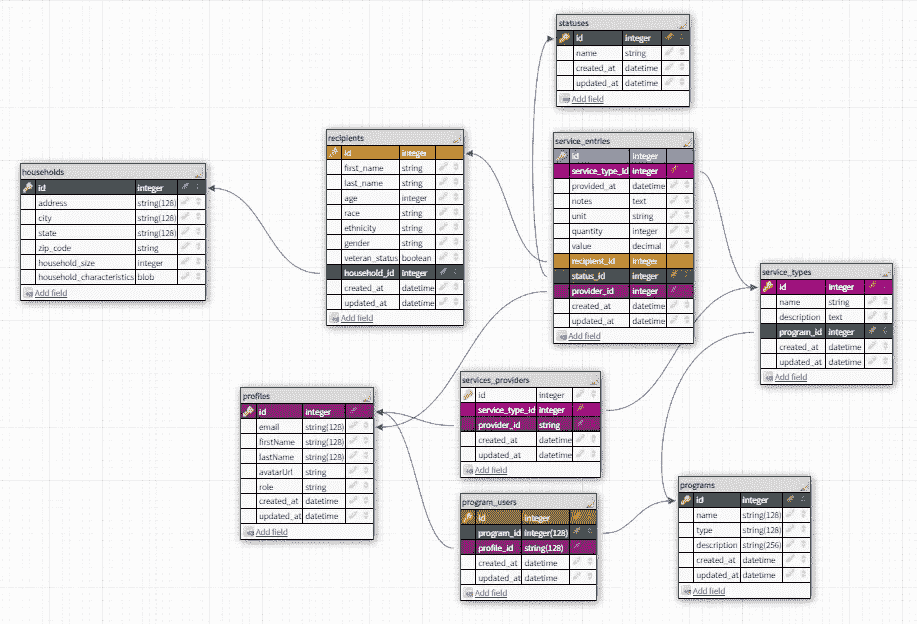
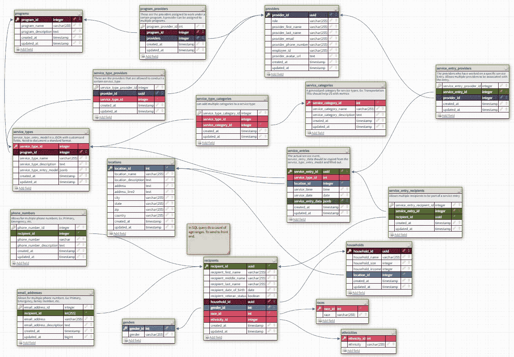
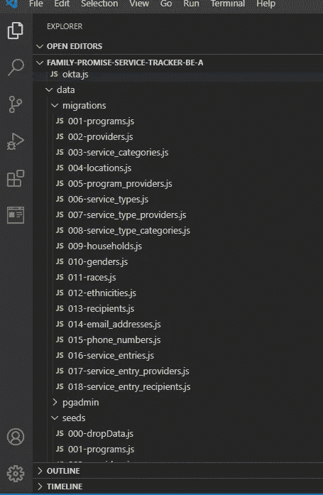
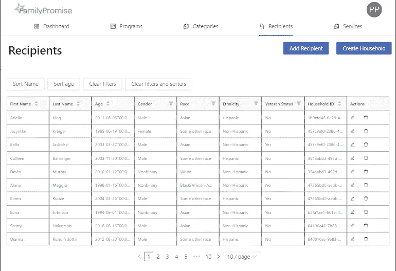

# 家庭承诺:履行对自己的承诺

> 原文：<https://medium.com/geekculture/family-promise-fulfilling-a-promise-to-myself-918b48f2dd15?source=collection_archive---------48----------------------->

Family Promise logo (www.familypromise.com)

2021 年 6 月对我来说是难以置信的收获。我得到了一个绝佳的机会，加入了一个团队，致力于为一个名为“家庭承诺”的非营利组织开发一个监测和评估平台。我们有一个月的时间来全面设计和实现我们的愿景。该组织自 1998 年以来一直致力于解决华盛顿州斯波坎市的无家可归问题。和许多非营利组织一样，“家庭承诺”面临的最大障碍之一是资金。为了克服这一点，竞选和申请资助是企业的必要组成部分。为了使这成为可能，非营利组织使用监测和评估平台(M&E)来跟踪他们提供的服务的各种指标。因此，Family Promise 与 Lambda School 合作，由即将毕业的学生搭建这个平台。能够跟踪各种社区中提供的特定服务的密度，或所提供服务的成本，甚至男性接受者与女性接受者的比例等信息，可以为拨款打开大门，如果没有旨在跟踪这些指标的应用程序，拨款将变得更加困难。

# 这就是我进来的原因…

我的团队由 19 名学生组成，包括 14 名网络开发人员和 5 名数据科学家，他们的任务是在现有应用程序上创建一个用户仪表板，Family Promise 的工作人员使用该应用程序在服务完成后输入服务条目。这个用户控制面板需要向用户显示各种可视化效果，如图表或地理定位地图，这些可视化效果将由来自数据科学团队的数据填充。长话短说——家庭承诺需要能够看到这个仪表板，清楚地看到他们对他们所服务的社区的影响。

只是有一个问题…

The old database…

当我的团队收到代码库时，数据库的结构缺乏向用户呈现有意义的、可定制的数据和指标所需的灵活性。我对这个问题感到兴奋和好奇，所以我选择加入后端 web 开发团队，因为我可以直接接触数据库。我们决定，当务之急是重建数据库，增加新的数据表。与后端模式的任何重大重组一样，一个主要关注点是变更会导致多少技术债务。像变量名这样的小变化都会使应用程序无法运行。如果数据库中的列名发生更改，则必须在代码中引用该列的每一点都进行相同的更改。你可能会想，“那又怎样？值得冒这个险吗？
然而，我们知道，如果不首先完成这项任务，我们将无法实现为 Family Promise 提供有意义的数据分析的目标。风险是必要的。

# 协作是关键！

知道了风险，我的团队安排了一次会议，花了一天的时间。我们一起工作，为数据库生成了一个全新的模式，它将很好地适用于所有团队—前端、后端和数据科学。

看哪！

New and improved database!

尽管对某些人来说这可能显得令人不知所措或困惑，但这个更大的数据库对于实现 Family Promise 对这个应用程序的设想是绝对必要的。他们最优先考虑的是工作人员和管理员能够根据非营利组织提供的服务，看到任何可以想象的数据指标的图表和图形。
举一个例子，通过我们的团队确保每个相关表格都包含一个记录记录创建时间/日期的“时间戳”列，Family Promise 现在能够填充一个显示数据随时间变化的图表。与今天相比，六个月前某个邮政编码提供了多少服务？过去一年接待了多少 10 岁以下的西班牙裔儿童？所有这些问题以及更多的问题现在都可以得到解答，并显示在用户仪表盘上，而在以前，这些问题是无法解答的。

# 各个击破

知道了我们需要数据库处于的状态，我的后端团队设定了三个需要在月底前完成的大任务:

> 1)需要编写新的迁移和种子文件。
> 2)需要为前端构建新的端点来获取新数据。
> 3)需要编写新的模型函数，以准确确定前端需要如何接收传入的数据。

创建 18 个表意味着编写 18 个迁移文件和 18 个相应的种子文件，以便我们能够在本地测试我们的端点的功能，并向前端呈现虚拟数据，以便他们也可以测试他们的工作。我们将这些文件平均分配，因此每个后端开发人员创建 3-4 个迁移文件和相同数量的种子文件，并且这项工作在同一天完成。

The new migration files

类似地，我们平均分配创建每个端点和模型函数的任务，这样每个后端开发人员为整个项目贡献了相似的工作量。

但是，当谈到 Family Promise 希望让每个员工都能够定义自己的自定义指标时，仍然存在一个问题。

# 是一只鸟！是一架飞机！它是...一个 JSON 专栏！

通过在节点后端提供特定的端点，可以很容易地提供许多不同的指标，但是这些指标必须在产品交付之前预先定义。那么，我们如何确保最终用户能够将数据定义和定制为我们的团队可能没有想到会包含在最终产品中的指标呢？我们试图解决这个问题的解决方案是 JSON 专栏，这是 PostgreSQL 的一个相对较新的特性。普通的表列包含单个值的数据(比如人名、位置或时间戳)，而 JSON 列可以包含整个 JSON 文档。这允许数据的反规范化。这很有用，因为作为开发人员，我们无法预测最终用户可能需要的每一个可能的指标。这将允许比传统关系列更深层次的定制。

## 那么它是如何工作的呢？

下面的第一张图片是我们的服务条目表的一个片段。注意第 21 行 JSON 列的实现。在第二个图像中，我们用一些虚拟数据作为服务条目表的种子。您可以看到，相应的“service_entry_data”列植入了一个 JSON 对象，其中包含“duration”、“notes”和“status”的自定义指标。

但是，这些字段不是必需的。事实上，任何信息都可以放在 JSON 对象中，并可以发送给数据科学团队以呈现可视化，或者由前端团队直接提取以包含在用户屏幕上显示的表格中。下图是我们自述文件中的一个片段，它为数据的统一组织方式提供了一个指南，使 Family Promise 更容易接收和实施这些数据。

当然，这只是一个例子，但是定制的含义是很清楚的。指定自定义字段、数据类型、字段是否为必填字段，甚至字段选项的能力，将允许继承我们代码的未来开发人员真正使用度量可视化并运行它们。

# 我们的立场

Recipients Spreadsheet, optimized for tablet-view

在我使用家庭承诺服务追踪应用程序长达一个月的旅程结束时，我们的大部分目标已经实现。就我自己和后端团队而言，重建数据库和清理由此导致的错误比我们预期的要耗费更多的时间。尽管如此，所有的端点都是正常的，数据在我们的服务器和前端之间正确地来回传递。另一个好处是，我学到了很多在跨职能团队中工作的经验。这比做一个独行侠程序员的好处是惊人的。如果是我一个人完成的话，我们上个月能完成的工作量会是我的好几倍。

能够“分而治之”我们分配的路线图使整个过程更容易概念化。我的意思是…当我在这个项目的第一天看到任务，看到所有需要做的工作时，我甚至不知道从哪里开始。这似乎令人生畏，势不可挡。然而，一旦我们分成团队，并为每个团队成员创建了简明的、可管理的任务，我面前的道路的形象就真正开始成形了。今天，该应用程序能够呈现来自新重建的数据库的所有数据，并且我们为用户实现了添加新接收者或服务的表单。

Form to add a new Service Type to the database

路线图的一个方面是我们这个月无法完成的，那就是预测模型的实现，它可以向用户提供各种服务建议。例如，根据某个社区的施粥场的低投票率，但是在另一个区域对食物的高需求水平，应用程序应该能够向项目经理提出建议，也许改变施粥场服务的位置。

当下一批开发人员接手我们离开的地方时，我预见到一个挑战是预测模型。类似于我们无法预测用户可能想要的每一个可能的指标的问题，致力于推荐功能的未来开发人员将需要预测用户可能想要看到的每一个可能的推荐。

# 将我的目光投向未来

我在“家庭承诺”监测和评估平台工作的经历令人难以置信。我们能够在仅仅一个月内完成的所有事情的范围向我表明，在跨职能团队中工作是实现目标和交付质量特性的最佳方式。我不仅对自己的编码能力，而且对自己成为一名好队友的能力变得更加自信。我努力工作，尽我所能支持我的团队。没有合作，很难有所成就，而且我发现我真的在这种环境中茁壮成长。我总是很兴奋地开始晨会，决定我们当天要处理的任务，然后开始工作！到目前为止，我最喜欢的一天是召集整个后端团队来解决数据库模式。每个开发人员都有一些实际的东西可以提供，一些新的和不同的东西可以带到桌面上，我们都互相学习。

从技术角度来说，我对自己使用 Node.js 和 Express 环境的能力，以及使用 OKTA 身份验证的能力越来越有信心，这是我在这个项目之前从未做过的。开发家庭承诺服务追踪应用程序无疑让我成为了一名更全面的开发人员。我的大部分学习经历都是从事前端开发，所以对我来说，单独从事大型后端项目是非常有价值的。

决定彻底改变我的生活并加入 Lambda 学校开始新的职业生涯是很可怕的，但我在这一路上学到的一切都让我充满信心，认为我做出了完美的决定。我对自己许下承诺，要改变我的生活，学习一种能以有意义的方式帮助他人的技能。到目前为止，学习 web 开发已经实现了这个承诺。

我自信并准备好接受下一个项目。我期待着找到新问题的解决方案，我迫不及待地开始下一步的工作！