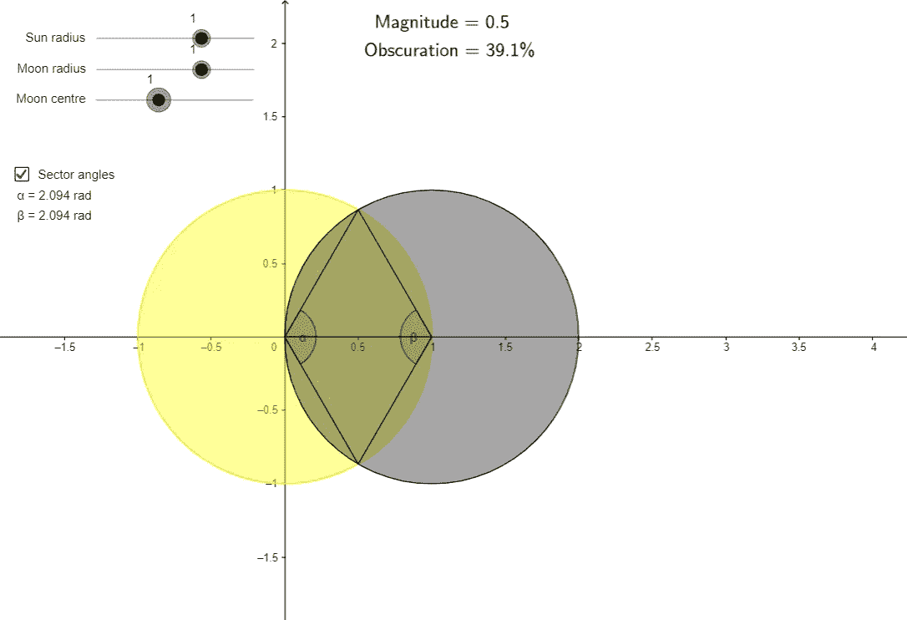
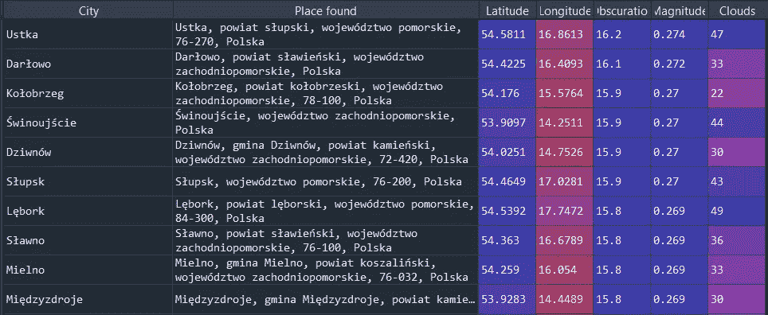

# 寻找观看日食的最佳地点:Pythonic 解决方案

> 原文：<https://medium.com/geekculture/finding-the-best-place-to-view-a-solar-eclipse-a-pythonic-solution-88591e3ad775?source=collection_archive---------47----------------------->

## 离日环食还有不到一个月的时间，开始寻找你喜欢的观看地点可能是有意义的。

然而，这并不是一项容易的任务。首先，日环食的[路径](https://www.timeanddate.com/eclipse/map/2021-june-10)本身，月亮覆盖太阳的中心，留下外缘的薄环可见，将穿过加拿大的部分地区，格陵兰岛，俄罗斯远东地区和美国的一小部分:这些不是世界上人口最稠密的地方，你不太可能生活在那个区域。对我们许多人来说，去那里旅行也相当昂贵，时间长，而且至少可以说不是很环保。第二，Covid。截至目前，即使在许多发达国家，疫苗接种也停滞不前，即使那些接种疫苗的人，虽然比未接种疫苗的人更能旅行，但他们的选择仍然有限，不同国家甚至不同地区之间也不同。例如，虽然我将能够在 6 月进入我的祖国，但在国内任何地方进行比一日游更具雄心的旅行实际上是不可行的，因为如果我们在另一个国家接种疫苗，我将无法与我的女朋友预订房间，在这种情况下，只有已婚夫妇才允许一起预订酒店房间。

对我们许多人来说，剩下的就是从离我们家相对较近的地方观察*日偏食，即月亮遮住部分日盘。这一次，世界上仍然只有少数人能够看到任何形式的日食，但是对于那些今年运气更好的人来说，这仍然比什么都没有好。那些在这次日食之外的人——这不是我们有生之年的最后一次日食，所以这篇文章在将来对你有用！*

现在，当选择一个我打算去寻找月食的大致区域时，我会考虑两件事:太阳有多少会被月亮遮住，因为我已经适应了日偏食，以及在主要事件发生时天气会怎么样。第一个可以通过暗度(被月球覆盖的太阳视盘的百分比)或星等(被月球覆盖的太阳视盘的直径部分)来测量——可以找到比我更好的解释[这里](https://www.geogebra.org/m/SnZ7QGTJ)，你甚至可以在那里玩滑块，以便更好地理解差异。在这种情况下，第二个对我来说是云层的同义词——有宜人的温度和微风是很好的，但那是次要的。



Difference between magnitude and obscuration illustrated, as per [geogebra.org](http://geogebra.org)

如果我按照几天前的计划在波兰看日食，我会去海边。它面向北方，从波兰看，这大概是日食“最强烈”的地方。问题是，这只是一个粗略的预测，虽然波兰海岸线上的 A 点和 B 点之间的差异很小，只有一个百分点，但我觉得很无聊，所以我决定潜得更深。


The differences between how will 2021 partial eclipse look like in different parts of Poland. First and second disks represent views from easternmost and westernmost points along Polish seashore, respectively. It’s not that easy to spot a difference, but it’s more noticeable when compared to a view from Warsaw in third disk and a view from Ustrzyki Dolne in south-eastern Poland in the last one. Source: [heavens-above.com](http://heavens-above.com)

**抓取居住场所列表的查看条件**

因此，我踏上了寻找封闭边界时代最佳观察点的旅程。作为第一步，我已经决定汇编一份波兰所有具有城镇地位的人口稠密地区的清单——共有 954 个。我使用维基百科列表作为我的来源，但是在你的国家，你可能想要更有创造性:也许你的人口普查/统计办公室或地理命名机构有容易获得的下载列表；当然，你可以自己列出清单，包括你认为可以观看日食的地方。

首先，导入稍后将需要的城镇和工具列表:

```
import pandas as pd
from selenium import webdriver
import time
from selenium.webdriver.common.keys import Keys
import csvlistOfCities = []with open(r'yourlocation.csv', newline='') as inputfile:
    for row in csv.reader(inputfile):
        listOfCities.append(row[0])places = []
latitudes = []
longitudes = []
obscuration = []
magnitude = []
```

后面的五个列表将存储循环的结果，该循环将在城市列表中寻找观看条件和其他参数。这将在下面讨论。

我毫不怀疑，如果你对天体物理学比较了解，找到一个特定地方的观测条件会容易得多，但是在网上搜索了关于日食观测条件的好资料后，我满足于两个选项:[timeanddate.com](https://www.timeanddate.com/eclipse/map/2021-june-10?n=262)和[heavens-above.com](https://www.heavens-above.com/SolarEclipseLocal.aspx?jdmax=2459375.94660477)；第一个被证明在寻找我所指的位置时会导致更多的错误，并且更依赖于连接质量，所以条目的其余部分将只处理第二个网站。因此，让我们推出一个使用 Selenium 的 Firefox，然后去天堂。记住，你需要下载[geckodriver.exe](https://github.com/mozilla/geckodriver/releases)才能通过 Selenium 控制浏览器！

```
driver = webdriver.Firefox(executable_path=r"yourlocation\geckodriver.exe")
time.sleep(5) # just in case
driver.get("[https://www.heavens-above.com/](https://www.heavens-above.com/)")
time.sleep(5) # giving it time to load
```

现在，一旦 Selenium 控制的浏览器窗口打开，我们就可以在城镇列表中循环查找以下内容:

*   当从列表中搜索一个城镇时(允许控制搜索引擎中的错误)，在天堂上找到的地方的名称将被存储在变量`places`中；
*   找到的一个地方的坐标——将需要检索天气数据——存储在变量`latitudes`和`longitudes`中；
*   日食高峰期的观赏条件— `obscuration`和`magnitude`变量。《巅峰时刻》也可以从同一页上刮下来，但我在这里没有这么做。

```
for i in range(len(listOfCities)):

    driver.find_element_by_xpath('//*[[@id](http://twitter.com/id)="ctl00_linkLatLong"]').click() #go to location change page
    time.sleep(2)
    searchbox = driver.find_element_by_xpath('//*[[@id](http://twitter.com/id)="ctl00_cph1_txtAddress"]')
    searchbox.send_keys(f"{listOfCities[i]}")
    time.sleep(2)
    searchbox.send_keys(Keys.ENTER)
    time.sleep(2)

    try:
        place = driver.find_element_by_xpath("/html/body/form/table/tbody/tr[3]/td[1]/div/table/tbody/tr[2]/td[2]/select/option[1]").text
    except:
        place = "Error"
    try:
        lat = driver.find_element_by_xpath("/html/body/form/table/tbody/tr[3]/td[1]/table[2]/tbody/tr[1]/td[2]/input").get_attribute("value")
    except:
        lat = "Error"
    try:
        lon = driver.find_element_by_xpath("/html/body/form/table/tbody/tr[3]/td[1]/table[2]/tbody/tr[2]/td[2]/input").get_attribute("value")
    except:
        lon = "Error"

    driver.find_element_by_xpath('//*[[@id](http://twitter.com/id)="ctl00_cph1_btnSubmit"]').click() #confirmation of location change
    time.sleep(2)

    try:
        driver.get("[https://www.heavens-above.com/SolarEclipseLocal.aspx?jdmax=2459375.94660477](https://www.heavens-above.com/SolarEclipseLocal.aspx?jdmax=2459375.94660477)") #go to the eclipse info page
    except:
        pass
    try:
        obs = float(driver.find_element_by_xpath('/html/body/form/table/tbody/tr[3]/td[1]/div[2]/div[1]/div[2]/div/div[2]/table/tbody/tr[4]/td[2]').text[:-1].replace(",", "."))
    except:
        obs = "Error"
    try:
        magn = float(driver.find_element_by_xpath('/html/body/form/table/tbody/tr[3]/td[1]/div[2]/div[1]/div[2]/div/div[2]/table/tbody/tr[3]/td[2]').text.replace(",", "."))
    except:
        magn = "Error"

    places.append(place)
    latitudes.append(lat)
    longitudes.append(lon)
    obscuration.append(obs)
    magnitude.append(magn)

    time.sleep(2)

driver.quit()df = pd.DataFrame(list(zip(listOfCities, places, latitudes, longitudes, obscuration, magnitude)), columns = ["City", "Place found", "Latitude", "Longitude", "Obscuration", "Magnitude"])
df.to_csv("yourfilename.csv", sep = ";", index = False)
```

循环的每一次迭代都要做两个步骤:首先，浏览器被定向到一个位置选择页面，在这里要搜索的城镇被输入到搜索框中。这允许改变观察 eclipse 状况的位置，并收集关于实际上找到了哪个位置的信息。然后，浏览器被重定向到 eclipse conditions 网站，在那里可以抓取和保存关于条件的信息。这被保存到数据帧中，该数据帧随后需要检查错误、可能的修正，然后它将被用于收集天气数据。

不幸的是，生成的数据帧可能需要更多的手动清理。这是错误搜索结果的结果(这里最能说明问题的例子可能是搜索引擎将两个波兰城镇——利普斯克和利普斯科理解为德国的莱比锡，因为莱比锡在波兰语中也被称为利普斯克)，这是无法避免的，以及由不稳定连接导致的错误，这显然是可以避免的。在我的案例中，这导致了 ca。2–3%的条目需要对观看条件进行纠正和人工审查。这个清洗过的数据集可以在[这里](https://github.com/danielrawinski/eclipseconditions/blob/main/poland_eclipses_ha_corrected_with_coords.csv) ***找到。***

**df . iloc[I]['纬度']，天气怎么样？**

清理后的数据集不仅可以从昏暗度和/或星等方面看到日食观测点，而且如前所述，还可以用来为它们寻找天气条件。为此，我们将使用[开放天气地图 API](https://openweathermap.org/api) 。他们的免费计划允许高达 60 次通话/分钟和每月 100 万次通话，这将这项练习轻松地置于这些限制之内。我们将使用他们的 [One Call API](https://openweathermap.org/api/one-call-api) 。

到目前为止，离日食发生还有两个多星期，天气预报显然还不可用，但是为了测试的目的，让我们假设日食发生在后天。这是在 8 天范围内，一个调用 Api 包含每日数据(今天+接下来的 7 天)，但还不包括 48 小时范围内的每小时数据；一旦日食时间临近，就可以而且应该切换到这些。

让我们循环查看城镇列表、观看条件及其坐标:

```
import pandas as pd
import requests
import timedf = pd.read_csv(r"yourfilename.csv", sep = ";")clouds = []for i in range(len(df)):
    request = requests.get(f"[https://api.openweathermap.org/data/2.5/onecall?lat={df.iloc[i]['Latitude']}&lon={df.iloc[i]['Longitude']}&exclude=current,minutely,hourly,alerts&appid=y](https://api.openweathermap.org/data/2.5/onecall?lat={corrected_df.iloc[i]['Latitude']}&lon={corrected_df.iloc[i]['Longitude']}&exclude=current,minutely,hourly,alerts&appid=b50e805ea2a45e1159521aa1a95bbe5b)ourapikey")
    requestJson = request.json()clouds.append(requestJson["daily"][3]["clouds"])
    time.sleep(1)

df["Clouds"] = clouds    
del cloudsresults = df.loc[(df["Clouds"] <= 50)].sort_values(by=["Magnitude"], ascending=False)
```

我在指定 API 调用目的地时使用了 f 字符串，这样它就可以从数据帧中获取地理坐标。接下来，排除当前、每分钟、每小时和天气警报输出(尽管，正如我提到的，随着月食的临近，你应该包括每小时的预报，并开始排除每天的预报；包括天气警报也可能是一个安全的好主意)。最后，提供了 API 密钥——在 OpenWeatherMap 网站上注册后可以轻松获得。

然后,`requestJson["daily"][3]["clouds"]`的输出会添加到`clouds`列表中，它显示了云的覆盖范围，即被云遮住的天空的百分比。`requestJson["daily"]`是一个字典列表，每一个都包含了很多关于某一天天气的有用信息(说真的，看看他们那里都有什么！)，所以第 0 个元素代表今天，第 1 个代表明天，以此类推。当包含在请求中时，此逻辑也适用于每小时输出。`results`数据帧是从观测条件数据帧(现在增加了表示云覆盖的列)中创建的，通过云覆盖进行过滤，并通过月食的大小进行排序。我在这里使用 50%作为临界值，但这当然是完全随意的，如果天气允许，你可能想用得更少，如果你运气不好，你可能想用得更多。

**选择观察点**



Results table head as seen on Spyder IDE

根据输出结果选择哪个地方完全取决于你。就我个人而言，我会关注 koobrzeg，因为它在暗度-星等组合 Ustka 方面比领先的预测好得多，并且靠近 Darł owo，如果那里的天气条件变得更好的话。

**总结**

本文展示了如何在大部分边界关闭且仍有移动限制的情况下，根据 a)观察者可到达的区域，b)该区域不同点的日食观测条件，c)云层覆盖预测，尝试并找到观看 2021 年日环食的最佳地点。

虽然为月食震级增加一千分之一或云层覆盖率减少一个百分点而斗争是不可否认的，但我也确信这可以以他们自己的方式使月食观测准备工作变得非常令人兴奋，人们可能会发现自己所在地区/国家的一些隐藏的宝石，只需去那里看一次月食，并为其自然和/或人为的美丽而停留。有时候旅程不是比目的地更重要吗？

**参考文献**

[1][2021 年 6 月 10 日日环食(timeanddate.com)](https://www.timeanddate.com/eclipse/solar/2021-june-10)
【2】[月食星等和暗度—GeoGebra](https://www.geogebra.org/m/SnZ7QGTJ)
【3】[诸天之上](https://heavens-above.com/)
【4】[mia sta w Polsce—维基百科、wolna encyclopedia](https://pl.wikipedia.org/wiki/Miasta_w_Polsce)
【5】[发布 Mozilla/geckodriver(github.com)](https://github.com/mozilla/geckodriver/releases)
【6】[danielrawins](https://github.com/danielrawinski/eclipseconditions)