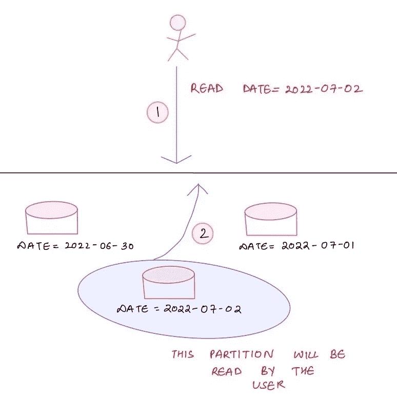

# 找到最近的日期并不像你想象的那么容易

> 原文：<https://medium.com/geekculture/finding-the-latest-date-is-not-as-easy-as-you-would-think-2d6a0a49eda1?source=collection_archive---------3----------------------->

## 了解如何在 Spark 中查找日期分区列中的最新值


Photo by [Akbar Tarkati](https://unsplash.com/@bahlooldesigner?utm_source=unsplash&utm_medium=referral&utm_content=creditCopyText) on [Unsplash](https://unsplash.com/s/photos/latest?utm_source=unsplash&utm_medium=referral&utm_content=creditCopyText)

这是一篇非常有趣的文章，因为它打破了关于分区列的神话，我的意思是分区是如此惊人，以至于在某些时候我们开始认为它是理所当然的。*至少我做了*，这篇文章是关于我从假设的错误中学到的东西。

所以，让我们开始吧！

好的，那么当您在分布式存储(如 HDFS/S3 或实际上任何存储)中存储大量数据时，您首先会做什么？

您*对它进行分区*，以便更容易地访问数据。基本上，一旦我决定了一个(或多个)列，它可以在存储数据时被指定为分区列，这样当我下一次访问它时，使用分区列作为过滤器，访问可以很快完成。

还在迷茫？让我们想象一下分区:



Image by Author

如果还不清楚，[这里的](https://www.datio.com/iaas/understanding-the-data-partitioning-technique/#:~:text=In%20HDFS%20the%20files%20are,shelves%20would%20be%20the%20Datanodes.)是一些可以用来理解分区的资源。

# 问题

好了，已经定义了分区，让我们讨论一下用例。**作为本文的参考，所有操作都在 Spark 中执行。**

我正在处理一个由`date`划分的数据(姑且称之为我们的数据`medium_article_stats`),并需要从中获取最新的数据，那么我做了什么呢？

我 ***假设*** 数据由`date`分区，我可以简单地在`date`列上运行`max`，它将使用分区元数据(基本上是跟踪从哪里获取我们的分区的信息)来计算。

类似于:

```
medium_article_stats.select(max("date")).show
```

## 问题

现在，这能行吗？

如果你知道这个答案，我为你骄傲！如果没有，让我们来发现答案。

## 回答

是的，这行得通。

我打赌你没想到会有这一天！

但是它确实可以工作，但是请注意，为了计算最大值，将扫描整个数据以实际获取列的最大值！！

当然，如果数据存储为 parquet/orc，可能会有格式级的优化，但是我们使用分区元数据计算`max date`的假设肯定是不准确的。

## 那么，这意味着什么呢？

这意味着如果你正在运行`max(date)`,它就像扫描你的完整数据来获取`max`,并且在数据量很大的情况下会非常慢(因为你已经对它进行了分区)

在查看上述查询的 Spark 查询执行计划时，我发现了这个缓慢的问题

```
== Physical Plan ==
(1) Scan csv 

(2) SortAggregate
Input [1]: [date#26]
Keys: []
Functions [1]: [partial_max(date#26)]
Aggregate Attributes [1]: [max#107]
Results [1]: [max#108]

(3) Exchange
Input [1]: [max#108]
Arguments: SinglePartition, ENSURE_REQUIREMENTS, [id=#41]

(4) SortAggregate
Input [1]: [max#108]
Keys: []
Functions [1]: [max(date#26)]
Aggregate Attributes [1]: [max(date#26)#101]
Results [1]: [max(date#26)#101 AS max(date)#105]
```

在这里，我们可以看到，为了计算最大值，首先在单个任务级别`(2)`计算`partial_max`,然后进行洗牌`(3)`,所有内容都被放入单个分区&,最后计算`max`。

这里的`(2)`和`(3)`是对大型数据集的极其昂贵的操作，想象一下扫描 3 年的数据！(*不要测试* *在 S3 运行这个查询，扫描 3 年的数据后的账单可能会让你骨折*)

如果我们的假设是准确的，那么基本上只有`(4)`会运行，扫描分区元数据并给我 max，但事实并非如此。

理解了为什么`max(date)`很慢之后，让我们看看如何在一个分区的列中找到最新的日期？

# 解决方法

## 方法 1:使用`SHOW PARTITIONS`

如果一个外部的 hive 表存在于你存储在 HDFS 的数据之上，我们可以显式地做我们假设会发生的事情

```
spark.sql("show partitions medium_article_stats").select(max("partition")).show(truncate=false)
```

这里，`max`将只在分区上计算，与直接在表上运行`max`相比，速度要快得多。

## 方法 2:添加过滤器

如果您的数据上没有 hive 表，并且主要处理路径，那么在`date`上添加一个显式的`filter`，然后再计算`max`，可以帮助加快查询速度。但是请注意，`date`之后的数据仍然会被扫描用于`max`计算。

```
medium_article_stats.filter(col("date") > "2022-05-01").select(max("date")).show
```

## 方法 3:从 S3/HDFS 路径导出最大值

这是一种黑客行为，基本上，这个想法是

*   列出目录中的所有路径

```
medium_article_stats/date=2022-01-20
medium_article_stats/date=2022-01-21
medium_article_stats/date=2022-01-22
medium_article_stats/date=2022-01-23
medium_article_stats/date=2022-01-24
```

*   拆分字符串，以便在列表中抓取`date`

```
[2022-01-20, 2022-01-21, 2022-01-22, 2022-01-23, 2022-01-24]
```

*   计算列表中的`max`

好吧，这是我能想到的一些方法，如果你还有其他问题，请随时发表评论:)

嗯，就这样吧！这就是我今天想要分享的知识，如何在对分区列执行`max`时避免全表扫描。这里需要注意的另一件事是，即使我们在列上运行`max`，也要记住一个分区的列总是一个`string`数据类型，所以要为列设置格式，以便在其上运行`max`能够给出准确的结果。

例如，如果你的`date`格式看起来像这样，即使过滤仍然有效，运行 max 会给出不准确的结果。

```
medium_article_stats/date=2022-01-1
medium_article_stats/date=2022-01-10
medium_article_stats/date=2022-01-2
medium_article_stats/date=2022-01-3
medium_article_stats/date=2022-01-4 # This would be returned as max as it is a string comparison
```

推荐的格式之一是:

```
medium_article_stats/date=2022-01-01
medium_article_stats/date=2022-01-10 # Accurate max calculation
medium_article_stats/date=2022-01-02
medium_article_stats/date=2022-01-03
medium_article_stats/date=2022-01-04
```

希望这有所帮助，你可能不会犯和我一样的错误。

如果你喜欢这篇文章，请为它鼓掌，它让我微笑，激励我继续写作！:)

快乐学习，
JD