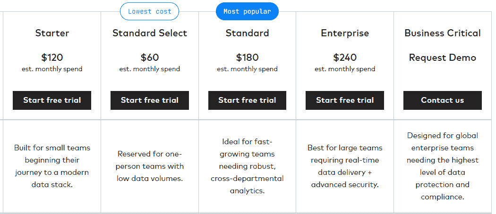
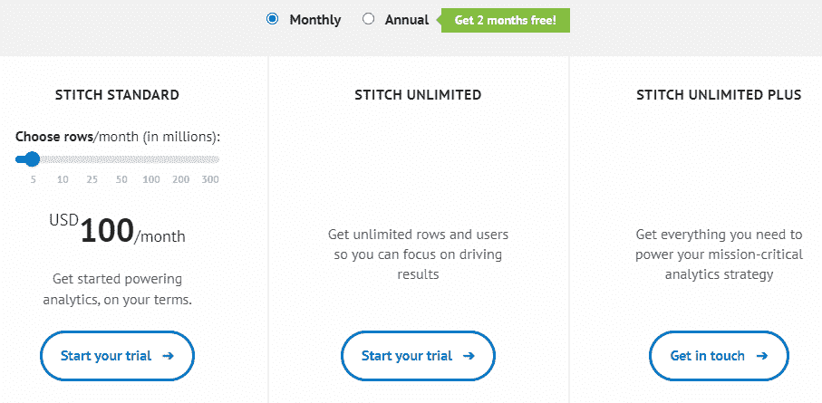

# Fivetran vs Stitch vs Knowi

> 原文：<https://medium.com/geekculture/fivetran-vs-stitch-vs-knowi-456d6e1d5d7b?source=collection_archive---------4----------------------->

三向比较，帮助您选择最适合您使用的工具

Image by Author

# **简介**

在寻找数据集成工具时，您可能会对现有的众多选择感到困惑。在本文中，我们将介绍三种数据集成工具: [Fivetran](https://www.stitchdata.com/) 、 [Stitch](https://www.stitchdata.com/) 和 [Knowi](https://www.knowi.com/) 。FiveTran 和 Stitch 采用类似的方法将数据从源传输到目的地，而 Knowi 采用不同的方法，使用数据集即服务模型。但是首先，让我们对每个工具做一个简单的概述。

# 五川

Fivetran logo

Fivetran 是一个基于云的 ETL 工具，是为数据工程师和数据分析师开发的。它提供了几个内置的集成来帮助用户将他们的数据移动到 BI 工具或数据仓库中。

Fivetran 允许您从不同的平台提取数据，包括 Mailchimp、AdWords、Salesforce、HubSpot 和 Google Analytics。它带有现成的连接器，可以自动适应模式和 API 的变化，提供可靠和一致的数据访问。

Fivetran 可以同步源应用程序和任何目的地之间的数据传输，还可以促进仓库内的数据转换，并提供特定于源的分析模板。它由泰勒·布朗和乔治·弗雷泽于 2012 年发起。

# 一针

Stitch logo

[Stitch](https://www.stitchdata.com/) 是为开发者打造的 ETL 工具。它将脸书广告和销售等 SaaS 平台与谷歌 BigQuery、亚马逊红移和雪花等云数据仓库连接起来。它使用由 Singer 支持的开源 ETL 集成。

Stitch 可以将来自 120 多个云和数据源的数据提取到一个位置进行分析。它还支持定制加载，允许开发人员决定加载时间、定制数据选择和复制频率。

# Knowi

Knowi logo

Fivetran 和 Stitch 专注于将原始数据传输到一个集中的仓库，而 [Knowi](https://www.knowi.com/) 使用他们的“没有统一数据的统一分析”范式以不同的方式处理这个问题。其核心是使用数据集即服务模型，该模型消除了通过 ETL 步骤获取数据的需要，并绕过了将原始数据保存到数据仓库的需要。这种方法允许您与源进行本地交互——无论是 SQL 数据库、NoSQL 数据库、云服务还是 API 等。—以及与数据实时交互的能力。

当这些数据集需要存储时，Knowi 提供了开箱即用的存储机制，或者您可以将该数据集推入您的数据仓库。

使用 Knowi 查询数据后，您可以在平台中可视化它，或者使用您选择的 BI 工具。Knowi 的搜索驱动分析功能可以让你用英语提出数据问题，并立即以可视化的形式获得答案。因此，它是一个集查询、探索和可视化数据于一体的解决方案。

Knowi 于 2015 年推出。

# Fivetran vs Stitch vs Knowi

在本节中，我们将讨论这三种工具的相互比较。将考虑以下核心领域:

*   连接/集成
*   数据转换
*   警报/异常检测
*   支持的数据
*   多源连接
*   形象化
*   把...嵌入
*   客户支持
*   定价

# 查询和数据浏览

Fivetran 是一个 ETL 工具，它连接到您的数据源，从中获取数据，并将其写入您的目标目的地，如数据仓库。因此，它不做任何数据探索。一旦数据到达最终目的地，您就可以使用您选择的 BI 工具来浏览数据。在大多数情况下，数据在途中和到达目的地之前会被扭曲，从而导致混乱的数据。

就像 Fivetran 一样，Stitch 是一个数据管道工具，可以让您连接到数据源，从数据源中提取数据，并将其移动到您想要的目的地，而无需进行任何探索。

另一方面，Knowi 为您提供了数据探索和查询生成特性，以及编写自己的查询的能力。您可以跨 SQL、NoSQL、REST APIs 和其他数据源执行原生查询。您只需在数据库中实时运行查询，并将结果保存到 Knowi 的 ElasticStore 数据仓库中，而不是将数据移动到数据仓库，从而跳过传统的 ETL 处理。这个数据集也可以发送到您的数据仓库。然后，您可以使用该数据集创建可视化效果和报告，将其与其他数据集连接，并执行其他下游分析。Knowi 将任何查询的结果视为一个数据集，它们可以用作另一个查询的输入。

# 连接/集成

Fivetran data sources (Source-www.fivetran.com)

Fivetran 带有 100 多个数据连接器，适用于不同的数据库、云平台和 SaaS 应用程序。Fivetran 支持各种数据仓库目的地，但不支持数据湖。它的集成页面还显示了路线图上的连接器，因此请确保在购买之前选择完整的连接器。Fivetran 的客户可以请求 Fivetran 构建到新数据源的连接器，但是只有 Fivetran 团队可以创建新的连接器或者对现有的连接器进行更改。

Stitch 支持与 100 多个数据库和 SaaS 集成，以及 8 个数据仓库和数据湖目的地的集成。

Stitch data sources (Source-www.stitchdata.com)

它的客户可以联系 Stitch 来创建新的源，任何用户都可以向 Stitch 添加新的源，只要他们遵守 Singer 要求的标准。然而，这要求一个人必须有胜任的编码技能。

Knowi 支持集成超过 36 个结构化和非结构化数据源，如 MongoDB、Apache Cassandra、Elasticsearch 等。

Knowi data sources (source-knowi.com)

与其他数据集成工具不同，Knowi 自带了到 NoSQL 数据源的本地连接器，让用户不再需要依赖第三方驱动程序。它还是完全本机的，不需要“关系化”数据。

当谈到云集成的数量时，Fivetran 和 Stitch 领先。然而，值得一提的是，Knowi 有一个强大的 REST API 集成，允许您通过 API 连接到任何东西，并跨其他数据源连接结果。

# 数据转换

Fivetran 是一款英语教学工具。这意味着在将数据加载到目的地之前，它不会对数据执行任何转换。最近，它增加了对使用复制粘贴 SQL 的后加载转换的支持。

就像 Fivetran 一样，Stitch 也是一个 ELT 工具。这意味着在将数据加载到目的地之前，它不会对数据执行任何转换。可能需要的唯一转换是转换数据类型，以确保数据与其目的地兼容。

Knowi 支持在返回的结果集之上通过 Cloud9QL(一种类似 SQL 的语法)或 UI 进行可选的转换。您可以直接在 Knowi 平台中修改和计算新数据，而无需依赖其他数据准备工具。

# 警报/异常检测

Fivetran 在用户仪表板的警报页面上生成警报。它生成两种类型的警报，即任务和警告。任务描述可能阻止 Fivetran 同步您的数据的问题。警告描述了您可能需要修复的任何问题，但它们不会阻止 Fivetran 同步您的数据。

Fivetran 还生成并发送电子邮件通知，以通知新任务或连接器故障等事件。然后你可以采取必要的行动，以免为时过晚。这些通知可能是关于您的连接器、转换或您的 Fivetran 帐户的。

Stitch 还会生成应用内和电子邮件通知。通知分为五个类别，即帐户、集成、目标、复制和内部。当您的 Stitch 帐户需要关注时，会生成帐户通知。集成通知通知您 Stitch 建立集成时出现的任何问题。当 Stitch 遇到目标目的地问题时，目的地通知会提醒您。当 Stitch 在数据复制过程中遇到问题时，会生成复制通知。当 Stitch 面临内部问题时，会发送内部通知。

Knowi 发送提醒，让用户了解他们的数据和业务的最新情况。当数据中出现特定阈值、条件和异常时，警报会发送实时通知。Knowi 还允许其用户根据数据中的阈值、异常或自定义条件直接在小部件上设置警报。警报可以通过 slack、电子邮件或 webhook 发送。

# 支持的数据

Fivetran 只复制结构化数据。它依赖表和模式作为数据组织的构建块。Fivetran 解析所有数据，将数据源中的每一列进行类型转换并映射到目标中相应的表列。

Stitch 支持常见的和特定于集成的数据类型。所有集成都支持通用数据类型，而特定集成以及集成版本都支持特定于集成的数据类型。例如，仅 PostgreSQL 集成支持 HSTORE 数据类型。如果某个数据类型既不属于通用类别，也不属于特定于集成的类别，Stitch 就不支持该数据类型的复制。

Knowi 的数据虚拟化功能允许它处理任何类型的数据，无论是结构化数据、非结构化数据、小数据还是大数据，而无需考虑底层数据结构。Knowi 用户还可以执行结构化和非结构化数据源之间的连接。

# 多源连接

Fivetran 连接到支持的数据源，从数据源中提取数据，并将其加载到您想要的目的地。每个数据源都有一个或多个独立运行的连接器。因此，Fivetran 不支持任何类型的连接操作。但是，Fivetran 允许您将多个数据源的数据加载到一个目的地。

和 Fivetran 一样，Stitch 也不支持多源 join 操作。它只帮助您将数据整合到您选择的数据仓库中，然后使用您选择的 BI 工具对其进行分析。

Knowi 支持跨多个数据源的连接操作，以混合和存储组合数据。连接操作依赖于数据源之间的公共字段。连接操作是动态完成的，没有传统的 ETL 处理，其结果可以存储在 Knowi 的 ElasticStore 无模式仓库中。

Creating a join in Knowi (Source-knowi.com)

使用 Knowi，您可以执行内部连接、左外部连接、全外部连接、右外部连接或循环连接。内部联接被用作联接操作的默认类型。Knowi 支持跨多个数据源的数百万条记录的大规模连接操作。它还为用户提供了优化连接操作的机制，以加快处理速度。

# 形象化

Fivetran 是一个数据集成工具，允许你从支持的数据源提取数据到你喜欢的目的地。一旦数据到达预期目的地，您可以选择一个 BI 工具来可视化数据，这取决于您。

就像 Fivetran 一样，Stitch 没有用于数据可视化的原生可视化。然而，Stitch 构建了您的数据，以便与顶级数据分析工具和平台兼容。Stitch 兼容各种 BI 平台，如 Amazon Quicksight、Tableau、Power BI 等。您可以依靠这些平台来实现数据可视化。

Knowi 提供可视化作为其统一平台的一部分，该平台拥有 30 多种可视化和自然语言 BI 功能，直接位于其数据之上作为服务层。Knowi 用户还可以使用 JavaScript 创建定制的可视化，以满足他们的特定需求。如果需要，您还可以在 Knowi 的数据集上使用现有的 BI 工具。

# 把...嵌入

Fivetran 具有“由 Fivetran 提供动力”的功能，这使得 Fivetran 用户可以轻松地在 web 门户和分析门户上嵌入 Fivetran 自动化数据连接器。该功能包括 Fivetran 支持的数据复制和自动化技术，以及旨在支持从最终用户收集数据的独特要求的附加组件。实施后，由 Fivetran 提供支持的为用户将数据装载到他们的平台上提供了一种自助服务方式。

Stitch 附带了“Stitch Connect”特性，使应用程序开发人员能够使用一个工具包将多个数据源集成到他们的应用程序中。Stitch Connect 附带了 JavaScript 用户界面和 API，开发人员可以使用它们以编程方式提供和访问 Stitch 帐户、创建目标连接、配置和更改数据源，以及选择用于复制的字段和流。

Knowi 有许多支持嵌入式分析的选项。用户可以生成仪表板的 URL，并将其嵌入到外部应用程序中。Knowi 用户可以创建仪表板的安全 URL，使用参数来控制向客户公开的数据类型。它还提供了单点登录 API 特性，该特性有助于系统中用户之间的令牌交换，以映射到具有用户权限的 Knowi。

# 分析学

Fivetran 没有附带数据分析工具。它只允许您将数据从不同的源移动到一个或多个目的地。如果您想要对数据执行分析，那么您可以选择 BI 或数据分析工具，并在数据到达目的地后对其进行分析。

和 Fivetran 一样，Stitch 也没有内置的数据分析工具。您只能使用 Stitch 来整合和优化您的数据，但如果您想要探索数据，您将需要一个数据分析工具。好在 Stitch 兼容很多 BI 和数据科学工具。

Knowi 有一个由自然语言处理驱动的搜索驱动的分析功能。这个特性允许 Knowi 用户用简单的英语提问，并以表格、图表和图形的形式得到答案。Knowi 也在 Slack 和微软团队上推出了这一功能，允许用户直接从这些应用中提问，并获得即时回答。

# 客户支持

Fivetran 附带了大量文档，包括功能文档、设置指南和 API 文档。这些涵盖了如何使用 Fivetran 的所有内容。它还带有一个知识库，您可以在其中键入您的问题，并获得对您有帮助的热门文章建议。

Fivetran knowledge base (Source-fivetran.com)

如果您没有得到帮助，Fivetran 允许您通过提供 24/7 支持的门户网站提交请求来联系其支持团队。

Stitch 还附带了大量的文档来帮助客户解决他们的任何问题。该文档介绍了所有内容，从入门的初始步骤到设置缝合数据管道。它还附带了一个知识库，您可以在其中键入您的问题，并获得顶级文章建议，您可以在其中获得问题的答案。

Stitch knowledge base (Source-www.stitchdata.com)

如果您的问题没有得到答案，您可以通过聊天系统向 Talend 团队发送电子邮件来联系他们。

Knowi 提供了一个知识库，用户可以在其中键入他们的问题，并以文章的形式获得答案。用户在输入时会得到可能回答他们问题的热门文章建议。

Knowi help center (Source-www.knowi.com)

Knowi 还附带了关于如何使用他们平台的发行说明。他们还推出了一个社区论坛，提供可能对用户有帮助的问题和答案。他们还有一个由 zendesk 支持的聊天系统，允许用户与工程师实时互动。

# 定价

Fivetran 采用基于消费的定价方式，根据你的使用量收费。您的消费是根据您帐户中所有目的地和连接的每月活动行数(MAR)计算的。

他们有 5 种定价方案，最便宜的方案每月吸引 60 美元的费用。

Fivetran pricing plans (Source-[www.fivetran.com](http://www.fivetran.com))

缝合提供三个价格等级，即缝合标准，缝合无限，缝合无限加。

Stitch pricing tiers(Source-www.stitchdata.com)

标准计划提供基本功能，每月费用为 100 美元。无限计划提供无限行，帮助您专注于推动结果。Unlimited Plus 计划适合具有无限数据集成需求的大型企业。您可以联系 Stitch 团队了解其定价信息。

Knowi 提供三种定价方案，即基本版、团队版和企业版。每个计划都配有全面的入职培训和技术支持。Knowi 为创业公司和非营利组织提供折扣。Knowi 对需要用户等的电子邮件报告不收费。在其他系统中。

# five tran vs Stitch vs Knowi-最终想法

从上面的讨论中，你可以看出 Fivetran 和 Stitch 是数据集成工具，而 Knowi 是一个一体化的解决方案，既提供数据集成工具，又提供 BI 服务。

如果您是一名数据工程师或数据分析师，正在寻找能够将数据从不同的结构化数据源提取到您的数据仓库的数据集成工具，请选择 [Fivetran](https://www.stitchdata.com/) 。Fivetran 也不允许你创建新的数据连接器，但是你可以联系他们的团队为你创建一个新的连接器。请注意，Fivetran 不提供数据可视化服务，因此，在到达数据仓库后，您必须寻找一个 BI 工具来可视化您的数据。

如果您是一名开发人员，正在寻找能够连接到不同数据源和数据湖的数据集成工具，请选择[缝合](https://www.stitchdata.com/)。如果您有良好的编码技能，Stitch 允许您创建新的数据源连接器，前提是您遵守 Singer 提供的标准。就像 Fivetran 一样，Stitch 不提供数据分析和可视化服务，但它兼容许多数据科学工具。

如果你没有被数据传输器、转换器和数据仓库的现有流程所束缚，考虑一下 [Knowi](https://www.knowi.com/) 。这是一个从原始数据一直到业务用户的端到端平台，减少了步骤数量和堆栈复杂性。