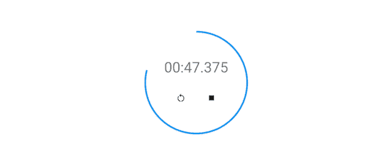

# 颤振中的定时器精度

> 原文：<https://medium.com/geekculture/flutter-case-study-timer-precision-a1154b431e8?source=collection_archive---------1----------------------->

## 颤振案例研究



# 介绍

我在 stack overflow[上看到一个关于 Flutter(Dart ' s)](https://stackoverflow.com)`[Timer](https://api.dart.dev/stable/2.16.2/dart-async/Timer-class.html)`职业的帖子。用户注意到了`Timer`的回调触发的变化，感觉它没有按预期工作。具体来说，用户表示，当将`Timer`的周期设置为 20 毫秒时，执行之间的时间间隔经常落在 100-1000 毫秒的不可接受的范围内。要了解这里发生了什么以及如何解决它，我们应该从看一看 Dart 的`Timer`类开始。

# 计时器

Dart 中的`Timer`类是调度异步任务的强大工具，这些任务在后台处理一次或多次工作。然而，如果你使用过它，你可能会注意到实际的计时不是很精确(对于一个叫做 **Timer** 的类来说不是很直观🤔).这在使用`Timer.periodic`时尤为明显。如果我们研究这个类的代码，我们会发现下面的注释:

```
The exact timing depends on the underlying timer implementation. No more than `n` callbacks will be made in `duration * n` time, but the time between two consecutive callbacks can be shorter and longer than `duration`.
```

看来，`Timer`和 Dart 的*事件循环*的性质是造成回调持续时间变化的原因。当然，随着更多的事件被添加到循环中，我们可以看到它如何影响时间。如果我们需要定期(即每帧)更新一次`Widget`，那么`Timer`显然不是最好的方法。如果您不熟悉 Dart 的事件循环，请查看下面的视频。

# 心脏

幸运的是，在 Flutter 中有一个计时机制，我们可以指望它非常稳定。它依赖于以一致的 60 fps 绘制帧，并且由于它在每一帧被绘制之前触发，这是尽可能频繁和一致地更新我们的 UI 的完美方式！这种方法使用了 Flutter 的`scheduler`库中的`[Ticker](https://api.flutter.dev/flutter/scheduler/Ticker-class.html)`类。我们去看看。

我们将创建一个简单的秒表部件。首先，让我们定义我们的`Stopwatch`小部件和`State`。我们将使用`SingleTickerProviderStateMixin`来提供对我们的`State`中的`Ticker`的访问。如果你在 Flutter 中做过动画，你可能已经遇到过了。我们还将提供变量来跟踪经过的时间。

```
class Stopwatch extends StatefulWidget {
  const Stopwatch({Key? key}) : super(key: key); @override
  State<Stopwatch> createState() => _StopwatchState();
}class _StopwatchState extends State<Stopwatch>
    with SingleTickerProviderStateMixin {
  var elapsed = Duration.zero;
  var previousElapsed = Duration.zero; @override
  Widget build(BuildContext context) {
    // TODO: implement UI
  }
}
```

我们定义`previousElapsed`是为了帮助我们在暂停&重启秒表时记录持续时间。接下来，我们将使用由`SingleTickerProviderStateMixin`提供的恰当命名的`createTicker`方法来创建我们的`Ticker`。我喜欢使用`late`关键字来实例化变量，但是您可能更喜欢先定义它，然后在`initState`中实例化它。无论哪种方式，请务必处理掉`Ticker`。

```
late final ticker = createTicker((elapsed) {
  setState(() => this.elapsed = elapsed);
});@override
void dispose() {
  ticker.dispose();
  super.dispose();
}
```

如您所见，我们只是定义了一个回调函数，它更新我们的运行时间`Duration`并调用`setState`。现在，让我们定义我们的`start`、`stop`和`reset`方法。

```
void start() {
  previousElapsed += elapsed;
  ticker.start();
}void stop() => setState(() => ticker.stop());void reset() {
  stop();
  setState(() => elapsed = previousElapsed = Duration.zero);
}
```

这些方法非常简单，但是请注意我们在哪里更新`previousElapsed`确保我们在没有复位的情况下启动&停止时不会丢失轨迹。还要注意，我们从`stop` & `reset`调用`setState`来更新 UI。启动`Ticker`时没有必要，因为我们的回调在每帧调用`setState`。

剩下唯一要做的就是实现我们的`build`方法，使用我们的`Duration`变量来显示经过的时间。

```
@override
Widget build(BuildContext context) {
  final totalElapsed = elapsed + previousElapsed;
  return Column(
    mainAxisAlignment: MainAxisAlignment.center,
    children: <Widget>[
      FormattedDuration(elapsed: totalElapsed),
      Row(
        mainAxisAlignment: MainAxisAlignment.center,
        children: [
          IconButton(
            onPressed: reset,
            icon: const Icon(Icons.restart_alt),
          ),
          IconButton(
            onPressed: ticker.isTicking ? stop : start,
            icon: Icon(ticker.isTicking ? Icons.stop : Icons.play_arrow),
          ),
        ],
      ),
    ],
  );
}
```

为了简洁起见，我省略了任何无关的格式和布局代码。需要注意的重要部分是我们通过添加`elapsed` & `previousElapsed`和`ticker.isTicking`的使用来计算`totalElapsed` `Duration`。如果`Ticker`已经在下一个帧*上调度了对其回调的调用，则该属性为`true`，这意味着它正在运行。*

```
**NOTE:** Ticker also has an isActive property. isActive can be true even when the Ticker is muted (not actively scheduling calls to its callback). That is why we use isTicking here.
```

# 警告

这种方法非常适合任何更新应用程序 UI 的预定任务，因为它保证每帧调用一次。您还可以使用它来安排任何其他每秒需要发生不超过 60 次(大约。每 16.6 毫秒)。例如，您可以以 120 bpm 播放节拍器声音(每秒两次/每 30 帧一次)。

但是，如果你需要更频繁地重复任务，那么这是不合适的。这种方法也是特定于 Flutter 的，所以如果您单独使用 Dart，它就不适用。如果这两种情况中的任何一种适用于你，我建议你去看看[这个](https://gist.github.com/mitsuoka/2652622)图书馆。它为精确计时创建了一个`Isolate`。我不是作者，也没有丰富的经验，所以你的收获可能会有所不同。作者声称精确度在几毫秒之内。不过应该注意的是，`Isolate`之间的通信是异步的，并且会受到不规则性的影响，所以在计划项目时要记住这一点。

# 结论

我希望你喜欢这篇文章，并在阅读过程中学到了一些有价值的东西。`Ticker`是 Flutter 的`scheduling`库的强大组成部分，可以帮助我们保证每一帧的时序。

一如既往的感谢阅读！鼓励评论，赞赏掌声。请跟随跟上我的颤振文章和更多。