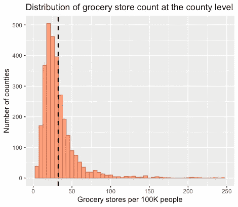
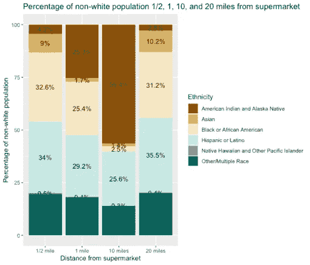
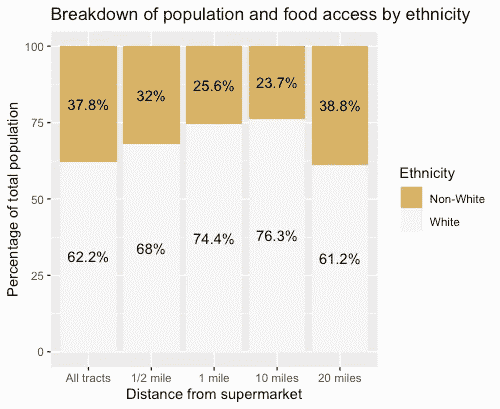
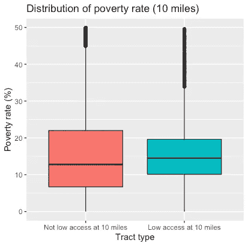
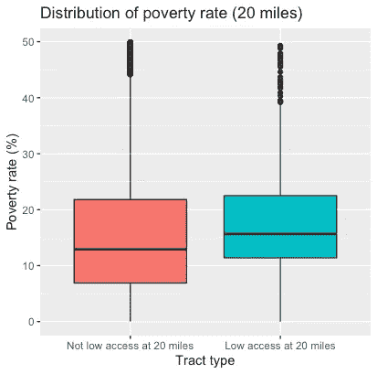
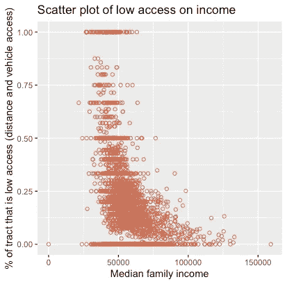
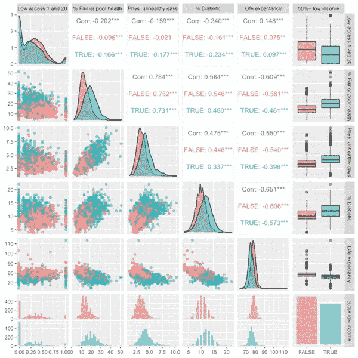
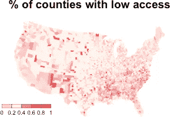

# 食物沙漠:描绘超市通路的差距

> 原文：<https://medium.com/geekculture/food-deserts-mapping-the-gap-in-supermarket-access-330b31fbc372?source=collection_archive---------10----------------------->

Photo by [Mockaroon](https://unsplash.com/@mockaroon?utm_source=medium&utm_medium=referral) on [Unsplash](https://unsplash.com?utm_source=medium&utm_medium=referral)

如果你在 Medium 的图片搜索中输入“食物沙漠”,你会找到几页类似上面的图片。看起来很好吃，但是很不一样。食物沙漠实际上很难定义。他们指的是那些很难去杂货店、超市或其他健康实惠的食物来源的地区。低进入率通常以离最近的超市的距离来衡量，并与其他指标如车辆进入率和家庭收入相结合。它们是社会经济不公平的众多指标之一。

该数据产品的目的是确定什么指标确切定义了食物沙漠，检查各种人口统计的低获取率有何不同，并了解食物沙漠对各种健康结果的影响程度。更广泛地说，通过绘制食物沙漠，这项研究可以用来建议 ALDI 等低价杂货连锁店下一步应该在哪里开店，以影响最弱势的人群。

我的主要数据集是来自美国农业部经济研究项目的[食物获取研究图集](https://www.ers.usda.gov/data-products/food-access-research-atlas/download-the-data/#Archived%20Versions)，其中包含人口普查区域层面的数据。我将这个数据集汇总到县一级，并与美国人口普查局的 [2015 县商业模式](https://www.census.gov/data/tables/2015/econ/cbp/2015-combined-report.html)和 [2015 县健康排名](https://www.countyhealthrankings.org/explore-health-rankings/rankings-data-documentation/national-data-documentation-2010-2018)合并。所有的清洁、分析和可视化都是在 r。

## 杂货店计数概述

让我们从绘制县级杂货店数量的分布开始。正如我们在下面的图表中看到的，杂货店的数量是非常右偏的。与人口相比，一小部分县拥有非常多的杂货店。然而，事实证明，每 10 万人拥有最多杂货店的前 10 个县在阿拉斯加、科罗拉多、内布拉斯加、蒙大拿和俄勒冈。这些县的人口非常少，夸大了我们的杂货店计数指标。

这表明**食物获取是一个更微妙的问题**来确定，杂货店计数是不够的。

## 人口普查地区级数据概述

首先，让我们简要探讨一下人口普查地区级数据中的人口统计数据。如下图所示，美国大约 3/4 的人口普查区域被划分为城市。此外，城市地区的低收入比例高于非城市地区。这一点很重要，有两个原因:

1.  作为城市居民和非城市居民，住在离超市 10 英里远的地方感觉非常不同。因此，当我们在下一节中检查超市附近的数据时，我们需要理解，即使是 1 英里或更远的距离也是大量城市居民低可及性的信号。
2.  我们还没有研究收入和食物获取之间的关系，但如果这种关系存在，城市居民可能会不成比例地经历低食物获取。

## 按种族划分的超市准入

下面的第一张图表显示了居住在距离超市 1/2 英里、1 英里、10 英里和 20 英里以上的不同非白人种族的百分比。下面的第二张图表对此进行了透视，描绘了美国非白人人口的种族划分。

在 1/2 英里和 20 英里处，比例相当匹配。然而，美国印第安人和阿拉斯加土著人口不成比例地居住在距离超市 1 英里和 10 英里的地方。特别是对于后者，AIAN 人口占居住在距离超市 10 英里以上的非白人人口的 56.4%，而仅占美国非白人人口总数的 2.2%。

从更广泛的角度来看少数民族进入超市的情况，似乎*至少在总体上*，非白人与白人相比，进入超市的机会并没有少得不成比例。事实上，下面的图表显示，白人人口占美国总人口的 62.2%，但 73.6%的人居住在距离超市 10 英里以上的地方。

## 贫困和超市准入

接下来，我们再来回顾一下收入和超市准入的关系。**出于多种原因，我最初的假设是收入和超市准入之间存在显著的关系。也许超市想在收入较高的地区开店，或者低收入人群缺乏资源支持额外超市的运营。**

以下两个图表描述了被归类为 10 英里(和 20 英里)低通道和非 10 英里(和 20 英里)低通道的人口普查区域的贫困率分布。请注意，数据经过过滤，排除了贫困率为 50%及以上的异常区域。我们可以看到，被划分为 10 英里以内的低通道区域的中位贫困率略高于其他区域(14.5%比 12.8%)。对于 20 英里处被归类为低通道的区域，这种差异更大(15.7%比 12.9%)。这表明**贫困率和超市准入之间存在某种关系**，但没有我预期的那么显著。

也许仅仅距离超市的距离并不是食物沙漠的最佳衡量标准。收入较高的郊区往往会向外扩张，这些地区的居民可能会开车去更远的超市。显然，这不同于经历粮食不安全。下面的图表使用了一种不同的方法来衡量低交通流量:居住在距离超市 20 英里以上的**低交通流量区域的百分比。**请注意，如果一个区域内超过 100 户家庭没有车辆，并且距离超市超过半英里，则该区域被定义为车辆通行率低。**在这里，收入和食物沙漠之间有着更明显的负相关。**

鉴于收入通常与健康结果密切相关，上图预示着超市准入与健康结果之间可能存在联系。

## 超市准入和健康结果

下面的配对图显示了超市访问和四个健康结果之间的配对关系(%健康状况良好或不佳、身体不健康天数、%糖尿病和预期寿命)。该图由一个布尔变量(真/假)着色，指示该县是否有至少 50%的人口普查区域被归类为低收入。我选择了上面提到的变量(20 英里处的低进入率和低车辆进入率)来衡量处于食物沙漠的县的比例。

该图的第一列和第一行显示出**在超市通路和所选择的健康因素之间存在某种相关性。**低可及性与%一般或差的健康和预期寿命最相关。虽然相关性不是非常高(分别为 0.434 和-0.401)，但看到生活在食物沙漠中实际上会缩短一个人的寿命，这令人震惊。正如其他研究显示的那样，我本以为糖尿病患者的比例会更高。相关性较低的一个可能原因是，为了与县一级的健康数据合并，我必须汇总从人口普查区到县一级的食物获取数据，取布尔低获取变量的平均值。也许如果我有胃肠道水平的健康数据，这种关系会更精确。

另一个见解:注意更多的蓝点聚集在第 2-4 行散点图的顶部，以及第 5 行散点图的底部。这证实了**低收入县**(蓝点)**倾向于** **不健康人口较多，平均预期寿命较低。**

为了证实我们之前的预感，下面的 pair 图使用了到超市的距离(城市地区为 1 英里，非城市地区为 20 英里)作为食物沙漠的衡量标准。当我们不再考虑交通工具时，与健康结果的相关性减少了一半。这证明了“低准入”不仅仅是超市的存在或甚至与超市的距离，而且是弥合这一距离的能力。

## 结论和未来应用

这种探索性的分析开始描绘出生活在食物沙漠中到底意味着什么。首先，我们发现每 10 万人的杂货店数量并不是食物沙漠的一个很好的指标，因为人口少的县有一个夸大的指标。第二，我们确定到超市的距离可能也不是食物沙漠的最佳指标。这是因为车辆通行的混杂效应，以及城市和非城市地区因此感受到不同的距离。因此，从本项目中分析的变量来看，**距离，结合车辆进入**，似乎是食物沙漠的最佳指标和健康结果的潜在预测指标。

下面的地图根据我归类为食物沙漠的人口普查区域的百分比对美国各县进行了着色，即距离超市 20 英里以上且车辆较少。**像 ALDI 这样的低价杂货店**可以利用这张地图背后的数据来确定下一步的扩张目标。**地方政府**可以利用这项研究来改善公共交通选择，缩小与超市的差距。

最终，这项研究显示了食物沙漠是多么微妙，以及有多少变量定义了什么是食物不安全。如果我要扩展这项研究，我会研究群体居住区的混乱影响，即大量人口居住在由一个实体或组织提供食物和住房的住宅区。我还想更深入地探讨种族和收入之间的相互作用，以及那里在获得食物方面的差异。

## 数据集链接

1.  [https://www . ers . USDA . gov/data-products/food-access-research-atlas/download-the-data/# Archived % 20 versions](https://www.ers.usda.gov/data-products/food-access-research-atlas/download-the-data/#Archived%20Versions)
2.  [https://www . census . gov/data/tables/2015/econ/CBP/2015-combined-report . html](https://www.census.gov/data/tables/2015/econ/cbp/2015-combined-report.html)
3.  [https://www . countyhealthrankings . org/explore-health-rankings/rankings-data-documentation/national-data-documentation-2010-2018](https://www.countyhealthrankings.org/explore-health-rankings/rankings-data-documentation/national-data-documentation-2010-2018)