# 角度形式测试

> 原文：<https://medium.com/geekculture/form-testing-in-angular-116762220c4f?source=collection_archive---------21----------------------->

# 介绍

角形通常用于现实世界的应用中。它为开发人员提供了简单而全面的方法来验证用户的输入，然后再提交给后端。在本教程中，我们将介绍如何为角度形式编写单元测试。

有角度的表单测试大致可以分为三类: **HTML 结构测试**、**表单控件绑定测试**和**表单控件验证测试**。因此，对于本教程，我们准备了一个简单的注册表单，其中包含一些常用的 HTML 输入元素。我们将一个接一个地介绍它们，以展示您如何在角度测试环境中与它们进行交互。

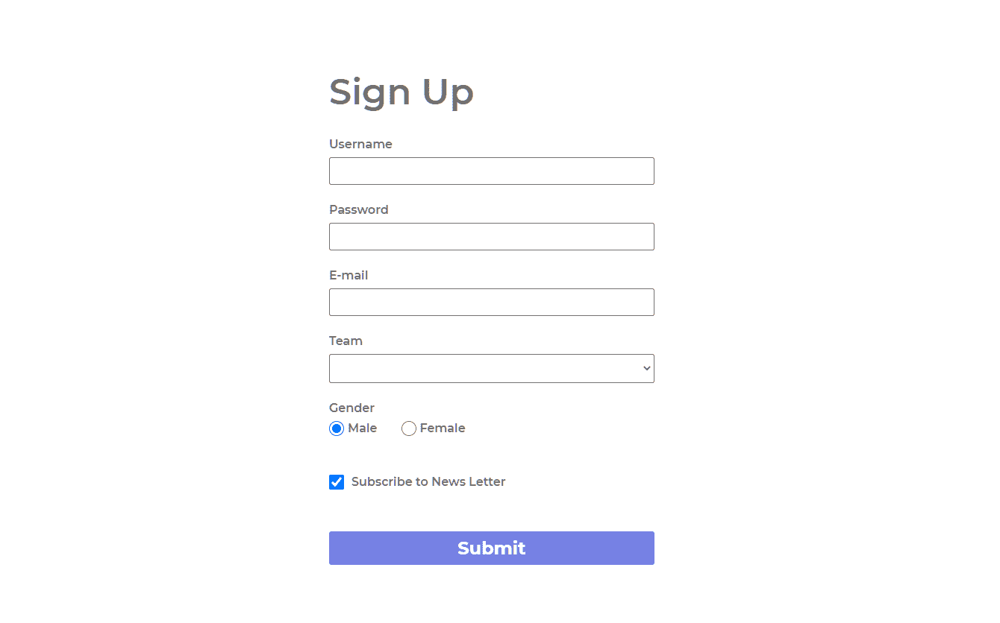

Sign up form

# 试验台初始化

为了在测试环境中使用角度表单，我们必须将**表单模块**导入测试床。在演示应用程序中，我们使用反应式表单方法，因此我们需要导入**表单模块**和**反应式表单模块**。

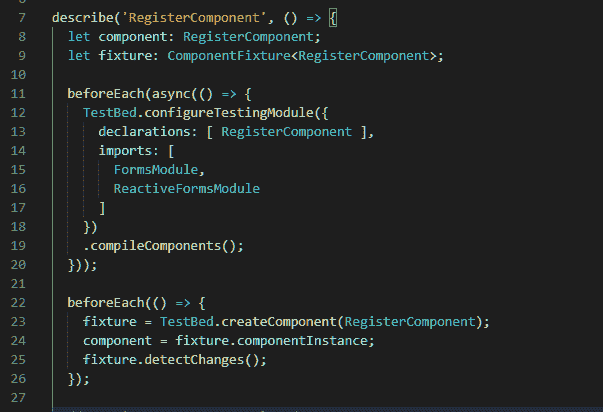

Test Bed Initialization

# 演示应用程序介绍

注册表单包含来自顶层的 h1 元素和 form 元素。在表单内部，有六个表单控件和一个提交按钮。

Top Level HTML Structure

另一方面，在 TypeScript 文件中，只有两个函数。isFormValid 并提交表单。在实际情况下，我们将在 submitForm 函数中将 API 发送到后端，但是，出于演示目的，我们将通过调用 window.confirm 方法简单地向用户显示注册信息。

TypeScript Code

# 输入元素测试

对于这个注册表单，有三个输入控件:用户名、密码和电子邮件，所以让我们一起来看看它们。

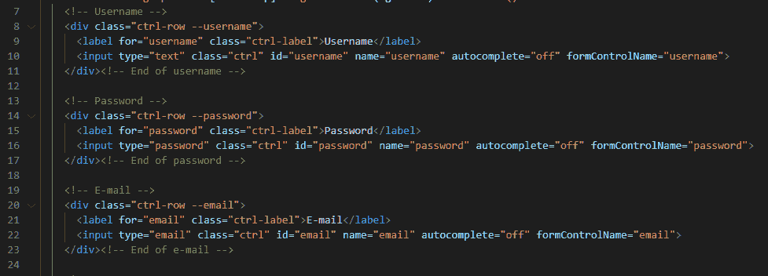

Username, Password, and E-mail HTML

## HTML 验证

像所有其他组件测试一样，我们可以像在[之前的教程](https://simpleweblearning.com/angular-component-unit-test)中一样验证 HTML 结构。具体来说，您希望验证输入元素是否在 HTML 中设置了所有适当的属性。

例如，对于输入元素，一些值得包含在测试中的常见属性包括:**类型、名称、最大长度、最小长度、自动完成**等

Username HTML Testing

像其他 HTML 元素一样，我们可以通过从 nativeElement 调用 **getAttribute** 函数来访问它们的属性。

## 表格装订

对于表单绑定测试，我们可以通过更新 FormControl 中的值来轻松测试它，然后测试 FormControl 的值是否反映在绑定的输入元素上。

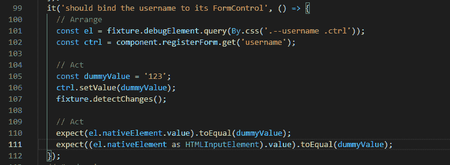

Input Element Binding Tests

要访问 HTML input 元素上的值，我们可以直接从其 nativeElement 对象的 value 属性中读取它。如果您想更精确，您也可以在读取值之前首先将 nativeElement 转换为 **HTMLInputElement** 类型，但是结果应该是相同的。

## 确认

用户名 FormControl 包含两个验证器:Required 验证器和 maxLength 验证器。

Register Form

我们可以为所需的验证器编写两个测试:

1.  当用户名 FormControl 的值长度小于 10 时，应将其标记为有效
2.  当用户名 FormControl 没有任何值时，应将其标记为无效

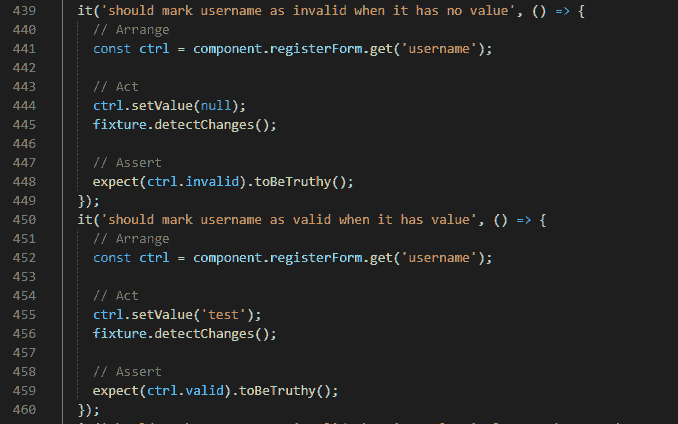

Username Required Validation Tests

类似地，对于 maxLength 测试，我们也可以开发两个测试。

1.  当用户名 FormControl 的值的长度小于 10 时，应将其标记为有效
2.  当用户名 FormControl 的值的长度大于 10 时，应将其标记为无效

Username maxLength Validation Tests

# 选择元素测试

与用户名、密码和电子邮件不同，Team FormControl 使用下拉元素(select 元素)和动态生成的选项列表。

Team HTML

## HTML 验证

Select 元素的 HTML 测试与 Input 元素非常相似，我们检查 HTML 结构及其属性。但是，使用 Select element，我们将拥有动态数量的 option 元素，这些元素在运行时使用 ngFor 呈现。因此，除了对输入元素进行测试之外，我们至少应该编写两个额外的测试:

1.  HTML 上呈现了正确数量的选项元素
2.  每个呈现的选项元素都有正确的值绑定，并显示正确的文本

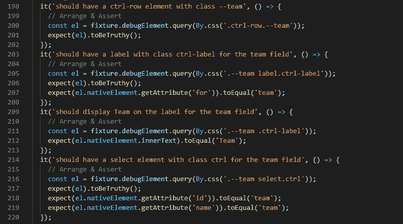

Team HTML Test

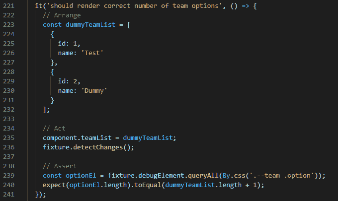

Select Option Render Test

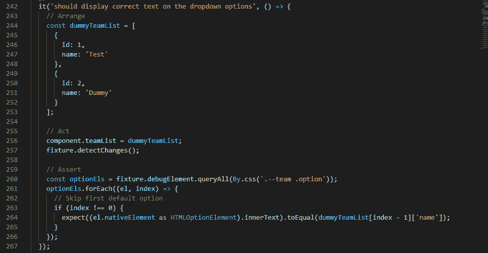

Select Option Text Render Test

## 表格装订

为了测试 team select 元素是否正确绑定到其 FormControl，我们也可以使用相同的方法:在控件上设置值，然后从 HTML 进行验证。但是，从 Select 元素中读取 selected 元素比从 Input 元素中读取 selected 元素有点棘手。

Select Element Form Binding Tests

在上面的示例中，我们从 HTML 中读取值，首先查询 Select 元素，读取它的 selectedIndex，然后将该值与我们在控件上设置的选项进行比较。

## 确认

由于我们对于团队 FormControl 只有一个必需的验证器，所以我们可以像以前一样测试它的验证器功能。

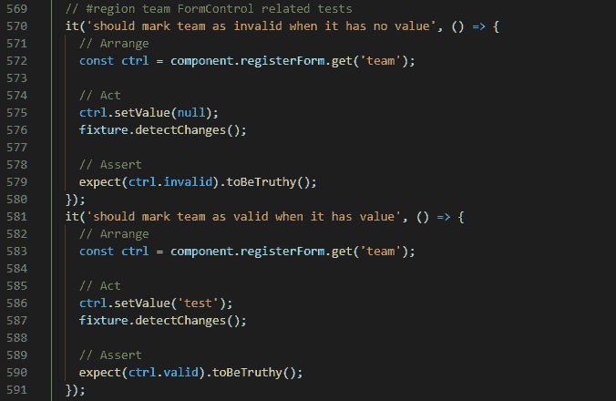

Team Required Validation Tests

# 单选按钮元素测试

Gender FormControl 使用带有两个选项的单选按钮组。

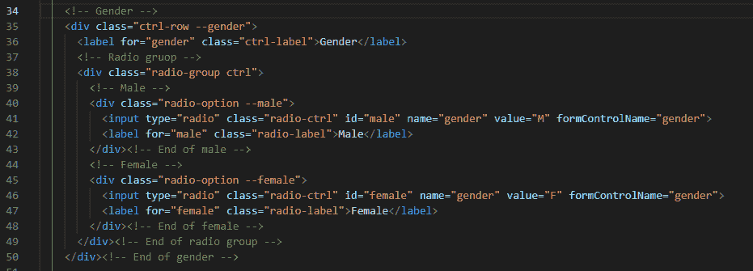

Gender HTML

## HTML 验证

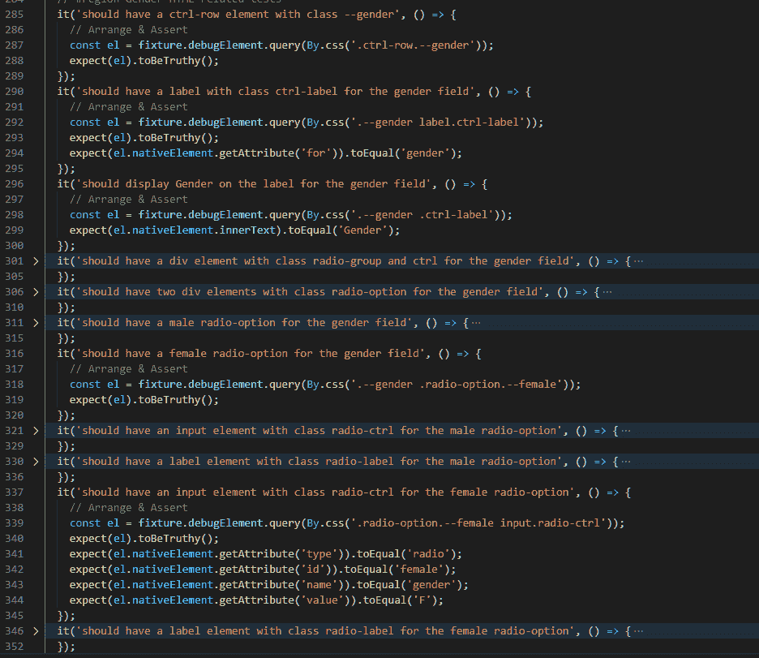

Gender HTML Testing

因为性别字段的 HTML 有点复杂，所以有更多的测试用例来覆盖它们的 HTML 结构。但是，重要的是你要验证它的属性，比如**类型**、**名称**、**值**、……等等。

## 表格装订

为了测试单选按钮的表单绑定，我们也可以直接在它的 FormControl 上设置值，然后从 HTML 中验证选中的单选按钮。

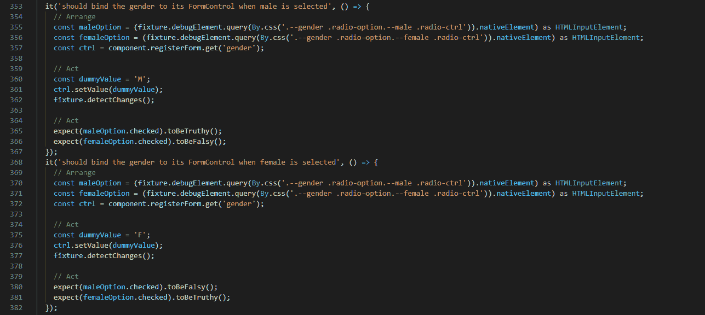

Radio Button Form Binding Tests

要验证单选按钮元素是否被选中，首先查询其 input 元素，将 nativeElement 转换为 HTMLInputElement 类型，然后通过读取其 **checked** 属性来确定它是否被选中。

## 确认

对于单选按钮验证测试，由于用户不能取消选择单选按钮，我们的验证测试将集中在单选按钮是否有默认值。

Radio Button Default Value Test

# 复选框元素测试

最后但同样重要的是，我们有一个订阅复选框，询问用户是否希望在未来收到简讯。

Subscription Checkbox HTML

## HTML 验证

对于 checkbox 元素的 HTML 测试，除了 HTML 结构测试之外，我们还验证是否在 input 元素上设置了正确的 **type** 属性。

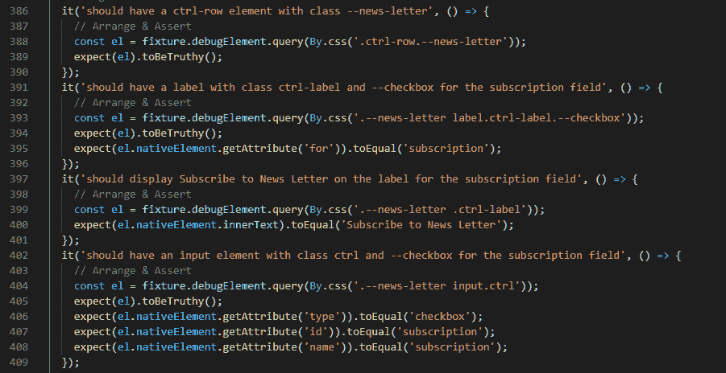

Checkbox Element HTML Tests

## 表格装订

至于表单绑定，我们设置订阅 FormControl 的值，并验证 checkbox 元素的 **checked** 属性是否相应更新。

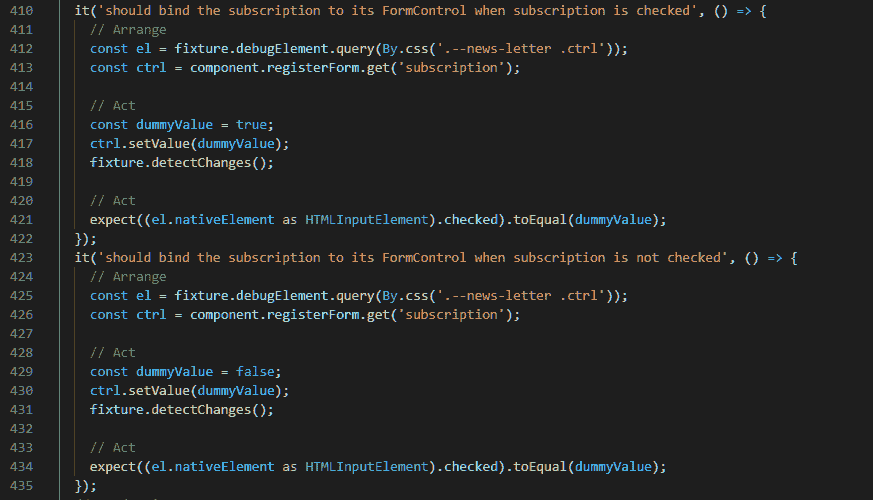

Checkbox Form Binding Tests

## 确认

与单选按钮类似，对于验证测试，我们希望检查复选框是否默认设置为选中。

Checkbox Default Value Test

# 表单提交事件测试

有两种方法可以测试表单提交功能。

1.  直接在表单上触发 **ngSubmit** 事件

Trigger ngSubmit on the Form Element

在上面的测试用例中，我们在提交表单时应该调用的回调函数上设置了一个间谍，然后我们在表单元素上触发 ngSubmit 事件，并测试间谍是否确实被调用了。

2.点击提交按钮

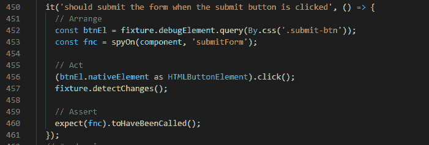

Trigger submit event by clicking on the submit button

在第二种方法中，我们不触发表单上的 ngSubmit 事件，而是直接点击**提交**按钮，并测试回调函数是否被调用。

注意。为了用这种方法测试表单提交特性，您必须确保提交按钮元素上的**类型**属性是**而不是**设置为**按钮**。如果按钮类型设置为按钮，则单击时不会触发表单提交。

# 表单验证测试

对于验证函数，我们想通过只在表单确实有效时返回 true 来测试 **isFormValid** 函数是否正常工作。

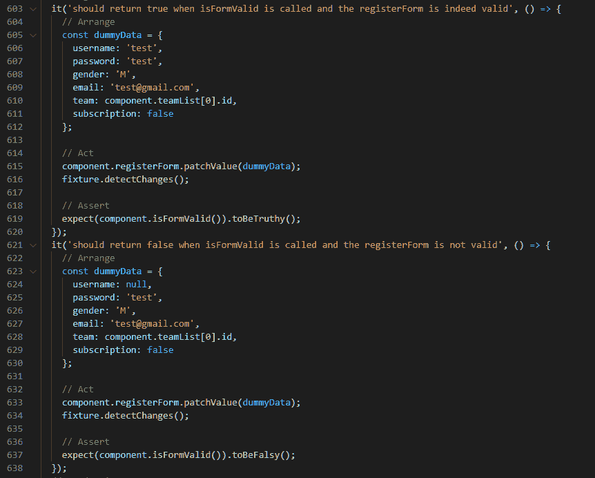

isFormValid Tests

# 提交表单测试

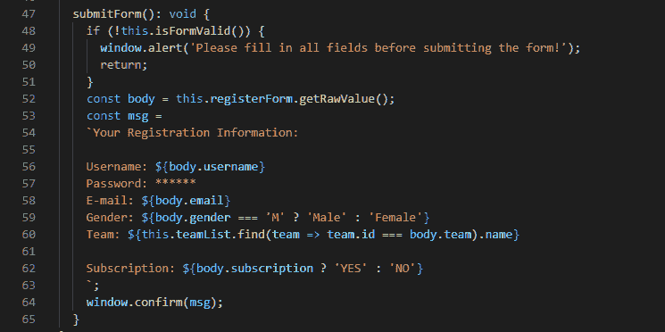

submitForm Function

当调用 submitForm 函数时，我们希望确保只有当 isFormValid 返回 true 时才提交表单，否则，它应该显示一条警告消息。

注意。我们使用 window.confirm 来模拟 API 调用，在您的应用程序中，您希望检查是否对后端进行了 API 调用。

## 警报消息测试

对于警告消息，我们准备了两个测试用例(一个肯定的，一个否定的)来测试警告消息是否在适当的时间显示。

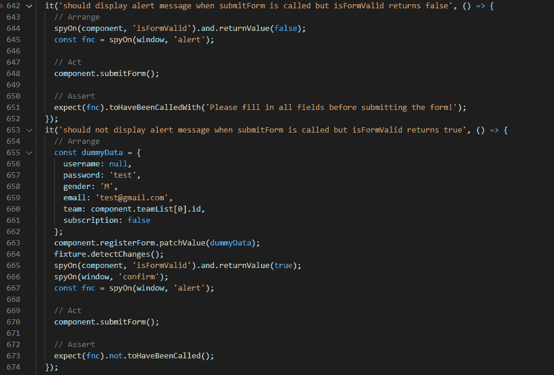

Alert Message Tests

## 表单提交测试

对于表单提交测试，您需要在提交表单时进行测试，在传递到后端(或者在我们的例子中是 confirm 函数)之前，数据的格式是否正确。

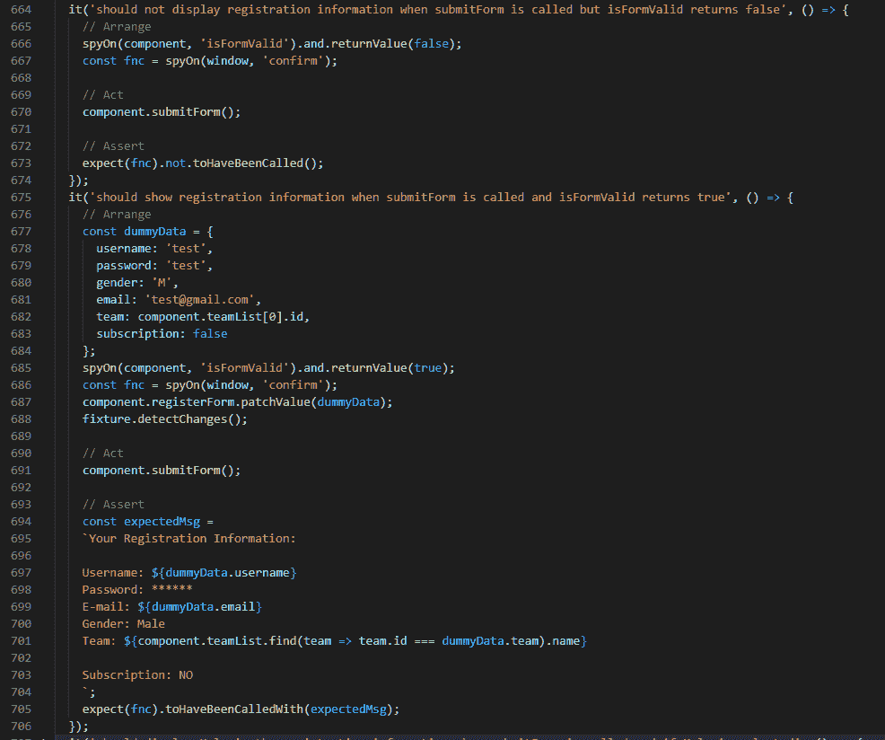

Form Submit Tests

# 结论

在本教程中，我们介绍了一些常用的表单控件 HTML 元素，以及如何在 HTML 验证、表单绑定和表单验证方面为它们编写测试。如果您使用不同的表单控件元素(例如 Angular Material)，即使从 HTML 元素读取其值的方式可能不同，最终该组件的表单测试仍然应该包括这三个方面的测试。

在本教程的最后一部分，我们用 window.confirm 函数替换表单提交 API 调用，这样我们就可以只关注表单测试了。在下一篇教程中，我们将讨论如何处理 API 测试，也就是 Angular 中的异步测试。

本教程总共有 72 个测试，你可以在 [GitHub](https://github.com/chen1223/unit-test-in-angular) 上找到完整的列表。

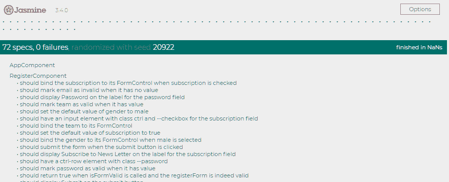

Total Tests for this Tutorial

原帖:【https://simpleweblearning.com/form-testing-in-angular】[T2](https://simpleweblearning.com/form-testing-in-angular)