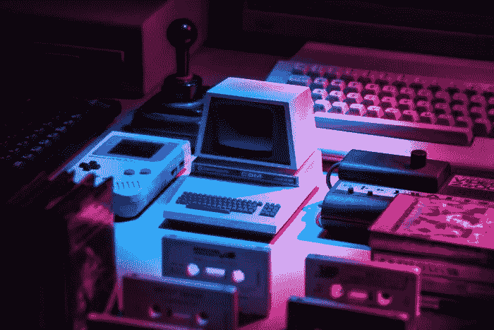

# 提高软件质量的四种非常规方法

> 原文：<https://medium.com/geekculture/four-unconventional-ways-of-improving-software-quality-63e8285e89f2?source=collection_archive---------48----------------------->

Photo by [Lorenzo Herrera](https://unsplash.com/@lorenzoherrera?utm_source=unsplash&utm_medium=referral&utm_content=creditCopyText) on [Unsplash](https://unsplash.com/?utm_source=unsplash&utm_medium=referral&utm_content=creditCopyText)

一个既定的事实是，确保软件质量的任务从软件开发的开始就开始了，并不完全落在一个角色的肩上，而是落在每个团队成员的肩上。此外，没有缺陷并不一定意味着软件质量高。

在开发之前、期间和之后实施质量实践和过程是朝着正确方向迈出的第一步。下面列出了一些确保应用程序质量时应该考虑的技术:

**基于会话的探索性测试**

基于会话的探索性测试(SBET)包括有时间限制的不间断会话，在这些会话中，测试人员对应用程序执行探索性测试，重点关注应用程序的特定方面、模块或功能。SBET 为测试人员创造了一个非常灵活的环境，让他们创造性地探索产品，并尽可能穷尽测试人员能够发明的所有场景，而不是局限于以前制定的测试用例。对于正在积极发展和变化的产品，也强烈推荐 SBET；因为它为团队提供了一个喘息的机会来发现自动化套件中没有涵盖的场景，并捕捉与用户体验相关的问题。

为了充分利用这种技术，建议实现以下内容:

*   时间段为 45-90 分钟，有短暂休息，
*   会议前测试章程的可用性。测试章程是一份规定测试会议的范围、目的/目标的文件
*   从对应用程序不熟悉的测试人员那里获得新的视角、见解和建议。
*   联系产品经理或业务部门的同事来回答问题
*   会议期间遇到的错误、问题和建议应该记录下来。
*   应该与其他利益相关者讨论和分享结果和观察结果。

**波兰周**

抛光周是一些软件团队采用的一种不受欢迎的技术，其中一周致力于“抛光”软件产品，改进功能，用户体验和修复 bug。本周所有的改进工作都特别集中在面向用户的相关任务上。这是一个提醒和指示，团队的工作最终是为用户服务的。所有团队，包括开发，质量保证，开发人员，设计师等，都专注于这一抛光活动。为这些任务留出一周的时间，让团队有时间处理那些通常由于其他优先任务而无法解决的功能和 bug。

为了充分利用波兰周的优势，

1.  更大的路线图项目可能不得不暂时搁置一周，以帮助团队专注于产品的改进
2.  应事先创建和整理改进任务/票证，并为任务分配故事点，以最大限度地延长完成任务的时间
3.  这些改进的部署应该在本周末完成
4.  波兰周可以每季度举行一次，或者在软件开发几个月后举行

Photo by [Andrew Neel](https://unsplash.com/@andrewtneel?utm_source=unsplash&utm_medium=referral&utm_content=creditCopyText) on [Unsplash](https://unsplash.com/?utm_source=unsplash&utm_medium=referral&utm_content=creditCopyText)

**定期获得关于你申请的反馈**

获得反馈是获得用户如何使用你的应用的第一手信息的另一种方式，如果它能帮助他们解决问题，如果他们觉得它很容易使用。查看和分析这些反馈还可以帮助您了解需要在哪些方面付出更多努力，尤其是在收到的关于应用程序的反馈报告中观察到趋势的情况下。获得有意义且可行的反馈的一些方法包括:

1.  审查客户或用户在一段时间内记录的错误或问题。
2.  与客户支持团队会面，了解用户/客户的痛点
3.  用户观察；即密切关注和观察实际用户与你的应用程序的互动。这通常是获得应用程序客观视图的快速方法。为了得到客观的结果，在做笔记的时候，尽可能的不引人注目。这可以使用 [**Hotjar**](https://www.hotjar.com/) 、 [**FullStory**](https://www.fullstory.com/) 、 [**Lookback.io**](https://lookback.io/) 等工具远程实现
4.  用户调查:向客户提供表格以征求他们的意见，因为他们自愿分享他们对应用程序的体验以及他们认为需要改进的地方。

请注意，获得反馈只是工作的一半。目标是提高你的软件的整体质量，你对这个反馈的处理决定了你得到的结果，以及你在努力实现的目标上走了多远

**自动静态代码分析:**

静态代码分析是一种工具，它通过执行自动代码审查来检测 bug、代码气味以及某些情况下的安全漏洞，从而帮助持续检查代码质量。许多静态代码分析工具提供了大量的代码质量报告，涵盖了代码缺陷、编码标准、重复代码和代码覆盖率的数量。它们通常非常容易设置，并且能够与大多数 CI/CD(持续集成和部署)工具无缝集成。这些工具中的许多都提供开源和付费版本，并且能够支持许多编程语言。流行的静态代码分析工具的例子有****[**栓子**](https://embold.io/)**[**vera code**](https://www.veracode.com/)**[**brake man**](https://brakemanscanner.org/)**等等。**********

******静态代码分析不应该被视为代码同行评审的替代。强烈建议同时使用这两种方法，因为这有助于提高代码的整体质量，因为代码要经过多次检查和评估。在软件开发的早期应用静态代码分析工具从一开始就在开发团队中实施开发标准和良好的实践，而不是在代码库非常大和复杂的时候。******

> ******一遍又一遍地做同样的事情，却期待着同样的结果，这是精神错乱。******

******为什么不尝试一些不同的，非传统的东西呢？******

******测试愉快！******