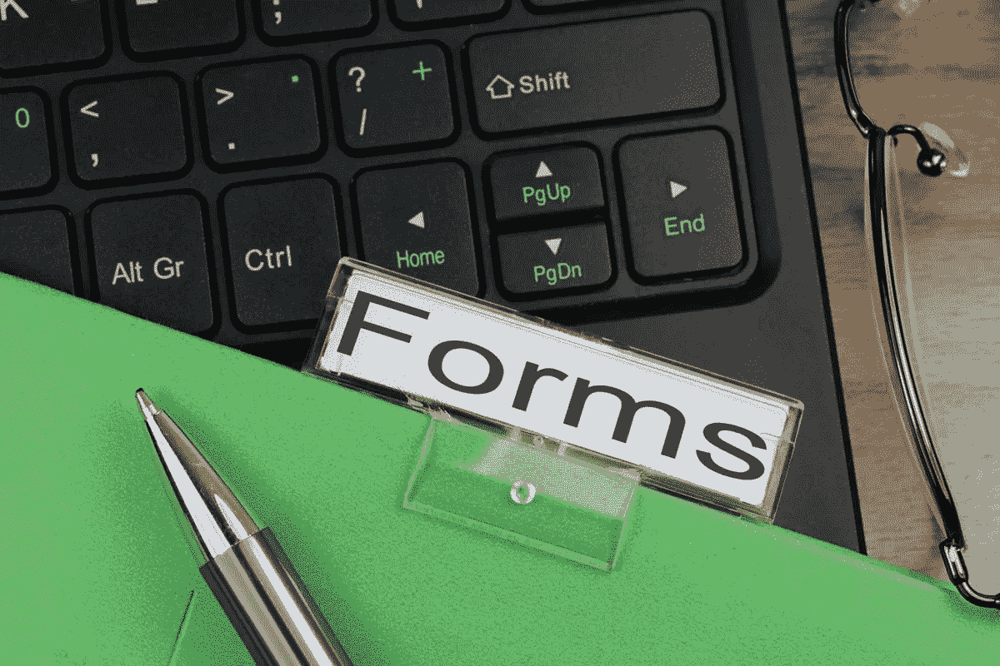

# React 中的前端表单验证

> 原文：<https://medium.com/geekculture/front-end-form-validation-in-react-33595dec8d6f?source=collection_archive---------10----------------------->



如果您需要构建一个连接到您的 Rails API 的 React 应用程序，您可能应该首先开始构建一个后端。首先构建后端并让它呈现您的数据是有意义的。您将需要一个数据库、控制器和模型。确保数据库只接受有效数据是一个很好的实践，因此我们需要添加验证，在 Rails 中，验证被添加到模型中。在我的特殊情况下，我需要向我的视频模型添加验证。我想确保数据库中的每个视频记录都有 name、URL、category_id 和 brand_id 字段。此外，我想确保数据库中没有重复的名称或 URL，所以我需要验证名称和 URL 的唯一性。

```
validates :name,:url, :category_id,:brand_id, presence: true
validates :name,:url, uniqueness: true
```

将上面的代码添加到我的视频模型将不允许我提交任何没有这些指定值的新视频，也不允许任何名称或 URL 重复。

下一步是让我的控制器加速处理验证。

```
def create
        if video = Video.create(video_params)
            render json: video
        else
            render json: video.errors.full_messages
        end
end
```

现在创建的控制器将呈现新创建的视频，如果它通过验证，否则它将呈现错误，并带有描述这些错误的完整消息。所以尽管我们的 Rails 验证，我还是选择了不同的方法来处理 React 应用程序中的表单验证。

我没有在服务器/数据库级别处理验证，而是决定使用客户端验证。客户端验证的主要好处是更快的表单验证，因为我们不需要向服务器获取任何数据并等待响应。

为了处理错误，我将组件状态更新如下:

```
state = {
        name:'',
        description:'',
        url:'',
        brandId:null,
        categoryId:null,
        errors: {
            name:"* Required",
            url:"* Required",
            brandId:"Please select Brand, if can't find specific brand choose other",
            categoryId:"Please select Category",
        }
    };
```

在我的状态中，我现在有了错误值，我将使用它来验证表单并显示错误。

在 React 中，我们需要确保当我们更新表单信息时，我们的状态也被更新，因为它们是相互关联的。我们通常会创建一个 handleChange 函数，它负责在每次表单中的数据发生变化时更新状态，同时我们也会更新状态中的错误消息。

```
handleChange = (e) => {
        const {name, value} = e.target;
        let errors = this.state.errors; switch (name) {

            case 'name': 
              if (value==='') {
                  errors.name = "Name can't be blank!"
              } else if (this.props.videos.find(video=>video.name===value)) {
                errors.name = "Video with this name exist!"
              } else {
                errors.name = ''
              }
              break;
            case 'url': 
              if (value==='') {
                  errors.url = "URL can't be blank!"
              } else if (this.props.videos.find(video=>video.url===value)) {
                errors.url = "Video with this url exist!"
              } else {
                errors.url = ''
              }
              break;
            default:
              break;
          }

          this.setState({errors, [name]: value})  
    };
```

handleChange 函数中的 case 状态为每个特定值声明一条错误消息，或者删除一条错误消息。

在表单提交时，我们需要验证表单中的数据是否有效，让我们创建一个表单验证器。它将检查是否有任何错误消息，并返回表单是否有效。

```
validateForm = (errors) => {
        let valid = true;
        Object.values(errors).forEach(value => {
            value.length > 0 && (valid = false)
        });
        return valid;
    }
```

最后，我们只需要在 handleSubmit 中添加 validateForm 函数，并检查表单是否有效。如果表单无效，我们还可以发送警告。

```
handleSubmit = (e) => {
        e.preventDefault();
        if (this.validateForm(this.state.errors)) {
            this.createNewVideo(this.state);
        } else {
            alert("Please fill in required fields")
        }
    };
```

在 React 中设置前端验证非常容易。它的工作速度很快，你不需要担心获取太多。

你可以观看下面的快速演示，并在这里查看这个项目。

FixerTube Demo

请在以下社交网络上查看我，我很乐意收到您的来信！——[*LinkedIn*](https://www.linkedin.com/in/nick-solonyy/)*，* [*GitHub*](https://github.com/nicksolony) ， [*脸书*](https://www.facebook.com/nick.solony) *。*