# 反应钩的基本原理

> 原文：<https://medium.com/geekculture/fundamentals-of-react-hooks-ce9f7064729b?source=collection_archive---------3----------------------->


从脸书反应小组发布的第一天起，钩子就真的变得非常受欢迎。如果你有任何使用类组件的经验，那么你就能真正理解钩子是如何让 React 开发者的生活变得更容易的。许多像 [Vue](https://css-tricks.com/what-hooks-mean-for-vue/) 、[svelite](https://twitter.com/Rich_Harris/status/1093260097558581250)这样的图书馆正在采用钩子来扩展它们的功能。

但另一方面，它的用途却不明确。所以，在这篇文章的帮助下，我会试着让事情对你来说更容易理解。

# 什么是钩子？

> *钩子是 React 16.8 中的新增功能。它们允许您使用状态和其他 React 特性，而无需编写类。*

# 内容

1.  **基本挂钩**

*   [使用状态](https://reactjs.org/docs/hooks-reference.html#usestate)
*   [使用效果](https://reactjs.org/docs/hooks-reference.html#useeffect)
*   [使用上下文](https://reactjs.org/docs/hooks-reference.html#usecontext)

2.**附加挂钩**

*   [useReducer](https://reactjs.org/docs/hooks-reference.html#usereducer)
*   [使用回调](https://reactjs.org/docs/hooks-reference.html#usecallback)
*   [使用备忘录](https://reactjs.org/docs/hooks-reference.html#usememo)
*   [useRef](https://reactjs.org/docs/hooks-reference.html#useref)
*   [使用命令句柄](https://reactjs.org/docs/hooks-reference.html#useimperativehandle)
*   [useLayoutEffect](https://reactjs.org/docs/hooks-reference.html#uselayouteffect)

**3。定制挂钩**

让我们一个一个地检查所有这些钩子。

# 基本挂钩

**使用状态**

这是 react 中最常见的挂钩，它在功能组件中创建状态变量。

```
const [state, setState] = useState(initialState);
```

要使用它，您可以传递任何值或函数作为初始状态，它返回两个实体的数组，第一个元素是初始状态，第二个是用于更新状态的函数(dispatcher)。

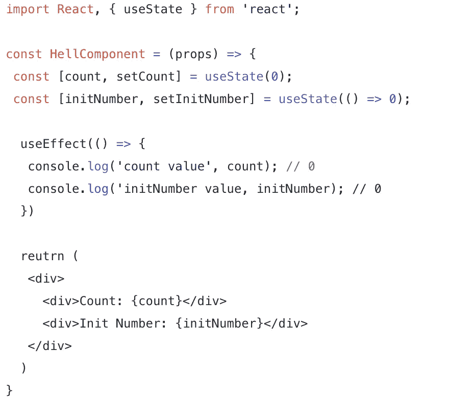

**注意:**如果你传递一个函数作为初始值，那么 react 在内部调用它，就像你在代码中看到的那样。

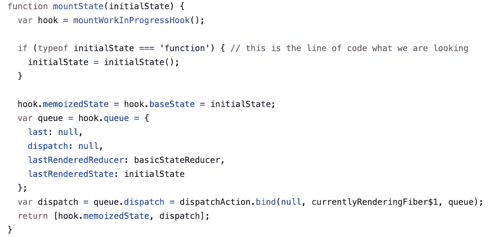

现在让我们看看如何更新这些值

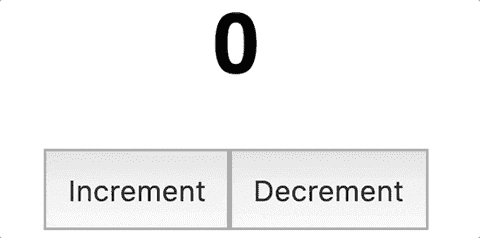

正如您在代码中看到的，我们用两种方式更新了值。第一个非常清楚，但是第二个我们在依赖旧值的时候会用到。

**使用效果**

useEffect 是 React 中第二常用的钩子。它只是在渲染提交到屏幕后调用传递的函数。

让我们看看这条线是什么意思。

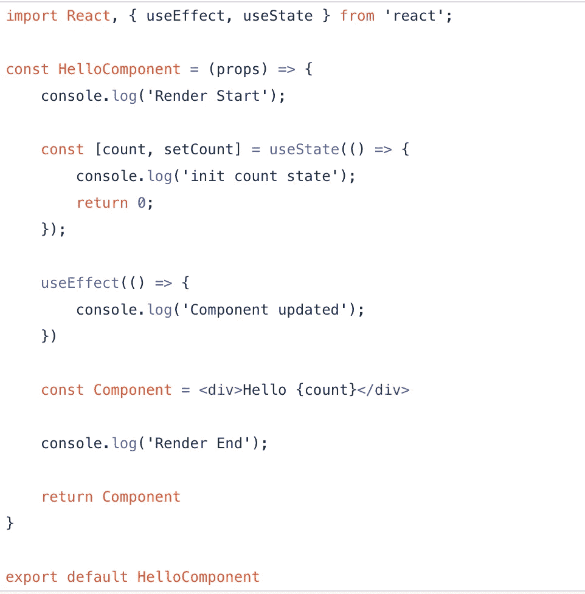

输出:

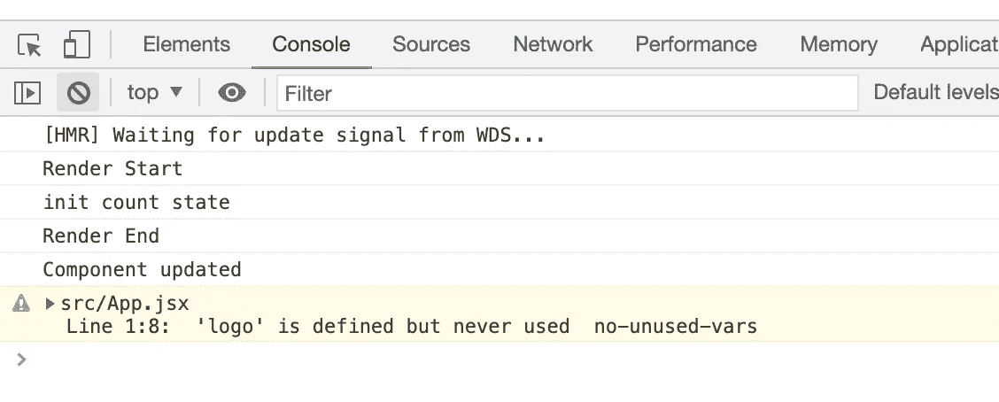

因此，您可以在控制台上看到“渲染结束”后的“组件更新”打印结果(“渲染提交到屏幕后”)。

**什么时候用，怎么用？**

**当**

它有很多用例，但让我提一下最常见的一个。

1.  将其用作组件(ComponentDidMount)的初始第一次呈现。
2.  当组件超出范围时使用它(ComponentWillUnMount)
3.  调用或处理特定状态更改的任何一段代码。

您可以了解 React 的生命周期。

**如何**


请注意我在代码中提到的 console.log 和注释。

**使用上下文**

**什么是上下文 API？**

上下文 API 是 16.3 中添加的新特性，它允许我们将状态直接传递给任何子组件。


正如您在图中可以清楚地看到的，如果没有上下文 API，如果您想要将数据(props)传递给任何子组件，那么您必须将该数据传递给包含目标组件的每个子组件。这个过程叫做道具演练。

但是通过上下文 API，你可以直接将数据(道具)传递给任何子组件。

让我们有一些代码


好的，所以你可以在代码中看到我们直接将对象({hello: 'Hello World'})传递给我的孩子 3 组件，借助于 useContext 钩子酷吧😎。


# 附加挂钩

**useReducer**

它是`[useState](https://reactjs.org/docs/hooks-reference.html#usestate)`的替代物。接受类型为`(state, action) => newState`的缩减器，并返回与`dispatch`方法配对的当前状态。(如果你熟悉 Redux，你已经知道这是如何工作的。)

```
const [state, dispatch] = useReducer(reducer, initialArg, init);
```

当你有复杂的状态逻辑，包括多个子值，或者下一个状态依赖于前一个状态时，`useReducer`通常比`useState`更好。

好吧，让我们用代码来理解我想说的。

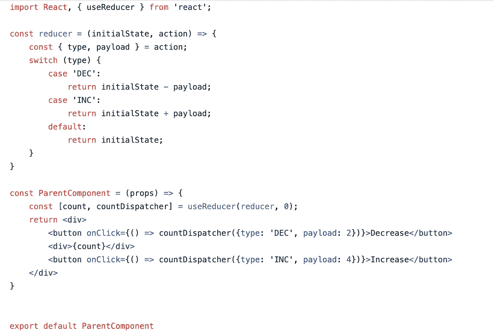

正如您在代码中看到的，首先，我们创建了 reducer，然后像在 redux 中一样放置我们的逻辑。然后，我们将该缩减器作为第一个参数传递给 useReducer，并将“0”作为初始值传递。

现在我们可以非常简单地使用 countDispatcher 更新计数值😊。因此您可以使用 useReducer 创建更复杂的状态。

**使用回调**

我们使用 useCallback 来记忆回调的版本，只有当其中一个依赖关系发生变化时，该版本才会发生变化。

```
const memorizedFunction = useCallback(fn, [deps]);
```

假设我们有一个函数给子组件，用在 map 中，那么每当 map 数据得到更新的时候，子组件就会重新渲染，一个新的对那个函数的引用也会生成，所以为了防止这种情况，我们可以使用 useCallback。

让我们有一些代码

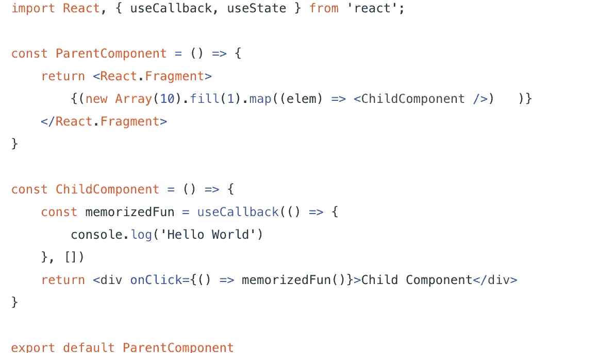

因此，正如你在“记忆的 Fun”中看到的，它不会在每次渲染时都创建一个新的引用。

使用备忘录

我们使用 useMemo 来记忆仅在其中一个依赖关系改变时才改变的值。

```
const memorizedValue = useCallback(value, [deps]);
```

假设我们必须存储经过大量计算后得到的值，并且我们不想在每次渲染时都重新计算该值，在这种情况下，我们可以使用 useMemo。

来点代码吧。

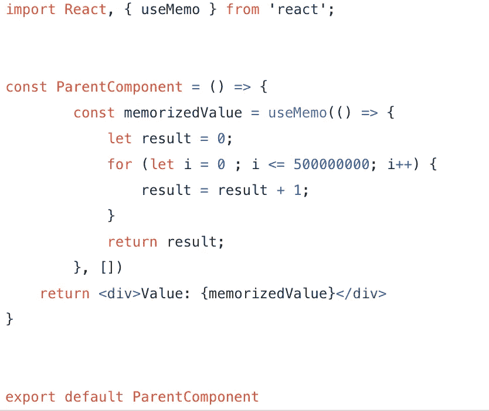

因此，正如你在代码中看到的，在第一次渲染时存储的值，它只是使用了存储的值，这也有助于我们提高性能。

**useRef**

`useRef`返回一个可变的 ref 对象，其`.current`属性被初始化为传递的参数(`initialValue`)。


一个常见的用例是访问 dom/子组件属性。

来点代码吧。

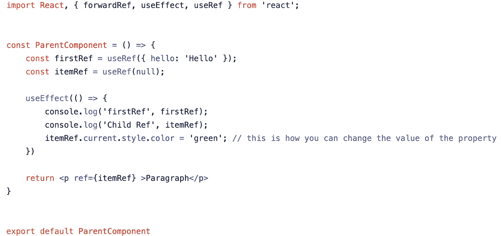

**输出**

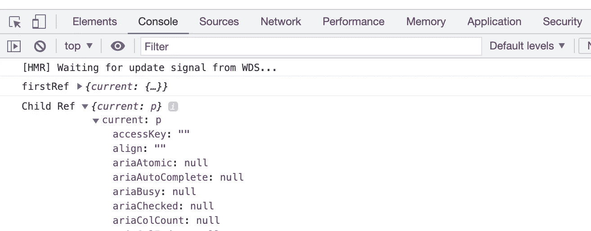

正如您在代码和输出中看到的，useRef 只存储 DOM/ React 组件的值或属性，您也可以对其进行更改。

**使用命令句柄**

> `*useImperativeHandle*` *定制使用* `*ref*` *时暴露给父组件的实例值。和往常一样，在大多数情况下应该避免使用引用的命令式代码。* `*useImperativeHandle*` *应与* `[*forwardRef*](https://reactjs.org/docs/react-api.html#reactforwardref)*.*`配合使用

让我们看看这是什么意思。

**如何在子组件中使用**


**如何在父组件中**

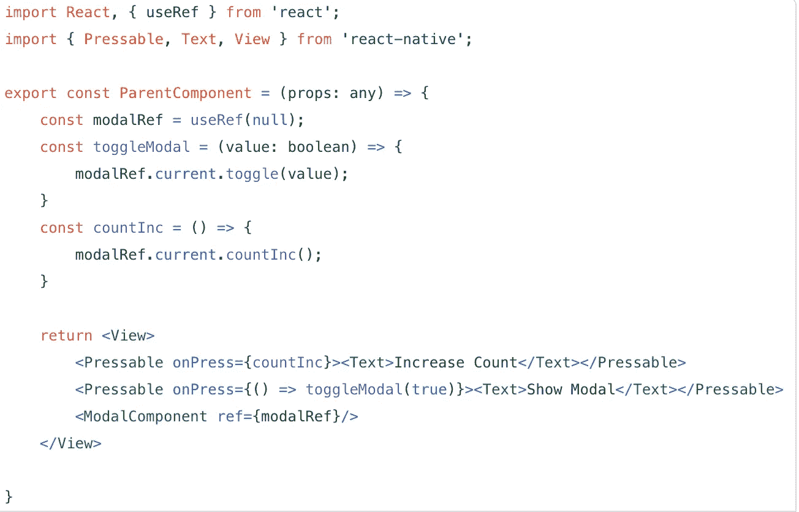

正如你在代码中看到的，现在我们可以很容易地使用父组件中的实例来改变子组件的状态，因为这个技巧，我们不需要改变父组件的状态，这就是我们保存渲染的方式。

**useLayoutEffect**

签名与`useEffect`相同，但是它在所有 DOM 突变之后同步触发。使用它从 DOM 中读取布局并同步重新渲染。在浏览器有机会绘制之前，安排在`useLayoutEffect`中的更新将被同步刷新。


**输出**


正如你在控制台上看到的“布局效果更新”只是在“组件更新”之前调用。这就是我们所说的定义。

**自定义挂钩**

可能有这样一种情况，您在多个组件中使用了相同的重复和冗余的有状态逻辑。所以提到每个组件中的逻辑，我们可以将代码分离到一个文件中，并在任何我们想要的地方使用它。

让我们看一些现实生活中的例子

假设您想要一种状态，通过这种状态您可以判断屏幕是在移动视图还是桌面视图。

如何为所需的自定义钩子创建一个单独的文件。

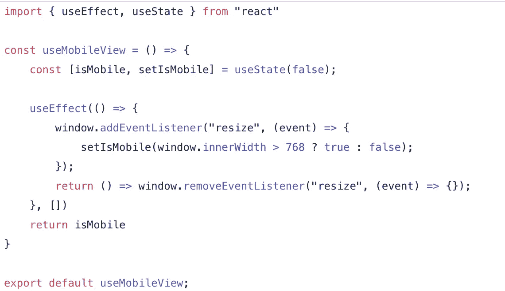

**注意:**您必须使用‘use’作为服务名的前缀，正如您在代码中看到的。

如何使用它


好的，所以当你调整浏览器宽度时，它会自动更新状态。

**结论**

至此，我们对 React 中何时、何地以及如何使用不同的钩子有了一个完整的基本理解。通过根据需求使用最佳匹配挂钩，我们可以使我们的应用程序模块化，不那么复杂，并通过防止不必要的渲染来提高性能。

感谢阅读这篇文章。我希望你喜欢它。