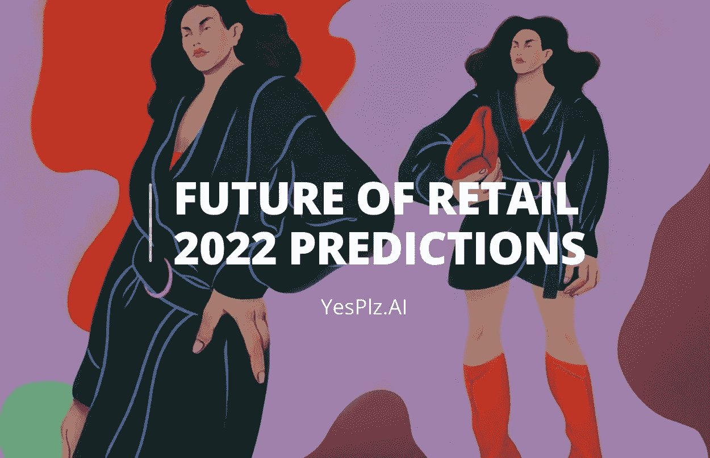
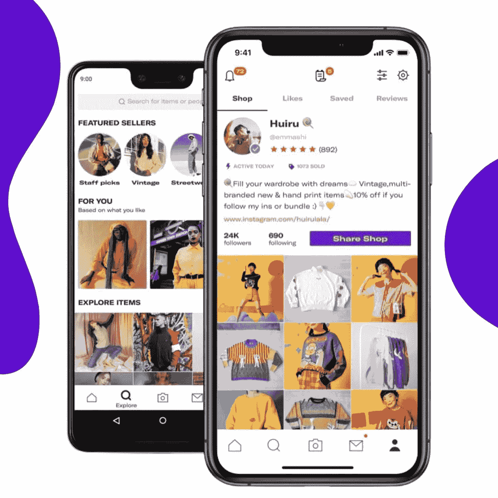
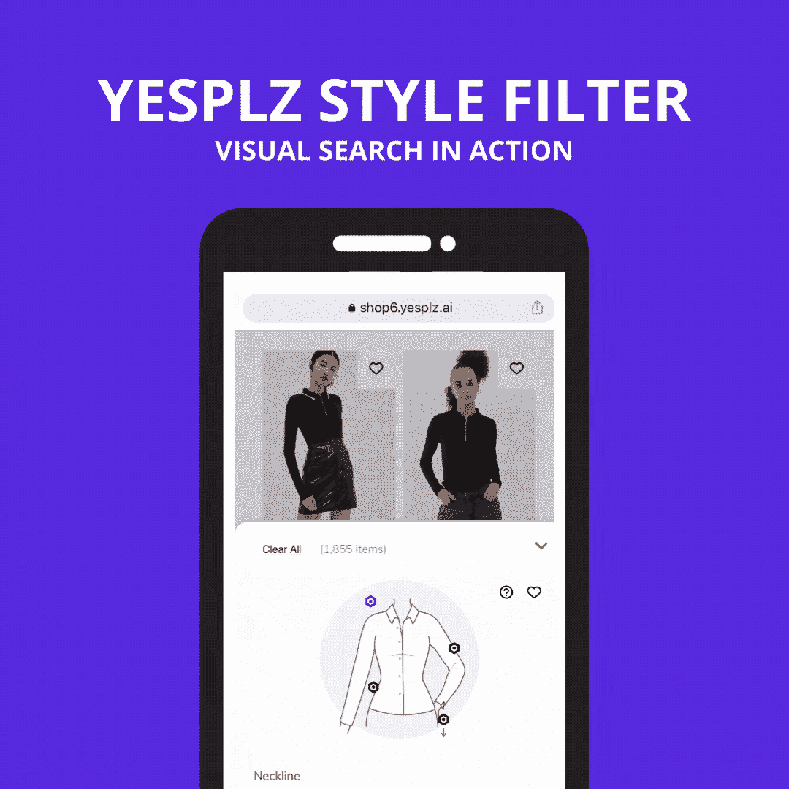
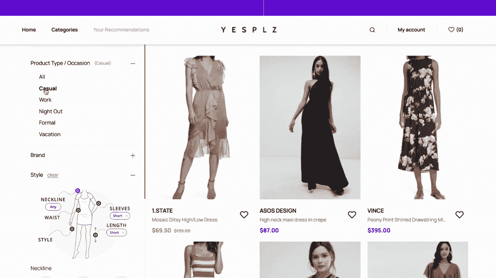
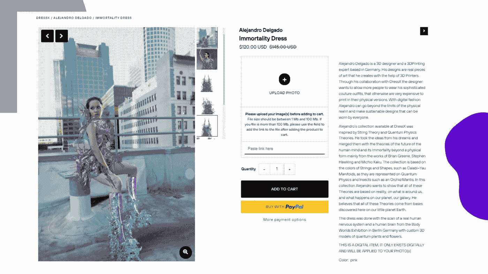

# 零售业的未来:我们的 2022 年预测

> 原文：<https://medium.com/geekculture/future-of-retail-our-2022-predictions-ca65a91b6e13?source=collection_archive---------15----------------------->

时尚科技在 2021 年迎来了突破性的一年，许多时尚零售商采用新技术来缓解供应链不稳定、客户需求上升和竞争激烈的在线购物环境带来的痛苦。

2022 年零售业的未来将包括过去几年发展起来的时尚技术的实验和实际应用:区块链、增强现实、时尚人工智能。

零售业正在进入 2022 年，继续从 2021 年开始驾驭时尚科技的兴奋浪潮。但是，我们应该关注哪些技术发展呢？而 2021 年我们能留下哪些发展？

虽然我们在 YesPlz AI 没有水晶球，但我们有多年的经验来研究过去的时尚技术和技术趋势。你可以在这里看看我们之前对疫情时尚趋势的分析。

继续阅读，寻找我们对 2022 年时尚科技的预测:

[**我们错过了一个预测吗？你不同意吗？让我们知道。**](https://www.linkedin.com/company/yesplz)

# 我们对 2021 年零售业未来的预测

在深入研究 2022 年之前，让我们快速回顾一下我们对 2021 年零售业未来的预测，看看我们的预测表现如何。

点击这里阅读我们的 2021 年时尚科技预测全文[。](https://yesplz.ai/resource/3-fashion-ecommerce-trends-you-can-expect-to-see-in-2021.html)

**预测 1:回归真实和社区**

我们预测，时尚电子商务品牌将试图通过清晰和真实的沟通来吸引客户。在疫情期间，顾客被来自时尚品牌的电子邮件、时事通讯和信息轰炸。因此，客户需要清晰、价值驱动的沟通，以简洁易懂的方式表达观点。

2021 年，客户不仅要求清晰的沟通，还开始质疑品牌价值观:这个品牌可持续吗？这个品牌兑现了它的承诺吗？品牌本身有多受价值驱动？

随着二手平台开始流行起来，我们也看到消费者转向可持续的、道德的消费。

二手时尚平台 Depop 于 2021 年被 Etsy 收购，标志着向可持续消费的长期迈进。

**预测 2:重新思考搜索和发现体验**

我们预测，时尚电子商务品牌将尝试新的搜索和发现工具，以保持过度刺激的客户注意力。由时尚人工智能驱动的视觉搜索等工具，使客户的购买之旅无缝衔接。

2021 年，Levis 等品牌开始更多地尝试视觉搜索，将视觉与语义搜索相结合，以满足客户需求。

而且，更多的视觉搜索用例出现在零售商面前，使得零售商更有可能实施视觉搜索。2021 年，零售商面临两个问题:1)当前的搜索导航让新老顾客失望；2)产品标签非常耗时。

通过视觉搜索工具，如 [YesPlz AI 的风格过滤器，](https://shop.yesplz.ai/visualfilter/wtop)零售商可以使用时尚人工智能快速标记产品属性，并提供令人兴奋的客户搜索体验。

# 2022 年零售业的未来:塑造这一年的三大趋势

**趋势 1:用户行为将永久地从线下转移到(主要)线上，需要先进的工具来复制店内客户体验。**

在 2020 年和 2021 年，购物者在网上购物时变得更加老练和舒适。因此，购物者对糟糕的搜索和导航体验有很高的要求和很低的关注度。

2022 年，购物者将改变他们的网上购物模式。

我们怎么知道？在用户采访中，一个主题不断出现:购物者在 COVID 之后 100%的时间都在网上购物。

然而，网上购物仍然缺少一个核心要素:一个有帮助的销售助理来指导购物者。

今年，我们预计复杂的搜索和推荐工具将逐步取代友好销售助理的角色，引导客户找到他们想要的产品，并推荐替代产品。

客户希望产品搜索和过滤器能够反映他们的风格偏好。搜索和推荐工具变得越来越先进，越来越了解对顾客来说最重要的是什么:合身、风格和时尚。

YesPlz AI 风格过滤和推荐系统允许客户根据合身程度和风格进行过滤，承担数字销售助理的角色，甚至根据产品属性建议类似的产品。

**趋势二:时尚人工智能技术将变得比以往更加强大和复杂。**

时尚人工智能将会一直存在——而且一年比一年好，越来越准确。人工智能技术现在可以执行人类可以做的事情，但更有效。

图像标记是一项单调乏味但非常需要技巧的任务，不仅需要准确性，还需要训练有素的时尚感。几年前，人们不可能认为时尚人工智能不仅可以有效地标记产品属性，甚至可以通过对时尚的理解来做到这一点。

快进到 2022 年，AI 图像标记比以往任何时候都更强大、更准确。虽然零售商可能在图像标记的早期经历了一些灾难，但我们预测，在 2022 年，人工智能图像标记将准备好首次亮相，成为时尚技术工具的关注中心。

作为时尚人工智能技术的现实应用，场合标签是最重要的。

场合标签是购物者要求最多的过滤器之一，但没有多少零售商提供它。为什么？因为人需要手动标记每个产品，确保产品被准确地分类到适当的心情场合。

时尚人工智能(fashion AI)不仅知道“t 恤连衣裙”和“沙滩装”之间的区别，还可以将 t 恤连衣裙归类为“休闲”场合产品，将沙滩装归类为“度假”场合。这对零售业的未来来说是革命性的。

当然，时尚 AI 仍在学习每种风格的过程中，但可以自动化数小时的日常工作。

[**联系 YesPlz AI 了解更多图片标注**](http://yesplz.ai/contact.html)

趋势 3:时尚电子商务品牌将竞相实施个性化技术，以支持购物者行为的改变。

我们预测，技术将应用于客户旅程的每一部分:

1) **产品发现**:时尚零售商将使用视觉搜索来帮助购物者探索产品。

2) **考虑**:人工智能驱动的产品推荐将根据浏览历史、时尚和产品类别，引导购物者购买有意义的产品。虚拟试衣间也可以帮助顾客试穿服装。

3) **Check-ou** t:通过个性化，零售商可以记住客户的偏好，并在未来的实地访问中应用这些偏好。

通过技术，零售商可以支持不断变化的客户行为，为他们提供复杂无缝的购物体验。

**行动中的个性化:基于用户行为的目标定位**

我们在用户访谈中了解到，当购物者收到带有他们喜欢的产品照片的电子邮件时，他们就会被触发访问网站。但是，品牌如何确定哪些照片会引发点击访问网站？

通过时尚 AI，数百张照片在几分钟内被快速扫描。然后，选择对每个人来说都是独一无二的相关产品图像，从而实现有效的个性化。

# 零售技术在 2022 年的角色

我们很高兴看到零售技术将在 2022 年继续发展，从超个性化到虚拟服装等领域。

**技术将如何为你最喜爱的电子商务品牌带来数字销售人员:**

人工智能搜索可以过滤一些产品属性，而人工智能搜索可以在几秒钟内过滤成千上万的产品属性和图片。

此外，人工智能搜索工具可以自动为图像添加相应的产品属性，[将顾客从混乱的时尚分类中解救出来](https://yesplz.ai/resource/demystifying-fashion-taxonomies-what-do-customers-really-want.html)。

2- **数据驱动** [**超个性化**](https://yesplz.ai/resource/trend-report-fashion-tech-and-hyper-personalization.html) :虽然个性化已经存在多年，但它在 2022 年变得更加强大。随着新技术的发展，客户可以收到闪电般的产品推荐，看到相关的产品，并获得动态的重新定位。

3- **视觉搜索**:通过[时尚视觉搜索](https://yesplz.ai/resource/2-ways-to-search-clothes-by-image.html) h，用户可以使用独特的视觉界面进行搜索，例如虚拟人体模型，并根据他们喜欢的产品属性和合身程度进行筛选。

4- **虚拟试穿**:网上购物最令人沮丧的地方之一就是合身问题。Drapr 等虚拟试衣间初创公司正在弥合这一差距，并改善在线购物体验。

我们在上面提到过，网上购物的最大问题之一是缺少一个友好的销售助理，他总是有惊人的产品建议，并找到完美的产品。2022 年，我们希望上述技术的结合能够填补销售助理的空缺。

2022 年，我们将拭目以待，看看零售商如何有效地将这些新技术融入日常电子商务体验。

# 为什么我们对 2022 年的时尚技术感到兴奋:

时尚技术不仅仅需要反应，解决以前的问题。随着一个纯数字世界的出现，它还可以提供一个令人兴奋的零售未来。这是我们在 2022 年期待的:

1- **数字服装不断发展，变得越来越复杂。**

2021 年，数字服装开始席卷全球，纯数字服装成为元宇宙虚拟人物和社交媒体上现实生活中的人的一种选择。随着消费者对可持续性的关注，数字服装可以成为展示最新微趋势的可行替代方案，而不会对环境产生负面影响。

但是，正如 Dress-X 的创始人娜塔莉亚·莫德诺娃(Natalia Modenova)指出的那样:“人工智能并没有完全自动化这个过程。”我们期待看到时尚人工智能和数字服装的结合，使工作流程更快、更具可扩展性。

2- **元宇宙的数字体验是一个完全未知的领域。**

如果 2021 年是我们被介绍到元宇宙的一年，那么 2022 年将是我们看到品牌在元宇宙探索和实验的一年。

更多的市场将会支持元宇宙的用户，比如专门针对数字时尚的 NFT 市场。随着用户转向永久性的在线行为，时装周等线下活动正在转向元宇宙。

例如，2022 年 3 月，元宇宙平台“分散之地”将举办首届[元宇宙时装周](https://www.voguebusiness.com/technology/what-fashion-week-looks-like-in-the-metaverse)。元宇宙没有脚本可循(我们的虚拟形象应该如何为虚拟时装秀着装？)，让跟随更加惊心动魄。

2021 年的重大变化将塑造 2022 年

2021 年对时尚科技来说是难忘的一年，看到品牌尝试这种新技术是前所未有的。现在，我们可以为 2022 年感到兴奋，这将包括实用和实验技术的结合，从时尚人工智能到区块链。

我们建议你[关注我们的 LinkedIn 页面](https://www.linkedin.com/company/yesplz)，关注 2022 年的时尚科技发展。我们在那里见！

**注:**本文由 YesPlz AI 原创发布。查看我们的完整资源页面，了解与时尚、零售技术和电子商务技巧相关的新闻和更新。