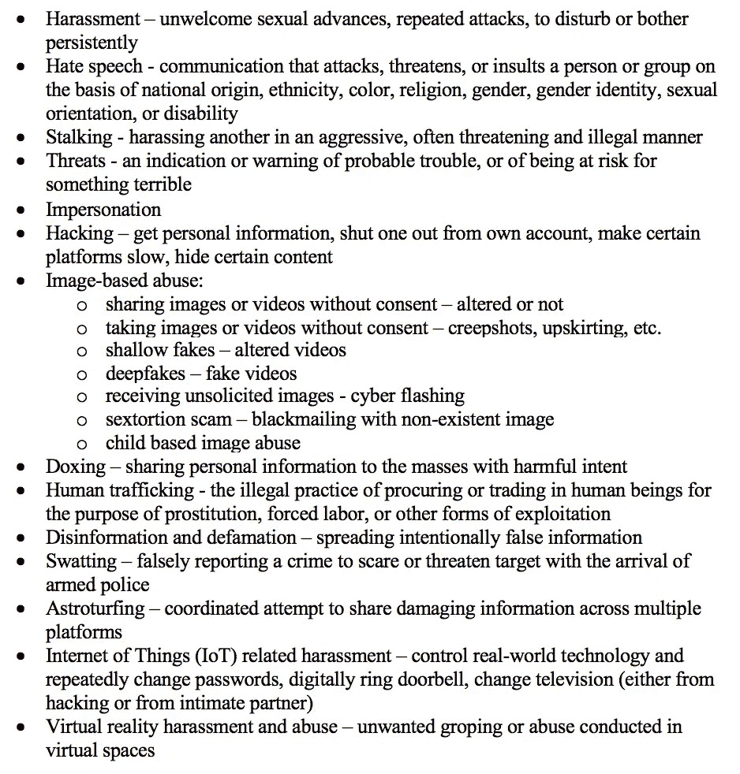

# 数据和技术中的性别偏见

> 原文：<https://medium.com/geekculture/gender-bias-in-data-and-tech-ba25524295d4?source=collection_archive---------21----------------------->

## 详述技术带来的危害:直接和间接

> 这篇文章详细描述了技术促进的对妇女和女孩的直接伤害(T1)(在线 GBV)和间接伤害(T3)(算法偏差、数据偏差、数据安全、无视性别的技术)。这是一篇跟进[在仪表板下](/@stephanie.mikkelson/checking-under-the-dashboard-6d0acc196fa2)检查的文章。

UNWomen gender equality ad campaign to raise awareness around Google’s gender bias search queries.

## **直接伤害/基于性别的暴力(GBV)/暴力侵害妇女行为(VAW)**

对妇女和女童的直接伤害包括故意暴力，例如:在线骚扰、仇恨言论、跟踪、威胁、冒充、黑客攻击、基于图像的虐待、doxing、人口贩运、造谣和诽谤、殴打、astroturfing、与物联网相关的骚扰以及虚拟现实骚扰和虐待。这些类型的暴力可以很容易地归类为 GBV/ VAW、[技术推动的 GBV](https://www.icrw.org/publications/technology-facilitated-gender-based-violence-what-is-it-and-how-do-we-measure-it/) /VAW 或[在线 GBV](https://webfoundation.org/2020/11/the-impact-of-online-gender-based-violence-on-women-in-public-life/) / VAW，因为这些行为背后的意图很明显，就是伤害个人或团体。关于这些主题的作品数量不多，但在不断增加。

一段时间以来，一直关注这种由技术推动的直接伤害的团体是 [APC](https://www.apc.org/en/tags/online-gender-based-violence) 和记者，尽管这项工作在历史上并不旨在关注女性，但针对女性的攻击是常见的，因此最近成立了一个反对网络暴力的[女记者联盟](https://www.iwmf.org/coalition-against-online-violence/)。儿童保护社区也很活跃，因为它与儿童特别相关。传统的 GBV 社区也开始讨论这样的话题，因为科技推动的 GBV 也是由男女权力不平衡的同代问题引起的。

其中包括一份由技术促成的直接伤害的清单，该清单是根据来自世界各地的资料汇编而成的，包括个人讨论、在线活动和多次会议。该列表并非详尽无遗，只是为了分享信息。

## **间接伤害/ GBV/ VAW**

今天，大多数技术，特别是数字技术的创造方式正在扩大性别不平等，歧视妇女和女孩。尽管*阻止女性获得工作、资金、公共服务和信息*，滥用数据和技术对女性造成的间接伤害几乎完全被忽视了。

在这里，我们谈论的是算法偏见(即人工智能和机器学习中的编码偏见)、数据偏见(即缺失或贴错标签的数据集)、数据安全(即共享可识别的信息)，以及其他没有纳入妇女和女孩声音的性别盲技术(如机器人、车祸假人和延续有害性别规范的人力资源软件)。让我们通过分解不同的元素和术语来更深入地了解这些间接伤害。

***算法偏差—***

*算法本身是没有偏见的，但它们是由无意识偏见的人类编写的*。每一项数字技术都是用算法构建的。一个**算法**基本上是一组指令，告诉计算机做什么。算法是程序员或者编码员写的。举一个简单的例子，如果编写一个算法来根据我们的世界人口做出决定，并且它的指令(也称为代码)说要查找“所有数据”，但无论是计算机还是程序员都没有认识到它的“所有”数据集实际上是由 90%的男性和 10%的女性组成的，那么显然女性没有按比例得到代表。如果我们的社会 90%是男性，这不会是一个问题，但由于我们的世界人口大约是 50%男性和 50%女性，这种算法现在错误地将男性数据放大到几乎整个人口，无意中使女性比例非常小，她们的关注几乎看不见。如果不明显，这对于女性来说是一个巨大的问题。

让我们想想，如果这个算法或类似的东西被用来雇用新员工(例如[亚马逊](https://www.reuters.com/article/us-amazon-com-jobs-automation-insight/amazon-scraps-secret-ai-recruiting-tool-that-showed-bias-against-women-idUSKCN1MK08G))、选择贷款人(例如[苹果卡](https://www.nytimes.com/2019/11/10/business/Apple-credit-card-investigation.html))、提供公共服务，或者甚至只是为了向一半人口提供基本信息(例如[谷歌搜索引擎](https://www.nytimes.com/2019/11/11/technology/artificial-intelligence-bias.html))，这将意味着什么。这将意味着我们现在雇用更多的男子，向男子提供更多的贷款和公共服务，所有基本信息都是从男子的角度提供的。90%男性和 10%女性的例子是一个极端和简化的例子，用于描绘一幅清晰的画面，即算法如何只捕捉它被告知要查看的内容，以及**算法如何编写以及它可以访问哪些数据集**真的很重要。

然而，亚马逊和 Apple Pay 是最近算法歧视女性的真实例子。[亚马逊](https://www.reuters.com/article/us-amazon-com-jobs-automation-insight/amazon-scraps-secret-ai-recruiting-tool-that-showed-bias-against-women-idUSKCN1MK08G)建立了一个机器学习工具，在它被拉出来之前，它只是在识别男性候选人。[苹果信用卡](https://www.nytimes.com/2019/11/10/business/Apple-credit-card-investigation.html)因其算法给予男性比女性更高的信用额度而受到调查，但他们无法向顾客解释原因。研究还表明，谷歌搜索引擎目前使用的语言模式也带有性别偏见，延续了有害的性别刻板印象。这些公司正在寻找解决上述问题的方法，但它们的存在需要更多的审查和整体解决问题的方法。

> 在这里，我们提供了一些关于算法的定义。我们有**机器学习** (ML)，这是为自动化数据分析而构建的算法。ML 算法是在特定数据集上训练的；或者换句话说，用训练手册之类的东西(由人类)教他们寻找什么。ML 非常常见，当您想要快速分组或分类大量数据时非常有用。当构建 ML 算法来寻找它自己的训练数据集时，ML 可以被带到另一个水平；或者换句话说，自己写手册，自己教自己。这种类型的 ML 被称为“无监督学习”。
> 
> 更高级的 ML 子集包括*深度学习* (DL)和不同的*神经网络* (NN)。人工智能(AI)是一个庞大而流动的术语，目前包含了我们描述的所有内容(ML、DL、NN)以及更多，但随着计算变得更加先进，它将继续变化。[人工智能被定义为“让计算机以我们认为需要人类智能的方式运行的[过程和机制]。根据这个定义，人工智能的例子只会继续扩展，但目前可以与 ML 互换。](https://www.forbes.com/sites/peterhigh/2017/10/30/carnegie-mellon-dean-of-computer-science-on-the-future-of-ai/?sh=2c24719d2197)

今天 ML 和 AI 中的一些最大问题包括黑盒问题、概念漂移和过度拟合。*黑盒问题*可能是两件事的结合，第一，它可能是关于根本无法访问原始算法(例如知识产权)，或者第二，它也可能是关于算法变得如此复杂，以至于**甚至创作者都无法解释决策过程了**。为了让我们了解是否存在算法偏差，它是否具有正确的男女比例，或者它对世界人口的原始看法是否偏向男性，我们需要回顾原始算法，原始训练数据集，以及它在“学习”过程中可能发生的任何变化。对于无监督的 ML 算法，知道算法为什么做出某些决定可能是困难的。要记住的另一个问题是，当 ML 用于预测未来事件或趋势时，是*概念漂移*，当一个变量(即你试图预测的东西周围的东西)以不可预见的方式移动，导致预测随着时间的推移变得不那么准确。最后，另一个问题，特别是与性别偏见有关的问题，是*过度适应*。这是指算法在特定类型的数据(例如男性)上训练过多，以致于难以识别新数据(例如女性)中的细微差异，从而产生与原始数据(例如男性)相同的输出。应该注意的是，过拟合是可以修复的，但是它确实需要大量的人工工作来将特定的差异编程到算法中。工作的价值可能大于成本，也可能不大于成本。

***数据偏差—***

数据偏差有多种形式和大小，有模拟的，也有数字的。数据偏差并不是什么新鲜事，只是当我们谈论 ML 时，它是一个更大的问题。算法或模型运行的时间越长，一个看似很小的偏差就变得越显著，越难检测。例如，假设我们有一个基本数据集来训练我们的工作模型。在这个数据集中，所有的男性都是医生、工程师和建筑工人，所有的女性都是护士、秘书和教师。这本身不是一个问题，因为男人可以成为医生、工程师和建筑工人，而女人可以成为护士、秘书和教师，但是因为我们谈论的是计算机而不是人，所以计算机将无法检测出女人可以成为工程师，除非我们用数据来展示它。

现在让我们假设这个原始模型被一家大公司用来寻找新的求职者。一名员工将搜索工程候选人，结果将出现所有男性，有人可能会认为这很奇怪，但也有人会想，“嗯，每个人都知道没有多少女性工程师，所以我想这是有道理的，这是所有男性…一定是管道问题”，然后继续他们的下一个任务。这当然不是因为没有女性工程师，而是因为该算法只能识别男性工程师。这是一个会从后端强化性别刻板印象的问题，这意味着作为一个普通的前端仪表板用户，要发现这个问题即使不是不可能，也是极其困难的。

这是一个基于[挖掘 AI](https://excavating.ai/) 来清晰描绘问题的例子，但是数据偏差可以以许多不同的方式影响结果。数据偏差中最紧迫的问题是妇女和女孩的总体缺乏*适当的代表性*，特别是在训练数据集中。如果它们没有在数据集中得到恰当的表示，那么就好像这些问题根本不存在。

研究中数据偏倚的三个主要类别是选择偏倚(计划)、信息偏倚(数据收集)和混杂偏倚(分析)。认知偏差，在我们的例子中是性别偏差，可以跨越所有的数据偏差。数据中的性别偏见的结果是，解决方案或证据要么在最好的情况下丢失了小规模影响的全貌，要么在最坏的情况下在全球范围内强化了几代人的性别陈规定型观念。世界比以往任何时候都更加关注数据偏见，因为我们认识到，我们的世界越是数字化，越多的偏见就会以指数形式编码到我们的生活中。想想技术发展得有多快，以及它是如何贯穿每一个工作领域的。数据和技术是性别歧视或平等未来的关键。

***数据安全—***

我们将从 GBV 的角度来看数据安全——这主要是关于技术解决方案，它们没有考虑到与收集和分享个人数据相关的全部风险。这适用于大多数性别平等项目，因为即使是对性别规范或增强妇女权能的质疑(或对其的质疑)也往往是敏感的和政治性的。当与 GBV 幸存者一起工作时，这一点更加真实。

当新行为者冒险进入性别平等或 GBV 领域时，第一个可以理解的冲动是按地点找出流行率数据，但这可能是危险的。我们都想知道这些信息，但经常被忽视的是，性别平等和 GBV 数据很复杂，不能像其他类型的数据一样对待。GBV 事件数据尤其如此，但随后是替代指标(这些指标与性别平等指标非常相似，如果不是完全相同的话)。分享任何特定地区的学校或学生数量可能不会有问题，但如果 GBV 幸存者或被认为是妇女赋权活动家的名字和/或位置被分享给错误的人或团体，那么结果可能是暴力增加甚至死亡。

在处理性别平等数据时，整个过程需要来自这样一种认识，即全球近三分之一的[妇女](https://www.who.int/publications/i/item/9789240022256)在其一生中遭受过身体暴力或性暴力，大多数针对妇女的暴力是由[亲密伴侣](https://www.who.int/publications/i/item/9789240022256)实施的。这意味着仅仅询问关于性别平等或 GBV 教的问题就有可能让三分之一的女性处于危险之中。因此，如果利益大于风险，所有性别平等项目都应仔细审查。

*充分评估性别平等和 GBV 项目的风险数据收集对于妇女的安全至关重要。*

在具体处理 GBV 事故数据时，还有一点需要注意，认识到 GBV 的数据被严重漏报也很重要，因此任何使用这些数据的人都必须了解这些数据的局限性和可能的算法偏差，如果打算在 ML 工具中使用这些数据的话。此外，在没有适当的 GBV 响应服务的情况下收集此类信息在道德上是有问题的。

***性别盲技术—***

无视性别的技术是指任何没有分析产品如何对男性和女性产生不同影响的技术解决方案。这意味着不仅要看产品对不同性别的人是多还是少有害，还要看它是多还是少有用。不考虑性别的后果可能大不相同。最好的情况是，这项技术将对男性和女性产生相同的负面和正面结果，但最坏的情况是，它可能只会对男性产生正面结果，对女性产生负面结果。这适用于任何科技产品，不管是不是数字产品。本文中给出的许多例子都是无视性别的技术，如果我们从一开始就考虑到性别因素，这些技术可能是可以避免或最小化的。

虽然我们不能客观地说任何技术都是真正的性别盲，除非创造者明确承认他们没有进行性别影响分析，但我们可以根据我们所拥有的信息做出假设。

我们以 Siri 为例来看看。Siri 是一个女性语音机器人，或虚拟助手，旨在为其数百万日常用户提供信息。当用户说“嘿 Siri，你是个双性恋***”或其他[粗俗的性命令](https://qz.com/911681/we-tested-apples-siri-amazon-echos-alexa-microsofts-cortana-and-googles-google-home-to-see-which-personal-assistant-bots-stand-up-for-themselves-in-the-face-of-sexual-harassment/)时，得到的回应是调情的“如果可以，我会脸红的”。这并不是无视性别的技术的证据，但它显然是一个更大问题的指标。当我们仔细观察 Siri、Alexa 和 Google Home 的内部工作方式时，我们会发现它们都使用 ML，并通过**自然语言处理** (NLP)进行操作，使用大型**语言模型** (LM)，其中通常包括[性别陈规定型*单词嵌入*](https://arxiv.org/pdf/1607.06520.pdf) (例如，男人对于计算机程序员而言，就像女人对于家庭主妇一样)。这意味着，除了 Siri 对口头性骚扰的轻浮回应，Siri 还被编程为以性别偏见的回应来回应。

虽然创造这些机器人的公司据称有偏见，但我认为可以肯定地说，没有彻底的性别影响评估，Siri 绝对属于无视性别的技术类别。

除非我们刻意分析并纳入不同女性和女孩的声音，否则科技将继续由“[默认男性](https://www.economist.com/leaders/2019/11/21/silicon-valley-is-bad-at-making-products-that-suit-women-that-is-a-missed-opportunity)”创造，并为他们服务。