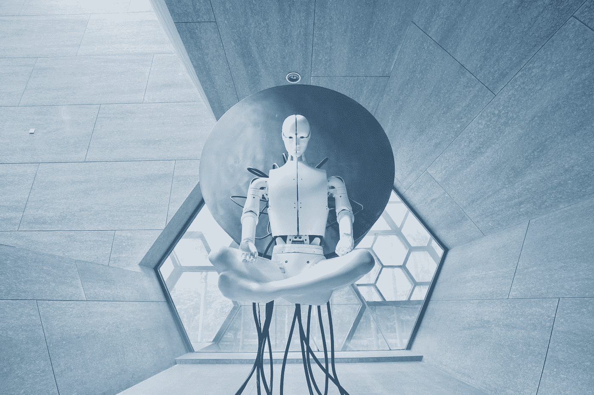

# 艾(AGI)将军是人类最后的发明吗？

> 原文：<https://medium.com/geekculture/general-ai-agi-is-the-last-human-invention-72694c79acda?source=collection_archive---------13----------------------->

Photo by [Aideal Hwa](https://unsplash.com/@aideal?utm_source=medium&utm_medium=referral) on [Unsplash](https://unsplash.com?utm_source=medium&utm_medium=referral)

在今天的文章中，我们将讨论人工智能以及它对人类未来的意义！在我们深入这个话题之前，如果你想查看这篇文章的视频版本，那么请查看下面的链接。

用非常简单的话来说，AGI 或人工通用智能是一种理论，即人工智能有一天将达到人类的水平，并随后超过所有人类智能。小说中的 AGI 通常被描绘成一台可以与人对话、进行医疗诊断并对任何事情做出非常准确预测的机器。这些例子绝非详尽无遗，但它们抓住了 AGI 未来可能的本质。当前的机器学习解决方案高度专用于特定问题，如网飞电影推荐、自动驾驶汽车和天气预测等。这些机器学习解决方案被称为狭义人工智能，因为顾名思义，它们只能处理狭窄范围的任务。如果 AGI 成为现实，在某一点上，它超越了所有人类的智慧，这是一个不可想象的差距，被称为奇点。在这一点上，被称为超级人工智能的人工智能解决方案被假设为在技术，太空探索，医学和其他几个领域的进步中不可预测。这仍然是非常理论化的，但是这是否意味着人类已经创造了他们最后的发明？AGI 将在不同的行业处于领先地位，但代价是什么？AGI 的批评者建议通过制定政策和法律来监管人工智能融入我们的日常生活，从而密切关注这项技术的发展。AGI 可能拥有的力量深不可测，正如在所有反乌托邦电影场景中看到的那样，如果全能的人工智能认为人类在其总体目标中毫无价值——无论目标是什么，那么我们真的有机会吗？著名的 AGI 批评家埃隆·马斯克称这项技术是对人类生存的威胁，因此作为回应，他联合创立了 Neuralink。Neuralink 是一家神经技术公司，承诺提供大脑-机器植入物，当人工智能系统变得非常强大时，这些植入物将使人类获得优势。换句话说，埃隆认为，人类可能有机会对抗 AGI 的唯一方式是与这些机器进行交互，这样人类就可以利用这些人工智能系统的力量。这是一个非常有趣的话题，我们将在以后的文章中讨论，所以如果你喜欢这种围绕未来技术的讨论，那么请查看这个频道了解更多内容[https://www.youtube.com/channel/UCsZRCvdmMPES2b-wyFsDMiA](https://www.youtube.com/channel/UCsZRCvdmMPES2b-wyFsDMiA)。批评者认为，民主化的人工智能将允许获得未来的 AGI 技术，并将阻止少数垄断公司单独控制非常强大的人工智能系统。你不会想要一个真实世界的天网控制一切，你会吗？访问非常有影响力的人工智能系统，就像其他资源一样，将决定未来的政治格局，并将影响社会阶层，这可能会进一步扩大不平等差距。你可以看到为什么在我们社会的各个方面绝对跟踪人工智能的进展是重要的。

除了批评者，还有几个 AGI 的支持者，比如来自 Deepmind 的戴密斯·哈萨比斯、来自 OpenAI 的伊利亚·苏茨基弗和他的团队、来自 OpenCog 的本·戈泽尔以及其他一些杰出的科学家。这些科学家通常给出的时间范围从 10 年到 30 年不等。现在，这些预测可能看起来过于乐观，但考虑到高度精确的狭义人工智能解决方案的搅动和对通用人工智能系统的认真尝试，这没有什么可嘲笑的。DeepMind 的加托是一个人工智能系统的例子，它扩展了单个模型可以执行的任务范围。DeepMind 将加托描述为多面手，能够解释不同的模式，如图像、文本和环境模拟，以解决 600 多项任务！一些科学家将它描述为一个为多项任务设计的人工智能解决方案工具包，因此它不一定是 AGI；但这是否意味着加托仍然是狭隘的人工智能？或者介于两者之间。在接下来的几个月里，DeepMind 可能会对这个模型进行改进，因为它只有 12 亿个参数，而其他最先进的模型则有数千亿个参数。学习也是仅基于监督学习的离线学习，但是有可能进一步扩展这种学习，通过随着更多数据通过未来交互变得可用而不断更新模型，并实施强化学习，这甚至可能使模型大大改进。总而言之，这对人工智能来说是一个非常令人兴奋的时刻，谁知道我们可能正处于 AGI 时代的尖端，我们只能拭目以待。OpenCog 是另一个目标是制造“会思考的机器”的项目。他们正在研究一些有趣的想法，如知识表示、逻辑网络和能力目标，其中包括借鉴人类特征的情感和动机框架。你现在不需要理解这些框架的本质，但你可以很容易地看到，世界各地都有顶尖的科学家致力于解决一般智力的问题。另一个大大加快人工智能发展的方法是关注硬件。当前的计算资源比它们的前辈快得多，但是它们在一个时间帧内可以处理多少数据上有限制。围绕量子计算的讨论是一种将量子物理概念整合到计算中的方法，长期以来一直被认为是计算机处理速度更快的显而易见的下一步。我们将在另一篇文章中讨论这一点，但为了总结这种新型计算能力的主要思想，机器学习问题将会看到更好的艺术效果，因为开发的模型将会相对更快地解决问题，并探索更广泛的解决方案。我们肯定生活在令人兴奋的时代，谁知道未来 10 年将会在量子计算研究中带来什么！

AGI 理论的另一面是怀疑论者，他们认为没有什么像超级智能的通用人工智能系统一样，要么是因为哲学推理、神经科学和生物学解释，要么只是技术限制。广受好评的科学家，如 Meta 的首席科学家 Yann LeCun 或《流行的机器学习库-Keras》的作者 Francois Chollet 解释说，一般智能不仅仅意味着扩大人工智能系统可以完成的任务。Yann LeCun 解释说，人类可以完成的所有任务都不是一般性的，而是在一定范围内具有一定的特异性，术语 A-G-I 应该更新为人工人类水平的智能。这种澄清将确保在一组可能的人工任务中，没有对更通用的人工智能系统的能力的误解。Francois Chollet 解释说，机器可以变得更通用，但这些机器不会成倍地超过人类的智力。他进一步指出，科学发现越多，就越难发现更多，因此一些科学家关于人工智能系统智能爆炸的预测是错误的。根据他的观点，科学进步应该开始趋于平稳。

就可能发生的事情和面临的威胁而言，AGI 的预言既令人兴奋又令人恐惧。我们建立新的人工智能系统越多，我们就越了解什么是可能的。

你觉得 AGI 怎么样？你相信 AI 系统真的能在各方面超越人类的任务吗？像人类擅长的创造力和创新这样的非物质属性呢？这些 AGI 系统会比人类更有创造力、更有野心、更有创新性吗？这些都是有趣的问题，我想知道你的想法，所以一定要添加到下面的评论部分。

谢谢大家！

**相关话题:**

 [## 人工智能终于在新的测试中变得有意识？

### 今天我们将讨论一种新的人工智能语言模型，以及它如何与意识相联系，所以请继续…

taffydas.medium.com](https://taffydas.medium.com/artificial-intelligence-finally-becomes-conscious-in-new-tests-df4e0e2d1287)