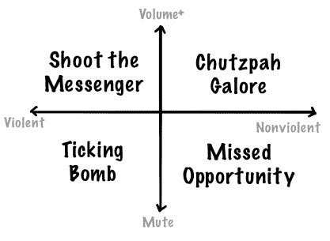

# 产生有效的胆识

> 原文：<https://medium.com/geekculture/generating-effective-chutzpah-aaf6c8d21977?source=collection_archive---------17----------------------->

在一个著名的夏洛克·福尔摩斯故事中，虚构的侦探通过意识到犯罪发生时狗并没有在午夜吠叫而破案。因此，他得出结论，这是初级的:狗认识肇事者。我经常训练我的客户适应他们周围的安静。每一次验尸都应该包括这样一个问题:“为什么狗不叫？”

你的团队可能由你花了很多精力雇佣的聪明有才华的人组成(他们每个月都有丰厚的薪水)。很可能对于每一个正在展开的问题，团队中的某个人在它引起你的注意或者甚至预见到它之前就已经发现了它。然而，许多团队苦于人们不畅所欲言，或者以一种不会导致积极行动的方式提供反馈。我们希望狗叫，并以某种方式让我们检查院子里发生了什么，而不是吼他们安静下来。我们如何获得更多？

作为一个在以色列出生和长大的人，我可能有偏见，但我相信有效的大胆是一种巨大的财富。当我还是以色列国防军一名 19 岁的下士时，我对一名中将说，让他知道他建议的解决方案是愚蠢的。我喜欢看到 ICs 在全体会议上就公司战略向 CEO 提问。要享受*的放肆*带来的好处，你需要用两方面的反馈来帮助你的团队:*卷*和*非暴力沟通*。让我们仔细分析一下:

# 安静的那些

当人们不说话时，并不意味着他们没有什么可说的。通常，这意味着过去的一些事情(无论是在你的公司还是他们以前的职位)已经告诉他们说出来可能是危险的或不被允许的。然而，敏锐的观察者可能会注意到可以改进的问题和领域，或者有太多的错误。他们的音量一直降低；他们静音了！

第二个方面是他们倾向于如何在头脑中表达他们的批评。如果他们天生倾向于非暴力沟通，那么他们可能会有很好的建设性批评。这是你正在错过的有价值的反馈。另一方面，我们安静的人可能不会倾向于非暴力沟通。这些人坐在那里积累压力、挫折和痛苦，最终很容易爆发和崩溃。

我们的第一步是注意这些人是谁，并慢慢提高他们的音量，不管他们目前在大脑中使用哪种交流方式。我们这样做是通过鼓励大胆的行为:

*   请你的经理考虑一下他们团队中谁看起来沉默不语。这些人不参加全体会议，也很少在回顾或一对一的会议中表达任何担忧。
*   对于每个人，评估他们是否一直保持沉默(我说的“一直”是指他们在你公司的任期)或者他们是否在某个时候保持沉默。
*   他们的直接经理应该就这种看似平静的情况进行一对一的反馈，并建议设定一个个人成长目标来改善这方面的情况。如前所述，对于变得沉默的人，一定要询问这一点，看看是什么原因造成的。
*   最后，继续征求反馈意见:首先，同意让他们准备好就某件事(他们自己、他们的团队、他们的经理、其他团队)进行一对一的反馈。慢慢地，他们可以在回顾会和更大的论坛上发表自己的意见。管理者应该解释反馈的重要性，并学会如何正确地承认它(更多[在这里](https://avivbenyosef.com/soliciting-upwardchutzpah-feedback/)和在我的书里 [*科技高管操作系统*](https://techexecutiveoperatingsystem.com) )。他们表达反馈的方式可以改进，如下所述。

请注意，人们有时会因为与他们的直接经理有关的问题而决定保持沉默。这就是为什么我建议跳过与一般人的一对一，特别是那些在上述过程中似乎不会有所改善的人。他们可能需要其他人的参与，比如作为高管或人力资源的你，来开始修复信任。

# 令人不快的

现在我们来看看那些敢于直言的人，但他们这样做的方式并没有真正培养反思和进步。即使是最注重成长的人也不太可能接受以暴力或有害方式提供的反馈。像这样交流的人的问题是，他们可能会经历一种“射杀信使”的情况(或者仅仅是被忽视)。这反过来会把他们归入前一类，让他们闭嘴，不再发表意见。

虽然这可能会让周围的人感觉更好，因为它减少了有害的评论，但这意味着我们将会失败。通常这些人也非常关心正在发生的事情，如果他们被迫保持沉默，他们会去哪里。

这些情况需要经理们的悉心指导，让他们正确看待自己的角色。我推荐查看一些资源，如[非暴力沟通](https://amzn.to/3ibXyEy)和[激进坦诚](https://amzn.to/3hEYtOW)。

# 厚颜无耻

最后，那些直言不讳并以有益于创造变革的方式这样做的宝贵的人是你的组织中惊人的力量倍增器。这就是我们作为领导者需要额外注意的地方，确保以正确的态度对待这些反馈。即使就个人而言，这意味着我们必须更加努力地解释决策背后的逻辑，或者当反馈解决了我们个人涉及的问题时，我们也应该首先怀着感激之情对待它。反馈很宝贵，不要浪费。

*Aviv Ben-Yosef 2021 —在我最近出版的书中获得更多信息:* [***科技高管操作系统***](https://techexecutiveoperatingsystem.com/)