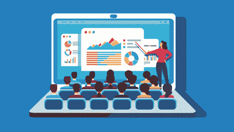

# 为数据分析师生成有效的演示文稿

> 原文：<https://medium.com/geekculture/generation-effective-presentations-for-data-analysts-d1609d4ce8ee?source=collection_archive---------12----------------------->

撇开技术技能不谈，分析领域要求一个人具备包括沟通和表达在内的软技能。分析过程的最后阶段是向客户展示你的发现和结论。虽然是一个演示文稿，但数据分析结果需要一定的工作流程才能使演示文稿成为一个好的商业故事。在这篇文章中，我们将看到一些有助于做好演示的技巧。

**从业务问题开始，并保持在上下文中**

所有的发现和相应的结论都伴随着与之相关的任何业务问题。没有这一点，做分析的全部意义就没有了。展示调查结果也是如此。开始陈述时，首先要问的是这个任务中需要解决什么问题，你试图解决什么问题？在整个演示过程中，所有的陈述和发现都应该紧扣这个业务问题。

> 心中有一个目的地，生成一堆输出不是关键，但解决客户的需求才是关键。

**少即是多**

演示的主要目的是突出研究结果及其相应的证据，如可视化。因此，请记住不要用大量的文字使每张幻灯片过于拥挤。这可能会混淆和转移观众的注意力。首选方案是用不超过 3-4 行的文本和一幅图像来展示调查结果，如果以简单的方式展示的话。文本应特别强调特定图表/分析的发现，但要将业务问题放在上下文中。

> 简单有时超越了风格。

**方法第一，结果第二**

分析程序通常有多种方法，每种方法都有一定的缺点，或者在应用的容易程度上有所不同，或者两者都有。在这种情况下，演示应该从执行分析所采用的方法、理由以及所获得的结果开始。此处的理由是，提及该方法可被观众用来验证程序和结果，而仅呈现结果将无助于观众提出关于该方法有效性的问题。

> 结果总会到来，但是正确的结果需要正确的方法。

**从常规开始，然后深入研究**

当开始任何演示时，在深入研究之前，先从基本的和低层次的发现开始。迈出太大的步伐而跳过一般的发现会让观众偏离轨道。最佳实践是从一般发现开始，给出数据的概述，然后深入研究。观众应首先对可用数据和业务问题有一个概述，然后展示其他发现。

> 好的开始是成功的一半。良好的介绍和理解大有帮助。

**做一个讲故事的人**

任何数据爱好者都可能熟悉“用数据讲故事”这个术语。要做一场精彩的演讲，就要做一个善于讲故事的人。按照有意义的顺序组织幻灯片，从基础知识、深入的发现和结论以及方法和理由开始。逻辑流程使演示易于为观众所理解。

> 解释数据就像一个故事，你需要一个介绍，一个核心部分和一个结论。

**保持简单的可视化，并贴上标签**

最大限度地利用可视化的潜力——易于理解。保持可视化简单，有标签和自我解释。记住使用正确的图表类型来突出显示数据的分布。标注时避免使用专业术语。如果任何可视化与解决业务问题无关，就把它们从演示文稿中去掉。查看我的[指南](https://medium.datadriveninvestor.com/a-guide-to-building-effective-dashboards-bd93362a0bf0)关于生成有效的可视化。

> 直观教具在理解数据上有更大的优势。这就是可视化的潜力。

**突出显示业务指标**

某些任务要求您选择特定的业务指标，并使用该指标执行分析。在这种情况下，需要突出显示这些指标，并说明为什么要突出显示这些指标，而不是其他类似的指标——该指标是否合适？执行分析的便利性？准确性？。

> 每件事都应该有一个什么和为什么。

感谢您的阅读！

## 有用的链接:

在 LinkedIn 上找到我:[https://www.linkedin.com/in/vishnuu0399](https://www.linkedin.com/in/vishnuu0399)

更了解我:[https://bit.ly/vishnu-u](https://bit.ly/vishnu-u)

生成有效可视化指南:[https://medium . datadriveninvestor . com/a-guide-to-building-effective-dashboards-BD 93362 a0bf 0](https://medium.datadriveninvestor.com/a-guide-to-building-effective-dashboards-bd93362a0bf0)