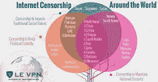
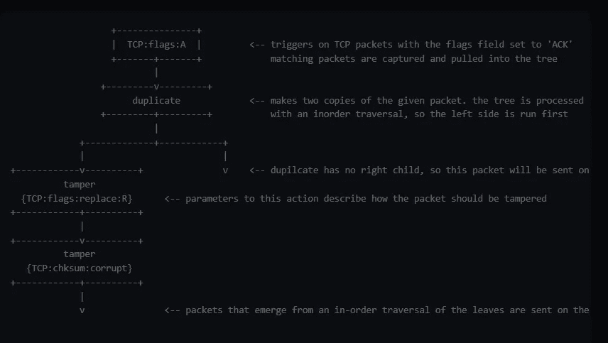
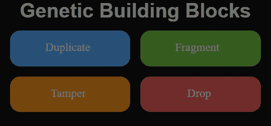
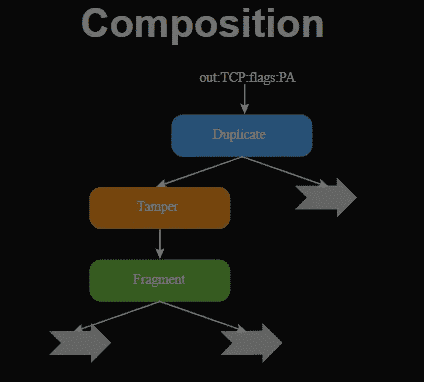
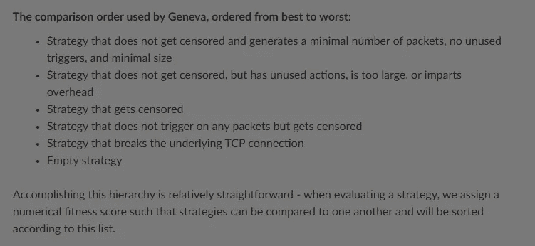
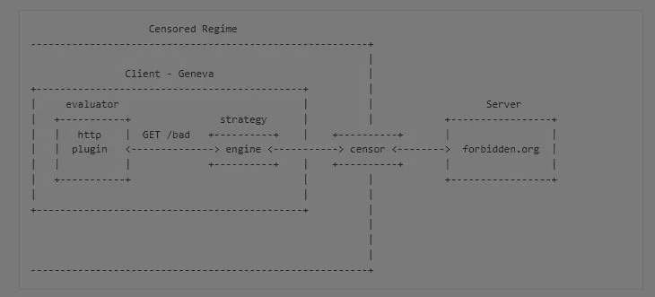

# 日内瓦项目:被遗传算法击败的国家审查制度

> 原文：<https://medium.com/geekculture/geneva-state-censorship-beat-by-genetic-algorithms-b95deff5cc52?source=collection_archive---------6----------------------->

## 人工智能在当今社会最具影响力的应用之一

互联网是一个伟大的工具。不足为奇的是，我是它提供的所有潜力的超级粉丝(我在旅途中非常依赖它)。互联网是人类进步不可或缺的一部分，并将继续成为未来进步的重要组成部分。

Every country in the world puts large amounts of information in tracking and censoring the internet

不幸的是，随着技术的发展，滥用的可能性也在增加。机器学习可以用来自动化许多复杂的任务，这在 15 年前是不可能的。不幸的是，这开启了审查和大规模监控，其规模在以前是不可想象的。具有讽刺意味的是，人工智能和机器学习也成为处理这类问题的最佳工具之一。

我在视频里碰到过一个这样的项目: [*AI 对抗审查:遗传算法，日内瓦项目，ML in Security，等等！*](https://www.youtube.com/watch?v=zcGOPqFZ4Tk&feature=youtu.be) 这是对一个项目领导人的精彩采访。这个采访特别有趣，因为作者谈到了遗传算法如何非常适合这项任务。[作为一个曾经谈论过进化算法未被充分利用的人，这引起了我的兴趣](https://youtu.be/tqJUrZPOwPo)。在这篇文章中，我将分享一些有趣的(机器学习外卖)以及我在研究这个想法时的一些想法。这篇文章旨在向您介绍[这个至关重要的项目，并引起您的注意](https://geneva.cs.umd.edu/about/)。确保你研究它们，因为它们对未来有帮助。

# 关于日内瓦

查看网站，“ *Geneva 是一种新颖的实验性遗传算法，它通过操纵连接一端的数据包流来迷惑审查员*，从而逃避审查。”它有两个组成部分-

1.  策略引擎:策略引擎负责在活跃的网络流量上运行给定的审查规避策略。
2.  遗传算法:遗传算法是一个学习组件，它针对给定的审查者进化出新的策略(使用引擎)。

该工具是开源的，他们的 [Github 可以在这里找到](https://github.com/kkevsterrr/geneva)。任何人都可以从他们的机器上设置和运行 Geneva。运行它将启动算法，尝试测试不同的策略。它尝试了越来越精细的策略。如果破解了加密，该团队将研究结果，以提取有关潜在审查系统的信息。

This disclaimer is so badass. Be safe if looking into this though

鉴于项目的性质，在他们的文档中有许多与网络相关的术语。我对该领域一无所知，所以我不会假装能够分解这些方面。如果任何在这些领域更有经验的人想继续讨论这些因素，我会非常乐意向你们开放我的平台。但我可以解释有趣的人工智能方面。

# 范围

在我分享的关于差分进化的视频中，我谈到了基于进化的算法如何比传统的基于梯度的方法具有更大的可能搜索空间。这种优势真的在类似这样的问题中表现出来了。进化算法(如这里提到的遗传算法)可以遍历更多样的搜索空间。

Sample Strategy evolved by Geneva algorithm: The reason that GAs can build solutions by chaining together components is that they don’t need a smooth, continuous search space.

以搜索空间为例。基于梯度的方法需要平滑、连续的搜索空间。遗传算法可以在不属于这种情况的情况下运行。这就是为什么他们可以调整解决方案并链接他们搜索空间的组件来创建新的候选解决方案。

Google found great success using Evolutionary Algorithms for their Neural Architecture Search work. Check out my content for more information on that.

这位领导在相关采访中确实提到了这一点。他提到 ML 方法计算时没有梯度。对于搜索空间(我们通过链接命令来构建策略)和输出(通过审查)都是如此。事实上，他甚至提到，由于遗传算法可以测试一切，他们实际上不得不将算法约束在一些基本命令上。

# 搜索空间命令

[基于进化的方法总是有一个有效的基本命令集可以测试。这是他们用来创建候选解决方案，以及在重组/突变阶段调整现有解决方案的工具。](/mlearning-ai/why-you-should-implement-evolutionary-algorithms-in-your-machine-learning-projects-ee386edb4ecc)这些都是领域特定的。对于这个项目，我们有以下构件。

These are the 4 commands that the algorithm can use/chain to win

重要的是要理解他们是如何提出这些作为基础的。该小组使用了审查的简单定义，审查仅仅是对网络流量 的 ***修改。因此，该策略只是一个“应该如何修改网络流量的描述”。*从这个角度来看，很明显，块应该由网络数据包可能被修改的可能方式组成。**

> 审查规避策略的目标是修改网络流量，使审查者无法审查，但客户端/服务器通信不受影响。—来自作者

Github readme 提供了每个构建块的简明描述。

1.  `duplicate`:取一个包，返回包的两个副本
2.  `drop`:取一个包，不返回包(丢弃包)
3.  `tamper`:取一个包，返回修改后的包
4.  `fragment`:取一个包，返回两个片段或两段

值得注意的是，复制和分段"*引入了分支，这些动作被组成一个称为动作树的二叉树结构。触发器描述了树应该在哪些数据包上运行，树描述了当触发器触发时这些数据包中的每一个应该发生什么。*“这里可以举一个树的例子

The simple strategy shared earlier was also an example. I’m sure my followers (who are all very intelligent) will come up with more samples when they look into this.

行动树被组合在一起以创建成熟的规避策略。

# 适应度函数

适应度函数对于所有的遗传算法都是至关重要的。它们决定了算法会认为什么是好的和坏的，并将最终指导涉及什么样的策略。就像积木一样，设计这个并不简单。该协议的作者有一个相对简单的功能(这很好，因为它允许许多增强和修改)。在文档中，它们共享以下优先级

Taken from the documentation

如前所述，解的可能搜索空间是无限的。这意味着性价比至关重要。这一点尤其重要，因为系统是在本地机器上运行的(而不是像现在大多数 ML 那样的大型服务器)，并且与州政府的计算能力相抵触。这就是为什么作者如此重视尽早找到潜在的解决方案

> 这种层次实现了搜索空间的显著减少*。而不是日内瓦模糊了整个空间的可能战略(有很多！)，相反，它会快速消除破坏潜在联系的策略，并鼓励遗传算法只关注那些保持潜在联系的策略。*

*适应度函数创建强调最小化后悔的学习者(这里后悔是无用的解决方案)。这对他们来说是可行的，因为搜索空间自然很大，所以我们可以希望我们达到最佳可行性能。我会有兴趣尝试一些不好的解决方案的“保留”运行。有时，当经过许多代之后与强候选人混合时，他们可以引入强学习者。由于构建模块很简单，在这种情况下可能不是非常有效，但是我很想看到它。*

# *关闭*

*这是一个有趣的对抗性设计的例子，学习者通过尝试打破审查来学习。在采访中，凯文谈到他们是如何试图自己设计一些审查程序的。探索一种与这种逃避者一起进化的自动审查者将是有趣的。这不仅可能在未来发生，而且这种解决方案将加速这一进程。[这种方法在大多数 ML 中都取得了巨大的成功](/swlh/techniques-combining-discriminative-and-generative-approaches-for-classification-d57c78f6f849)*

*结合这一点和一种我们可以将所有运行结果链接回主系统的设置(就像我们对自动驾驶汽车所做的那样)，将是一种增强逃避代理的伟大方式。它还可以很好地利用规模。确保你研究了这个项目，并分享了你的想法。*

**

*The system operations in a nutshell*

*如果你喜欢这篇文章，看看我的其他内容。我定期在 Medium、YouTube、Twitter 和 Substack 上发帖(所有链接都在下面)。我专注于人工智能、机器学习、技术和软件开发。如果你正在准备编码面试，看看:[编码面试变得简单](https://codinginterviewsmadesimple.substack.com/)，我的每周时事通讯。您可以以每天不到 0.5 美元的价格获得高级版本。高级版将解锁每周编码问题的高质量解决方案、特殊讨论帖子和一个伟大的社区。它帮助了很多人做准备。*

*为了帮助我写更好的文章和了解你[填写这份调查(匿名)](https://forms.gle/7MfQmKhEhyBTMDUD7)。最多花 3 分钟，让我提高工作质量。*

*如果你也有任何有趣的工作/项目/想法给我，请随时联系我。总是很乐意听你说完。*

*以下是我的 Venmo 和 Paypal 对我工作的金钱支持。任何数额都值得赞赏，并有很大帮助。捐赠解锁独家内容，如论文分析、特殊代码、咨询和特定辅导:*

*https://account.venmo.com/u/FNU-Devansh*

*贝宝:[paypal.me/ISeeThings](https://www.paypal.com/paypalme/ISeeThings)*

# *向我伸出手*

*如果你想讨论家教，发短信给我。查看免费的罗宾汉推荐链接。我们都得到一个免费的股票(你不用放任何钱)，对你没有任何风险。不使用它只是在浪费钱。*

*查看我在 Medium 上的其他文章。:[https://rb.gy/zn1aiu](https://rb.gy/oaojch)*

*我的 YouTube:[https://rb.gy/88iwdd](https://rb.gy/88iwdd)*

*在 LinkedIn 上联系我。我们来连线:[https://rb.gy/m5ok2y](https://rb.gy/f7ltuj)*

*我的 insta gram:[https://rb.gy/gmvuy9](https://rb.gy/gmvuy9)*

*我的推特:[https://twitter.com/Machine01776819](https://twitter.com/Machine01776819)*

*如果你正在准备编码/技术面试:[https://codinginterviewsmadesimple.substack.com/](https://codinginterviewsmadesimple.substack.com/)*

*在罗宾汉上获得免费股票:【https://join.robinhood.com/fnud75 *