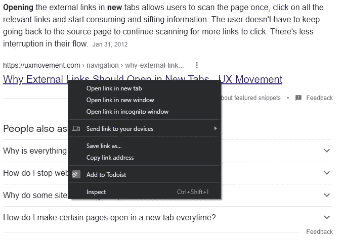
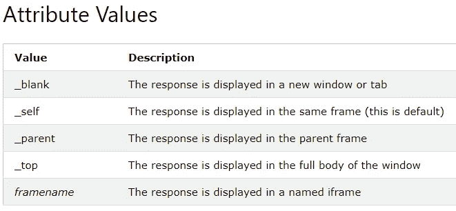

# 获取要在新标签中打开的链接

> 原文：<https://medium.com/geekculture/get-links-to-open-in-a-new-tab-84bbbbeb6ab0?source=collection_archive---------40----------------------->

Photo by [That's Her Business](https://unsplash.com/@thatsherbusiness?utm_source=medium&utm_medium=referral) on [Unsplash](https://unsplash.com?utm_source=medium&utm_medium=referral)

因为我在任何给定的时间都在做多件事情，所以我很抱歉打开了多个浏览器窗口，每个窗口都有几个标签。也许你们有些人能感同身受？当我完成项目和研究时，我会关闭它们，但混乱是永无止境的。

如果你使用 Chrome，[标签组](https://www.google.com/chrome/tips/)也不错，但我更喜欢将每个主题放在各自独立的窗口中。

我打开这么多标签页的部分原因是因为我会查看一些东西的列表，或者阅读一篇链接到其他页面或网站的文章，以获取更多信息。一些深度潜水需要我查找多个来源。然后，我不想关闭任何标签，以防我需要回溯我的来源。

在编码时，我重新发现了“啊哈！”瞬间。有没有注意到当你点击一些链接时，它会把你带到同一个标签页/窗口中的新页面？同时，其他链接会在**的新**标签中呈现新页面？还是窗户？或者启动一个本地网络或移动应用程序并在那里显示信息？

我的标签依赖型自我已经失望了太多次，从点击链接在我默认的同一个标签中呈现新页面，到右击链接并选择“在新标签中打开链接”。

right-click link and select ‘Open link in new tab’

以防你不理解我的轻微失望，想象一下你在谷歌搜索某样东西，想要比较前两三个结果的信息。如果你只是点击第一个链接，它会在同一个选项卡中呈现该页面。如果你开始点击那个网站，你就失去了立即返回谷歌搜索结果页面的能力。然后，你在第一个网站上找到你想与另一个网站进行比较的信息，在谷歌搜索结果页面上，这个页面现在已经回到了浏览器历史中。你在为自己创造更多的工作。

我没有权力让谷歌搜索结果链接默认打开在一个新的标签页(至少，据我所知)，但作为一名开发人员，我可以建立这个功能到我的网站，当我觉得这将有利于用户使用[**HTML‘目标’属性**](https://www.w3schools.com/tags/att_form_target.asp#:~:text=The%20target%20attribute%20specifies%20a,window%2C%20or%20inline%20frame) 。

“target”属性指定显示响应的位置。

**语法带表单** <表单 target="_blank" >

**链接到不同页面的语法** <a href = " http://www . Google . com " target = " _ blank ">Google</a>

w3schools — target attribute values

虽然我主要对在新选项卡或窗口中显示内容的' _blank '感兴趣，但我很好奇其他属性值会如何发挥作用，以及何时是使用它们的最佳时间和地点。