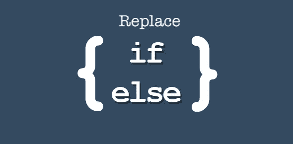

# 摆脱 If-else 循环

> 原文：<https://medium.com/geekculture/get-rid-of-if-else-loop-b80f98ce1fe7?source=collection_archive---------21----------------------->

在这篇博客中，我们将看到如何摆脱多重 if-else 比较。

Replace if-else.

在很多情况下，我们需要做多个 if-else 条件。一些开发人员更喜欢使用[开关盒](https://www.w3schools.com/java/java_switch.asp)，但是即使这样也不会给出干净和健壮的代码。因此，在这篇博客中，我们将看到如何使用地图移除这些多重 if-else 条件。

*   对于字符串文字，可以使用[散列表](https://www.w3schools.com/java/java_hashmap.asp)
*   如果我们有[枚举](https://www.w3schools.com/java/java_enums.asp)，我们可以使用[枚举映射](https://docs.oracle.com/javase/8/docs/api/java/util/EnumMap.html)来代替 HashMap。

下面给出了多个 if-else 条件示例。

if-else multiples.

我们不使用 if-else 条件，而是使用地图。

我们必须确保我们的条件符合地图。我们没有为每个案例编写逻辑处理，而是创建了一个映射，并将案例和逻辑作为*键、值*对。因此，我们可以根据键从映射中检索逻辑。

Using Map for handling multiple logic.

希望你喜欢这种模式。请与我保持联系，了解更多编程模式！！