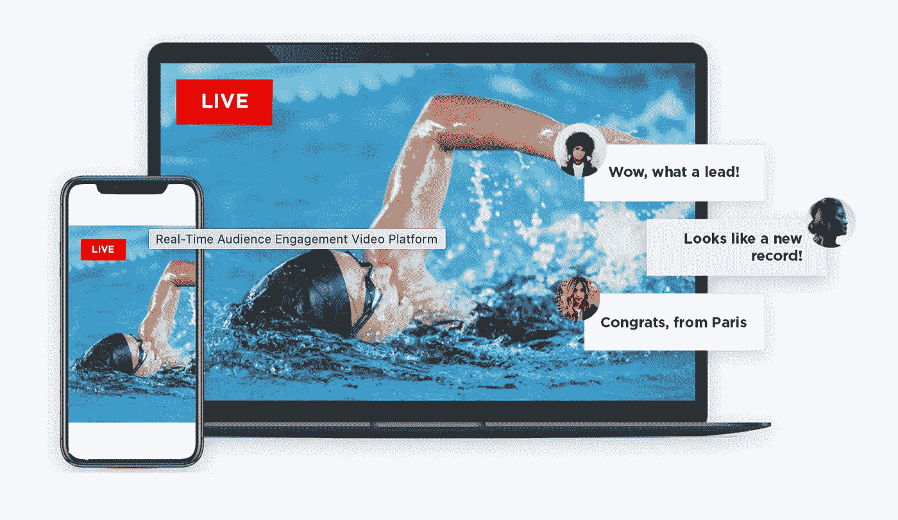

# 了解实时聊天信息等

> 原文：<https://medium.com/geekculture/get-to-know-real-time-messaging-for-chat-and-more-95a5a8dcf570?source=collection_archive---------63----------------------->

发送和接收基于文本的消息是许多基于 WebRTC 的应用程序的关键部分，这是一个经常被忽视并且可能不被重视的特性。音频和视频往往会抢尽风头，但交换信息的能力增加了一层简单可靠的表现力和交互性，即使在旧设备和慢速网络上也是如此。

在 Slack 等一些应用中，短信是主要功能，而音频和视频通信则是次要功能。消息传递有各种各样的用例，但大多数都可以归入三个类别之一——聊天消息、系统消息或应用程序消息。

**聊天消息**

最常见的文本消息类型是聊天消息。聊天消息来源于您系统的用户，通常以对话方式传递给另一个用户或一组用户。

*这些对话可以是:*

1.私人的，或者只有被邀请的，比如 iMessage。

2.半私有，同一个账户的用户可以随意加入或离开，就像 Slack 一样。

3.公共的，任何用户都可以加入或离开，像 IRC

聊天消息通常是持久的，因为它们需要存储在应用程序数据库中。当用户在新设备上打开应用程序时，需要永久存储来提供上下文。除非显示最近的消息，否则用户很难说出他们最后离开时在对话中的位置。

消息如何存储，存储多长时间，很大程度上是应用程序级的决定。出于隐私原因，一些应用程序可能希望消息在存储时加密，而其他应用程序可能有法律依据完全避免存储。一些应用程序可能选择保留所有发送的消息，而其他应用程序可能只保留固定数量的消息以控制存储成本。

**系统消息**

系统消息与聊天消息有许多共同之处，但与聊天消息不同，它们来自服务器或机器人。系统消息可以简单到向第一次加入通道的新客户发送单向欢迎消息，也可以复杂到记录一系列统计报告。大多数情况下，系统消息只是通知用户应用程序中的一些状态变化。

*系统消息可以是:*

1.应用程序范围，针对所有用户，例如系统停机或维护通知。

2.频道范围，针对特定频道/房间/会话中的用户，例如会话结束通知。

3.特定于用户，就像来自管理员的禁止通知一样。

4.特定于设备，例如通知您客户端应用程序的新版本在设备应用程序商店中可用。

5.特定于客户端，就像发送给处于活动会话中的应用程序的 kick 通知一样。

6.特定于连接，例如向从流中接收媒体的客户端发送静音或取消静音通知。

**应用消息**

应用程序消息来自应用程序的用户，但不是基于聊天的。例如，一个简单的共享白板应用程序可以使用信号系统将板上的每个笔划作为一条消息发送，该消息包括坐标、颜色和笔划特征。在线象棋平台可能使用应用程序消息在参与者之间发送移动信息。

选择如何发送应用程序消息是一个灰色地带。在大多数情况下，它们可以很容易地通过信令引擎发送，但在某些情况下，使用 WebRTC 数据通道会改善用户体验和/或更好地利用服务器资源。例如，虽然通过信号引擎发送象棋游戏中的玩家走法非常实用，但实时赛车游戏中的玩家走法要频繁得多，并且需要更低的延迟才能获得良好的游戏体验，因此数据通道在这种情况下更有意义。

甚至上面使用的白板示例也可以受益于数据通道的低延迟和[流](https://www.liveswitch.io/blog/scaling-virtual-event-platforms-with-multipoint-control-units)特性。在笔画完成后逐段发送笔画数据而不是作为单个消息发送，这允许接收端也逐段重建笔画，从而完全改变用户体验。

在这种情况下，假设我们想要持久化白板绘图，我们可以利用这两种技术。数据通道“在发生时”流式传输笔画数据以供实时用户体验，而信令将完整的笔画发送到服务器以供后期加入的参与者存储或历史查看。

**总结**

虽然一系列应用程序有不同类型的消息传递，但每种类型都有自己的用途。聊天消息和系统消息依赖于双方对彼此的响应(尽管它们来自不同的系统)，应用程序消息需要更低的延迟，因为与简单的双方来回聊天相比，有更多的活动部分。在所有情况下， [WebRTC 通过实时流媒体服务提供清晰、快速的连接，不断改善用户体验](https://www.liveswitch.io/signup?hsCtaTracking=a94c0d6c-2c11-45f2-bec5-b9126ed58114%7Ca91f55d0-6f14-4760-bc74-ace0edf21229)。