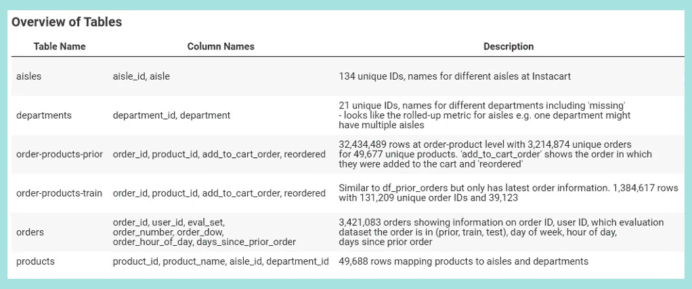
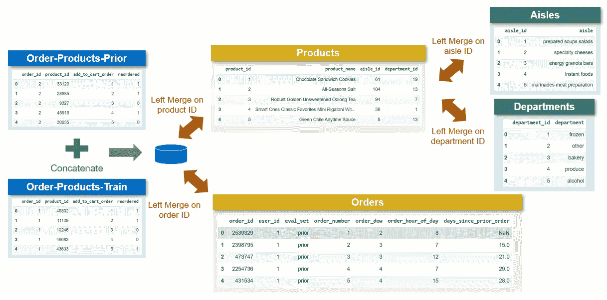
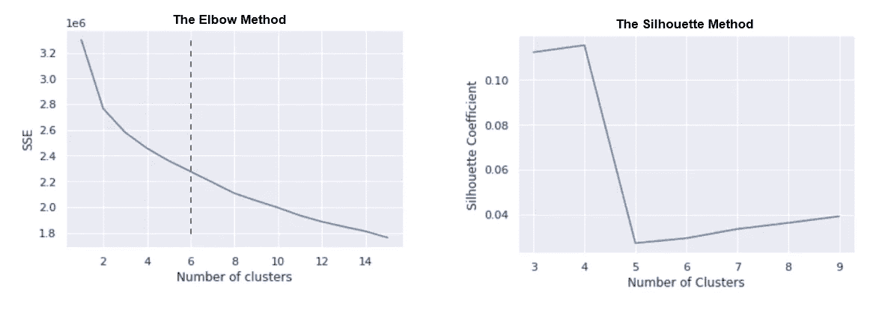
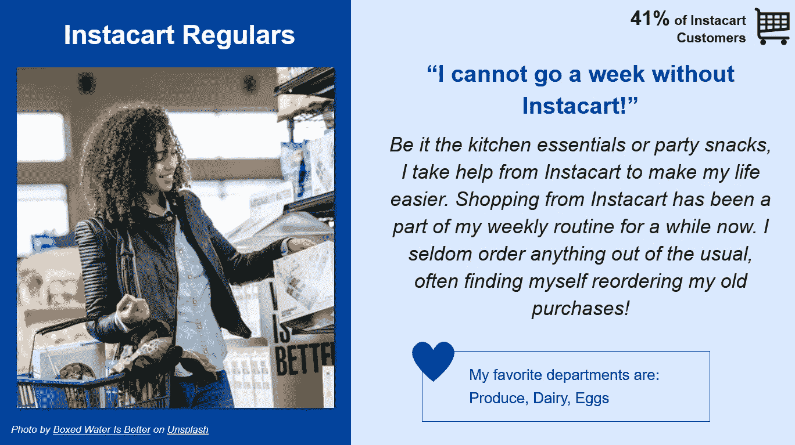

# 了解你的客户:细分案例研究

> 原文：<https://medium.com/geekculture/get-to-know-your-customers-a-segmentation-case-study-cb5b48c7cad1?source=collection_archive---------6----------------------->

## 顾客细分初学者指南


Photo by [Jeremy Zero](https://unsplash.com/@jeremy0?utm_source=medium&utm_medium=referral) on [Unsplash](https://unsplash.com?utm_source=medium&utm_medium=referral)

对于许多公司来说，在竞争激烈的环境中吸引顾客是营销的重中之重。这很大程度上取决于提出正确的营销策略并在有限的资源下恰当地执行的能力。基于客户偏好对这些策略进行优先排序和定制，为客户提供了愉快的体验，也是对公司营销预算的一份厚礼。

> “人们不购买商品和服务。他们购买关系、故事和魔法”~赛斯·戈丁

营销策略的一个这样的过滤器是客户细分。市场细分为公司提供了一个明确的市场进入和扩张计划，同时也是其他市场营销工作的基础，如客户定位、信息传递和战略发展。

就其核心而言，细分就是将客户分成相关的群体。可以根据多种因素进行分组，如他们的行为、偏好、核心信念、对公司的价值、人口统计等。


Segmenting customers enables the companies to customize their marketing strategy (image by author)

# 在这篇博客中…

我将介绍创建强大细分渠道的不同步骤，包括探索性数据分析、数据争论、特征工程和建模。为了在案例研究的帮助下探索这些步骤，我将使用 Kaggle 上共享的数据集进行 [Instacart 市场购物篮分析](https://www.kaggle.com/c/instacart-market-basket-analysis)。这个数据集是 Instacart 几年前开源的。


Tech stack used in the blog

# 创建分段管道


Segmentation Pipeline (image by author)

# 定义业务问题

像任何其他数据科学问题一样，理解市场格局和围绕我们试图解决的问题的动态是至关重要的。这一阶段包括研究市场，从公司以前的研究中吸取发现，并与领域专家就手头问题的可能驱动因素进行假设。

**公司简介** *(来自 Instacart 的 LinkedIn 个人资料)* : Instacart 是北美在线杂货配送的领导者。Instacart 购物者提供当天送货和提货服务，为美国和加拿大的忙碌人士和家庭带来新鲜的食品和日常必需品。Instacart 的送货服务适用于 85%的美国家庭和 70%的加拿大家庭。


Photo by [Clem Onojeghuo](https://unsplash.com/@clemono?utm_source=medium&utm_medium=referral) on [Unsplash](https://unsplash.com?utm_source=medium&utm_medium=referral)

**业务问题**:根据 Instacart 用户的历史购买模式对他们进行分组。目标是确保细分市场内购物偏好的同质性和不同细分市场间的异质性。

# 从探索性数据分析中收集见解

在我们为模型处理数据之前，最好先对数据有一个基本的了解。探索性数据分析或 EDA 可以帮助回答以下问题:

*   **数据概述**:不同的数据集在哪个级别可用？每个数据集中的变量/特征是什么？每个数据集中有多少行？



A summary of the tables present in the dataset acts as a cheat sheet for the course of the project

*   **数据汇总**:数据中有哪些独特的类别？数值变量的范围是什么？是否有任何缺失值？有多少异常值？


Checking null values and applying appropriate missing value treatment is crucial in this step

在 Instacart 数据集中，只有一个指标(“自上次订单后的天数”)有缺失值，经过进一步调查，这些值仅在第一个客户订单中缺失，因此，该指标被替换为 0。

> Scikit learn 有一个名为 Imputers 的库，它为其他插补技术提供了一个简单的实现。

*   **数据模式/趋势**:一个客户下了多少订单？购物车的平均/中间尺寸是多少？一周中不同日子的订购趋势是什么？订购/再订购最多的产品是什么？哪个通道/部门获得的再订单最多？


Sample charts to capture data trends for Instacart (image by author)

抽查数据摘录并查看总体趋势有助于识别任何明显的错误、检测异常值以及发现数据集中有趣的趋势。在第一步中定义的假设之上，EDA 通常会先睹为快，对假设进行优先排序，并确定不同的变量。例如，在上图中，订单和再订单有非常相似的趋势，可能没有明显的区别。

> 对于细分问题，关键是对模型中区分客户的变量进行优先排序，因为这些变量最终会在细分市场中产生异质性。

# 通过数据争论简化复杂性

通常在多个数据集上进行细分，以确保获取客户的不同行为、偏好和态度。为了降低后续步骤的复杂性，最好创建一个主数据集，合并所有相关数据并将其滚动到客户级别。

除了合并数据集，数据争论还包括将所有数据转换为适当的数据类型，并标准化数据以确保一致性。下面的例子说明了我们如何使用简单的 pandas 函数，比如 concatenate 和 merge，来创建一个主数据集，以便于下游使用。



Illustration of the Data Wrangling process for Instacart datasets (image by author)

# 利用特征工程优化您的机会

顾名思义，在这一步中，我们通常添加/更新特性，以确保数据适合我们计划使用的模型，并将为我们提供最佳结果。大致有三种方法可以解决特征工程:

*   **将数据转换为 apt 数据类型或分布**:对于分类模型，数字数据需要进行分类；对于数值模型，分类数据需要一次性编码。类似地，其他数据类型应该被适当地转换以适合模型。为了确保我们将分布良好的数据输入到模型中，还需要转换数据(对数、多项式等)。)基于当时的需要。下面的文章详细介绍了 9 种转换数据的方法:

[](https://towardsdatascience.com/feature-engineering-for-machine-learning-3a5e293a5114) [## 面向机器学习的特征工程基本技术

### 用熊猫例子进行综合数据预处理所需的所有方法。

towardsdatascience.com](https://towardsdatascience.com/feature-engineering-for-machine-learning-3a5e293a5114) 

*   **压缩特征的维度**:有时特征的数量会过多，可能会导致模型过度拟合。一个好的方法是使用 PCA 或因子分析来降低特征的维数。目标是用较少的变量合理地解释数据的方差。下面的文章非常详细地解释了 PCA，可能是一个有用的读物！

[](https://www.analyticsvidhya.com/blog/2020/12/an-end-to-end-comprehensive-guide-for-pca/) [## 主成分分析|主成分分析指南

### 机器学习中最受欢迎也同样令人困惑的方法之一是主成分分析(PCA)…

www.analyticsvidhya.com](https://www.analyticsvidhya.com/blog/2020/12/an-end-to-end-comprehensive-guide-for-pca/) 

```
# use sklearn to perform PCA and reduce dimensionality of datafrom sklearn.decomposition import PCA
pca = PCA(n_components=features)
scale_data = pd.DataFrame(scale(data), columns = data.columns, index = data.index)
pca_output = pca.fit_transform(data)
df_pca = pd.DataFrame(data = pca_output, columns = [name+str(i) for i in range(features)], index = data.index)plot(pca.explained_variance_ratio_.cumsum(), linewidth=2)
print("\nImportance of Components")
print(pd.DataFrame(data = pca.components_, columns = data.columns, index = ['prod_'+str(i) for i in range(features)]))return df_pca
```

*   **基于领域专长的特征**:特征工程的一个重要目的是基于领域专长创造新的特征。例如，如果我们知道杂货店的客户正在快速增长，那么我们可以在模型中添加一个季度增长率作为派生指标。创造这样的变量也有助于我们从第一步开始检验我们的假设。

> 在监督学习问题中，我们还可以通过运行随机森林、XGBoost 等模型来执行特征选择，以基于特征重要性对变量进行优先排序。

# 寻找最适合的模型

现在我们已经准备好了数据集，是时候开始建模过程了。通常，分割模型要么是基于聚类的(无监督学习)，要么是使用决策树/集成创建的(有监督学习)。像任何数据科学项目一样，我们必须在建模过程中做出一些关键决定——使用哪个模型？如何调整模型以达到最佳拟合？什么时候停止迭代？

## **使用哪种型号？**

根据我们试图解决的业务问题和市场的复杂性，我们需要首先弄清楚定义一个健壮的目标函数是否可行。

> 目标函数是一个数值，需要通过迭代最小化或最大化，以达到手头问题的优化解决方案。

如果我们可以量化优化目标，这是一个安全的赌注，开始与监督学习迭代，典型的回归树，其中每个叶节点可以被视为一个片段在这种情况下使用。如果问题/市场过于松散，或者如果我们想做更多的探索性分析，我们可以使用无监督学习。

对于 Instacart 数据集，监督和非监督都是可行的。我选择了聚类(无监督学习),因为我想在数据集分析中更具探索性。


K-means in action with n centroids=3\. Source: [Wikimedia](https://commons.wikimedia.org/wiki/File:K-means_convergence.gif)

聚类旨在根据相似性将数据点分组在一起。k-means 是最简单的聚类算法之一。它初始化 k 个质心，并根据到每个质心的最小距离将每个数据点分配给一个质心。这使得 k 个数据点集群。一旦聚类被识别，质心被重新调整到聚类的中心，并且数据点基于这些新的质心被重新分配。这个过程一直重复，直到算法收敛，即质心在迭代时停止改变，或者当达到迭代的最大极限时。

> 由于 k-means 算法基于数据点之间的“距离”来计算聚类，因此它很容易受到非正态分布和离群值的影响。这两个问题都需要在开始迭代之前解决。

## 如何调整模型以达到最佳拟合？

在对模型进行调优之前，我们先来看看下面一个简单的 k-means 代码，了解一下每个超参数的用法。

```
kmeans_args = {
"init": "random",
"n_init": 10,
"max_iter": 300,
"random_state": 42,
}
kmeans = KMeans(n_clusters = 5, **kmeans_args)
kmeans.fit(X)
```

*   `init`参数用于定义质心初始化的方法。当`random`时，它从数据中随机选择行进行初始化，而`k-means++`允许算法灵活地放置初始中心
*   `n_init`将允许算法按照定义的次数初始化聚类，并选择最收敛的值作为最佳拟合值
*   `max_iter`是算法在单次运行中收敛的最大迭代次数，默认值为 300
*   `random_state`保证模型结果的再现性
*   `n_clusters`指我们希望从模型中得到的聚类数，算法将初始化这些质心。要确定理想的集群数量，最好进行统计分析，并与领域专家交流，以了解他们根据自己的专业知识期望有多少个集群。

确定集群数量的最流行的统计方法是**肘法**。在这种方法中，我们绘制了跨不同数量的聚类的数据的解释变量。随着 k 的增加，质心和数据点之间的平方距离减少，诀窍是在 k 增加时我们开始获得递减结果的范围周围挑选 n_clusters，这被称为曲线的肘部。

```
cluster_range = range(2,16)
sse = []
for k in cluster_range:
 kmeans = KMeans(n_clusters=k, **kmeans_args)
 kmeans.fit(X)
 sse.append(kmeans.inertia_)
```

另一种找出理想聚类数的方法是**剪影法**。它衡量一个数据点与自己的聚类相比，与另一个聚类相似的程度，我们可以生成一个图表，总结每个数据点的分类情况。1 表示聚类清晰可辨，0 表示没有显著差异。

```
silhouette_coefficients = []
cluster_range = range(3,10)
for k in cluster_range:
 kmeans = KMeans(n_clusters=k, **kmeans_args)
 kmeans.fit(X)
 score = silhouette_score(X, kmeans.labels_)
 silhouette_coefficients.append(score)
```



Finding the optimal value for k (image by author)

下面的文章是了解更多 k 均值超参数的良好开端:

[](https://www.analyticsvidhya.com/blog/2019/08/comprehensive-guide-k-means-clustering/) [## K 表示聚类| K 表示 Python 中的聚类算法

### K-Means 聚类是数据科学中一种简单而强大的算法，在现实世界中有很多应用…

www.analyticsvidhya.com](https://www.analyticsvidhya.com/blog/2019/08/comprehensive-guide-k-means-clustering/) 

## 什么时候停止迭代？

调整超参数并确定“k”值后，建议使用 k、k+1、k-1 个集群运行迭代，以研究故事中的变化和输出段的有用性。从统计和商业的角度研究这三次迭代的结果可以帮助我们决定是否找到了解决方案。

> 从统计上来说，这些细分市场在关键结构上应该有很大的不同，从业务的角度来看，我们希望这些细分市场对领域专家来说是有意义的，并且是可操作的

根据您试图解决的问题，这些指导原则会有不同的解释，评估细分的一些标准示例如下:

*   目标函数在各个部分之间有显著的差异
*   每个细分市场都有一个独特的叙述，与其他细分市场有着显著的差异，而在该细分市场中则具有同质性
*   没有表现出差异的特征可以基于数据和/或领域知识来解释
*   细分市场的% n 规模是合理的，反映了市场
*   这些结果在当前数据的总体或子样本的不同样本之间是可重复的
*   这些细分可以推广到新客户

# 每个数据点背后都有一个故事

最后一步，也是最重要的一步，是在依赖的工作流之间交流结果，以进一步提高可用性。像大多数数据科学步骤一样，这也可能因工作流而异，但是，应该传达的一些要点如下:

*   **阐述普遍真理** —在测试样本中，有哪些我们看不到任何差异且对大多数客户来说都相似的关键特性
*   **为什么这个“k”值最适合这个问题** —展示当我们增加/减少 k 值时分段如何变化，以及为什么当前的 k 值是最佳的
*   **细分市场有何不同** —展示定义细分市场差异的关键特征


An executive summary for the segment differences is a useful primer before diving deep into details

*   **双击每个细分市场** —深入了解每个细分市场，了解他们的行为、信念和偏好。对营销团队来说，为每个细分市场添加可行的建议是一个有用的起点——品牌在这个细分市场的潜在下一步是什么？



Converting data points into stories personalizes the ‘clusters’ (image by author, picture in the image *by* [*Boxed Water Is Better*](https://unsplash.com/@boxedwater?utm_source=medium&utm_medium=referral) *on* [*Unsplash*](https://unsplash.com/?utm_source=medium&utm_medium=referral))

# 结论

客户细分是许多营销和销售计划的基础。与任何其他数据科学项目一样，分段遵循首先理解数据，然后使用数据生成预测模型的流程。建立强大的细分渠道将有助于企业为其营销和销售战略奠定坚实的基础。

要深入研究代码，请参考我的 [GitHub 库](https://github.com/VidushiBhatia/Customer-Segmentation)，你可以在 [Kaggle](https://www.kaggle.com/c/instacart-market-basket-analysis/data) 上找到考虑的数据集。

我很想听听您在细分方面的经验，如果您对博客有任何反馈，请联系 [me](https://www.linkedin.com/in/bhatia-vidushi/) ！