# Neo4j 和 Gephi 工具入门

> 原文：<https://medium.com/geekculture/getting-started-with-neo4j-a-graph-database-tool-f619e7c80465?source=collection_archive---------16----------------------->

本文涵盖了两个数据可视化工具——Neo4j 和 Gephi 工具。它包括让您开始使用 *Neo4j 的基本步骤，Neo4j 是一个图形数据库工具*和用于数据图形分析的 *Gephi 工具*。

图形数据库是一种用于将数据建模为图形的数据库。图形数据库的结构基于以下内容:

*   **节点** —代表记录/数据。您可以向一个节点添加零个或多个标签。
*   **关系** —表示节点之间的连接。每个连接都有一个方向。
*   **属性** —表示命名的数据值。适用于节点和关系。

[**Neo4j**](https://neo4j.com/) 是一个流行的开源项目，原生图形数据库。简单来说，neo4j 就是图形数据库的 MySQL。它提供了一个图形数据库管理系统，一种查询数据库的语言，即 CYPHER，以及一个与 neo4j 浏览器的可视化界面。


要进行设置，您可以下载并安装最新版本的 Neo4j Desktop 或开始使用 sandbox。

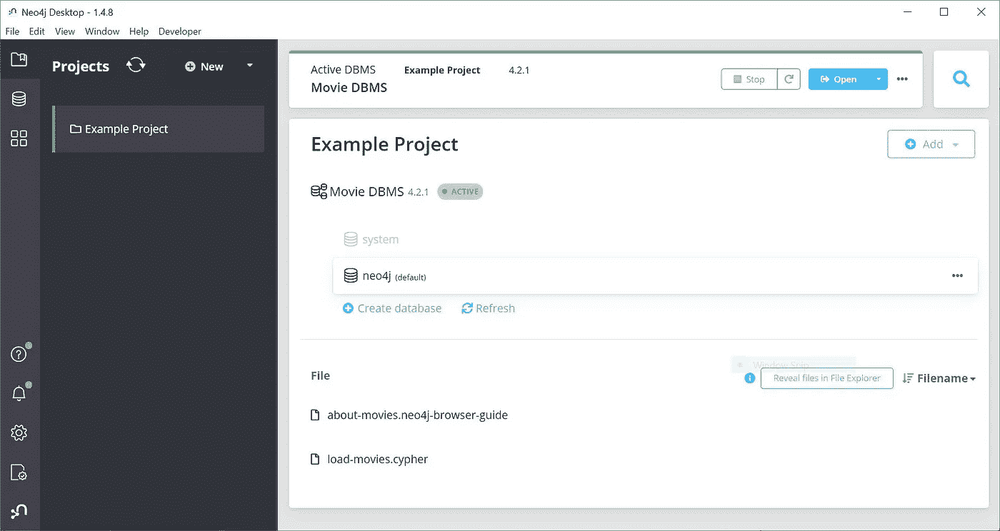

Neo4j Desktop

Neo4j 附带了样本数据集。在我的沙盒环境中，我创建了一个项目，其中包含一个名为 Movies 的样本数据集。该数据集展示了交叉引用流行文化中演员和电影的常见查询模式。


一旦项目状态变为正在运行，打开 Neo4j 浏览器运行查询并查看数据库。


在左侧，有一个导航面板，根据您的需要包含一些有用的按钮。它为您提供数据库信息、文档和配置。


## 密码—图形查询语言

Cypher 用于从 Neo4j 中查询数据。它是一种高度优化的查询语言，能够理解每个节点之间存储的连接。

*   MATCH — `MATCH`子句用于读取数据。它描述了图形数据的模式，Neo4j 将使用该模式来检索与该模式匹配的所有路径
*   CREATE — `CREATE`子句主要用于创建数据。您需要指定命名节点及其与内联属性的关系
*   MERGE — `MERGE`在创建新数据之前，子句将首先确定图形中是否存在模式。您可以把它看作是`MATCH`和`CREATE`的组合，它要么基于模式匹配现有数据，要么从中创建新数据

电影数据库包含内置的例子。您可以创建节点和边，添加属性，并使用交互式幻灯片浏览您的数据。让我们开始，在查询窗格中运行以下命令，并查看电影数据库示例交互式幻灯片。

```
:play movie graph
```


Neo4j 为我们提供了四种不同的最终结果—

*   *图*显示了节点之间的可视化以及它们之间的关系
*   *表格*在表格中显示每个节点的信息，如标签和属性
*   *Text* 显示整个查询输出，就像您在查询 SQL 数据库时看到的一样
*   如果您通过代码进行查询，代码将为您提供响应信息

在查询窗格中运行基本的 Cypher 代码，并查看结果，如计算节点数和关系类型。

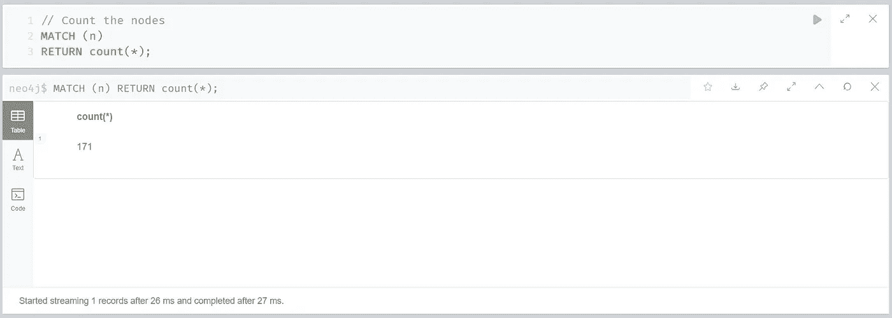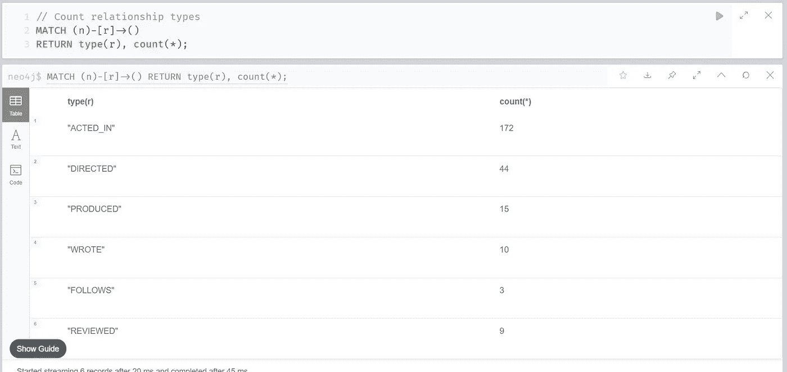

运行以下查询，通过使用不同的节点和关系类型来查找特定电影的导演或电影中的所有演员。

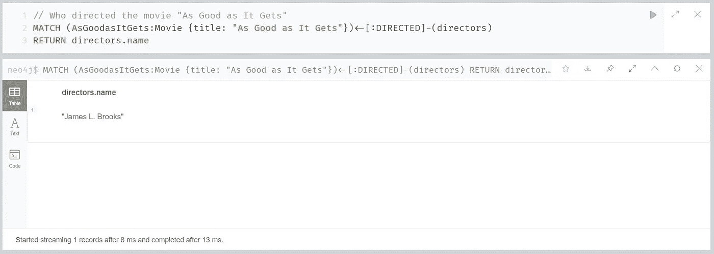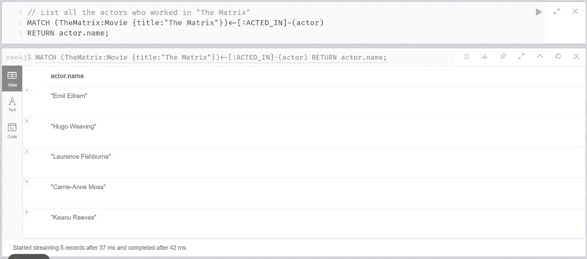

在下面的快照中，我运行了查询来查找 20 世纪 90 年代发行的电影。

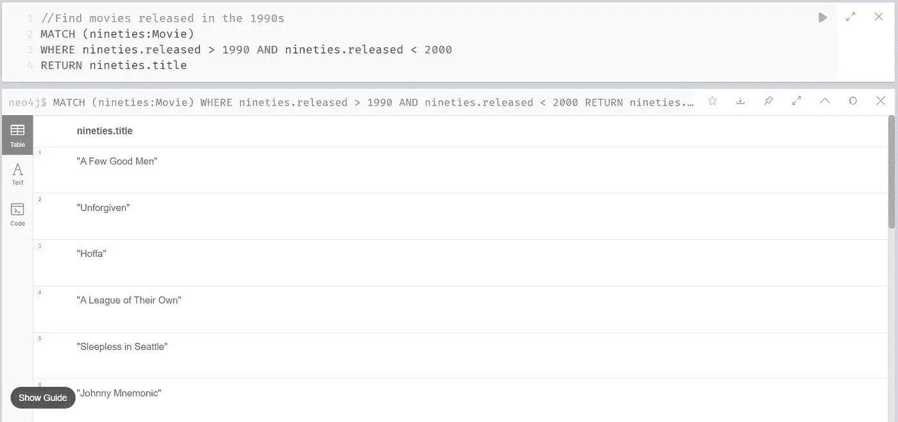

接下来，使用下面的 Cypher 代码，您可以以图形和表格的形式查看 Tom Hanks 的所有电影。

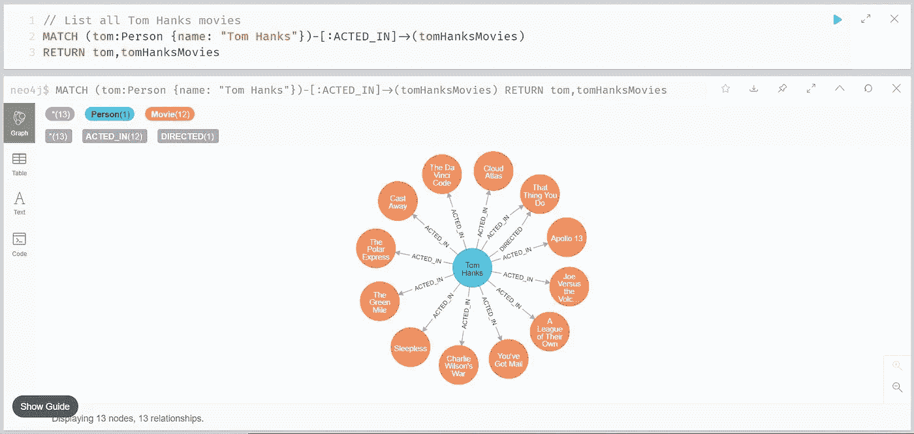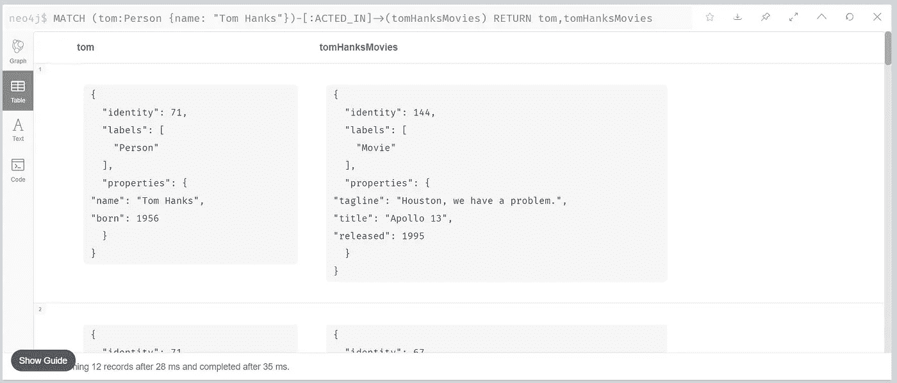

接下来，我询问了汤姆·汉克斯的所有合作演员。

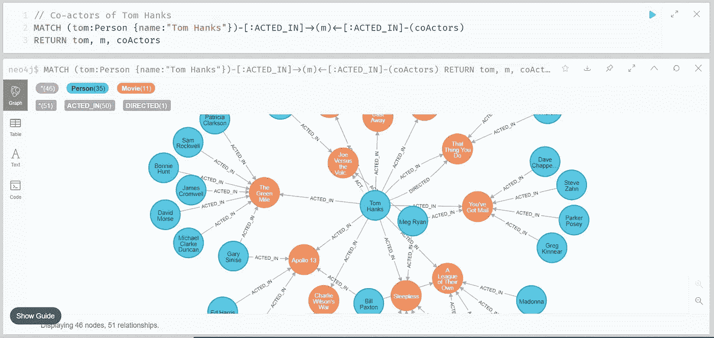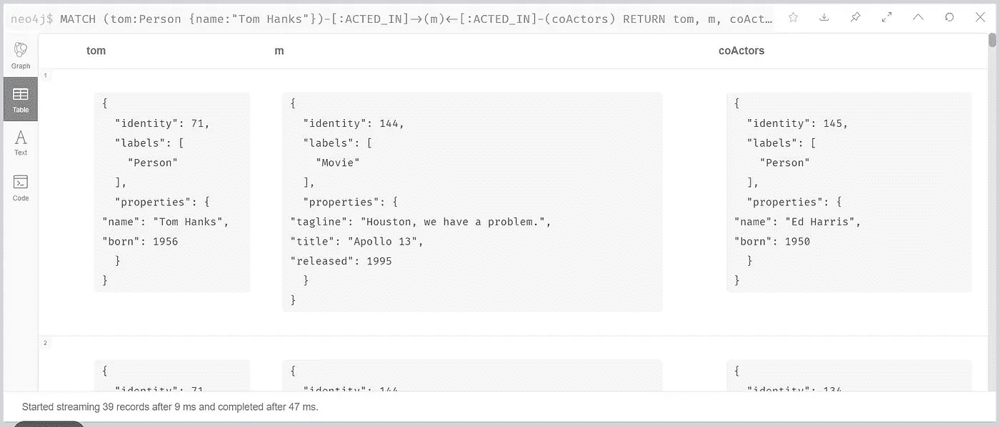

使用这个密码，你可以列出所有的节点和关系。

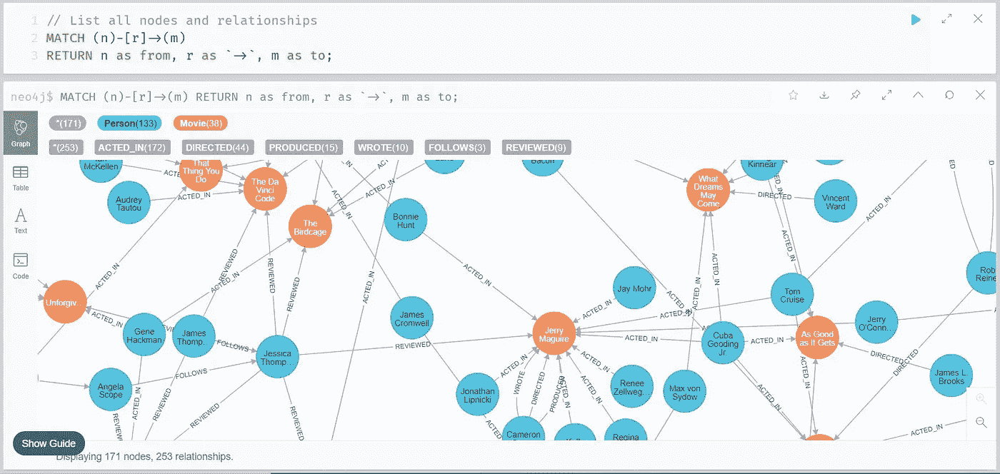

# Gephi 工具


Gephi 是一款开源软件，可以让你可视化、操作和探索网络。对于数据分析师和数据科学爱好者来说，这是一个探索和理解图形的绝佳工具。网络(也称为图表)可以以多种文件格式存储(例如。gexf，。gdf，或者。gml)但是它们都由一列*节点*和一列连接节点的*边*组成。

这里，我在一个空手道. gml 数据集上执行了一些 Gephi 操作。我们将介绍在 Gephi 中进行可视化网络分析的基础知识。

让我们开始，打开 Gephi，创建一个新项目**，**和加载你的数据集。

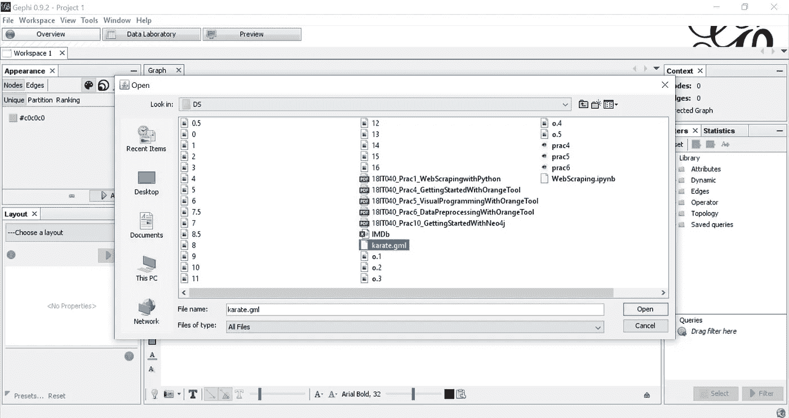

在加载数据集时，您会看到数据集中存在的节点和边的数量、图表的类型以及关于数据集的其他信息。

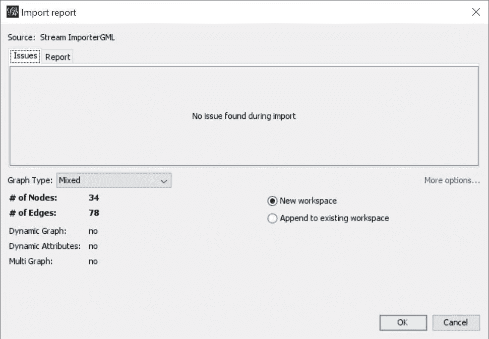

像下面的快照一样，Gephi 画布将显示所有节点和边的图形表示。


你可以用各种布局表示数据。在左侧窗格中，从布局选项卡中选择任意布局，然后单击*运行*。

在这里，在下面的快照中，您可以观察到数据在布局中的表现形式— *Fruchterman Reingold* 和 *ForceAtlas 2。*

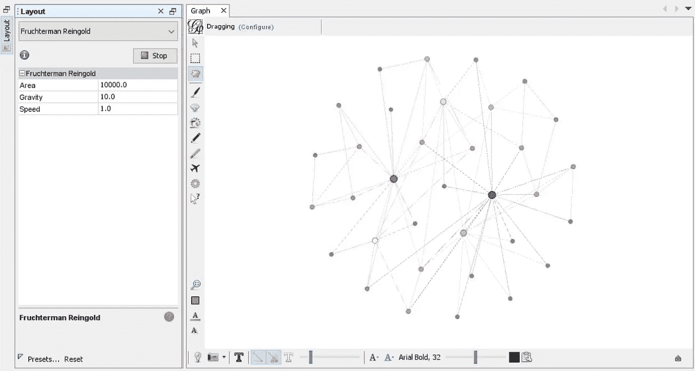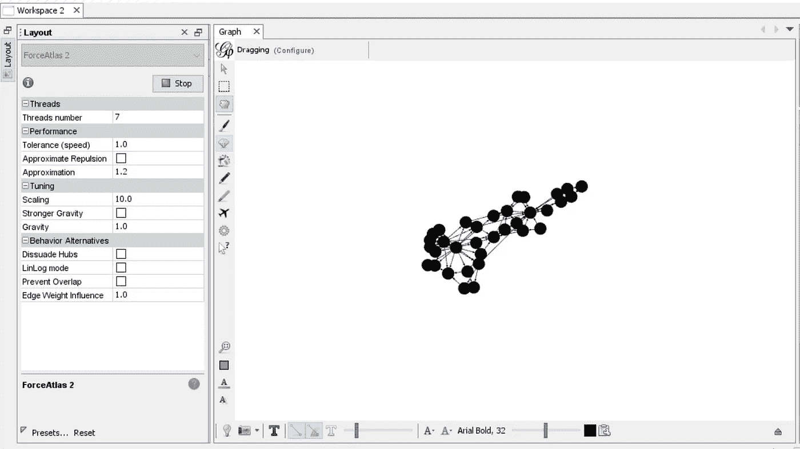

接下来，我们可以根据各种排序来区分节点，如**入度**、**出度、**或**度**，还可以用颜色定制它们。

为此，在左侧窗格中的**外观**部分下，选择**节点→等级，**选择**入度**，与白色和绿色的节点相比，橙色的节点具有较低的入度等级。

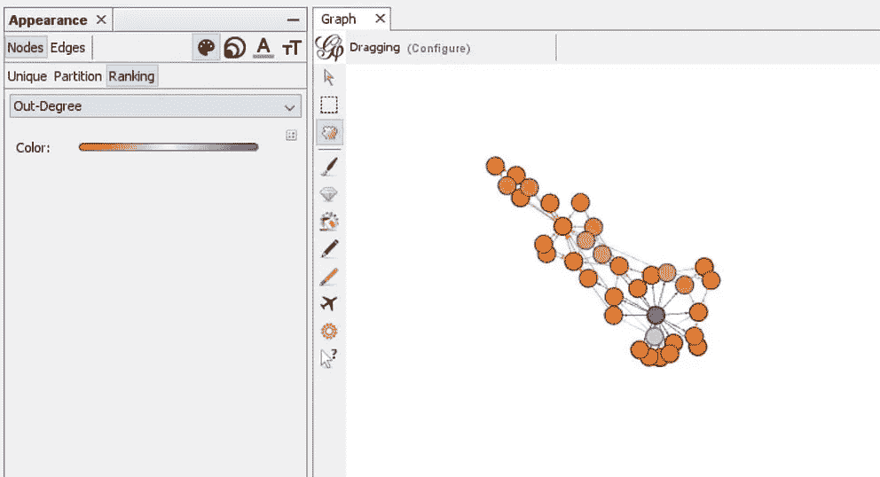

此外，为了获得更清晰的可视化，我们可以区分节点的大小。类似地，在下面的快照中，与度数较低的节点相比，度数较高的节点在大小上更大，即，与白色和橙色的节点相比，紫色的节点具有较高的度数值。

为此，类似地，在**外观**部分，选择**大小**选项，并设置节点的最小和最大大小。

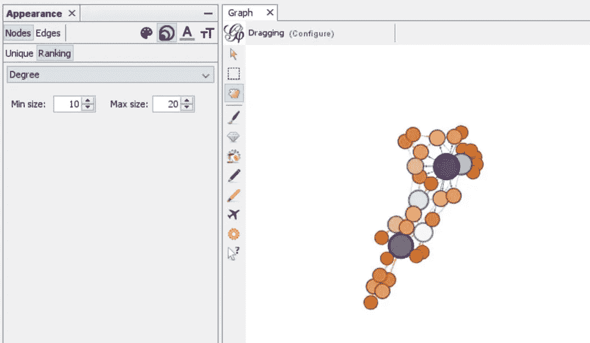

接下来，我们可以为度、入度和出度生成一个**度分布**图，并获得所有节点的平均度值。

要生成图表，在右窗格的**统计**选项卡下，运行**网络概述**部分的**平均度**。将生成一个*度报告*，其中包含所有度、入度和出度的度分布图。

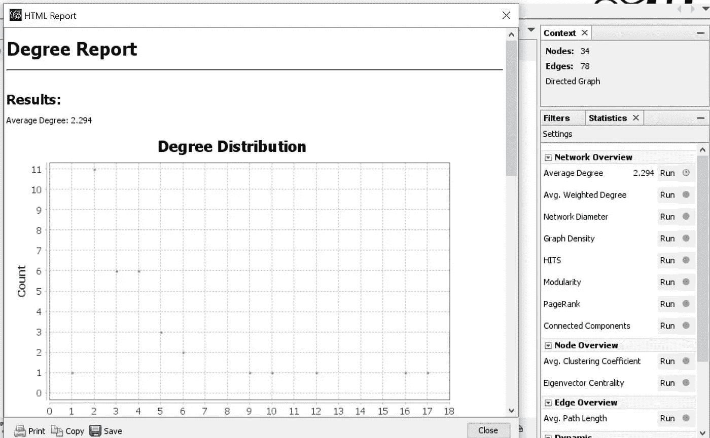

此外，将在数据集表中添加一个学位列。要查看**数据表，从菜单栏中选择**选择**窗口→数据表。**运行**平均度**功能后，为每个存在的节点添加**入度、出度、**和**度**列。

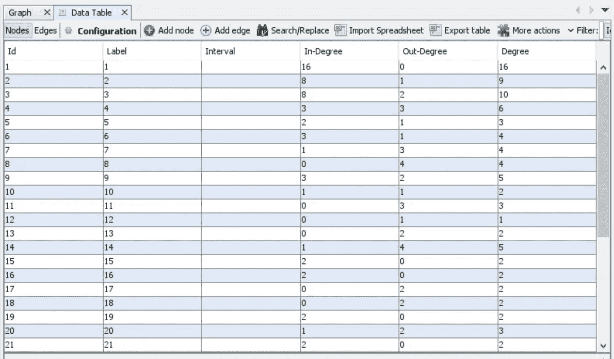

总之，我们使用了 Cypher，Neo4j 中使用的图形查询语言，并探索了用于图形分析的 Gephi 工具。希望这篇博客对你有所帮助。