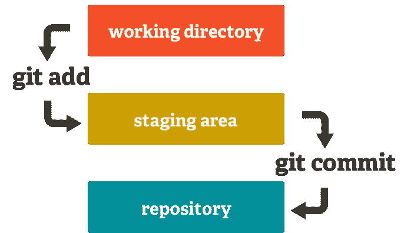
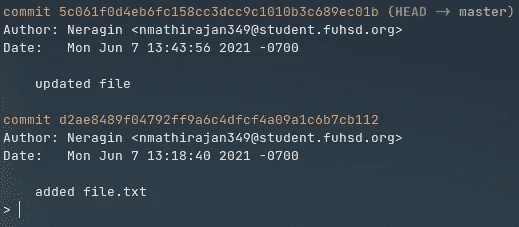
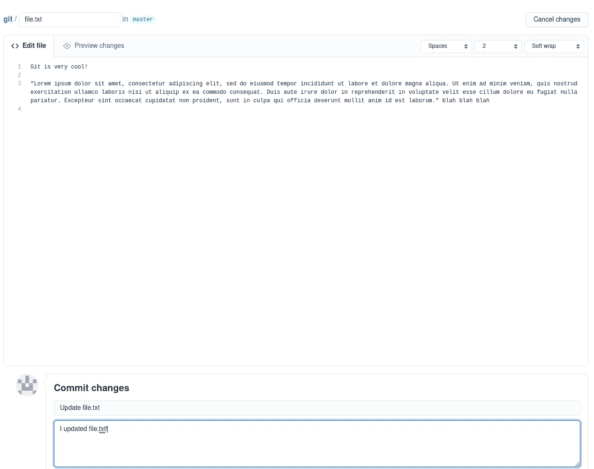
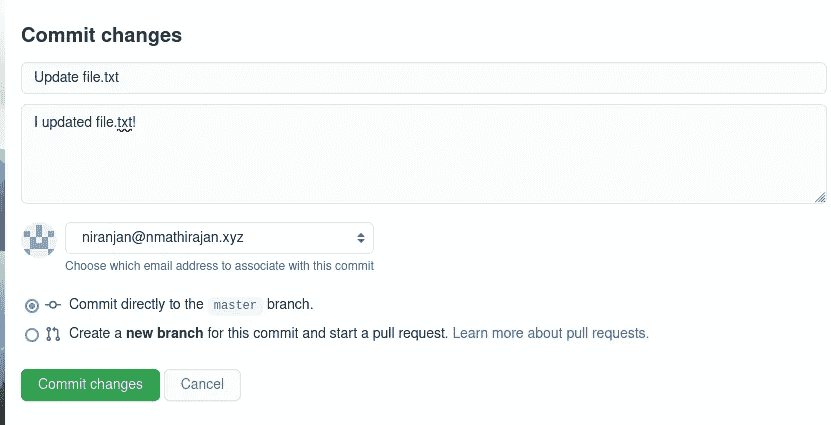
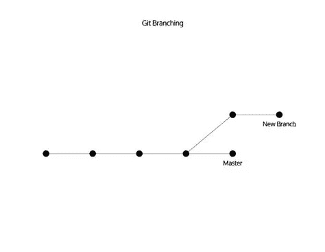
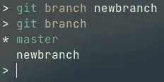
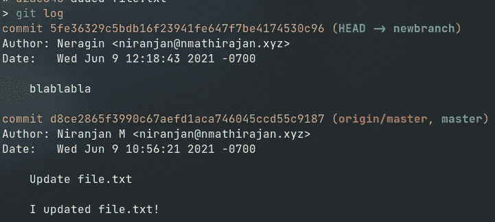
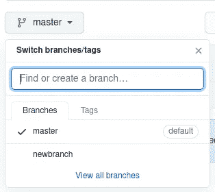

# Git 和 GitHub 的傻瓜

> 原文：<https://medium.com/geekculture/git-and-github-for-dummies-35cfcbb28084?source=collection_archive---------20----------------------->

# 先决条件:

*   [Git 已安装](https://git-scm.com/downloads)
*   GitHub 的一个账户
*   Bash 基础知识

# Git 是什么？

Git 是一个分布式版本控制系统。简而言之，它是一个记录文件或目录更改的程序，您可以使用它来重新访问指定文件或目录的任何以前版本。Git 还跟踪其他信息，这对于比较更改和恢复更改非常有用。Git 是一个非常有价值的工具，因为它允许多人在一个代码库上协作，这对于有多个开发人员的项目或开源项目非常有用。Git 主要与 GitHub 结合使用，GitHub 是一个存储库托管平台，它利用 Git 为用户提供跨不同存储库的协作。

# 检查 Git 是否安装正确:

Git 是一个命令行工具，这意味着要与它交互，我们必须首先在 windows 上打开一个终端或命令提示符。在你打开你的终端后，你必须输入`git --version` 并确保 Git 被正确安装。如果你没有得到版本号或者得到一些错误，你应该确保你的 [Git 被正确安装](https://git-scm.com/downloads)。

# 与 Git 交互:

在本教程中，我们将初始化一个 Git 存储库。为此，创建一个新文件夹，并在其中打开一个终端。要在 windows 中执行此操作，请打开文件夹，按住 shift 键，右键单击该文件夹，然后选择“在此打开 Power Shell 窗口”在 MAC 上，你可以点击标题栏上的 Finder 文本，并在服务选项卡内，选择在文件夹中新建终端。随着 Git 打开，现在您可以将该文件夹初始化为 Git 存储库。为此，键入`git init`，该命令告诉 Git 跟踪该文件夹中发生的所有更改。现在，我们可以添加文件供 Git 跟踪。创建一个简单的文本文件，键入你想要的任何内容。我们现在将使用 Git 来记录对此文件所做的任何更改。为此，键入`git add --all`或`git add <filename>`将您的文本文件添加到 Git 的暂存区。Git 暂存区是使用`git add`命令第一次移动文件的地方。

此功能使我们能够只转移文件的一部分；因此，我们可以始终确保我们只提交相关的修改。既然我们已经将所有想要提交的文件移动到暂存区域，我们现在可以通过执行`git commit -m "a message to describe your commit"`来提交这些更改。如果出现错误，`Please tell me who you are`按照步骤，运行`git config --global user.email "example@example.com"`和`git config --global user.name "your username"`。做完这些，你就可以运行`git commit -m "a message to describe your commit"`了。现在，我们已经将变更从临时区域转移到了存储库中。因此，我们总是可以遍历回到目录的这个状态。要看到这一点，我们可以编辑文件并向其中添加更多的文本。这样做之后，我们可以通过`git commit -am "updated file"`再次添加并提交它。(是`git add --all`的简写，`git commit -m "message"`是`git commit -am "message here"`)现在，为了遍历回我们的第一次提交，在这里执行`git log`，您可以看到所有之前提交到我们的库的提交。

现在，找到提交散列。哈希是我们用来标识每个提交的，我们可以使用哈希返回到那个特定的提交。在第一个例子中，第一次提交的提交是 d2ae8489f04…现在，复制散列，然后键入`git checkout <hash value>`。这使 Git 处于“分离状态”,并允许我们在提交时查看我们的目录。要离开这种分离状态，请键入`git switch -`。

# 整合 GitHub

在我们继续之前，如果您还没有创建 GitHub 帐户，请在这里创建一个。

GitHub 是一项允许用户创建云储存库的服务。这使得我们可以在线托管我们的 GitHub 库，让其他人也可以进行协作。要开始，请访问 [https://repo.new](https://repo.new) 。在这里，您可以设置基本规则，比如将存储库设为私有或公共。创建存储库之后，您可以通过输入`git remote add origin <link to GitHub Repository>`，然后输入`git branch -M master`，最后通过执行`git push -u origin master`，将您的更改推送到 GitHub，从而将远程存储库添加到 git 中。`git push`将您的本地提交推送到 GitHub，允许其他人下载您的更改。现在，您应该可以在 GitHub 上看到您正在本地编辑的文件。现在，如果您添加更多的更改，您可以运行`git add --all`将文件移动到暂存区，然后您可以通过运行`git commit -m "a descriptive message"`提交它，最后，您可以`git push`您对 GitHub 的更改。你甚至可以通过点击这里的提交图标在 GitHub 上看到你以前的 Git 历史:

commit history

All of our previous commits!

现在，其他人也可以查看您的代码(当然，如果您公开了您的存储库)，并根据您的判断做出贡献。现在，点击你创建的文件，点击编辑图标，在 GitHub 中添加更多的文本。您应该进入这个在线文本编辑器，在这里您可以添加对文件的更改。

写入更改并添加提交消息后，选择`Commit directly to the master branch`并点击`Commit changes`

通过这样做，GitHub 现在有了比我们机器上的本地存储库更近的变化。为了解决这个问题，我们可以运行`git pull`,从我们的在线 GitHub 资源库中下载新的变更。最重要的是要记住，当你完成某项工作时，你需要`git push`你的改变，以及`git pull`你没有提交的新改变。

# Git 分支:

到目前为止，我们已经学会了如何使用 Git 记录我们的更改并在线分享，但这只是 Git 全部功能的一小部分。为了将 Git 更多地整合到我们的工作流中，我们需要了解 Git 分支。分支是一个概念，在这里我们从现有的存储库中分支出来。这允许我们在提交变更之前进行试验，并通过为我们正在处理的每个特性创建分支，然后将其合并回主`master`分支，从而拥有一个特性驱动的工作流。在我们之前的示例中，我们总是线性提交，您可以在这里看到:

the commit history, from most recent to least recent.

但是，假设我们希望保留最新提交的副本，同时仍然有一个我们可以编辑的副本。为了实现这一点，我们可以使用 Git 分支！如果我们使用分支，下面是我们的 git 日志的样子:

如您所见，我们从主分支中分离出来，创建一个独立于主分支的提交。让我们在我们的存储库上实现它。首先，我们需要通过键入`git branch newbranch`创建一个新的分支。现在，如果您键入`git branch`来列出存储库中的所有分支，我们可以看到有`master`分支和`newbranch`分支。

the two branches in our repository!

要切换到这个分支，请键入`git checkout newbranch`。我们在一个独立的分支中，这个分支与我们之前工作的主分支完全不同。现在，如果我们在 file.txt 中添加更多的行并提交它，我们可以运行`git log`来查看我们的更改发生了。`newbranch`

The latest commit was on the new branch.

如果我们现在回到主分支，通过这样做，`git checkout master`我们可以看到我们提交的变更`newbranch`根本不存在。最后，让我们将新的分支推送到 GitHub，这样我们的新更改也可以远程存储。为此，我们需要运行`git push --set-upstream origin newbranch`。我们不能直接推送，因为我们创建了一个 GitHub 没有的新的本地分支。为了解决这个问题，我们告诉 Git 在 GitHub 上创建一个名为 new branch 的新分支，然后按。这样做之后，您应该能够返回 GitHub 并使用这个下拉菜单选择新的分支:

Here, we can select our new branch.

最后，让我们合并我们的两个分支。合并是我们将来自`newbranch`的提交合并回`master`分支的过程。要做到这一点，回到您的终端，并通过执行列出您的存储库状态的`git status`来确保您在主分支上。如果您不在主分支上，您可以运行`git checkout master`来检查主分支。现在，你可以运行`git merge newbranch`来合并主服务器和新的分支。最后，`git push`你对 GitHub 的改动！如果您做的一切都正确，那么当您从 GitHub 的下拉菜单中选择一个新分支时，您应该会看到这条消息。

# 关于 GitHub 的快速说明:

GitHub 允许我们在项目中添加一些额外的功能，我们可以通过点击 settings 选项卡来查看。要邀请其他人也能够向您的存储库添加更改，请单击管理访问。输入密码后，您可以邀请协作者控制您的存储库，并对其进行更改。只需点击`Invite a collaborator`，输入他们的 GitHub 用户名。应该会有一封电子邮件提示他们接受您的邀请。回到“选项”选项卡，您还可以在此处将存储库的可见性更改为公共或私有:

在 GitHub 中，如果一个存储库是公开的，你可以“派生”这个存储库并拥有你自己的副本。这允许您保留您自己的存储库副本，您可以对其做出贡献。要派生存储库，您可以访问任何公共存储库(不属于您自己的存储库),然后单击此处的“fork”按钮:

# 结束语:

我们仅仅触及了有效使用 Git 及其工具的皮毛。为了学习更多关于 git 的知识，我强烈推荐在 https://git-scm.com/book/en/v2 查看 Git 官方文档。这是你在互联网上找到的理解 Git 的最佳资源。然而，简单地学习理论和花费几个小时盲目地阅读文档只会让你到此为止。

为了更好地使用 Git，我建议将您的 Git 和 Github 技能应用到您自己的项目中。如果你是一名高中生，请随时查看探索黑客，这是一项为期 3 天的高中生黑客马拉松，将于 2021 年 7 月 23 日至 25 日举行。

 [## 探索黑客

### Explore Hacks 是一个黑客马拉松，为高中生提供探索从构思到产品执行的过程的机会。

explorehacks.org](https://explorehacks.org) 

# 作者:

尼兰詹·马蒂拉詹

# 编辑:

大卫·菲利普斯& [徐丁](https://medium.com/u/2c31921662ce?source=post_page-----35cfcbb28084--------------------------------)